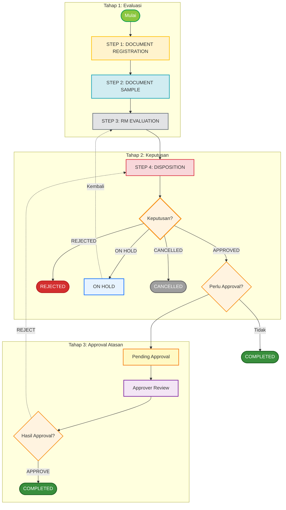
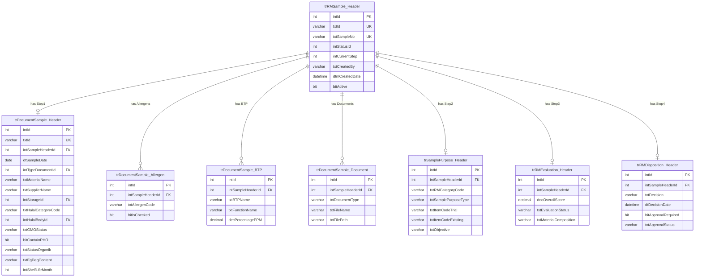
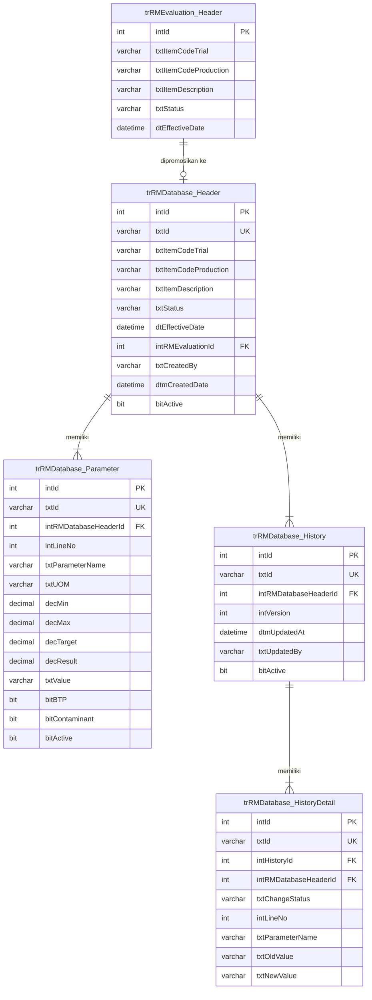

# FUNCTIONAL SPECIFICATION DOCUMENT (FSD)
## Modul: New RM Sample Management
### Sistem: IDC System (New RM Selection)

---

| Atribut          | Keterangan                                           |
|------------------|------------------------------------------------------|
| **Nama Dokumen** | FSD Modul New RM Sample Management                   |
| **Versi**        | 2.0                                                  |
| **Tanggal**      | 8 April 2026                                         |
| **Divisi**       | R&D / Procurement / ICT                              |
| **Status**       | Draft                                                |
| **Dibuat oleh**  | Tim ICT – IDC System                                 |

---

## Riwayat Revisi

| Versi | Tanggal       | Diubah Oleh     | Keterangan                                                                                  |
|-------|---------------|-----------------|---------------------------------------------------------------------------------------------|
| 1.0   | —             | Tim ICT         | Initial draft                                                                               |
| 1.8   | Feb 2026      | Tim ICT         | Penambahan ERD, DDL scripts, modul RM Database                                              |
| 1.9   | Feb 2026      | Tim ICT         | Update field EG-DEG di Step 3, data LOV dari MAppParam                                     |
| **2.0** | **Apr 2026** | **Tim ICT**   | Penghapusan field Shipping Method dari accordion Storage & Shelf Life; penambahan dropdown **Status Organik** dan **Potensi Bahan Mengandung EG DEG** (multi-select, Select2) ke accordion **Halal, GMO & PHO** di Step 1; EG-DEG dipindahkan dari Step 3 ke Step 1 |

---

## Daftar Isi

1. [Pendahuluan](#1-pendahuluan)
   - 1.1 [Tujuan Dokumen](#11-tujuan-dokumen)
   - 1.2 [Ruang Lingkup](#12-ruang-lingkup)
   - 1.3 [Stakeholder](#13-stakeholder)
2. [Ringkasan Business Flow](#2-ringkasan-business-flow)
   - 2.1 [Proses As-Is (Manual)](#21-proses-as-is-manual)
   - 2.2 [Proses To-Be (Sistem IDC)](#22-proses-to-be-sistem-idc)
3. [Spesifikasi Fungsional](#3-spesifikasi-fungsional)
   - 3.1 [Halaman Index – New RM Sample](#31-halaman-index--new-rm-sample)
   - 3.2 [Halaman Detail – Wizard Form (4 Step)](#32-halaman-detail--wizard-form-4-step)
4. [Struktur Database](#4-struktur-database)
5. [Aturan Bisnis](#5-aturan-bisnis)
6. [List of Values (LOV) & Referensi Data](#6-list-of-values-lov--referensi-data)
7. [Hak Akses & Peran Pengguna](#7-hak-akses--peran-pengguna)
8. [Notifikasi](#8-notifikasi)
9. [Appendix A – SQL Server DDL Scripts](#appendix-a-sql-server-ddl-scripts)

---

## 1. Pendahuluan

Modul **New RM Sample Management** merupakan modul dalam sistem IDC (Integrated Data Center) untuk mengelola proses pengajuan, evaluasi, dan disposisi sample Raw Material baru dari supplier. Modul ini dirancang untuk menggantikan proses manual yang sebelumnya dilakukan melalui email dan spreadsheet, menjadi alur terstandardisasi dengan workflow yang terstruktur dan terdokumentasi secara digital.

### 1.1 Tujuan Dokumen

Dokumen ini bertujuan untuk:

1. Menjelaskan fungsionalitas lengkap modul New RM Sample Management di sistem IDC.
2. Menjadi acuan pengembangan (*development reference*) bagi tim ICT.
3. Mendeskripsikan alur proses, desain layar, struktur database, serta aturan bisnis yang berlaku.
4. Mendokumentasikan field, validasi, dan business rules untuk setiap step workflow.
5. Mencatat perubahan desain terkini (v2.0) — penambahan Status Organik & EG-DEG, penghapusan Shipping Method.

### 1.2 Ruang Lingkup

Dokumen ini mencakup dua halaman utama:

1. `NewRMSampleIndex.html` – Halaman daftar & monitoring semua RM Sample
2. `NewRMSampleDetail.html` – Halaman wizard form 4-step untuk input, evaluasi, dan disposisi sample

**Empat Step Workflow:**

| Step | Nama            | Deskripsi                                                 |
|------|-----------------|-----------------------------------------------------------|
| 1    | Document Registration | Pendaftaran dan dokumentasi sample RM dari supplier       |
| 2    | Document Sample  | Analisis tujuan dan kebutuhan sample, mapping ke produk   |
| 3    | RM Evaluation   | Testing dan evaluasi teknis sample di laboratorium        |
| 4    | Disposition     | Review final dan keputusan approve / reject / on hold     |

### 1.3 Stakeholder

| Peran                | Tim / Nama              | Keterlibatan                                               |
|----------------------|-------------------------|-------------------------------------------------------------|
| Business Owner       | Procurement / R&D       | Pemilik proses bisnis, validasi kebutuhan                  |
| ICT Developer        | KN IT                   | Pengembangan dan implementasi                              |
| Sample Requestor (PIC) | Procurement Team      | Menerima sample, dokumentasi awal, koordinasi supplier     |
| R&D Team            | R&D Department          | Analisis purpose, mapping produk, set requirement          |
| Lab / QC Team       | Laboratorium / QC       | Testing sample, validasi compliance, quality scoring       |
| Decision Maker      | Manager / Supervisor    | Review hasil evaluasi, keputusan final (approve/reject)    |
| Approver            | Management              | Final approval untuk sample yang di-approve (jika perlu)  |

---

## 2. Ringkasan Business Flow

### 2.1 Proses As-Is (Manual)

Sebelum sistem IDC, proses evaluasi RM Sample dilakukan secara manual:

- **Penerimaan Sample**: Supplier mengirim sample fisik, PIC mencatat via email atau spreadsheet Excel.
- **Analisis Purpose**: R&D menganalisis tujuan melalui meeting dan komunikasi informal, tidak ada tracking terstruktur.
- **Evaluasi Lab**: Hasil testing dikirim via email, tidak ada centralized tracking per sample.
- **Keputusan**: Decision maker memberikan keputusan verbal atau via email, tidak ada audit trail.

| Aspek              | Proses Lama (Manual)                        | Proses Baru (IDC)                              |
|--------------------|---------------------------------------------|------------------------------------------------|
| Pencatatan         | Spreadsheet Excel / Email                   | Database terpusat, web-based                   |
| Tracking           | Manual, tidak real-time                     | Dashboard otomatis, real-time                  |
| Dokumen Pendukung  | File attachment via email                   | Upload langsung ke sistem, per tahap           |
| Audit Trail        | Tidak ada / tidak terstruktur               | Full history log setiap perubahan              |
| Notifikasi         | Manual (email pribadi)                      | Otomatis oleh sistem                           |
| Keputusan          | Verbal / email tidak terstruktur            | Formal disposition dengan timestamp & reason   |

### 2.2 Proses To-Be (Sistem IDC)

#### 2.2.1 Flow Diagram

*(Gambar 1: New RM Sample Business Flow Diagram)*



#### 2.2.2 Status Sample

| Kode              | Label              | Deskripsi                                                              |
|-------------------|--------------------|------------------------------------------------------------------------|
| `DRAFT`           | Draft              | Baru dibuat, wizard belum selesai                                      |
| `PENDING`         | Pending            | Dalam proses evaluasi (salah satu step sedang berjalan)                |
| `PENDING_APPROVAL`| Pending Approval   | Disposisi Approved, menunggu approval atasan                           |
| `COMPLETED`       | Completed          | Semua step selesai, keputusan final sudah diberikan                    |
| `REJECTED`        | Rejected           | Keputusan disposisi adalah Rejected                                    |
| `ON_HOLD`         | On Hold            | Ditunda, menunggu informasi tambahan                                   |
| `CANCELLED`       | Cancelled          | Dibatalkan oleh PIC (hanya saat masih Draft)                          |

---

## 3. Spesifikasi Fungsional

### 3.1 Halaman Index – New RM Sample

**Path**: `NewRMSampleIndex.html`

**Tujuan**: Menampilkan semua RM Sample dalam bentuk daftar tabel, dilengkapi dashboard ringkasan berdasarkan workflow stage.

#### 3.1.1 Deskripsi

*(Gambar 2: Halaman Index – Dashboard dan Data Table)*

| Card               | Warna               | Isi                                                   |
|--------------------|---------------------|-------------------------------------------------------|
| Total Samples      | Biru (Primary)      | Total semua sample yang terdaftar                     |
| Step 1: Document   | Kuning (Warning)    | Sample yang sedang di tahap dokumentasi               |
| Step 2: Analysis   | Cyan (Info)         | Sample yang sedang di tahap analisis purpose          |
| Step 3: Evaluation | Abu-abu (Secondary) | Sample yang sedang di tahap evaluasi teknis           |
| Completed          | Hijau (Success)     | Sample yang sudah selesai (approved/rejected)         |

#### 3.1.2 Functional Description

**Action Bar:**

| Tombol              | Fungsi                                                              |
|---------------------|---------------------------------------------------------------------|
| Create New Sample   | Arahkan ke halaman Detail dengan wizard fresh (mode Create)         |
| Export Excel        | Export data tabel ke format Excel (.xlsx)                           |

**Tabel Daftar Sample:**

| Kolom          | Sumber Data          | Keterangan                                          |
|----------------|----------------------|-----------------------------------------------------|
| Sample No      | `txtSampleNo`        | Nomor unik sample (format: XXX-R-RM-MM-YY)          |
| Material Name  | `txtMaterialName`    | Nama material/RM yang di-sample                     |
| Supplier Name  | `txtSupplierName`    | Nama supplier yang mengajukan sample                |
| Date           | `dtSubmissionDate`   | Tanggal submission sample                           |
| Workflow Stage | `txtWorkflowStage`   | Tahap workflow saat ini (Badge berwarna)             |
| Status         | `txtStatus`          | Status sample (Badge warna sesuai status)           |
| Action         | —                    | Dropdown: Edit / View / Delete                      |

#### 3.1.3 Business Rules & Validation

| Status Sample    | Tombol Action | Keterangan                                            |
|------------------|---------------|-------------------------------------------------------|
| Draft            | Edit / Delete | Bisa diedit dan dihapus (soft delete)                 |
| Pending          | Edit          | Bisa diedit (lanjutkan wizard)                        |
| Completed        | View          | Read-only, tidak bisa diedit atau dihapus             |
| Rejected         | View          | Read-only                                             |
| On Hold          | Edit          | Bisa diedit untuk kembali ke Step 3                   |

---

### 3.2 Halaman Detail – Wizard Form (4 Step)

**Path**: `NewRMSampleDetail.html`

**Tujuan**: Form wizard 4 step untuk mengelola lifecycle lengkap RM Sample dari dokumentasi hingga disposition.

*(Gambar 3: Halaman Detail – 4-Step Wizard Form)*

---

#### 3.2.1 Step 1: Document Registration

*(Gambar 4: Step 1 – Document Registration)*

**Fungsi Utama:**
- Mendokumentasikan informasi dasar sample RM dari supplier
- Input data supplier, material, pricing, quantity, informasi Halal-GMO-Organik
- Upload dokumen pendukung (COA, MSDS, Spec Sheet, dll)

**Sub-Accordion di Step 1:**

| Accordion             | Konten Utama                                                            |
|-----------------------|-------------------------------------------------------------------------|
| Supplier & Material   | Material Name, Supplier, Principal, Country, Plant Site                 |
| Pricing & Packaging   | Currency, Price, UOM, Net Weight, Packaging                             |
| Storage & Shelf Life  | Storage Condition (LOV), Shelf Life (Months)                            |
| **Halal, GMO & PHO**  | Halal Category, Halal Body, GMO Status, Contains PHO, **Status Organik**, **Potensi Bahan Mengandung EG DEG** |
| Allergen Information  | Checklist allergen (Gluten, Egg, Fish, Peanuts, dll.)                   |
| BTP Content           | Tabel: BTP Name, Function, PPM                                          |
| Project Members (PIC) | Tabel assignee per departemen (auto-fill dari Item Code PM)             |

> **Perubahan v2.0**: Accordion "Storage & Shelf Life" **tidak lagi** memuat field Shipping Method. Field Status Organik dan Potensi EG DEG kini berada di accordion **Halal, GMO & PHO**.

**Keterangan Field — Accordion Supplier & Material:**

| Field Name        | ID Elemen                     | Mandatory | Validasi              | Keterangan                                                  |
|-------------------|-------------------------------|-----------|-----------------------|-------------------------------------------------------------|
| Type Document     | `txtTypeDocument`             | Yes       | LOV Selection         | Jenis dokumen (New Material / Replacement / Alternative)    |
| Sample No         | `txtSampleNo`                 | Auto      | Auto-generated        | Nomor unik sample (format: XXX-R-RM-MM-YY)                  |
| I2MS Project No   | `txtI2MSProjectNo`            | No        | LOV Selection         | Nomor proyek I2MS terkait (opsional)                        |
| Sample Date       | `sampleDate`                  | Yes       | Date                  | Tanggal sample diterima                                     |
| Date of Receipt   | `receiptDate`                 | Yes       | Date                  | Tanggal penerimaan fisik sample                             |
| Material Name     | `materialName`                | Yes       | Min 3, Max 200 char   | Nama material yang di-sample                                |
| Supplier          | `DocumentSample_txtSupplierName`| Yes     | LOV Selection         | Supplier yang mengajukan sample                             |
| Principal         | `principalName`               | No        | Max 200 char          | Nama manufacturer / principal                               |
| Country           | `DocumentSample_txtCountryName`| No       | LOV Selection         | Negara manufaktur                                           |
| Plant Site        | `plantSite`                   | No        | Max 200 char          | Lokasi pabrik                                               |

**Keterangan Field — Accordion Pricing & Packaging:**

| Field Name  | ID Elemen                          | Mandatory   | Validasi                | Keterangan                       |
|-------------|------------------------------------|-------------|-------------------------|----------------------------------|
| Currency    | `DocumentSample_txtCurrencyName`   | Conditional | LOV Selection           | Wajib jika Price diisi           |
| Price       | `price`                            | No          | Numeric, >= 0           | Harga per UOM                    |
| UOM         | `DocumentSample_txtUOMName`        | Yes         | LOV Selection           | Unit of Measure (kg, liter, pcs) |
| Net Weight  | `netWeight`                        | Yes         | Numeric, > 0            | Berat bersih sample              |
| Packaging   | `packaging`                        | No          | Max 200 char            | Informasi kemasan                |

**Keterangan Field — Accordion Storage & Shelf Life:**

| Field Name        | ID Elemen                              | Mandatory | Validasi         | Keterangan                                  |
|-------------------|----------------------------------------|-----------|------------------|---------------------------------------------|
| Storage Condition | `DocumentSample_txtStorageCondition`   | Yes       | LOV Selection    | Kondisi penyimpanan (source: MAppParam)     |
| Shelf Life (Months)| `shelfLife`                           | No        | Numeric, > 0     | Masa simpan dalam bulan                     |

> **Catatan v2.0**: Field **Shipping Method** (`shipping`) telah **dihapus** dari accordion ini mulai versi 2.0.

**Keterangan Field — Accordion Halal, GMO & PHO:**

| Field Name                        | ID Elemen              | Mandatory | Validasi               | Keterangan                                                            |
|-----------------------------------|------------------------|-----------|------------------------|-----------------------------------------------------------------------|
| Halal Category                    | `Halal_txtHalalDesc`   | No        | LOV Selection          | Kategori halal material (source: master Halal Category)               |
| Halal Body                        | `Halal_txtHalalBodyInst`| No       | LOV Selection          | Lembaga sertifikasi halal (MUI, JAKIM, dll.)                          |
| GMO Status                        | `Halal_txtGMOStatusDesc`| Yes      | LOV Selection          | Status GMO: Non GMO / GMO Free / PCR Negative                         |
| Contains PHO                      | `pho`                  | Yes       | Select (Yes/No)        | Apakah mengandung Partially Hydrogenated Oil                          |
| **Status Organik** *(Baru v2.0)*  | `evalStatusOrganik`    | No        | Select                 | NON ORGANIK / ORGANIK (source: MAppParam)                             |
| **Potensi EG DEG** *(Baru v2.0)*  | `evalEgDeg`            | No        | Multi-select (Select2) | Pilihan: N/A, Gliserol, Polietilen Glikol, Propilen Glikol, Sorbitol Cair (source: MAppParam) |

**Document Attachment Table:**

- Upload multiple dokumen per sample (COA, MSDS, Spec Sheet, dll)
- Kolom: Document Type, Remarks, File Name, Upload Date, Action (Delete)
- Format yang didukung: PDF, DOC, DOCX, XLS, XLSX, JPG, PNG
- Ukuran maksimum: **10 MB** per file

---

#### 3.2.2 Step 2: Document Sample

*(Gambar 5: Step 2 – Document Sample)*

**Fungsi Utama:**
- Mendefinisikan tujuan dan alasan pengajuan sample
- Mapping sample dengan product/formula yang akan menggunakan material
- Input target usage percentage dan expected benefit

**Keterangan Field:**

| Field Name        | ID Elemen             | Mandatory | Validasi               | Keterangan                                            |
|-------------------|-----------------------|-----------|------------------------|-------------------------------------------------------|
| RM Category       | `rmCategory`          | Yes       | LOV Selection          | Kategori RM (Dairy, Flavoring, dll.)                  |
| Purpose Type      | `txtSamplePurposeType`| Yes       | LOV Selection          | New Ingredients / Alternative / dll.                  |
| Item Code Trial   | `txtItemCodeTrial`    | Yes       | LOV Selection          | Kode item trial dari IDC                              |
| Item Code Existing| `txtItemCodeExisting` | No        | LOV Selection          | Material yang akan digantikan (jika ada)              |
| Objective         | `objective`           | No        | Max 2000 char          | Tujuan penggunaan sample                              |
| Analysis Deadline | `dtAnalysisDeadline`  | Yes       | Date, >= Current Date  | Target deadline analisis sample                       |

**Variant Table (Apply to Product):**

- Tabel mapping product group, parent type, child type, dan Kategori Pangan
- Kategori Pangan dipilih via LOV dengan search
- Multiple row diperbolehkan

---

#### 3.2.3 Step 3: RM Evaluation

*(Gambar 6: Step 3 – RM Evaluation)*

**Fungsi Utama:**
- Input hasil testing dan evaluasi teknis sample di laboratorium
- Comparison dengan spec requirement dan existing material
- Upload hasil lab test dan trial production

**Keterangan Field:**

| Field Name              | ID Elemen               | Mandatory | Validasi              | Keterangan                                         |
|-------------------------|-------------------------|-----------|------------------------|----------------------------------------------------|
| Penyusun Bahan Baku     | `txtMaterialComposition`| No        | Text                  | Deskripsi komposisi bahan baku                     |
| Test Result Category    | Tab panel               | —         | —                     | Organoleptic, Nutrition, Microbiology, Heavy Metal, Antibiotics, Mycotoxin, Pesticides, Foreign |
| Status Conformance      | Per test row            | No        | Selection             | Conform / Non Conform per parameter                |

> **Catatan v2.0**: Field **Status Organik** dan **Potensi EG DEG** telah **dipindahkan** dari Step 3 ke accordion Halal, GMO & PHO di Step 1 (sejak versi 2.0). Tab parameter uji masih lengkap di Step 3.

**Tabel Parameter Uji (per kategori):**

| Kolom           | Keterangan                                                  |
|-----------------|-------------------------------------------------------------|
| Test Code       | Kode parameter uji (LOV Search)                             |
| Test Class      | Kategori: Physical / Chemical / Microbiology                |
| Regulation No   | Nomor regulasi acuan                                        |
| Regulation Min  | Batas minimum regulasi                                      |
| Regulation Max  | Batas maximum regulasi                                      |
| Spec Supplier Min / Max / Target | Nilai spec dari supplier                 |
| COA Result      | Hasil dari dokumen COA                                      |
| Analysis Result | Hasil analisa laboratorium internal                         |
| Spec SHP Min / Max | Nilai spec internal SHP                               |
| Target          | Nilai target                                                |

---

#### 3.2.4 Step 4: Disposition

*(Gambar 7: Step 4 – Disposition)*

**Fungsi Utama:**
- Review summary lengkap dari semua step sebelumnya (read-only)
- Input keputusan final (Approved / Rejected / On Hold)
- Setup approval workflow jika keputusan memerlukan persetujuan atasan

**Keterangan Field:**

| Field Name          | ID Elemen              | Mandatory    | Validasi               | Keterangan                                        |
|---------------------|------------------------|--------------|------------------------|---------------------------------------------------|
| Disposition Decision| `txtDisposition`       | Yes          | Selection              | Keputusan: Approved / Rejected / On Hold          |
| Decision Date       | `dtDecisionDate`       | Auto         | Auto: Current Date     | Tanggal keputusan dibuat                          |
| Decision By         | `txtDecisionBy`        | Auto         | Auto from Login User   | User yang membuat keputusan                       |
| Reason              | `txtReason`            | Yes          | Min 10, Max 1000 char  | Alasan keputusan (wajib untuk semua keputusan)    |
| Next Action         | `txtNextAction`        | No           | Max 500 char           | Action plan selanjutnya (jika On Hold / Approved) |
| Approval Required   | `bitApprovalRequired`  | No           | Boolean (Yes/No)       | Apakah memerlukan approval atasan                 |
| Approver            | `txtApproverId`        | Conditional  | LOV Selection          | Wajib jika Approval Required = Yes                |

**Summary Review Section (Read-Only):**
- Menampilkan ringkasan data dari Step 1, 2, dan 3
- Link ke dokumen attachment yang sudah diupload

---

#### 3.2.5 Wizard Navigation & Actions

**Tombol Navigasi:**

| Button            | Visibility       | Fungsi                                                         |
|-------------------|------------------|----------------------------------------------------------------|
| Previous          | Step 2, 3, 4     | Kembali ke step sebelumnya (data tersimpan)                    |
| Next Step         | Step 1, 2, 3     | Lanjut ke step berikutnya (validasi field mandatory terlebih dahulu) |
| Save Draft        | Semua Step       | Simpan sebagai draft, bisa dilanjutkan nanti                   |
| Submit Complete   | Step 4 only      | Submit final — ubah status menjadi Completed / Pending Approval|
| Back to Index     | Semua Step       | Kembali ke halaman Index tanpa mengubah data                   |

---

## 4. Struktur Database

> **Database**: SQL Server – `IDC_Formulation`
> **Engine**: Microsoft SQL Server
> **Referensi DDL**: `idc-system/Database/Scripts/03 – 06_Step*.sql`

### 4.1 Konvensi Penamaan (Actual)

| Prefix | Tipe Data | Contoh |
|--------|-----------|--------|
| `int` | INT (auto-inc) | `intId`, `intSampleHeaderId` |
| `txt` | VARCHAR | `txtSampleNo`, `txtMaterialName` |
| `dt` / `dtm` | DATE / DATETIME | `dtSampleDate`, `dtmCreatedDate` |
| `dec` | DECIMAL | `decPricePerUOM`, `decOverallScore` |
| `bit` | BIT | `bitActive`, `bitApprovalRequired` |
| `tr` | Tabel transaksi | `trRMSample_Header`, `trDocumentSample_Header` |
| `m` | Tabel master | `mDepartment`, `mSampleType` |

**Primary Key Convention (Dual PK):**
- `intId` — INT IDENTITY auto-increment (FK reference)
- `txtId` — VARCHAR(50) GUID (unique business key)

**Audit Fields (setiap tabel transaksi):**
`txtCreatedBy`, `dtmCreatedDate`, `txtUpdatedBy`, `dtmUpdatedDate`, `bitActive`

### 4.2 Entity Relationship Diagram (ERD)

*(Gambar 8: ERD – Relasi Tabel Modul New RM Sample)*



### 4.3 Tabel Transaksi

Total tabel transaksi: **11 tabel**, terbagi per step workflow.

#### STEP 1 – Document Registration (5 Tabel)

**4.3.1 `trDocumentSample_Header`** — Step 1: Data Dokumentasi Sample

> **Perubahan v2.0**: Kolom `txtShippingMethod` dihapus. Ditambahkan kolom `txtStatusOrganik` dan `txtEgDegContent` untuk menyimpan data dari accordion Halal, GMO & PHO.

| Kolom | Tipe Data | Nullable | Keterangan |
|-------|-----------|----------|------------|
| `intId` | INT IDENTITY (PK) | No | Primary key |
| `txtId` | VARCHAR(50) (UK) | No | GUID |
| `intSampleHeaderId` | INT (FK) | No | FK → `trRMSample_Header.intId` |
| `dtSampleDate` | DATE | No | Tanggal pembuatan dokumen |
| `intTypeDocumentId` | INT (FK) | No | FK → master type document |
| `txtMaterialName` | VARCHAR(200) | No | Nama material |
| `txtPrincipalName` | VARCHAR(200) | No | Nama principal/manufacturer |
| `intSupplierId` | INT (FK) | Yes | FK → master supplier |
| `txtSupplierName` | VARCHAR(200) | No | Nama supplier (denormalized) |
| `intShelfLifeMonth` | INT | No | Masa simpan (bulan) |
| `txtPackaging` | VARCHAR(200) | No | Kemasan |
| ~~`txtShippingMethod`~~ | ~~VARCHAR(200)~~ | ~~Yes~~ | **DIHAPUS** di v2.0 |
| `intStorageId` | INT (FK) | No | FK → `mAppParam` (STORAGE_CONDITION) |
| `txtHalalCategoryCode` | VARCHAR(10) | No | Kode kategori halal |
| `intHalalBodyId` | INT (FK) | No | FK → master halal body |
| `dtDateReceipt` | DATE | No | Tanggal terima sample |
| `txtCurrencyCode` | VARCHAR(10) | No | Kode mata uang |
| `txtUOMCode` | VARCHAR(10) | No | Kode UOM |
| `decPricePerUOM` | DECIMAL(18,2) | Yes | Harga per UOM |
| `decNetWeight` | DECIMAL(18,4) | Yes | Berat bersih |
| `intPegawaiId` | INT (FK) | No | FK → user/pegawai (PIC) |
| `txtGMOStatus` | VARCHAR(50) | No | Non GMO / GMO Free / PCR Negative |
| `bitContainPHO` | BIT | No | Mengandung PHO (0=No, 1=Yes) |
| **`txtStatusOrganik`** | **VARCHAR(50)** | **Yes** | **Baru v2.0** — NON ORGANIK / ORGANIK (source: MAppParam) |
| **`txtEgDegContent`** | **VARCHAR(MAX)** | **Yes** | **Baru v2.0** — JSON/CSV pilihan EG DEG (source: MAppParam) |

---

**4.3.2 `trDocumentSample_Allergen`** — Allergen Checklist

Multiple rows per sample, satu row per allergen type yang dicek.

| Kolom | Tipe Data | Keterangan |
|-------|-----------|------------|
| `intId` | INT IDENTITY (PK) | Primary key |
| `txtId` | VARCHAR(50) (UK) | GUID |
| `intSampleHeaderId` | INT (FK) | FK → `trRMSample_Header.intId` |
| `intDocSampleHeaderId` | INT (FK) | FK → `trDocumentSample_Header.intId` |
| `txtAllergenCode` | VARCHAR(50) | e.g. CEREAL_GLUTEN, EGG, FISH |
| `txtAllergenName` | VARCHAR(200) | Nama allergen lengkap |
| `bitIsChecked` | BIT | 0=Tidak mengandung, 1=Mengandung |

---

**4.3.3 `trDocumentSample_BTP`** — Carry Over BTP

Multiple rows, satu row per BTP item.

| Kolom | Tipe Data | Keterangan |
|-------|-----------|------------|
| `intId` | INT IDENTITY (PK) | Primary key |
| `txtId` | VARCHAR(50) (UK) | GUID |
| `intSampleHeaderId` | INT (FK) | FK → `trRMSample_Header.intId` |
| `intDocSampleHeaderId` | INT (FK) | FK → `trDocumentSample_Header.intId` |
| `intLineNo` | INT | Nomor urut baris |
| `txtBTPName` | VARCHAR(200) | Nama BTP |
| `txtFunctionName` | VARCHAR(200) | Fungsi BTP |
| `decPercentagePPM` | DECIMAL(18,4) | Persentase dalam ppm |

---

**4.3.4 `trDocumentSample_Document`** — Upload Dokumen Pendukung

Multiple rows, satu row per file yang diupload.

| Kolom | Tipe Data | Keterangan |
|-------|-----------|------------|
| `intId` | INT IDENTITY (PK) | Primary key |
| `txtId` | VARCHAR(50) (UK) | GUID |
| `intSampleHeaderId` | INT (FK) | FK → `trRMSample_Header.intId` |
| `txtDocumentType` | VARCHAR(50) | Specification / COA / Halal Certificate / dll. |
| `txtFileName` | VARCHAR(255) | Nama file asli |
| `txtFilePath` | VARCHAR(500) | Path server |
| `txtFileExtension` | VARCHAR(10) | pdf, jpg, docx, dll |
| `intFileSize` | INT | Ukuran file (bytes) |
| `dtExpiredDate` | DATE | Tanggal expired (opsional) |
| `txtRemarks` | VARCHAR(MAX) | Keterangan |

---

#### STEP 2 – Document Sample (2 Tabel)

**4.3.5 `trSamplePurpose_Header`** — Data Purpose Utama

| Kolom | Tipe Data | Keterangan |
|-------|-----------|------------|
| `intId` | INT IDENTITY (PK) | Primary key |
| `txtId` | VARCHAR(50) (UK) | GUID |
| `intSampleHeaderId` | INT (FK) | FK → `trRMSample_Header.intId` |
| `intRMCategoryId` | INT (FK) | FK → master RM category |
| `txtRMCategoryCode` | VARCHAR(50) | Kode kategori (denormalized) |
| `txtRMCategoryName` | VARCHAR(200) | Nama kategori (denormalized) |
| `txtRMSubCode` | VARCHAR(50) | Kode sub-kategori |
| `txtRMSubName` | VARCHAR(200) | Nama sub-kategori |
| `intSamplePurposeTypeId` | INT (FK) | FK → master purpose type |
| `txtSamplePurposeType` | VARCHAR(100) | New Ingredients / Alternative / dll |
| `txtItemCodeTrial` | VARCHAR(50) | Kode item trial (form IDC) |
| `txtItemDescTrial` | VARCHAR(200) | Deskripsi item trial |
| `txtItemCodeExisting` | VARCHAR(50) | Kode item existing |
| `txtItemDescExisting` | VARCHAR(200) | Deskripsi item existing (auto-filled) |
| `txtObjective` | VARCHAR(MAX) | Tujuan penggunaan sample |

---

**4.3.6 `trSamplePurpose_Product`** — Apply To Product (Child Table)

Multiple rows, satu row per product group/type yang akan menggunakan material.

| Kolom | Tipe Data | Keterangan |
|-------|-----------|------------|
| `intId` | INT IDENTITY (PK) | Primary key |
| `txtId` | VARCHAR(50) (UK) | GUID |
| `intSampleHeaderId` | INT (FK) | FK → `trRMSample_Header.intId` |
| `intSamplePurposeHeaderId` | INT (FK) | FK → `trSamplePurpose_Header.intId` |
| `intLineNo` | INT | Nomor urut baris |
| `intGroupProductTypeId` | INT (FK) | FK → master group product type |
| `txtGroupProductTypeName` | VARCHAR(200) | Nama group (denormalized) |
| `intChildProductTypeId` | INT (FK) | FK → master child product type |
| `txtChildProductTypeName` | VARCHAR(200) | Nama child (denormalized) |
| `intVariantId` | INT (FK) | FK → master variant |
| `txtVariantName` | VARCHAR(200) | Nama variant (denormalized) |
| `decCarryOverBTP` | DECIMAL(18,4) | Hasil kalkulasi Carry Over BTP |

---

#### STEP 3 – RM Evaluation (3 Tabel)

**4.3.7 `trRMEvaluation_Header`** — Summary Evaluasi

| Kolom | Tipe Data | Keterangan |
|-------|-----------|------------|
| `intId` | INT IDENTITY (PK) | Primary key |
| `txtId` | VARCHAR(50) (UK) | GUID |
| `intSampleHeaderId` | INT (FK) | FK → `trRMSample_Header.intId` |
| `decOverallScore` | DECIMAL(5,2) | Skor keseluruhan (0–100) |
| `txtEvaluationStatus` | VARCHAR(50) | Draft / Completed / Reviewed |
| `txtEvaluationNotes` | VARCHAR(MAX) | Catatan Evaluasi |
| `txtStatusOrganik` | VARCHAR(50) | NON ORGANIK / ORGANIK |
| `txtEgDegContent` | VARCHAR(MAX) | Potensi EG/DEG (multi-select, JSON) |
| `txtMaterialComposition` | VARCHAR(MAX) | Deskripsi penyusun bahan baku |

---

**4.3.8 `trRMEvaluation_Detail`** — Parameter Uji (Testing Parameters)

Multiple rows, satu row per parameter uji (Organoleptic / Nutrition / Micro / Heavy Metal / Contaminant).

| Kolom | Tipe Data | Keterangan |
|-------|-----------|------------|
| `intId` | INT IDENTITY (PK) | Primary key |
| `txtId` | VARCHAR(50) (UK) | GUID |
| `intSampleHeaderId` | INT (FK) | FK → `trRMSample_Header.intId` |
| `intEvaluationHeaderId` | INT (FK) | FK → `trRMEvaluation_Header.intId` |
| `intLineNo` | INT | Nomor urut |
| `txtTestCode` | VARCHAR(50) | Kode parameter uji |
| `txtTestClass` | VARCHAR(100) | Organoleptic / Nutrition / Micro / HeavyMetal / Contaminant |
| `txtTestName` | VARCHAR(200) | Nama parameter uji |
| `txtTestUnit` | VARCHAR(20) | Satuan (%, ppm, cfu/g, mg/kg) |
| `txtRegulationNo` | VARCHAR(100) | Nomor regulasi |
| `decRegulationMin` | DECIMAL(18,4) | Batas minimum regulasi |
| `decRegulationMax` | DECIMAL(18,4) | Batas maximum regulasi |
| `decSpecSupplierMin` | DECIMAL(18,4) | Spec supplier minimum |
| `decSpecSupplierMax` | DECIMAL(18,4) | Spec supplier maximum |
| `decSpecSupplierTarget` | DECIMAL(18,4) | Spec supplier target |
| `txtCOAResult` | VARCHAR(200) | Hasil dari COA document |
| `txtAnalysisResult` | VARCHAR(200) | Hasil analisa laboratorium |
| `decSpecSHPMin` | DECIMAL(18,4) | Spec SHP minimum |
| `decSpecSHPMax` | DECIMAL(18,4) | Spec SHP maximum |
| `decTarget` | DECIMAL(18,4) | Target value |

---

**4.3.9 `trRMEvaluation_FoodCategory`** — Food Category Mapping

Multiple rows, mapping kategori pangan untuk referensi regulasi.

| Kolom | Tipe Data | Keterangan |
|-------|-----------|------------|
| `intId` | INT IDENTITY (PK) | Primary key |
| `txtId` | VARCHAR(50) (UK) | GUID |
| `intSampleHeaderId` | INT (FK) | FK → `trRMSample_Header.intId` |
| `intEvaluationHeaderId` | INT (FK) | FK → `trRMEvaluation_Header.intId` |
| `intCategoryId` | INT (FK) | FK → master food category |
| `txtCategoryCode` | VARCHAR(50) | Kode kategori (denormalized) |
| `txtCategoryName` | VARCHAR(200) | Nama kategori (denormalized) |
| `txtRegulationRef` | VARCHAR(200) | Referensi regulasi terkait |

---

#### STEP 4 – Disposition (1 Tabel)

**4.3.10 `trRMDisposition_Header`** — Keputusan Final & Approval

| Kolom | Tipe Data | Nullable | Default | Keterangan |
|-------|-----------|----------|---------|------------|
| `intId` | INT IDENTITY (PK) | No | Auto | Primary key |
| `txtId` | VARCHAR(50) (UK) | No | GUID | Business unique key |
| `intSampleHeaderId` | INT (FK) | No | — | FK → `trRMSample_Header.intId` |
| `txtRecommendation` | VARCHAR(MAX) | Yes | NULL | Rekomendasi dari evaluator |
| `txtDecision` | VARCHAR(20) | Yes | NULL | Approved / Rejected / On Hold |
| `txtDecisionReason` | VARCHAR(MAX) | Yes | NULL | Alasan keputusan |
| `dtDecisionDate` | DATETIME | Yes | NULL | Tanggal keputusan |
| `bitApprovalRequired` | BIT | Yes | 0 | 0=Tidak, 1=Butuh approval |
| `intApproverId` | INT (FK) | Yes | NULL | FK → master pegawai/user |
| `txtApproverName` | VARCHAR(200) | Yes | NULL | Nama approver (denormalized) |
| `txtApprovalStatus` | VARCHAR(20) | Yes | NULL | Pending / Approved / Rejected |
| `dtApprovalDate` | DATETIME | Yes | NULL | Tanggal approval |
| `txtApprovalNotes` | VARCHAR(MAX) | Yes | NULL | Catatan approver |
| `txtCreatedBy` | VARCHAR(100) | No | — | Username pembuat |
| `dtmCreatedDate` | DATETIME | No | GETDATE() | Tanggal dibuat |
| `txtUpdatedBy` | VARCHAR(100) | Yes | NULL | Username terakhir update |
| `dtmUpdatedDate` | DATETIME | Yes | NULL | Tanggal terakhir update |
| `bitActive` | BIT | No | 1 | Soft delete flag |

---

### 4.4 Tabel Master yang Digunakan (Existing)

| Nama Tabel | DB Asal | Digunakan di | Keterangan |
|------------|---------|--------------|------------|
| `mDepartment` | KN2017_Formulation | LOV Departemen | Departemen user |
| `mAppParam` | IDC_Formulation | Step 1 | Storage condition, Status Organik, EG-DEG options |
| Master supplier, currency, UOM, pegawai | Existing | Step 1, 4 | Reuse dari modul lain |

> **Catatan v2.0**: `mAppParam` kini juga menjadi source untuk **Status Organik** dan opsi **EG DEG**. Filter: `WHERE txtAppParamVariable IN ('IDC_STATUS_ORGANIK', 'IDC_EG_DEG_OPTION')`.

---

## 5. Aturan Bisnis

### 5.1 Pembuatan Sample

1. **Sample No** bersifat read-only dan di-generate otomatis saat save pertama kali, format: `{DEPT}-R-RM-{MM}-{YY}`.
2. **Submission Date** default adalah tanggal hari ini dan tidak dapat diubah manual.
3. **Status** awal adalah `DRAFT` dan tidak dapat diubah manual.

### 5.2 Navigasi Wizard

1. User harus menyelesaikan step secara **berurutan** — tidak bisa lompat ke step yang belum dilalui.
2. Data tersimpan otomatis ketika user berpindah step (klik Next Step).
3. Tombol **Previous** tersedia di Step 2, 3, dan 4 untuk kembali ke step sebelumnya tanpa kehilangan data.
4. Draft bisa diedit kapan saja sebelum Submit Complete.

### 5.3 Validasi Field

1. Semua field mandatory harus terisi sebelum user bisa lanjut ke step berikutnya.
2. **Price Currency** wajib diisi jika field Price diisi.
3. **Approver** wajib diisi jika `bitApprovalRequired = 1`.
4. **Catatan Keputusan** (Reason) wajib minimal 10 karakter untuk semua jenis keputusan disposisi.
5. **Analysis Deadline** tidak boleh kurang dari tanggal hari ini.
6. **Status Organik** dan **EG DEG** bersifat opsional (tidak mandatory) di Step 1.

### 5.4 Upload Dokumen

1. Format file yang diizinkan: **PDF, DOC, DOCX, XLS, XLSX, JPG, PNG**. Ukuran maksimum: **10 MB** per file.
2. Multiple file diperbolehkan per sample.
3. File yang sudah diupload bisa dihapus hanya saat status masih **Draft** atau **Pending**.

### 5.5 Submit & Perubahan Status

1. Tombol **Submit Complete** hanya muncul di Step 4 (Disposition).
2. Setelah Submit Complete:
   - Jika `bitApprovalRequired = 0`: status berubah menjadi `COMPLETED`.
   - Jika `bitApprovalRequired = 1`: status berubah menjadi `PENDING_APPROVAL`, notifikasi dikirim ke Approver.
3. Sample dengan status **Completed** atau **Rejected** tidak bisa diedit dan tidak bisa dihapus.

### 5.6 EG DEG Multi-Select

1. Field **Potensi Bahan Mengandung EG DEG** menggunakan komponen **Select2 multi-select** sehingga user dapat memilih lebih dari satu opsi.
2. Pilihan tersedia: **N/A**, Gliserol, Polietilen Glikol, Propilen Glikol, Sorbitol Cair.
3. Nilai tersimpan dalam format JSON/CSV di kolom `txtEgDegContent` pada `trDocumentSample_Header`.
4. Default value saat form dibuat: **N/A**.

---

## 6. List of Values (LOV) & Referensi Data

| LOV Name              | Sumber Data         | Query / Endpoint                                                                    | Field Tujuan                      |
|-----------------------|---------------------|-------------------------------------------------------------------------------------|-----------------------------------|
| Type Document         | `M_TYPE_DOCUMENT`   | `SELECT * FROM M_TYPE_DOCUMENT WHERE bitActive = 1`                                 | `txtTypeDocument`                 |
| Supplier              | `M_SUPPLIER`        | `SELECT * FROM M_SUPPLIER WHERE bitActive = 1`                                      | `txtSupplierName`, `intSupplierId`|
| Currency              | `M_CURRENCY`        | `SELECT * FROM M_CURRENCY WHERE bitActive = 1`                                      | `txtCurrencyId`                   |
| UOM                   | `M_UOM`             | `SELECT * FROM M_UOM WHERE bitActive = 1`                                           | `txtUOMCode`                      |
| Storage Condition     | `mAppParam`         | `WHERE txtAppParamVariable = 'IDC_STORAGE_CONDITION'`                               | `DocumentSample_txtStorageCondition`|
| Halal Category        | Master Halal Cat    | `SELECT * FROM mHalalCategory WHERE bitActive = 1`                                  | `Halal_txtHalalDesc`              |
| Halal Body            | Master Halal Body   | `SELECT * FROM mHalalBody WHERE bitActive = 1`                                      | `Halal_txtHalalBodyInst`          |
| GMO Status            | `mAppParam`         | `WHERE txtAppParamVariable = 'IDC_GMO_STATUS'`                                      | `Halal_txtGMOStatusDesc`          |
| **Status Organik**    | **`mAppParam`**     | **`WHERE txtAppParamVariable = 'IDC_STATUS_ORGANIK'`**                              | **`evalStatusOrganik`**           |
| **Potensi EG DEG**    | **`mAppParam`**     | **`WHERE txtAppParamVariable = 'IDC_EG_DEG_OPTION'`**                              | **`evalEgDeg` (multi-select)**    |
| I2MS Project No       | IDC Project Master  | LOV modal dengan search                                                              | `txtI2MSProjectNo`                |
| PIC / Pegawai         | `M_PEGAWAI`         | `SELECT * FROM M_PEGAWAI WHERE bitActive = 1`                                       | `DocumentSample_txtPegawaiName`   |
| Approver              | `M_PEGAWAI`         | `SELECT * FROM M_PEGAWAI WHERE bitActive = 1 AND txtRole IN ('MANAGER','ADMIN')`    | `txtApproverId`                   |

> **Catatan**: Field `evalEgDeg` menggunakan komponen **Select2 multi-select** agar user bisa memilih lebih dari satu bahan sekaligus. Opsi data di-load dari `mAppParam` dengan variable `IDC_EG_DEG_OPTION`.

---

## 7. Hak Akses & Peran Pengguna

| Peran            | Buat Sample | Edit Sample         | Upload Dokumen | Submit Complete | Approve  | Lihat Semua |
|------------------|-------------|---------------------|----------------|-----------------|----------|-------------|
| PIC / Requestor  | ✓           | ✓ (milik sendiri)   | ✓              | ✓               | ✗        | ✗           |
| R&D Team         | ✓           | ✓ (milik sendiri)   | ✓              | ✓               | ✗        | ✗           |
| Lab / QC Team    | ✗           | ✓ (Step 3 only)     | ✓              | ✗               | ✗        | ✗           |
| Manager          | ✗           | ✗                   | ✗              | ✗               | ✓        | ✓           |
| Administrator    | ✓           | ✓                   | ✓              | ✓               | ✓        | ✓           |

---

## 8. Notifikasi

| Event                              | Penerima                          | Jenis            |
|------------------------------------|-----------------------------------|------------------|
| Sample baru berhasil dibuat        | PIC (konfirmasi)                  | In-App           |
| Sample masuk ke Step 3 (Evaluation)| Lab / QC Team terkait             | Email + In-App   |
| Sample Submit Complete             | Approver (jika required)          | Email + In-App   |
| Approver telah approve             | PIC / Requestor                   | Email + In-App   |
| Approver telah reject              | PIC / Requestor                   | Email + In-App   |
| Sample Completed                   | PIC / Requestor                   | Email + In-App   |
| Sample Rejected (Disposisi)        | PIC / R&D Team                    | Email + In-App   |
| Reminder deadline sample           | PIC / Evaluator yang belum action | Email (Terjadwal)|

---

*Dokumen ini dibuat berdasarkan analisis kebutuhan sistem dan kode sumber yang ada oleh tim ICT.*
*Revisi dokumen dilakukan jika ada perubahan spesifikasi dari Business Owner.*

**End of Document**

---

## Appendix A: SQL Server DDL Scripts

> **Database:** `IDC_Formulation` (SQL Server)
> **Konvensi:** Nama tabel `tr` prefix + PascalCase. Dual PK: `intId` (IDENTITY) + `txtId` (VARCHAR GUID).

### A.1 `trRMSample_Header` — Unified Workflow Header

```sql
IF OBJECT_ID('dbo.trRMSample_Header', 'U') IS NULL
BEGIN
    CREATE TABLE [dbo].[trRMSample_Header](
        [intId]           INT           IDENTITY(1,1) NOT NULL,
        [txtId]           VARCHAR(50)   NOT NULL,
        [txtSampleNo]     VARCHAR(50)   NOT NULL,
        [intStatusId]     INT           NOT NULL DEFAULT 0,
        [intCurrentStep]  INT           NOT NULL DEFAULT 1,
        [txtCreatedBy]    VARCHAR(100)  NOT NULL,
        [dtmCreatedDate]  DATETIME      NOT NULL DEFAULT GETDATE(),
        [txtUpdatedBy]    VARCHAR(100)  NULL,
        [dtmUpdatedDate]  DATETIME      NULL,
        [bitActive]       BIT           NOT NULL DEFAULT 1,
        CONSTRAINT [PK_trRMSample_Header] PRIMARY KEY ([intId]),
        CONSTRAINT [UQ_trRMSample_Header_txtId] UNIQUE ([txtId]),
        CONSTRAINT [UQ_trRMSample_Header_SampleNo] UNIQUE ([txtSampleNo])
    )
END
GO
```

### A.2 `trDocumentSample_Header` — Step 1: Document Registration (v2.0)

> **v2.0**: Kolom `txtShippingMethod` dihapus. Ditambah `txtStatusOrganik` dan `txtEgDegContent`.

```sql
IF OBJECT_ID('dbo.trDocumentSample_Header', 'U') IS NULL
BEGIN
    CREATE TABLE [dbo].[trDocumentSample_Header](
        [intId]                INT           IDENTITY(1,1) NOT NULL,
        [txtId]                VARCHAR(50)   NOT NULL,
        [intSampleHeaderId]    INT           NOT NULL,
        [dtSampleDate]         DATE          NOT NULL,
        [intTypeDocumentId]    INT           NOT NULL,
        [txtMaterialName]      VARCHAR(200)  NOT NULL,
        [txtPrincipalName]     VARCHAR(200)  NOT NULL,
        [intSupplierId]        INT           NULL,
        [txtSupplierName]      VARCHAR(200)  NOT NULL,
        [intShelfLifeMonth]    INT           NOT NULL,
        [txtPackaging]         VARCHAR(200)  NOT NULL,
        -- [txtShippingMethod] VARCHAR(200) NULL  -- REMOVED in v2.0
        [intStorageId]         INT           NOT NULL,
        [txtHalalCategoryCode] VARCHAR(10)   NOT NULL,
        [intHalalBodyId]       INT           NOT NULL,
        [dtDateReceipt]        DATE          NOT NULL,
        [txtCurrencyCode]      VARCHAR(10)   NOT NULL,
        [txtUOMCode]           VARCHAR(10)   NOT NULL,
        [decPricePerUOM]       DECIMAL(18,2) NULL,
        [decNetWeight]         DECIMAL(18,4) NULL,
        [intPegawaiId]         INT           NOT NULL,
        [txtGMOStatus]         VARCHAR(50)   NOT NULL,
        [bitContainPHO]        BIT           NOT NULL DEFAULT 0,
        [txtStatusOrganik]     VARCHAR(50)   NULL,   -- NEW in v2.0: NON ORGANIK / ORGANIK
        [txtEgDegContent]      VARCHAR(MAX)  NULL,   -- NEW in v2.0: JSON multi-select EG DEG
        [txtCreatedBy]         VARCHAR(100)  NOT NULL,
        [dtmCreatedDate]       DATETIME      NOT NULL DEFAULT GETDATE(),
        [txtUpdatedBy]         VARCHAR(100)  NULL,
        [dtmUpdatedDate]       DATETIME      NULL,
        [bitActive]            BIT           NOT NULL DEFAULT 1,
        CONSTRAINT [PK_trDocumentSample_Header] PRIMARY KEY ([intId]),
        CONSTRAINT [UQ_trDocumentSample_Header_txtId] UNIQUE ([txtId]),
        CONSTRAINT [FK_trDocumentSample_Header_Sample] FOREIGN KEY ([intSampleHeaderId])
            REFERENCES [dbo].[trRMSample_Header]([intId])
    )
END
GO
```

### A.3 Child Tables Step 1

```sql
-- trDocumentSample_Allergen
IF OBJECT_ID('dbo.trDocumentSample_Allergen', 'U') IS NULL
BEGIN
    CREATE TABLE [dbo].[trDocumentSample_Allergen](
        [intId]                INT          IDENTITY(1,1) NOT NULL,
        [txtId]                VARCHAR(50)  NOT NULL,
        [intSampleHeaderId]    INT          NOT NULL,
        [intDocSampleHeaderId] INT          NOT NULL,
        [txtAllergenCode]      VARCHAR(50)  NOT NULL,
        [txtAllergenName]      VARCHAR(200) NOT NULL,
        [bitIsChecked]         BIT          NOT NULL DEFAULT 0,
        [txtCreatedBy]         VARCHAR(100) NOT NULL,
        [dtmCreatedDate]       DATETIME     NOT NULL DEFAULT GETDATE(),
        CONSTRAINT [PK_trDocumentSample_Allergen] PRIMARY KEY ([intId]),
        CONSTRAINT [FK_trDocumentSample_Allergen_Sample] FOREIGN KEY ([intSampleHeaderId])
            REFERENCES [dbo].[trRMSample_Header]([intId]),
        CONSTRAINT [FK_trDocumentSample_Allergen_DocHeader] FOREIGN KEY ([intDocSampleHeaderId])
            REFERENCES [dbo].[trDocumentSample_Header]([intId])
    )
END
GO

-- trDocumentSample_BTP
IF OBJECT_ID('dbo.trDocumentSample_BTP', 'U') IS NULL
BEGIN
    CREATE TABLE [dbo].[trDocumentSample_BTP](
        [intId]                INT            IDENTITY(1,1) NOT NULL,
        [txtId]                VARCHAR(50)    NOT NULL,
        [intSampleHeaderId]    INT            NOT NULL,
        [intDocSampleHeaderId] INT            NOT NULL,
        [intLineNo]            INT            NOT NULL,
        [txtBTPName]           VARCHAR(200)   NOT NULL,
        [txtFunctionName]      VARCHAR(200)   NOT NULL,
        [decPercentagePPM]     DECIMAL(18,4)  NOT NULL,
        [txtCreatedBy]         VARCHAR(100)   NOT NULL,
        [dtmCreatedDate]       DATETIME       NOT NULL DEFAULT GETDATE(),
        CONSTRAINT [PK_trDocumentSample_BTP] PRIMARY KEY ([intId]),
        CONSTRAINT [FK_trDocumentSample_BTP_Sample] FOREIGN KEY ([intSampleHeaderId])
            REFERENCES [dbo].[trRMSample_Header]([intId])
    )
END
GO

-- trDocumentSample_Document
IF OBJECT_ID('dbo.trDocumentSample_Document', 'U') IS NULL
BEGIN
    CREATE TABLE [dbo].[trDocumentSample_Document](
        [intId]                INT           IDENTITY(1,1) NOT NULL,
        [txtId]                VARCHAR(50)   NOT NULL,
        [intSampleHeaderId]    INT           NOT NULL,
        [intDocSampleHeaderId] INT           NOT NULL,
        [txtDocumentType]      VARCHAR(50)   NOT NULL,
        [txtFileName]          VARCHAR(255)  NOT NULL,
        [txtFilePath]          VARCHAR(500)  NOT NULL,
        [txtFileExtension]     VARCHAR(10)   NULL,
        [intFileSize]          INT           NULL,
        [txtSpecNumber]        VARCHAR(100)  NULL,
        [txtCertificateNo]     VARCHAR(100)  NULL,
        [dtExpiredDate]        DATE          NULL,
        [txtRemarks]           VARCHAR(MAX)  NULL,
        [txtCreatedBy]         VARCHAR(100)  NOT NULL,
        [dtmCreatedDate]       DATETIME      NOT NULL DEFAULT GETDATE(),
        CONSTRAINT [PK_trDocumentSample_Document] PRIMARY KEY ([intId]),
        CONSTRAINT [FK_trDocumentSample_Document_Sample] FOREIGN KEY ([intSampleHeaderId])
            REFERENCES [dbo].[trRMSample_Header]([intId])
    )
END
GO
```

### A.4 Step 2 – Document Sample

```sql
-- trSamplePurpose_Header
IF OBJECT_ID('dbo.trSamplePurpose_Header', 'U') IS NULL
BEGIN
    CREATE TABLE [dbo].[trSamplePurpose_Header](
        [intId]                   INT           IDENTITY(1,1) NOT NULL,
        [txtId]                   VARCHAR(50)   NOT NULL,
        [intSampleHeaderId]       INT           NOT NULL,
        [intRMCategoryId]         INT           NULL,
        [txtRMCategoryCode]       VARCHAR(50)   NULL,
        [txtRMCategoryName]       VARCHAR(200)  NULL,
        [intSamplePurposeTypeId]  INT           NULL,
        [txtSamplePurposeType]    VARCHAR(100)  NULL,
        [txtItemCodeTrial]        VARCHAR(50)   NULL,
        [txtItemDescTrial]        VARCHAR(200)  NULL,
        [txtItemCodeExisting]     VARCHAR(50)   NULL,
        [txtItemDescExisting]     VARCHAR(200)  NULL,
        [txtObjective]            VARCHAR(MAX)  NULL,
        [txtCreatedBy]            VARCHAR(100)  NOT NULL,
        [dtmCreatedDate]          DATETIME      NOT NULL DEFAULT GETDATE(),
        [txtUpdatedBy]            VARCHAR(100)  NULL,
        [dtmUpdatedDate]          DATETIME      NULL,
        [bitActive]               BIT           NOT NULL DEFAULT 1,
        CONSTRAINT [PK_trSamplePurpose_Header] PRIMARY KEY ([intId]),
        CONSTRAINT [FK_trSamplePurpose_Header_Sample] FOREIGN KEY ([intSampleHeaderId])
            REFERENCES [dbo].[trRMSample_Header]([intId])
    )
END
GO

-- trSamplePurpose_Product
IF OBJECT_ID('dbo.trSamplePurpose_Product', 'U') IS NULL
BEGIN
    CREATE TABLE [dbo].[trSamplePurpose_Product](
        [intId]                     INT           IDENTITY(1,1) NOT NULL,
        [txtId]                     VARCHAR(50)   NOT NULL,
        [intSampleHeaderId]         INT           NOT NULL,
        [intSamplePurposeHeaderId]  INT           NOT NULL,
        [intLineNo]                 INT           NOT NULL,
        [intGroupProductTypeId]     INT           NOT NULL,
        [txtGroupProductTypeName]   VARCHAR(200)  NULL,
        [intChildProductTypeId]     INT           NULL,
        [txtChildProductTypeName]   VARCHAR(200)  NULL,
        [intVariantId]              INT           NULL,
        [txtVariantName]            VARCHAR(200)  NULL,
        [decCarryOverBTP]           DECIMAL(18,4) NULL,
        [txtCreatedBy]              VARCHAR(100)  NOT NULL,
        [dtmCreatedDate]            DATETIME      NOT NULL DEFAULT GETDATE(),
        CONSTRAINT [PK_trSamplePurpose_Product] PRIMARY KEY ([intId]),
        CONSTRAINT [FK_trSamplePurpose_Product_Sample] FOREIGN KEY ([intSampleHeaderId])
            REFERENCES [dbo].[trRMSample_Header]([intId]),
        CONSTRAINT [FK_trSamplePurpose_Product_Purpose] FOREIGN KEY ([intSamplePurposeHeaderId])
            REFERENCES [dbo].[trSamplePurpose_Header]([intId])
    )
END
GO
```

### A.5 Step 3 – RM Evaluation

```sql
-- trRMEvaluation_Header
IF OBJECT_ID('dbo.trRMEvaluation_Header', 'U') IS NULL
BEGIN
    CREATE TABLE [dbo].[trRMEvaluation_Header](
        [intId]                   INT           IDENTITY(1,1) NOT NULL,
        [txtId]                   VARCHAR(50)   NOT NULL,
        [intSampleHeaderId]       INT           NOT NULL,
        [decOverallScore]         DECIMAL(5,2)  NULL,
        [txtEvaluationStatus]     VARCHAR(50)   NULL,
        [txtEvaluationNotes]      VARCHAR(MAX)  NULL,
        [txtStatusOrganik]        VARCHAR(50)   NULL,
        [txtEgDegContent]         VARCHAR(MAX)  NULL,
        [txtMaterialComposition]  VARCHAR(MAX)  NULL,
        [txtCreatedBy]            VARCHAR(100)  NOT NULL,
        [dtmCreatedDate]          DATETIME      NOT NULL DEFAULT GETDATE(),
        [txtUpdatedBy]            VARCHAR(100)  NULL,
        [dtmUpdatedDate]          DATETIME      NULL,
        [bitActive]               BIT           NOT NULL DEFAULT 1,
        CONSTRAINT [PK_trRMEvaluation_Header] PRIMARY KEY ([intId]),
        CONSTRAINT [FK_trRMEvaluation_Header_Sample] FOREIGN KEY ([intSampleHeaderId])
            REFERENCES [dbo].[trRMSample_Header]([intId])
    )
END
GO

-- trRMEvaluation_Detail & trRMEvaluation_FoodCategory
-- (lihat: 05_Step3_RMEvaluation_DDL.sql)
```

### A.6 Step 4 – Disposition

```sql
IF OBJECT_ID('dbo.trRMDisposition_Header', 'U') IS NULL
BEGIN
    CREATE TABLE [dbo].[trRMDisposition_Header](
        [intId]                INT           IDENTITY(1,1) NOT NULL,
        [txtId]                VARCHAR(50)   NOT NULL,
        [intSampleHeaderId]    INT           NOT NULL,
        [txtRecommendation]    VARCHAR(MAX)  NULL,
        [txtDecision]          VARCHAR(20)   NULL,
        [txtDecisionReason]    VARCHAR(MAX)  NULL,
        [dtDecisionDate]       DATETIME      NULL,
        [bitApprovalRequired]  BIT           NULL DEFAULT 0,
        [intApproverId]        INT           NULL,
        [txtApproverName]      VARCHAR(200)  NULL,
        [txtApprovalStatus]    VARCHAR(20)   NULL,
        [dtApprovalDate]       DATETIME      NULL,
        [txtApprovalNotes]     VARCHAR(MAX)  NULL,
        [txtCreatedBy]         VARCHAR(100)  NOT NULL,
        [dtmCreatedDate]       DATETIME      NOT NULL DEFAULT GETDATE(),
        [txtUpdatedBy]         VARCHAR(100)  NULL,
        [dtmUpdatedDate]       DATETIME      NULL,
        [bitActive]            BIT           NOT NULL DEFAULT 1,
        CONSTRAINT [PK_trRMDisposition_Header] PRIMARY KEY ([intId]),
        CONSTRAINT [UQ_trRMDisposition_Header_txtId] UNIQUE ([txtId]),
        CONSTRAINT [FK_trRMDisposition_Header_Sample] FOREIGN KEY ([intSampleHeaderId])
            REFERENCES [dbo].[trRMSample_Header]([intId])
    )
END
GO
```

### A.1 Tabel Header Sample (`T_RM_SAMPLE_HEADER`)

```sql
CREATE TABLE "T_RM_SAMPLE_HEADER" (
    "intSampleId"       BIGSERIAL       PRIMARY KEY,
    "txtSampleNo"       VARCHAR(50)     NOT NULL UNIQUE,
    "intTypeDocumentId" BIGINT          NOT NULL,
    "txtMaterialName"   VARCHAR(200)    NOT NULL,
    "intSupplierId"     BIGINT          NOT NULL,
    "txtSupplierName"   VARCHAR(200),
    "decPrice"          DECIMAL(18,4),
    "intCurrencyId"     BIGINT,
    "intUOMId"          BIGINT          NOT NULL,
    "decQuantity"       DECIMAL(18,4)   NOT NULL,
    "intPICId"          BIGINT          NOT NULL,
    "dtSubmissionDate"  TIMESTAMP       NOT NULL DEFAULT CURRENT_TIMESTAMP,
    "txtRemarks"        VARCHAR(500),
    "txtWorkflowStage"  VARCHAR(50)     NOT NULL DEFAULT 'Document'
                            CHECK ("txtWorkflowStage" IN ('Document','Purpose','Evaluation','Disposition')),
    "txtStatus"         VARCHAR(50)     NOT NULL DEFAULT 'DRAFT'
                            CHECK ("txtStatus" IN ('DRAFT','PENDING','PENDING_APPROVAL','COMPLETED','REJECTED','ON_HOLD','CANCELLED')),
    "bitActive"         BOOLEAN         NOT NULL DEFAULT TRUE,
    "txtCreatedBy"      VARCHAR(50)     NOT NULL,
    "dtCreatedDate"     TIMESTAMP       NOT NULL DEFAULT CURRENT_TIMESTAMP,
    "txtModifiedBy"     VARCHAR(50),
    "dtModifiedDate"    TIMESTAMP
);

COMMENT ON TABLE  "T_RM_SAMPLE_HEADER"              IS 'Header utama New RM Sample Management';
COMMENT ON COLUMN "T_RM_SAMPLE_HEADER"."txtSampleNo" IS 'Nomor unik sample, auto-generated';
COMMENT ON COLUMN "T_RM_SAMPLE_HEADER"."txtStatus"   IS 'Status mengikuti workflow New RM Sample';
```

### A.2 Tabel Attachment (`T_RM_SAMPLE_ATTACHMENT`)

```sql
CREATE TABLE "T_RM_SAMPLE_ATTACHMENT" (
    "intAttachId"       BIGSERIAL       PRIMARY KEY,
    "intSampleId"       BIGINT          NOT NULL REFERENCES "T_RM_SAMPLE_HEADER"("intSampleId") ON DELETE CASCADE,
    "intDocTypeId"      BIGINT          NOT NULL,
    "txtRemarks"        VARCHAR(500),
    "txtFileName"       VARCHAR(255)    NOT NULL,
    "txtFilePath"       TEXT            NOT NULL,
    "intFileSizeKb"     INT,
    "txtFileType"       VARCHAR(20),
    "txtUploadedBy"     VARCHAR(50)     NOT NULL,
    "dtUploadedDate"    TIMESTAMP       NOT NULL DEFAULT CURRENT_TIMESTAMP,
    "bitActive"         BOOLEAN         NOT NULL DEFAULT TRUE,
    "txtCreatedBy"      VARCHAR(50)     NOT NULL,
    "dtCreatedDate"     TIMESTAMP       NOT NULL DEFAULT CURRENT_TIMESTAMP
);

COMMENT ON TABLE  "T_RM_SAMPLE_ATTACHMENT"           IS 'File attachment per RM Sample';
```

### A.3 Tabel Purpose (`T_RM_SAMPLE_PURPOSE`)

```sql
CREATE TABLE "T_RM_SAMPLE_PURPOSE" (
    "intPurposeId"          BIGSERIAL       PRIMARY KEY,
    "intSampleId"           BIGINT          NOT NULL REFERENCES "T_RM_SAMPLE_HEADER"("intSampleId") ON DELETE CASCADE,
    "intPurposeCategoryId"  BIGINT          NOT NULL,
    "txtTargetProduct"      TEXT,
    "txtExpectedBenefit"    VARCHAR(1000)   NOT NULL,
    "decUsagePercentage"    DECIMAL(5,2),
    "intReplaceMaterialId"  BIGINT,
    "dtAnalysisDeadline"    DATE            NOT NULL,
    "txtCreatedBy"          VARCHAR(50)     NOT NULL,
    "dtCreatedDate"         TIMESTAMP       NOT NULL DEFAULT CURRENT_TIMESTAMP,
    "txtModifiedBy"         VARCHAR(50),
    "dtModifiedDate"        TIMESTAMP
);

COMMENT ON TABLE  "T_RM_SAMPLE_PURPOSE"                      IS 'Data purpose & target product per RM Sample';
COMMENT ON COLUMN "T_RM_SAMPLE_PURPOSE"."decUsagePercentage" IS 'Persentase usage dalam formula, 0-100';
```

### A.4 Tabel Evaluasi (`T_RM_SAMPLE_EVALUATION`)

```sql
CREATE TABLE "T_RM_SAMPLE_EVALUATION" (
    "intEvalId"             BIGSERIAL       PRIMARY KEY,
    "intSampleId"           BIGINT          NOT NULL REFERENCES "T_RM_SAMPLE_HEADER"("intSampleId") ON DELETE CASCADE,
    "dtTestDate"            DATE            NOT NULL,
    "intTestTypeId"         BIGINT          NOT NULL,
    "txtTestResult"         VARCHAR(10)     NOT NULL CHECK ("txtTestResult" IN ('Pass','Fail')),
    "txtSpecCompliance"     VARCHAR(10)     NOT NULL CHECK ("txtSpecCompliance" IN ('Yes','No','Partial')),
    "intQualityScore"       INT             CHECK ("intQualityScore" BETWEEN 0 AND 100),
    "txtEvaluationNotes"    TEXT            NOT NULL,
    "txtPotensiEGDEG"       VARCHAR(500),
    "intEvaluatorId"        BIGINT          NOT NULL,
    "txtCreatedBy"          VARCHAR(50)     NOT NULL,
    "dtCreatedDate"         TIMESTAMP       NOT NULL DEFAULT CURRENT_TIMESTAMP,
    "txtModifiedBy"         VARCHAR(50),
    "dtModifiedDate"        TIMESTAMP
);

COMMENT ON TABLE  "T_RM_SAMPLE_EVALUATION"                  IS 'Hasil evaluasi & testing teknis per RM Sample';
COMMENT ON COLUMN "T_RM_SAMPLE_EVALUATION"."txtPotensiEGDEG" IS 'Potensi bahan mengandung Ethylene/Diethylene Glycol';
```

### A.5 Tabel Disposisi (`T_RM_SAMPLE_DISPOSITION`)

```sql
CREATE TABLE "T_RM_SAMPLE_DISPOSITION" (
    "intDispId"             BIGSERIAL       PRIMARY KEY,
    "intSampleId"           BIGINT          NOT NULL UNIQUE REFERENCES "T_RM_SAMPLE_HEADER"("intSampleId") ON DELETE CASCADE,
    "txtDecision"           VARCHAR(20)     NOT NULL CHECK ("txtDecision" IN ('Approved','Rejected','On Hold')),
    "dtDecisionDate"        TIMESTAMP       NOT NULL DEFAULT CURRENT_TIMESTAMP,
    "intDecisionById"       BIGINT          NOT NULL,
    "txtReason"             VARCHAR(1000)   NOT NULL,
    "txtNextAction"         VARCHAR(500),
    "bitApprovalRequired"   BOOLEAN         NOT NULL DEFAULT FALSE,
    "intApproverId"         BIGINT,
    "txtApprovalStatus"     VARCHAR(20)     CHECK ("txtApprovalStatus" IN ('Pending','Approved','Rejected')),
    "dtApprovalDate"        TIMESTAMP,
    "txtApprovalNotes"      TEXT,
    "txtCreatedBy"          VARCHAR(50)     NOT NULL,
    "dtCreatedDate"         TIMESTAMP       NOT NULL DEFAULT CURRENT_TIMESTAMP,
    "txtModifiedBy"         VARCHAR(50),
    "dtModifiedDate"        TIMESTAMP
);

COMMENT ON TABLE  "T_RM_SAMPLE_DISPOSITION"                       IS 'Keputusan disposisi & approval workflow per RM Sample';
COMMENT ON COLUMN "T_RM_SAMPLE_DISPOSITION"."intSampleId"         IS 'One-to-one dengan T_RM_SAMPLE_HEADER';
COMMENT ON COLUMN "T_RM_SAMPLE_DISPOSITION"."bitApprovalRequired" IS 'TRUE = butuh approval atasan setelah disposition Approved';
```

---

### A.7 Script Alter untuk Database Existing (Migrasi v1.9 → v2.0)

```sql
-- Hapus kolom Shipping Method (jika sudah ada di database)
IF COL_LENGTH('dbo.trDocumentSample_Header', 'txtShippingMethod') IS NOT NULL
BEGIN
    ALTER TABLE [dbo].[trDocumentSample_Header]
    DROP COLUMN [txtShippingMethod];
    PRINT 'txtShippingMethod column dropped.';
END
GO

-- Tambah kolom Status Organik (jika belum ada)
IF COL_LENGTH('dbo.trDocumentSample_Header', 'txtStatusOrganik') IS NULL
BEGIN
    ALTER TABLE [dbo].[trDocumentSample_Header]
    ADD [txtStatusOrganik] VARCHAR(50) NULL;
    PRINT 'txtStatusOrganik column added.';
END
GO

-- Tambah kolom EG DEG Content (jika belum ada)
IF COL_LENGTH('dbo.trDocumentSample_Header', 'txtEgDegContent') IS NULL
BEGIN
    ALTER TABLE [dbo].[trDocumentSample_Header]
    ADD [txtEgDegContent] VARCHAR(MAX) NULL;
    PRINT 'txtEgDegContent column added.';
END
GO
```

### A.8 Seed Data MAppParam untuk Opsi EG-DEG dan Status Organik

```sql
-- Seeding mAppParam untuk Status Organik
INSERT INTO [dbo].[mAppParam] (txtAppParamVariable, txtAppParamCode, txtAppParamName, bitActive)
SELECT 'IDC_STATUS_ORGANIK', 'NON_ORGANIK', 'NON ORGANIK', 1
WHERE NOT EXISTS (SELECT 1 FROM [dbo].[mAppParam] WHERE txtAppParamVariable = 'IDC_STATUS_ORGANIK' AND txtAppParamCode = 'NON_ORGANIK');

INSERT INTO [dbo].[mAppParam] (txtAppParamVariable, txtAppParamCode, txtAppParamName, bitActive)
SELECT 'IDC_STATUS_ORGANIK', 'ORGANIK', 'ORGANIK', 1
WHERE NOT EXISTS (SELECT 1 FROM [dbo].[mAppParam] WHERE txtAppParamVariable = 'IDC_STATUS_ORGANIK' AND txtAppParamCode = 'ORGANIK');
GO

-- Seeding mAppParam untuk Opsi EG DEG
INSERT INTO [dbo].[mAppParam] (txtAppParamVariable, txtAppParamCode, txtAppParamName, bitActive)
VALUES
    ('IDC_EG_DEG_OPTION', 'NA',              'N/A',              1),
    ('IDC_EG_DEG_OPTION', 'GLISEROL',        'Gliserol',         1),
    ('IDC_EG_DEG_OPTION', 'POLIETILEN_GLIKOL','Polietilen Glikol',1),
    ('IDC_EG_DEG_OPTION', 'PROPILEN_GLIKOL', 'Propilen Glikol',  1),
    ('IDC_EG_DEG_OPTION', 'SORBITOL_CAIR',   'Sorbitol Cair',    1);
GO
```

---


*End of Appendix A*

## Modul RM Database

### Versi Dokumen

| Atribut          | Keterangan                                           |
|------------------|------------------------------------------------------|
| **Nama Modul**   | RM Database                                          |
| **Versi**        | 1.0                                                  |
| **Tanggal**      | 6 Maret 2026                                         |
| **Status**       | Draft                                                |

---

### RMD.1 Pendahuluan

Modul **RM Database** merupakan modul master dalam sistem IDC yang berfungsi sebagai repositori terpusat untuk data baku hasil evaluasi Raw Material (RM). Modul ini menyimpan informasi Quality Parameters dan menetapkan nilai-nilai batas (Min, Max, Target) beserta hasil aktual yang digunakan sebagai standar kualitas material.

Modul ini terkait langsung dengan modul **RM Evaluation** pada New RM Sample Management, dimana data evaluasi yang telah disetujui akan di-promote menjadi data master di RM Database.

**Dua Halaman Utama:**

| Halaman                | Path                       | Fungsi                                                    |
|------------------------|----------------------------|-----------------------------------------------------------|
| RM Database Index      | `RMDatabaseIndex.html`     | Menampilkan daftar semua RM yang sudah terdaftar          |
| RM Database Detail     | `RMDatabaseDetail.html`    | Input/edit Quality Parameters dan lihat History of Changes|

---

### RMD.2 Halaman Index – RM Database

**Path**: `RMDatabaseIndex.html`

**Tujuan**: Menampilkan seluruh data RM yang sudah terdaftar di database, dengan kemampuan pencarian, paginasi, dan navigasi ke halaman detail.

#### RMD.2.1 Screenshot Halaman Index


*Gambar RMD-1: Halaman Index RM Database — DataTable 135 entri, dilengkapi fitur pencarian dan paginasi.*

#### RMD.2.2 Deskripsi Fungsional

**Action Bar:**

| Elemen        | Fungsi                                                                 |
|---------------|------------------------------------------------------------------------|
| `+ Create New`| Navigasi ke halaman Detail dalam mode Create (form kosong)             |
| Search Box    | Filter real-time DataTable berdasarkan semua kolom                     |
| Show Entries  | Kontrol jumlah baris per halaman (10, 25, 50, 100)                     |

**Kolom Tabel:**

| Kolom                 | Sumber Data              | Keterangan                                                   |
|-----------------------|--------------------------|--------------------------------------------------------------|
| Item Code Trial       | `txtItemCodeTrial`       | Kode item trial (prefix Y), contoh: `YGSWE028`              |
| Item Code Production  | `txtItemCodeProduction`  | Kode item produksi (prefix R), contoh: `RGSWE028`           |
| Status                | `txtStatus`              | Status RM (badge `On Development`)                          |
| Item Description      | `txtItemDescription`     | Deskripsi nama material lengkap                              |
| Effective Date        | `dtEffectiveDate`        | Tanggal efektif data RM berlaku                              |
| Created By            | `txtCreatedBy`           | Username yang membuat record                                 |
| Created Date          | `dtmCreatedDate`         | Tanggal pembuatan record                                     |
| Action                | —                        | Tombol `View` untuk navigasi ke halaman Detail               |

---

### RMD.3 Halaman Detail – RM Database

**Path**: `RMDatabaseDetail.html`

**Tujuan**: Menampilkan detail RM yang dipilih, termasuk informasi RM (linked dari RM Evaluation), tabel Quality Parameters, dan History of Changes accordion.

#### RMD.3.1 Screenshot Halaman Detail


*Gambar RMD-2: Card RM Information (auto-filled dari RM Evaluation) dan tabel Quality Parameters dengan kolom Min, Max, Target, Result, BTP, Contaminant, dan Value.*


*Gambar RMD-3: Section History of Changes — Accordion per versi dengan summary badge (1 Added, 1 Modified, 1 Deleted) di header, dan baris tabel berwarna sesuai action.*

#### RMD.3.2 Seksi RM Information

| Field                | ID Elemen              | Mode     | Keterangan                                              |
|----------------------|------------------------|----------|---------------------------------------------------------|
| RM Evaluation        | `txtEvaluationCode`    | LOV Pick | Dipilih melalui popup LOV                               |
| Deskripsi            | `txtEvaluationDesc`    | Auto     | Deskripsi RM Evaluation                                 |
| Item Code Trial      | `txtItemCodeTrial`     | Read-Only| Contoh: `YGSWE028`                                      |
| Item Code Production | `txtItemCodeProduction`| Read-Only| Contoh: `RGSWE028`                                      |
| Item Description     | `txtItemDescription`   | Read-Only| Nama material lengkap                                   |
| Status               | `txtStatus`            | Read-Only| Status material                                         |
| Effective Date       | `dtEffectiveDate`      | Read-Only| Tanggal efektif                                         |
| Created By           | `txtCreatedBy`         | Read-Only| Username pembuat awal                                   |

**Logika Filter LOV RM Evaluation:**

| Kondisi             | Perilaku LOV                                                                           |
|---------------------|----------------------------------------------------------------------------------------|
| Belum ada ID (baru) | Menampilkan semua RM Evaluation yang item-nya **belum ada** di RM Database            |
| Sudah ada ID (edit) | Hanya RM Evaluation dengan item code yang sama (strip prefix `Y/R`) dengan data aktif |

#### RMD.3.3 Seksi Quality Parameters

| Kolom       | Tipe     | Keterangan                                                                 |
|-------------|----------|----------------------------------------------------------------------------|
| Line No     | Read-Only| Nomor urut baris parameter                                                 |
| Parameter   | Read-Only| Nama parameter uji (Moisture, Ash, Protein, E. coli, dll.)                |
| UOM         | Read-Only| Unit of Measure (%, /g, cfu/gr, dll.)                                      |
| Min         | Read-Only| Nilai minimum yang diperbolehkan                                            |
| Max         | Read-Only| Nilai maksimum yang diperbolehkan                                           |
| Target      | Read-Only| Nilai target yang diharapkan                                                |
| Result      | Read-Only| Hasil aktual dari uji laboratorium (ditampilkan biru)                      |
| BTP         | Read-Only| Flag BTP (Bahan Tambahan Pangan) — ikon centang/silang                     |
| Contaminant | Read-Only| Flag Kontaminan — ikon centang/silang                                      |
| Value       | **Input**| Nilai yang diinput user; hanya angka dan desimal yang diterima             |

#### RMD.3.4 Seksi History of Changes

Menampilkan riwayat perubahan Quality Parameters sebagai **nested accordion** per versi.

**Header Accordion:**
```
Version {N}  [X Added]  [X Modified]  [X Deleted]     |  {Tanggal}  |  {User}
```

**Kolom Tabel History:**

| Kolom       | Keterangan                                                                                      |
|-------------|-------------------------------------------------------------------------------------------------|
| Action      | Badge: `Added` (hijau), `Modified` (kuning), `Deleted` (merah)                                 |
| Line No     | Nomor urut parameter (`-` jika deleted)                                                         |
| Parameter   | Nama parameter                                                                                  |
| UOM / Min / Max / Target / Result | Nilai spesifikasi saat versi itu disimpan                                 |
| BTP / Contaminant | Flag status                                                                             |
| Value       | Nilai aktual di versi ini                                                                       |
| Comparison  | `Modified`: ~~Lama~~ → **Baru**; `Added`: nilai baru (hijau); `Deleted`: ~~nilai lama~~ (merah)|

**Warna Baris:** 🟢 Added · 🟡 Modified · 🔴 Deleted

---

### RMD.4 Entity Relationship Diagram (ERD)



*Gambar RMD-4: ERD Modul RM Database*

---

### RMD.5 Struktur Database

> **Database**: SQL Server – `IDC_Formulation`
> **Tabel Baru**: 4 tabel transaksi

#### RMD.5.1 `trRMDatabase_Header` — Header Utama RM Database

| Kolom                   | Tipe Data          | Nullable | Keterangan                                        |
|-------------------------|--------------------|----------|---------------------------------------------------|
| `intId`                 | INT IDENTITY (PK)  | No       | Primary key                                       |
| `txtId`                 | VARCHAR(50) (UK)   | No       | GUID                                              |
| `txtItemCodeTrial`      | VARCHAR(50)        | No       | Kode trial (prefix Y), contoh: `YGSWE028`        |
| `txtItemCodeProduction` | VARCHAR(50)        | No       | Kode produksi (prefix R), contoh: `RGSWE028`     |
| `txtItemDescription`    | VARCHAR(200)       | Yes      | Deskripsi material                                |
| `txtStatus`             | VARCHAR(50)        | No       | Default: `On Development`                         |
| `dtEffectiveDate`       | DATETIME           | Yes      | Tanggal efektif                                   |
| `intRMEvaluationId`     | INT (FK)           | Yes      | FK → `trRMEvaluation_Header.intId`                |
| `txtCreatedBy`          | VARCHAR(100)       | No       | Username pembuat                                  |
| `dtmCreatedDate`        | DATETIME           | No       | Default: GETDATE()                                |
| `txtUpdatedBy`          | VARCHAR(100)       | Yes      | Username terakhir update                          |
| `dtmUpdatedDate`        | DATETIME           | Yes      | Tanggal terakhir update                           |
| `bitActive`             | BIT                | No       | Soft delete (default: 1)                          |

#### RMD.5.2 `trRMDatabase_Parameter` — Quality Parameters

| Kolom                   | Tipe Data          | Nullable | Keterangan                                        |
|-------------------------|--------------------|----------|---------------------------------------------------|
| `intId`                 | INT IDENTITY (PK)  | No       | Primary key                                       |
| `txtId`                 | VARCHAR(50) (UK)   | No       | GUID                                              |
| `intRMDatabaseHeaderId` | INT (FK)           | No       | FK → `trRMDatabase_Header.intId`                  |
| `intLineNo`             | INT                | No       | Nomor urut parameter                              |
| `txtParameterName`      | VARCHAR(200)       | No       | Nama parameter (Moisture, Ash, E. coli, dll.)     |
| `txtUOM`                | VARCHAR(50)        | No       | Unit of Measure                                   |
| `decMin`                | DECIMAL(18,4)      | Yes      | Batas minimum                                     |
| `decMax`                | DECIMAL(18,4)      | Yes      | Batas maksimum                                    |
| `decTarget`             | DECIMAL(18,4)      | Yes      | Nilai target                                      |
| `decResult`             | DECIMAL(18,4)      | Yes      | Hasil aktual laboratorium                         |
| `txtValue`              | VARCHAR(100)       | Yes      | Nilai input user                                  |
| `bitBTP`                | BIT                | No       | Flag BTP (default: 0)                             |
| `bitContaminant`        | BIT                | No       | Flag Kontaminan (default: 0)                      |
| `txtCreatedBy`          | VARCHAR(100)       | No       | Username pembuat                                  |
| `dtmCreatedDate`        | DATETIME           | No       | Default: GETDATE()                                |
| `txtUpdatedBy`          | VARCHAR(100)       | Yes      | Username terakhir update                          |
| `dtmUpdatedDate`        | DATETIME           | Yes      | Tanggal terakhir update                           |
| `bitActive`             | BIT                | No       | Soft delete (default: 1)                          |

#### RMD.5.3 `trRMDatabase_History` — Header Riwayat Versi

| Kolom                   | Tipe Data          | Nullable | Keterangan                                        |
|-------------------------|--------------------|----------|---------------------------------------------------|
| `intId`                 | INT IDENTITY (PK)  | No       | Primary key                                       |
| `txtId`                 | VARCHAR(50) (UK)   | No       | GUID                                              |
| `intRMDatabaseHeaderId` | INT (FK)           | No       | FK → `trRMDatabase_Header.intId`                  |
| `intVersion`            | INT                | No       | Nomor versi (1, 2, 3, ...)                        |
| `dtmUpdatedAt`          | DATETIME           | No       | Timestamp perubahan disimpan                      |
| `txtUpdatedBy`          | VARCHAR(100)       | No       | Username yang melakukan perubahan                 |
| `txtCreatedBy`          | VARCHAR(100)       | No       | Username pembuat record history                   |
| `dtmCreatedDate`        | DATETIME           | No       | Default: GETDATE()                                |
| `bitActive`             | BIT                | No       | Soft delete (default: 1)                          |

#### RMD.5.4 `trRMDatabase_HistoryDetail` — Detail Perubahan per Parameter

| Kolom                   | Tipe Data          | Nullable | Keterangan                                        |
|-------------------------|--------------------|----------|---------------------------------------------------|
| `intId`                 | INT IDENTITY (PK)  | No       | Primary key                                       |
| `txtId`                 | VARCHAR(50) (UK)   | No       | GUID                                              |
| `intHistoryId`          | INT (FK)           | No       | FK → `trRMDatabase_History.intId`                 |
| `intRMDatabaseHeaderId` | INT (FK)           | No       | FK → `trRMDatabase_Header.intId`                  |
| `txtChangeStatus`       | VARCHAR(20)        | No       | `added` / `modified` / `deleted`                  |
| `intLineNo`             | INT                | Yes      | Nomor urut (NULL jika deleted)                    |
| `txtParameterName`      | VARCHAR(200)       | No       | Nama parameter                                    |
| `txtUOM`                | VARCHAR(50)        | Yes      | Unit of Measure                                   |
| `decMin`                | DECIMAL(18,4)      | Yes      | Nilai Min saat versi ini                          |
| `decMax`                | DECIMAL(18,4)      | Yes      | Nilai Max saat versi ini                          |
| `decTarget`             | DECIMAL(18,4)      | Yes      | Nilai Target saat versi ini                       |
| `decResult`             | DECIMAL(18,4)      | Yes      | Nilai Result saat versi ini                       |
| `bitBTP`                | BIT                | Yes      | Flag BTP saat versi ini                           |
| `bitContaminant`        | BIT                | Yes      | Flag Contaminant saat versi ini                   |
| `txtOldValue`           | VARCHAR(100)       | Yes      | Value sebelum perubahan (NULL jika Added)         |
| `txtNewValue`           | VARCHAR(100)       | Yes      | Value setelah perubahan (NULL jika Deleted)       |

#### RMD.5.5 DDL Scripts

```sql
-- ══════════════════════════════════════════
-- 1. trRMDatabase_Header
-- ══════════════════════════════════════════
IF OBJECT_ID('dbo.trRMDatabase_Header', 'U') IS NULL
BEGIN
    CREATE TABLE [dbo].[trRMDatabase_Header] (
        [intId]                  INT           IDENTITY(1,1) NOT NULL,
        [txtId]                  VARCHAR(50)   NOT NULL,
        [txtItemCodeTrial]       VARCHAR(50)   NOT NULL,
        [txtItemCodeProduction]  VARCHAR(50)   NOT NULL,
        [txtItemDescription]     VARCHAR(200)  NULL,
        [txtStatus]              VARCHAR(50)   NOT NULL DEFAULT 'On Development',
        [dtEffectiveDate]        DATETIME      NULL,
        [intRMEvaluationId]      INT           NULL,
        [txtCreatedBy]           VARCHAR(100)  NOT NULL,
        [dtmCreatedDate]         DATETIME      NOT NULL DEFAULT GETDATE(),
        [txtUpdatedBy]           VARCHAR(100)  NULL,
        [dtmUpdatedDate]         DATETIME      NULL,
        [bitActive]              BIT           NOT NULL DEFAULT 1,
        CONSTRAINT [PK_trRMDatabase_Header]        PRIMARY KEY ([intId]),
        CONSTRAINT [UQ_trRMDatabase_Header_txtId]  UNIQUE ([txtId])
    )
END
GO

-- ══════════════════════════════════════════
-- 2. trRMDatabase_Parameter
-- ══════════════════════════════════════════
IF OBJECT_ID('dbo.trRMDatabase_Parameter', 'U') IS NULL
BEGIN
    CREATE TABLE [dbo].[trRMDatabase_Parameter] (
        [intId]                  INT           IDENTITY(1,1) NOT NULL,
        [txtId]                  VARCHAR(50)   NOT NULL,
        [intRMDatabaseHeaderId]  INT           NOT NULL,
        [intLineNo]              INT           NOT NULL,
        [txtParameterName]       VARCHAR(200)  NOT NULL,
        [txtUOM]                 VARCHAR(50)   NOT NULL,
        [decMin]                 DECIMAL(18,4) NULL,
        [decMax]                 DECIMAL(18,4) NULL,
        [decTarget]              DECIMAL(18,4) NULL,
        [decResult]              DECIMAL(18,4) NULL,
        [txtValue]               VARCHAR(100)  NULL,
        [bitBTP]                 BIT           NOT NULL DEFAULT 0,
        [bitContaminant]         BIT           NOT NULL DEFAULT 0,
        [txtCreatedBy]           VARCHAR(100)  NOT NULL,
        [dtmCreatedDate]         DATETIME      NOT NULL DEFAULT GETDATE(),
        [txtUpdatedBy]           VARCHAR(100)  NULL,
        [dtmUpdatedDate]         DATETIME      NULL,
        [bitActive]              BIT           NOT NULL DEFAULT 1,
        CONSTRAINT [PK_trRMDatabase_Parameter]       PRIMARY KEY ([intId]),
        CONSTRAINT [UQ_trRMDatabase_Parameter_txtId] UNIQUE ([txtId]),
        CONSTRAINT [FK_trRMDatabase_Parameter_Header] FOREIGN KEY ([intRMDatabaseHeaderId])
            REFERENCES [dbo].[trRMDatabase_Header]([intId])
    )
END
GO

-- ══════════════════════════════════════════
-- 3. trRMDatabase_History
-- ══════════════════════════════════════════
IF OBJECT_ID('dbo.trRMDatabase_History', 'U') IS NULL
BEGIN
    CREATE TABLE [dbo].[trRMDatabase_History] (
        [intId]                  INT           IDENTITY(1,1) NOT NULL,
        [txtId]                  VARCHAR(50)   NOT NULL,
        [intRMDatabaseHeaderId]  INT           NOT NULL,
        [intVersion]             INT           NOT NULL,
        [dtmUpdatedAt]           DATETIME      NOT NULL DEFAULT GETDATE(),
        [txtUpdatedBy]           VARCHAR(100)  NOT NULL,
        [txtCreatedBy]           VARCHAR(100)  NOT NULL,
        [dtmCreatedDate]         DATETIME      NOT NULL DEFAULT GETDATE(),
        [bitActive]              BIT           NOT NULL DEFAULT 1,
        CONSTRAINT [PK_trRMDatabase_History]       PRIMARY KEY ([intId]),
        CONSTRAINT [UQ_trRMDatabase_History_txtId] UNIQUE ([txtId]),
        CONSTRAINT [FK_trRMDatabase_History_Header] FOREIGN KEY ([intRMDatabaseHeaderId])
            REFERENCES [dbo].[trRMDatabase_Header]([intId])
    )
END
GO

-- ══════════════════════════════════════════
-- 4. trRMDatabase_HistoryDetail
-- ══════════════════════════════════════════
IF OBJECT_ID('dbo.trRMDatabase_HistoryDetail', 'U') IS NULL
BEGIN
    CREATE TABLE [dbo].[trRMDatabase_HistoryDetail] (
        [intId]                  INT           IDENTITY(1,1) NOT NULL,
        [txtId]                  VARCHAR(50)   NOT NULL,
        [intHistoryId]           INT           NOT NULL,
        [intRMDatabaseHeaderId]  INT           NOT NULL,
        [txtChangeStatus]        VARCHAR(20)   NOT NULL, -- 'added', 'modified', 'deleted'
        [intLineNo]              INT           NULL,
        [txtParameterName]       VARCHAR(200)  NOT NULL,
        [txtUOM]                 VARCHAR(50)   NULL,
        [decMin]                 DECIMAL(18,4) NULL,
        [decMax]                 DECIMAL(18,4) NULL,
        [decTarget]              DECIMAL(18,4) NULL,
        [decResult]              DECIMAL(18,4) NULL,
        [bitBTP]                 BIT           NULL,
        [bitContaminant]         BIT           NULL,
        [txtOldValue]            VARCHAR(100)  NULL,
        [txtNewValue]            VARCHAR(100)  NULL,
        CONSTRAINT [PK_trRMDatabase_HistoryDetail]       PRIMARY KEY ([intId]),
        CONSTRAINT [UQ_trRMDatabase_HistoryDetail_txtId] UNIQUE ([txtId]),
        CONSTRAINT [FK_trRMDatabase_HistoryDetail_Hist]  FOREIGN KEY ([intHistoryId])
            REFERENCES [dbo].[trRMDatabase_History]([intId]),
        CONSTRAINT [FK_trRMDatabase_HistoryDetail_Hdr]   FOREIGN KEY ([intRMDatabaseHeaderId])
            REFERENCES [dbo].[trRMDatabase_Header]([intId])
    )
END
GO
```

---

### RMD.6 Aturan Bisnis

#### RMD.6.1 Pemilihan RM Evaluation (LOV)

1. **Mode Create (belum ada ID):** LOV hanya menampilkan RM Evaluation yang item-nya **belum terdaftar** di RM Database.
2. **Mode Edit (sudah ada ID):** LOV hanya menampilkan RM Evaluation dengan item code yang **sama** (strip prefix `Y`/`R`).
3. Setelah RM Evaluation dipilih, semua field RM Information terisi otomatis dan bersifat **read-only**.

#### RMD.6.2 Quality Parameters

1. Hanya kolom **Value** yang dapat diinput oleh user; semua kolom lain bersifat read-only.
2. Kolom **Value** hanya menerima angka numerik dan desimal.
3. Parameter di-load otomatis dari RM Evaluation yang dipilih.

#### RMD.6.3 History of Changes

1. Setiap kali Quality Parameters **disimpan/diubah**, sistem membuat record History baru secara otomatis.
2. Sistem membandingkan data sebelum dan sesudah save untuk menentukan status:
   - Parameter baru → `added`
   - Parameter ada tetapi nilainya berubah → `modified`
   - Parameter yang dihapus dari versi sebelumnya → `deleted`
3. **Hanya parameter yang berubah** yang dicatat; parameter tanpa perubahan tidak tersimpan di history.
4. History bersifat **read-only** dan tidak dapat diedit atau dihapus.
5. Nomor versi bertambah otomatis per simpan.

#### RMD.6.4 Integrasi dengan RM Evaluation

1. Data parameter di-load dari `trRMEvaluation_Detail` saat RM Evaluation dipilih oleh user.
2. Prefix konvensi: Trial = prefix `Y` (contoh: `YGSWE028`), Production = prefix `R` (contoh: `RGSWE028`).

---

### RMD.7 Hak Akses

| Peran         | Index | Detail | Edit Value | Lihat History |
|---------------|-------|--------|------------|---------------|
| R&D Team      | ✓     | ✓      | ✓          | ✓             |
| Lab / QC Team | ✓     | ✓      | ✓          | ✓             |
| Procurement   | ✓     | ✓      | ✗          | ✓             |
| Manager       | ✓     | ✓      | ✗          | ✓             |
| Administrator | ✓     | ✓      | ✓          | ✓             |

---

*Bagian ini merupakan tambahan FSD New RM Sample Management v1.8 — Modul RM Database.*
*Tanggal: 6 Maret 2026 | Dibuat oleh: Tim ICT – IDC System*

```
