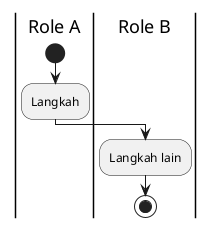

# AI START HERE — FSD Generator Engine

> **Baca file ini pertama** jika Anda AI Agent / developer baru yang akan membuat atau mem-build FSD.
>
> Tujuan: menghasilkan FSD **sesuai standar Kalbe** tanpa menebak format, path, atau pipeline.

---

## Urutan baca (WAJIB)

| # | File | Untuk apa |
|---|------|-----------|
| 1 | **`docs/AI-START-HERE.md`** (file ini) | Orientasi + tutorial |
| 2 | **`docs/STANDARD-FSD-GENERATION.md`** | Standar penulisan A–M + prompt eksekusi |
| 3 | **`modules/item-spec/source/FSD_ItemSpec_RM_v1.2.md`** | **Acuan kualitas konten** — tiru kedalaman & gaya |
| 4 | **`docs/COVER-STANDARD.md`** | Cover 2 halaman pertama Word |
| 5 | **`docs/FOLDER-STRUCTURE.md`** | Di mana file diletakkan |
| 6 | **`docs/MODULE-INDEX.md`** | Modul yang sudah ada |

**Jangan** mulai dari `archive/`, folder deprecated (`ItemSpec/`), atau `QUICK_START.md`.

---

## Pilih skenario Anda

```
Apakah FSD untuk modul DI DALAM engine ini?
├── YA  → Ikuti "Tutorial: Modul Baru di Engine" (bawah)
└── TIDAK (proyek lain, mis. kicaokds) → Ikuti "Tutorial: Proyek Eksternal" (bawah)
```

---

## Aturan anti-halusinasi (WAJIB)

AI **dilarang** mengisi FSD dengan asumsi. Ikuti aturan ini:

| # | Aturan | Jika tidak ada data |
|---|--------|---------------------|
| 1 | **Baca sumber dulu** — HTML/JS/BRD/spec sebelum menulis field | Tulis `> **[TBD]** — verifikasi di {path}` |
| 2 | **Setiap field UI** harus dari kode atau spec — jangan invent ID elemen | Jangan buat `btnXxx` fiktif |
| 3 | **Setiap section UI** wajib: narasi + screenshot **atau** placeholder eksplisit; **urutan interleaved** (screenshot→penjelasan per tampilan, bukan semua screenshot dulu) | `> *Screenshot belum tersedia: screenshots/ss_XX.png*` |
| 4 | **Business Rules** — ID unik `BR-01`, `BR-02`… prefix modul jika gabungan (`BR-M01`) | Jangan tulis "dll." |
| 5 | **Tabel** — gunakan kolom standar (lihat STANDARD §D) | Jangan pakai HTML table |
| 6 | **Path gambar** — relatif `screenshots/...`, bukan `C:\Users\...` | — |
| 7 | **Versi & tanggal** — dari metadata dokumen, bukan ditebak | Ambil dari tabel Atribut |
| 8 | **Mermaid / Swimlane** — hanya jika alur dikonfirmasi dari spec; Bab 2/9 wajib swimlane multi-lane | Jangan diagram fiktif; jangan flowchart 1 kolom untuk multi-role |
| 9 | **Setelah tulis MD** — jalankan `py build.py` | Jika gagal, perbaiki — jangan klaim selesai |
| 10 | **Bandingkan output** dengan `modules/item-spec/output/` | Cover + tabel hijau + font Calibri |

**Sumber kebenaran (priority):**
1. Kode UI (`Views/`, `*.html`, `*.js`)
2. Dokumen spec proyek (`Docs/`, BRD, UReq)
3. `FSD_ItemSpec_RM_v1.2.md` (format & kedalaman)
4. `docs/STANDARD-FSD-GENERATION.md` (konvensi)

**Standar penulisan UI (semua proyek):** urutan interleaved + page break + tabel Tombol Aksi — lihat `lib/fsd_ui_section.py` dan STANDARD § *Standar Penulisan FSD vs Database*. Bab Database/ERD/DDL **format** distandarkan, **isi** per proyek.

---

## Tutorial: Modul baru di Engine (~15 menit)

### Langkah 1 — Salin template (2 menit)

```powershell
cd "D:\Work\Source\FSD Generator Engine\modules"
Copy-Item -Recurse _template my-module-slug
cd my-module-slug
```

Ganti `my-module-slug` dengan slug lowercase-hyphen, contoh: `inventory-adjustment`.

### Langkah 2 — Edit `build.py` (3 menit)

Buka `build.py`. Ubah:

```python
slug='my-module-slug',
md_filename='FSD_MyModule_v1.0.md',      # harus sama dengan file di source/
output_filename='FSD_MyModule_v1.0.docx',
```

**Mermaid (opsional):** jika MD punya diagram, tambahkan handler — lihat § Mermaid Handler di bawah.

**Cover override (opsional):**

```python
cover_defaults={
    'project': 'NAMA SISTEM',
    'brd_no': '2026.SHP-FSD.XXXX',
    'pid_no': '2026.SHP-PID.XXXX',
},
```

### Langkah 3 — Rename & isi source MD (5 menit)

```powershell
Rename-Item source\FSD_TEMPLATE.md FSD_MyModule_v1.0.md
```

Isi `source/FSD_MyModule_v1.0.md`:
- Ganti semua `{PLACEHOLDER}`
- Mulai tulis dari `## 1. Pendahuluan`
- **Baca** `modules/item-spec/source/FSD_ItemSpec_RM_v1.2.md` sebagai contoh section UI

### Langkah 4 — Screenshot (3 menit)

Simpan PNG di `screenshots/`:

```
screenshots/ss_01_index.png
screenshots/ss_02_detail_header.png
```

Naming: `ss_{2digit}_{deskripsi_snake}.png`

Embed di MD:

```markdown
**Tampilan Halaman Index:**


```

Detail capture: `docs/PANDUAN_SCREENSHOT.md`

### Langkah 5 — Build & verifikasi (2 menit)

```powershell
# Dari root engine sekali:
py -m pip install -r requirements.txt
# Pandoc harus terinstall: https://pandoc.org/installing.html

py build.py
```

Output: `output/FSD_MyModule_v1.0.docx`

1. Buka Word → **F9** (update TOC jika field belum ter-update otomatis)
2. Cek halaman 1–2 cover Kalbe
3. Cek caption gambar/tabel: center + italic, posisi di bawah elemen
4. Cek tabel header hijau `#D9EAD3`

### Langkah 6 — Daftarkan modul

Tambah baris di `docs/MODULE-INDEX.md` dan tulis `README.md` modul.

---

## Tutorial: Proyek eksternal (di luar engine)

Untuk aplikasi lain (contoh: `kicaokds.kalbenutritionals`):

### Struktur folder di proyek Anda

```
YourProject/Docs/FSD/
├── source/FSD_{Modul}_v{x.y}.md
├── output/FSD_{Modul}_v{x.y}.docx    ← terbaru, tanpa timestamp (git)
├── screenshots/
├── build.py
└── reference.docx          ← salin dari engine/templates/

Arsip ber-timestamp → `D:\Work\Documentation\SHP\Project Log\{tahun}\{NNN}. {proyek}\`
(via `DeliverableConfig` di `lib/fsd_deliver.py` — bukan di folder git)
```

### Yang harus disalin dari engine

| Dari engine | Ke proyek |
|-------------|-----------|
| `lib/` (seluruh folder) | `Docs/FSD/lib/` atau symlink |
| `templates/FSD_Cover_Template.docx` | `Docs/FSD/` atau path di `fsd_paths` |
| `templates/logo.png` | sama |
| `templates/reference.docx` | `Docs/FSD/reference.docx` |
| Pola `modules/item-registration/build.py` | `Docs/FSD/build.py` |

### Prompt untuk AI di proyek eksternal

Salin blok **PROMPT EKSEKUSI** dari `docs/STANDARD-FSD-GENERATION.md`, lalu isi:
- Path sumber UI (`Views/...`)
- Path BRD/UReq
- `{KODE_MODUL}` untuk penamaan file

Acuan proyek nyata: `kicaokds.kalbenutritionals/Docs/FSD/PROMPT-STANDARD-FSD-GENERATION.md`

---

## Mermaid Handler — cara menulis `build.py`

Diagram di MD ditulis sebagai:

````markdown

````

`build.py` harus tahu blok mana → PNG mana. Pola di `modules/item-registration/build.py`:

```python
MermaidHandler(
    lambda code: 'erDiagram' in code and 'NAMA_TABEL' in code,
    os.path.join(SCREENSHOTS, 'my_erd.png'),
    'ERD',                          # label log
    'ERD – Deskripsi Modul',        # caption di DOCX
),
```

**Cara menentukan predicate:**
1. Buka MD, cari string unik di dalam blok mermaid (nama tabel, role, node)
2. Gunakan `lambda code: 'STRING_UNIK' in code`
3. Urutan handler: spesifik dulu, generik belakang
4. Jika tidak ada handler → runner otomatis buat `{slug}_diagram_N.png`

**Tanpa handler khusus:** kosongkan `mermaid_handlers=[]` — semua diagram tetap di-render generik.

---

## Swimlane (Cross-Functional Flowchart)

**Wajib** untuk Bab Business Flow & Approval jika ada ≥2 aktor (role/sistem/eksternal).

### Layout

```
flowchart LR     ← lane menyamping (kolom role)
  subgraph L1["Role A"]
    direction TB ← alur turun dalam lane
```

### Sebelum diagram — tabel lane wajib

| # | Lane ID | Label | Tipe | Sumber |
|---|---------|-------|------|--------|
| 1 | L1 | {Role} | User | `{path spec}` |

### Template siap salin

`docs/examples/swimlane/` — termasuk golden reference `restaurant-poc-mermaid.mmd`

### Render PoC

```powershell
py scripts/render_swimlane_poc.py
```

### PlantUML (disarankan — kolom swimlane klasik)

PoC: `py scripts/render_swimlane_poc.py` — PlantUML paling mirip gambar referensi (lane menyamping).

````markdown

````

Tambahkan `plantuml_handlers` di `build.py` (struktur sama dengan `mermaid_handlers`).

### Mermaid (modul existing / ERD)

`flowchart LR` + `subgraph` — dipakai Item Spec v1.2. Kadang lane tampil sebagai baris, bukan kolom.

Build otomatis deteksi swimlane → lebar gambar **17 cm** di DOCX.

Detail: `docs/STANDARD-FSD-GENERATION.md` §F

---

## Build script — pilih pola mana?

| Pola | Kapan pakai | Contoh |
|------|-------------|--------|
| **`fsd_module_runner`** (disarankan) | Modul baru standar | `modules/_template/build.py`, `item-registration/` |
| **Custom penuh** | Logic preprocess rumit (multi-folder screenshot, Brain path) | `item-spec/build.py`, `new-rm-sample/build.py` |

**Default untuk modul baru: salin `_template/build.py`.**

---

## Dependency checklist

```powershell
py -m pip install -r requirements.txt   # python-docx, docxcompose
pandoc --version                         # wajib di PATH
```

Internet diperlukan untuk render Mermaid via **Kroki.io** saat build.

---

## Troubleshooting

| Masalah | Solusi |
|---------|--------|
| `pandoc not found` | Install pandoc, restart terminal |
| `docxcompose` error | `py -m pip install docxcompose` |
| Gambar tidak muncul di DOCX | Cek path relatif dari MD; file ada di `screenshots/` |
| Cover kosong | Pastikan `templates/FSD_Cover_Template.docx` ada |
| TOC kosong di Word | Tekan **F9** di Word |
| Kroki timeout | Coba lagi; atau simplify diagram Mermaid |

---

## File acuan kualitas (golden references)

| Tujuan | File |
|--------|------|
| Kedalaman konten FSD | `modules/item-spec/source/FSD_ItemSpec_RM_v1.2.md` |
| Build minimal | `modules/item-registration/build.py` |
| Build lengkap | `modules/item-spec/build.py` |
| Output DOCX | `modules/item-spec/output/FSD_ItemSpec_RM_v1.2.docx` |

---

*Terakhir diperbarui: Juli 2026 · FSD Generator Engine*
