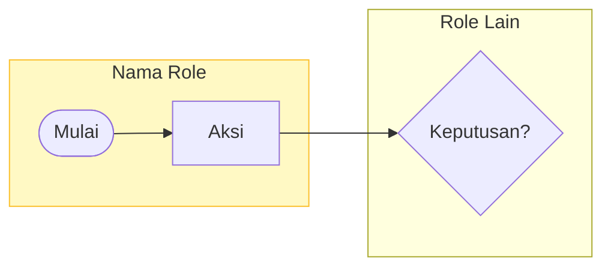
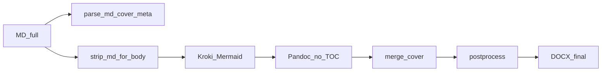

# Standar Generasi FSD — FSD Generator Engine

> **Tujuan:** Dokumen master untuk AI Agent / developer — format Markdown FSD, pipeline MD→DOCX, cover Kalbe, konvensi visual, dan aturan anti-halusinasi.
>
> **Mulai di sini:** [AI-START-HERE.md](AI-START-HERE.md) — orientasi, tutorial 15 menit, troubleshooting.
>
> **Acuan kualitas konten:** `modules/item-spec/source/FSD_ItemSpec_RM_v1.2.md`
>
> **Template modul baru:** `modules/_template/` — salin, edit `build.py`, isi `source/FSD_TEMPLATE.md`

Dokumen terkait:

| Dokumen | Isi |
|---------|-----|
| [AI-START-HERE.md](AI-START-HERE.md) | Entry point AI — urutan baca, anti-halusinasi, tutorial |
| [MODULE-INDEX.md](MODULE-INDEX.md) | Katalog modul |
| [FOLDER-STRUCTURE.md](FOLDER-STRUCTURE.md) | Penempatan file |
| [COVER-STANDARD.md](COVER-STANDARD.md) | 2 halaman pertama Word |
| [PANDUAN_SCREENSHOT.md](PANDUAN_SCREENSHOT.md) | Cara capture UI |

---

## PROMPT EKSEKUSI (Copy-Paste untuk AI IDE)

```
Kamu adalah Technical Writer + Business Analyst senior. Buat Functional Specification Document (FSD) dalam Markdown mengikuti standar FSD Generator Engine.

## Orientasi WAJIB (baca sebelum menulis)

1. `FSD Generator Engine/docs/AI-START-HERE.md` — urutan baca + aturan anti-halusinasi
2. `FSD Generator Engine/docs/STANDARD-FSD-GENERATION.md` — standar penulisan § A–M
3. `FSD Generator Engine/modules/item-spec/source/FSD_ItemSpec_RM_v1.2.md` — acuan kedalaman konten

## Sumber Kebenaran (priority)

1. Kode UI proyek (`Views/`, `*.html`, `*.js`) — field ID, label, validasi
2. BRD / UReq / spec proyek (`Docs/`)
3. `FSD_ItemSpec_RM_v1.2.md` — format & kedalaman section UI
4. Dokumen ini — konvensi visual & pipeline

## Metadata Dokumen (header MD)

# FUNCTIONAL SPECIFICATION DOCUMENT (FSD)
## Modul: {Nama Modul}
### Sistem: {Nama Sistem}
### Versi Dokumen: {x.y}

| Atribut | Keterangan |
|---------|------------|
| **Nama Dokumen** | FSD Modul ... |
| **Versi** | ... |
| **Tanggal** | ... |
| **Dibuat oleh** | ... |

## Riwayat Revisi
(tabel versi)

## 1. Pendahuluan
(lanjutkan bab sesuai § Struktur Bab di STANDARD-FSD-GENERATION.md)

## Output (modul di dalam engine)

- Salin `modules/_template/` → `modules/{slug}/`
- `modules/{slug}/source/FSD_{Modul}_v{x.y}.md`
- `modules/{slug}/screenshots/` — UI capture
- `modules/{slug}/build.py` — pipeline build (pakai `fsd_module_runner`)
- `modules/{slug}/output/FSD_{Modul}_v{x.y}.docx`

## Output (proyek eksternal)

- `{YYYYMMDDHHmmss}__FSD_{KODE_MODUL}.md` + `.docx` (lihat § K)
- `build_fsd_{kode}.py`, `reference.docx`, folder `screenshots/`

## Patuhi

- Pipe tables (bukan HTML)
- Screenshot per section UI ATAU placeholder eksplisit `> *Screenshot belum tersedia*`
- Mermaid → Kroki PNG via build script
- Business rules: Rule ID unik (`BR-01`, `BR-M01`, `BR-K01`)
- RBAC matrix
- JANGAN invent field/ID — jika tidak ada di kode, tulis `> **[TBD]** — verifikasi di {path}`
- Setelah tulis MD: jalankan `py build.py` — jangan klaim selesai jika build gagal

Cover Word: `templates/FSD_Cover_Template.docx` via `lib/fsd_cover_merge.py`
Build acuan: `modules/_template/build.py` atau `modules/item-registration/build.py`
```

---

## Aturan Anti-Halusinasi (WAJIB)

AI **dilarang** mengisi FSD dengan asumsi. Ini adalah penyebab utama dokumen tidak sesuai standar.

| # | Larangan | Yang benar |
|---|----------|------------|
| 1 | Menebak ID elemen (`btnSave`, `txtField`) tanpa baca HTML/JS | Baca `Views/...` dulu; jika tidak ketemu → `> **[TBD]**` |
| 2 | Menulis "dll.", "dst.", "dan lain-lain" | Daftar eksplisit semua field/kolom |
| 3 | Diagram Mermaid fiktif | Hanya diagram yang dikonfirmasi dari spec/kode |
| 4 | Path absolut `C:\Users\...` di MD | Path relatif `screenshots/ss_01.png` |
| 5 | Klaim selesai tanpa `py build.py` | Build wajib sukses sebelum claim done |
| 6 | Versi/tanggal ditebak | Ambil dari tabel Atribut atau metadata proyek |
| 7 | HTML table di Markdown | Pipe table saja |
| 8 | Skip screenshot tanpa placeholder | Narasi + label bold + gambar ATAU blockquote placeholder |
| 9 | Business rule tanpa Rule ID | `BR-01`, `BR-02`… prefix modul jika gabungan |
| 10 | Mengabaikan cover 2 halaman | Output harus merge cover Kalbe (bukan body saja) |

**Jika data belum ada:**

```markdown
> **[TBD]** — Field belum diverifikasi di `Views/Modul/Index.html`
```

```markdown
> *Screenshot belum tersedia: screenshots/ss_03_grid.png*
```

---

## STANDAR PENULISAN & FORMAT VISUAL (§ A–M)

Selain konten, dokumen **harus** mengikuti standar berikut agar MD dan DOCX hasil build identik dengan FSD Item Spec RM v1.2.

### A. Bahasa & Gaya Penulisan

| Aspek | Standar |
|-------|---------|
| Bahasa utama | **Bahasa Indonesia formal** |
| Istilah teknis | Bahasa Inggris untuk: CRUD, LOV, RBAC, workflow, API, modal, dropdown, read-only, submit, draft |
| Istilah bisnis | Campuran ID/EN sesuai UI (contoh: Group Account, Ready to Submit) |
| Kalimat pembuka section | 1 paragraf kontekstual sebelum tabel (*"Tab ini berisi..."*, *"Section Header berisi..."*) |
| Istilah dev di dalam teks | Italic untuk frasa penjelas: *development reference*, *soft delete* |
| Nama file / path | Backtick: `Views/Index.html` |
| ID elemen HTML / JS | Backtick: `btnSave`, `txtGroupAccount` |
| Nama kolom DB / entity | Backtick: `TXT_DOC_NO`, `XXSHP_T_HDR` |
| Penekanan | **Bold** untuk label field di narasi, status penting, operasi CRUD di tabel |
| Hindari | Bullet kosong, "dll.", "dst.", "dan lain-lain" — **wajib eksplisit** |

### B. Hierarki Heading (Markdown)

```markdown
# FUNCTIONAL SPECIFICATION DOCUMENT (FSD)          ← H1: judul dokumen (sekali saja)
## Modul: {Nama Modul}                             ← H2: sub-judul modul
### Sistem: {Nama Sistem}                          ← H3: sistem
### Versi Dokumen: 1.0

---                                                 ← pemisah horizontal antar blok besar

## 1. Pendahuluan                                   ← H2: bab utama (nomor + judul)
### 1.1 Latar Belakang                              ← H3: sub-bab
#### 3.1.1 Fields – Header                          ← H4: sub-sub-bab (per section UI)
```

| Level | Format | Contoh |
|-------|--------|--------|
| Cover | `#` + `## Modul` + `### Sistem` + `### Versi` | Sekali di awal |
| Bab | `## {nomor}. {Judul}` | `## 3. Halaman Index` |
| Sub-bab | `### {nomor}.{sub} {Judul}` | `### 3.1 Dashboard Cards` |
| Detail UI | `#### {nomor}.{sub}.{detail} {Judul}` | `#### 3.1.1 Fields` |

**Pemisah `---`:** gunakan setelah metadata, setelah Daftar Isi (jika ada), dan antar bab besar.

> **TOC di engine:** Modul standar memakai cover template Kalbe — TOC dihasilkan field Word di template (tekan **F9** di Word). Daftar Isi manual di MD opsional.

### C. Tabel Metadata & Riwayat Revisi

**Tabel atribut dokumen** — selalu 2 kolom, label kiri **Bold**:

```markdown
| Atribut | Keterangan |
|---------|------------|
| **Nama Dokumen** | FSD Modul ... |
| **Versi** | 1.0 |
| **Tanggal** | {tanggal} |
| **Divisi** | ... |
| **Status** | Draft |
| **Dibuat oleh** | Tim ... |
```

**Riwayat revisi** — kolom: Versi, Tanggal, Diubah Oleh, Keterangan. Versi aktif pakai **bold** di semua sel baris.

### D. Format Tabel Konten (Pipe Table)

**Wajib** gunakan Markdown pipe table (`| col | col |`), **bukan** HTML table.

| Jenis Tabel | Kolom Standar (urutan tetap) |
|-------------|------------------------------|
| **Field form** | Field Name \| ID Elemen \| Tipe \| Mandatory \| Default \| Validasi \| Keterangan |
| **Kolom grid** | Kolom \| Field Key / Entity Field \| Render \| Sortable \| Keterangan |
| **Tombol** | Tombol \| ID \| Warna/Style \| Kondisi Aktif \| Fungsi |
| **CRUD** | Operasi \| Cara \| Role \| Keterangan |
| **Business Rules** | Rule ID \| Aturan |
| **Status** | Kode Status \| Label \| Warna Badge \| Keterangan |
| **RBAC** | Bagian/Tab \| Role A \| Role B \| ... |
| **Stakeholder** | Peran \| Tim/Divisi \| Keterlibatan |
| **Mapping DB** | Field UI \| Kolom DB \| Tipe Data \| Keterangan |

**Aturan isi sel tabel:**

| Aturan | Contoh benar | Contoh salah |
|--------|--------------|--------------|
| Mandatory | `Ya`, `Tidak`, `Ya (Auto)`, `Opsional` | `yes`, `optional` |
| Tipe field | `Text`, `Dropdown/LOV`, `Date Picker`, `Checkbox`, `Text (readonly)` | `input`, `select` |
| Nilai kosong | `—` atau `(kosong)` | `-`, `N/A` sembarang |
| Operasi CRUD | `**Create**`, `**Read**`, `**Update**`, `**Delete**` (bold) | create, read |
| Rule ID | `BR-M01`, `BR-K12`, `BR-01` | Rule 1, BR1 |
| Path file | dalam backtick di kolom Keterangan | tanpa backtick |

**Alignment:** tidak perlu syntax alignment (`:---`); cukup pipe standar.

### E. Screenshot & Gambar

**Format embed di Markdown:**

```markdown
**Tampilan Halaman Index:**


```

| Aspek | Standar |
|-------|---------|
| Caption (`alt text`) | Bahasa Indonesia, deskriptif |
| Baris sebelum gambar | Bold label: `**Tampilan Halaman Index:**` |
| Path | Relatif dari folder modul, **bukan** path absolut |
| Urutan | Narasi konteks → label tampilan → gambar → tabel field |
| Lebar di DOCX | Auto-scale max **15 cm** (17 cm untuk grid lebar — diatur build script) |
| Diagram | Render PNG via Kroki; caption: `` |
| Penamaan file | `ss_{2digit}_{deskripsi_snake}.png` |

Detail capture: [PANDUAN_SCREENSHOT.md](PANDUAN_SCREENSHOT.md)

### F. Diagram Mermaid (sebelum di-render ke PNG)

**Flow bisnis — swimlane per role** (wajib untuk Bab Business Flow):



| Aspek | Standar |
|-------|---------|
| Arah flow utama | `flowchart LR` (horizontal) untuk swimlane |
| Subgraph | Satu subgraph per role/departemen |
| Node keputusan | `{"Teks?"}` diamond |
| Node start/end | `([Mulai])` stadium shape |
| Warna subgraph | `style SUBGRAPH fill:#...,stroke:#...,color:#333` |
| ERD | `erDiagram` dengan field `{tipe nama PK/FK}` per entitas |
| Panah relasi | `\|\|--o{`, `}o--\|\|` sesuai kardinalitas |

Build script merender via **Kroki.io** → PNG di `screenshots/` atau `diagrams/`. Lihat [AI-START-HERE.md § Mermaid Handler](AI-START-HERE.md).

### G. Code Block & Pseudo-logic

**Logika bisnis / auto-fill** — gunakan fenced code block:

```
Format: [SEQ]-RM-SPC-[MM]-[YY]
Setelah Item Code dipilih:
  Item Spec No = "S-" + Item Code
```

**Cuplikan JavaScript** (RBAC, callback LOV) — hanya jika relevan; max 10–15 baris.

### H. Format DOCX (Output Word)

Konstanta **wajib** sama dengan `lib/fsd_build.py`:

| Elemen | Nilai | Keterangan |
|--------|-------|------------|
| **Font body** | Calibri | Seluruh paragraf narasi |
| **Ukuran body** | 11 pt | `FONT_SIZE_BODY = 11` |
| **Font tabel** | Calibri | Isi sel tabel |
| **Ukuran tabel** | 9 pt | `FONT_SIZE_TABLE = 9` |
| **Header baris tabel** | Bold + background `#D9EAD3` | Hanya **baris pertama** setiap tabel |
| **Border tabel** | Hitam `#000000`, single, sz=8 | Semua sisi sel |
| **Style tabel Word** | `Table Grid` | Diterapkan post-process |
| **Max lebar gambar** | 15 cm | Proporsional, tidak distorsi |
| **Cover** | 2 halaman pertama | Template `FSD_Cover_Template.docx` — lihat [COVER-STANDARD.md](COVER-STANDARD.md) |
| **Reference template** | `templates/reference.docx` | Font heading & margin body |

**Post-process:** skip 2 tabel pertama di cover saat apply style hijau (lihat `lib/fsd_cover_merge.py`).

### I. Pipeline Build (Engine — modul standar)



**Langkah (`fsd_module_runner` / `modules/_template/build.py`):**

1. **Preprocess:** `COVER_META = parse_md_cover_meta(raw)`; `text = strip_md_for_body(raw)`
2. **Mermaid:** render blok ` ```mermaid ` → PNG (Kroki, timeout ~45s)
3. **Pandoc:** `MD_TMP` → `_tmp/{slug}_content.docx` — **tanpa** `--toc` (TOC dari cover template)
4. **Cover:** `merge_cover_and_content(content, output, COVER_META)`
5. **Post-process:** Calibri 11pt, tabel border hitam header `#D9EAD3`, gambar max 15cm — **skip 2 tabel cover**

**Perintah Pandoc (internal):**

```bash
pandoc _tmp/{slug}_processed.md \
  -o _tmp/{slug}_content.docx \
  --from=markdown+pipe_tables \
  --resource-path={module_dir};{screenshots} \
  --reference-doc=templates/reference.docx
```

**Encoding:** UTF-8 wajib.

**Dependency:**

```powershell
cd "D:\Work\Source\FSD Generator Engine"
py -m pip install -r requirements.txt
pandoc --version   # harus di PATH
```

Internet diperlukan untuk Kroki.io saat build.

### J. Post-Process python-docx (setelah Pandoc)

Urutan operasi di `lib/fsd_build.py`:

1. Set `Normal` style → Calibri 11pt
2. Loop semua `paragraphs` → apply font body
3. Loop semua `tables` (skip 2 tabel cover):
   - Set style `Table Grid`
   - Baris index 0 → background `#D9EAD3`, font 9pt **bold**
   - Baris lain → font 9pt regular
   - Semua sel → border hitam semua sisi
4. Loop semua inline images → scale max width 15cm
5. Save DOCX final

### K. Penamaan File Output

**Dua pola** — pilih sesuai konteks:

#### K.1 Modul di dalam Engine (`modules/{slug}/`)

| Artefak | Pola | Contoh |
|---------|------|--------|
| Markdown sumber | `source/FSD_{Modul}_v{x.y}.md` | `FSD_ItemSpec_RM_v1.2.md` |
| DOCX output | `output/FSD_{Modul}_v{x.y}.docx` | `FSD_ItemSpec_RM_v1.2.docx` |
| Build script | `build.py` | Stabil, tanpa timestamp |
| Screenshot | `screenshots/ss_{NN}_{desc}.png` | `ss_01_index.png` |

#### K.2 Proyek eksternal (gabungan / multi-modul)

```
{TIMESTAMP}__FSD_{KODE_MODUL}.{ext}
```

| Komponen | Format | Contoh |
|----------|--------|--------|
| `{TIMESTAMP}` | `YYYYMMDDHHmmss` | `20260706111230` |
| Pemisah | Double underscore `__` | `__` |
| `{KODE_MODUL}` | UPPER_SNAKE_CASE | `KICAO_KDS`, `E_MATERAI` |

Contoh: `20260706111230__FSD_KICAO_KDS.md` + `.docx`

| Artefak | Pola |
|---------|------|
| Build script | `build_fsd_{kode_lower}.py` (stabil) |
| Temp MD | `_tmp_{TIMESTAMP}__FSD_{KODE}_processed.md` (dihapus setelah build) |
| `reference.docx` | Nama tetap — salin dari `templates/reference.docx` |

Acuan proyek eksternal: `kicaokds.kalbenutritionals/Docs/FSD/PROMPT-STANDARD-FSD-GENERATION.md`

### L. Contoh Cuplikan Section (Acuan Gaya)

Contoh **persis** seperti Item Spec v1.2 — tiru pola ini:

```markdown
### 4.2 Section Header


Section Header berisi informasi identitas dokumen. Ditampilkan dalam satu card di bagian atas halaman.

#### 4.2.1 Fields – Header

| Field Name | ID Elemen | Tipe | Mandatory | Default | Validasi | Keterangan |
|------------|-----------|------|-----------|---------|----------|------------|
| Group Account | `txtGroupAccount` | Text + LOV Button | Ya | (kosong) | Harus dipilih | LOV filter supplier |
| Supplier | `txtSupplier` | Text + LOV Button | Ya | (kosong) | — | Auto-fill setelah pilih |

#### 4.2.2 Business Rules – Header

| Rule ID | Aturan |
|---------|--------|
| BR-01 | Satu supplier hanya boleh punya satu mapping aktif |

#### 4.2.3 CRUD – Header Section

| Operasi | Cara | Role | Keterangan |
|---------|------|------|------------|
| **Create** | Klik Baru → isi form | ADMIN | ID auto-generate |
| **Read** | Klik Cari → pilih record | Semua role | — |
| **Update** | Edit field → Simpan | ADMIN | — |
| **Delete** | — | — | Tidak tersedia di UI |
```

Template lengkap: `modules/_template/source/FSD_TEMPLATE.md`

### M. Checklist Format Visual (sebelum claim selesai)

- [ ] Font DOCX: Calibri 11pt body, 9pt tabel
- [ ] Header tabel: hijau muda `#D9EAD3`, teks bold
- [ ] Border tabel: hitam semua sisi
- [ ] Cover halaman 1–2 sesuai template Kalbe
- [ ] **F9** di Word untuk update TOC
- [ ] Gambar max 15cm, tidak blur berlebihan
- [ ] Tidak ada path absolut `C:\Users\...` di MD
- [ ] Semua tabel pakai pipe format (bukan HTML)
- [ ] Heading hierarchy konsisten (tidak loncat level)
- [ ] Metadata & riwayat revisi lengkap
- [ ] Caption screenshot bahasa Indonesia
- [ ] Rule ID, field ID, DB column konsisten formatnya
- [ ] `py build.py` sukses tanpa error
- [ ] Entry di `docs/MODULE-INDEX.md` (modul baru)

---

## Struktur Bab Tipikal (Modul Tunggal)

| Bab | Isi |
|-----|-----|
| 1. Pendahuluan | Latar belakang, tujuan, ruang lingkup, stakeholder |
| 2. Business Flow | Swimlane Mermaid per role |
| 3–N. Halaman UI | Per section: screenshot + field + rules + CRUD |
| Aturan Bisnis | `BR-01`, `BR-02`, ... |
| RBAC | Matrix role × fitur |
| Workflow / Approval | Flow approval jika ada |
| Database & ERD | `erDiagram` Mermaid + DDL opsional |
| LOV | Daftar List of Values |
| Appendix | Glosarium, status code, gap analysis |

Sesuaikan nomor bab dengan kompleksitas modul. Acuan kedalaman: `FSD_ItemSpec_RM_v1.2.md`.

### Per Section UI (WAJIB)

Setiap section halaman/modal wajib memiliki:

1. **Narasi** — 1 paragraf konteks
2. **Screenshot** — atau placeholder eksplisit
3. **Tabel Fields** — kolom standar § D
4. **Business Rules** — jika ada aturan khusus section
5. **CRUD** — jika section mendukung operasi
6. **Tombol** — tabel terpisah jika action bar kompleks

---

## Struktur Dokumen Gabungan (Multi-Modul)

Untuk FSD yang menggabungkan beberapa modul dalam satu file (contoh: KICAO KDS Master + Klaim):

| Aturan | Detail |
|--------|--------|
| Urutan | Master/prasyarat **sebelum** transaksi |
| Bab integrasi | Wajib — penghubung antar modul (lookup, dependency) |
| Rule ID prefix | `BR-Mxx` (master), `BR-Kxx` (klaim), `BR-Xxx` (lintas modul) |
| Screenshot folder | Subfolder per modul: `screenshots/master/`, `screenshots/klaim/` |
| ERD | Satu diagram gabungan dengan relasi antar entitas |

Detail lengkap: `kicaokds.kalbenutritionals/Docs/FSD/PROMPT-STANDARD-FSD-GENERATION.md`

---

## Checklist Kualitas (Definition of Done)

### Konten

- [ ] Header metadata + riwayat revisi lengkap
- [ ] Setiap section UI punya screenshot + tabel field (atau TBD/placeholder)
- [ ] Business rules punya Rule ID unik
- [ ] Tidak ada "dll." — semua field eksplisit
- [ ] Mermaid dirender ke PNG (tidak broken di DOCX)
- [ ] RBAC matrix jika modul punya role-based access

### Format & Build

- [ ] Gaya penulisan mengikuti § A–M
- [ ] `py build.py` sukses
- [ ] Cover + tabel hijau + font Calibri sesuai acuan
- [ ] Bandingkan visual dengan `modules/item-spec/output/FSD_ItemSpec_RM_v1.2.docx`

---

## Larangan / Anti-Pattern

- ❌ Invent field/ID tanpa baca kode
- ❌ Ringkas field menjadi "dll."
- ❌ Skip screenshot tanpa placeholder di versi draft
- ❌ Pakai font selain **Calibri** di DOCX body
- ❌ Pakai HTML table di Markdown
- ❌ Skip post-process tabel (header hijau + border)
- ❌ Path absolut di MD
- ❌ Klaim selesai tanpa build sukses
- ❌ Mulai dari `archive/` atau folder deprecated
- ❌ Dokumentasikan transaksi sebelum master (dokumen gabungan)

---

## Proyek Baru

### Di dalam Engine

1. Salin `modules/_template/` → `modules/{slug}/`
2. Edit `build.py` (slug, md_filename, output_filename)
3. Rename & isi `source/FSD_TEMPLATE.md`
4. Tambah screenshot di `screenshots/`
5. `py build.py` → verifikasi DOCX
6. Update `docs/MODULE-INDEX.md`

Tutorial: [AI-START-HERE.md](AI-START-HERE.md)

### Di luar Engine

1. Salin `lib/` + `templates/` ke proyek
2. Salin pola `modules/item-registration/build.py` → `build.py` proyek
3. Gunakan prompt § PROMPT EKSEKUSI dengan path disesuaikan
4. Penamaan timestamp jika multi-modul (§ K.2)

---

## Referensi Format (Quick Link)

| Aspek | File Acuan |
|-------|------------|
| Entry AI | `docs/AI-START-HERE.md` |
| Template modul | `modules/_template/` |
| Konten & struktur bab | `modules/item-spec/source/FSD_ItemSpec_RM_v1.2.md` |
| Build minimal | `modules/item-registration/build.py` |
| Build lengkap | `modules/item-spec/build.py` |
| Tampilan DOCX final | `modules/item-spec/output/FSD_ItemSpec_RM_v1.2.docx` |
| Konstanta font/tabel | `lib/fsd_build.py` |
| Cover 2 halaman | `lib/fsd_cover_merge.py` + `templates/FSD_Cover_Template.docx` |
| Proyek gabungan | `kicaokds/.../PROMPT-STANDARD-FSD-GENERATION.md` |

---

*FSD Generator Engine · docs/STANDARD-FSD-GENERATION.md · v2.0 · Juli 2026*
