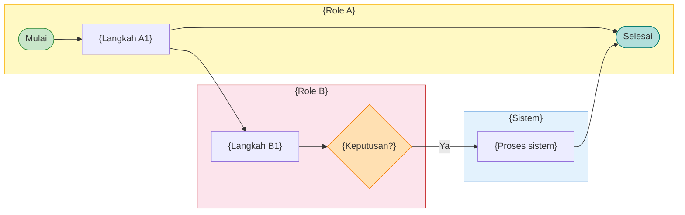
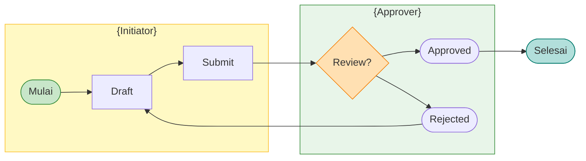
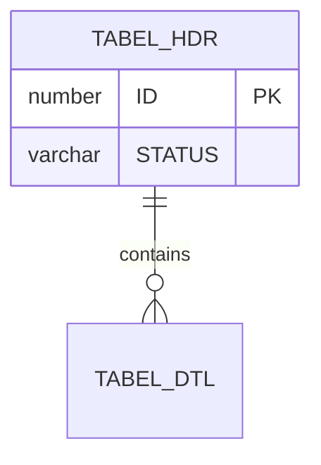

# {NAMA_MODUL} — Template FSD

> **INSTRUKSI AI:** Ganti seluruh `{PLACEHOLDER}` dengan data nyata dari kode/spec.
> **Jangan hapus** struktur heading. **Jangan invent** field yang tidak ada di UI.
> Hapus blok instruksi ini setelah selesai.

# FUNCTIONAL SPECIFICATION DOCUMENT (FSD)
## Modul: {NAMA_MODUL}
### Sistem: {NAMA_SISTEM}
### Versi Dokumen: 1.0

---

| Atribut | Keterangan |
|---------|------------|
| **Nama Dokumen** | FSD Modul {NAMA_MODUL} |
| **Versi** | 1.0 |
| **Tanggal** | {TANGGAL} |
| **Divisi** | {DIVISI} |
| **Status** | Draft |
| **Dibuat oleh** | {TIM_PEMBUAT} |

---

## Riwayat Revisi

| Versi | Tanggal | Diubah Oleh | Keterangan |
|-------|---------|-------------|------------|
| **1.0** | **{TANGGAL}** | **{TIM_PEMBUAT}** | Initial draft |

---

> **Catatan build:** Daftar Gambar, Daftar Tabel, dan caption bernomor dihasilkan otomatis oleh pipeline — jangan tulis manual di MD sumber.

## 1. Pendahuluan

### 1.1 Latar Belakang

{Paragraf kontekstual — jelaskan modul, sistem, dan alasan dokumen ini dibuat.}

### 1.2 Tujuan Dokumen

1. Mendeskripsikan fungsionalitas per komponen UI modul {NAMA_MODUL}.
2. Menjadi acuan pengembangan dan UAT.
3. Mendokumentasikan business rules, RBAC, dan alur approval (jika ada).

### 1.3 Ruang Lingkup

| Dalam lingkup | Di luar lingkup |
|---------------|-----------------|
| {Halaman/fitur A} | {Fitur X — iterasi berikutnya} |

### 1.4 Stakeholder

| Peran | Tim/Divisi | Keterlibatan |
|-------|------------|--------------|
| {Peran 1} | {Divisi} | {Keterlibatan} |

---

## 2. Ringkasan Business Flow

{Paragraf narasi alur bisnis end-to-end. Jelaskan hand-off antar role.}

### 2.1 Lane Swimlane

**Lane (urutan kiri → kanan):**

| # | Lane ID | Label | Tipe | Sumber |
|---|---------|-------|------|--------|
| 1 | L1 | {Role A} | User | `{path spec/kode}` |
| 2 | L2 | {Sistem} | System | `{path}` |
| 3 | L3 | {Role B} | User/External | `{path}` |

### 2.2 Swimlane — Alur {NAMA_PROSES}

> Template lengkap: `docs/examples/swimlane/swimlane-4-role-template.mmd`

---

## 3. Halaman Index — {NAMA_MODUL}

### 3.1 Tampilan Umum

**Tampilan Halaman Index:**

{Paragraf deskripsi halaman index.}

#### 3.1.1 Fields / Kolom Grid

| Field Name | ID Elemen | Tipe | Mandatory | Default | Validasi | Keterangan |
|------------|-----------|------|-----------|---------|----------|------------|
| {Field} | `{idElemen}` | Text | Ya | (kosong) | — | {Keterangan} |

#### 3.1.2 Tombol / Action Bar

| Tombol | ID | Warna/Style | Kondisi Aktif | Fungsi |
|--------|-----|-------------|---------------|--------|
| Baru | `btnNew` | Primary | Selalu | Buka form baru |

#### 3.1.3 Business Rules

| Rule ID | Aturan |
|---------|--------|
| BR-01 | {Aturan bisnis eksplisit} |

#### 3.1.4 CRUD

| Operasi | Cara | Role | Keterangan |
|---------|------|------|------------|
| **Create** | Klik Baru | {Role} | — |
| **Read** | Buka halaman index | Semua | — |
| **Update** | — | — | — |
| **Delete** | — | — | — |

---

## 4. Halaman Detail — {NAMA_MODUL}

**Tampilan Halaman Detail:**

### 4.1 Section Header

#### 4.1.1 Fields – Header

| Field Name | ID Elemen | Tipe | Mandatory | Default | Validasi | Keterangan |
|------------|-----------|------|-----------|---------|----------|------------|
| {Field} | `{id}` | Dropdown/LOV | Ya | (kosong) | — | — |

---

## 5. Aturan Bisnis (Business Rules)

| Rule ID | Aturan |
|---------|--------|
| BR-01 | {Ringkasan semua rules modul} |

---

## 6. Hak Akses & Peran Pengguna (RBAC)

| Bagian/Tab | {Role A} | {Role B} | Keterangan |
|------------|----------|----------|------------|
| Index | Read | Read | — |
| Detail – Simpan | — | Write | — |

---

## 7. Alur Persetujuan (jika ada)

### 7.1 Lane Swimlane

| # | Lane ID | Label | Tipe | Sumber |
|---|---------|-------|------|--------|
| 1 | L1 | {Initiator} | User | `{path}` |
| 2 | L2 | {Approver} | User | `{path}` |

### 7.2 Swimlane — Workflow Approval

> Template: `docs/examples/swimlane/swimlane-approval-template.mmd`

---

## 8. Struktur Database & ERD

---

## 9. List of Values (LOV)

| LOV | Sumber Data | Dipakai di |
|-----|-------------|------------|
| {Nama LOV} | {Tabel/API} | {Field UI} |

---

## 10. Appendix

### 10.1 Status Dokumen

| Kode Status | Label | Warna Badge | Keterangan |
|-------------|-------|---------------|------------|
| DRAFT | Draft | Abu-abu | — |

### 10.2 Glosarium

| Istilah | Definisi |
|---------|----------|
| LOV | List of Values |
