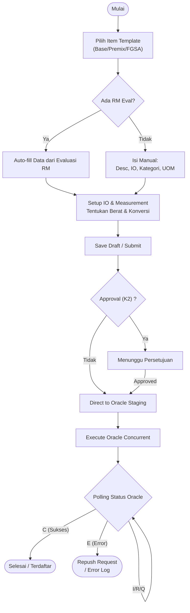
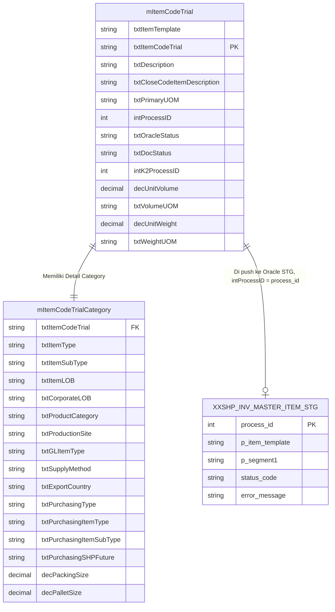

# FUNCTIONAL SPECIFICATION DOCUMENT (FSD)
## Modul: Item Trial Formulation (Revamp)
### Sistem: IDC System (New RM Selection)

---

| Atribut                | Keterangan                                                   |
|------------------------|--------------------------------------------------------------|
| **Nama Dokumen**       | FSD Modul Item Trial Formulation (Revamp)                    |
| **Versi**              | 1.0                                                          |
| **Tanggal**            | 15 April 2026                                                |
| **Divisi**             | Procurement / ICT / R&D                                      |
| **Status**             | Draft                                                        |
| **Dibuat oleh**        | Tim ICT – IDC System                                         |

---

## Riwayat Revisi

| Versi   | Tanggal      | Diubah Oleh | Keterangan                                                                                                |
|---------|--------------|-------------|-----------------------------------------------------------------------------------------------------------|
| **1.0** | **Apr 2026** | **Tim ICT** | Initial draft – Revamp modul Item Code Trial dari legacy system KN2017 ke format SPA (Single Page Apps).  |

---

## Daftar Isi

1. [Pendahuluan](#1-pendahuluan)
2. [Ringkasan Business Flow](#2-ringkasan-business-flow)
3. [UI & Fungsionalitas Modul](#3-ui--fungsionalitas-modul)
   - 3.1 [Halaman Dashboard & List (Index)](#31-halaman-dashboard--list-index)
   - 3.2 [Detail Form - Tab 1: Item Trial Setup](#32-detail-form---tab-1-item-trial-setup)
   - 3.3 [Detail Form - Tab 2: IO Setup & Measurement](#33-detail-form---tab-2-io-setup--measurement)
   - 3.4 [Detail Form - Tab 3: Category Setup](#34-detail-form---tab-3-category-setup)
4. [Struktur Database & ERD](#4-struktur-database--erd)
5. [Aturan Bisnis (Business Rules)](#5-aturan-bisnis-business-rules)
6. [Alur Persetujuan (Approval Flow)](#6-alur-persetujuan-approval-flow)

---

## 1. Pendahuluan

### 1.1 Latar Belakang

Modul **Item Trial Formulation** merupakan revamp dari modul Item Code Trial eksisting (KN2017_FORMULATION). Modul ini digunakan untuk melakukan pendaftaran kode material/bungkus produk yang masih berada dalam fase percobaan (Trial). Data ini nantinya akan diintegrasikan dengan modul Oracle ERP Inventory melalui tabel staging (`XXSHP_INV_MASTER_ITEM_STG`).

Pembaharuan bertujuan untuk mengubah format form linear yang panjang menjadi model *Single Page Application* (SPA) dengan tab dan *workflow* yang lebih intuitif, dilengkapi dashboard visual untuk summary data, integrasi Unit Conversion yang fleksibel, dan fitur multi-select untuk Inventory Organization (IO).

### 1.2 Tujuan Dokumen

1. Memberikan pedoman dasar fungsionalitas UI/UX desain baru dibandingkan dengan sistem *legacy*.
2. Mendetailkan behaviour per tab dan *field mapping*.
3. Menggambarkan proses konversi data dari draft hingga di-push ke tabel Staging Oracle.

---

## 2. Ringkasan Business Flow

---

## 3. UI & Fungsionalitas Modul

### 3.1 Halaman Dashboard & List (Index)

Halaman ini berfungsi sebagai muka awal modul, menampilkan status visual (*cards overview*) dan daftar dokumen item trial.

#### 3.1.1 Dashboard Card Summary

Berisi 5 kartu status:
1. **Total**: Total semua dokumen item trial.
2. **Draft**: Dokumen yang baru disimpan atau diketik sebagian (Status: "10").
3. **Waiting**: Dokumen yang disubmit namun sedang menunggu approval K2 (Status: "20").
4. **Submitted**: Dokumen yang sedang diolah oleh antrean Oracle (Status: "26").
5. **Approved**: Dokumen yang berhasil teregistrasi komplit/selesai (Status: "50").

Pilih pada kartu dashboard akan melakukan filter otomatis pada DataTable.

#### 3.1.2 Tabel Data (DataTable)

Kolom tabel meliputi:
- **No** (Auto Increment)
- **Status** (Indicator badge warna sesuai status di database)
- **Code Template** (Misal: BASE TRIAL, FGSA TRIAL)
- **Trial Code** (Hyperlink klik untuk masuk Edit Mode)
- **Desc**
- **Template UOM**
- **Action** (Tombol Edit dan Delete; delete hanya bisa untuk draft)

---

### 3.2 Detail Form - Tab 1: Item Trial Setup

Tab ini berisi identitas pokok material trial. Digunakan untuk inisialisasi basis data template yang akan mempengaruhi field category.

| Field | Mandatory | Source / Behavior |
| --- | --- | --- |
| **Input Mode** | Yes | Radio: `Evaluation` (Pilih Item RM Approval) atau `Direct` (Non-eval) |
| **RM/PM Form Approval** | Yes (jika Eval) | LOV (List of Value) dari RM Approval. Mengisi otomatis description, UOM, dsb. |
| **Trial Code Proposal** | Yes | Terisi otomatis berdasarkan sequence / template. |
| **Item Description** | Yes | UPPERCASE, bisa dirubah sebelum release. |
| **Template** | Yes | Opsi: `BASE`, `FGSA`, `PM`, dll. Pemilihan template men-trigger default value untuk IO, Tab Kategori, dan Measurement rules. |

---

### 3.3 Detail Form - Tab 2: IO Setup & Measurement

Konfigurasi unit satuan, konversi, berat spesifik, lokasi operasional.

#### Sebelah Kiri: Packaging & Measurement
Terdapat bagian **Packaging And Pallet**:
- **Packing Size**
- **Pallet Size** (Default: 9999)

Bagian **General Item Form**:
- **Item UoM** (Satuan Utama / Primary UoM)
- **Halal Logo** / **Halal Country** (untuk keperluan registrasi halal body).

#### Sebelah Kanan: Unit Conversion & IO
- **Unit Conversion**: Digunakan untuk menetapkan Base UoM vs Target UoM.
- **UoM Weight** & **UoM Volume**: 
    > **[WARNING] Aturan Ketat** - Wajib diisi (aktif/enabled) apabila Template pada Tab 1 diisi dengan nilai **"FGSA TRIAL"**. Jika template lain, kolom dikunci dan nilai diset `0`.
- **IO (Inventory Organization)**: Dropdown Tagging multiple/Select2 (Berbeda dengan sistem lama). User bisa assign lebih dari 1 IO dengan mendaftarkan lokasi pabrik tujuan (misal KMI, NIS, NDI).

---

### 3.4 Detail Form - Tab 3: Category Setup

Digunakan untuk menetapkan nilai LOB, Purchasing group, Category, dan kode GL ke Oracle ERP.

Terdapat 3 blok kolom utama:
1. **LOB Mapping**: Corporate LOB (di-lock default "SHP_NA"), LOB Kategori.
2. **Product Purchasing & Financials**: 
   - **GL Item Types** / **Purchasing Subtypes** yang secara dinamis diset default = "ALL" atau "INDIRECT2" (mengikuti logic database eksisting legacy KN2017).
   - **Purchasing Item Type / Inventory Item Type**: Otomatis terset ("RM", "PM", "FG", atau "BS") berdasarkan dropdown **Item Template** di Tab-1.
3. **Closed Code**: *Single Line text* khusus menampung identitas kode penutupan produk (bisa readonly berdasar role).

---

## 4. Struktur Database & ERD

ERD untuk implementasi Item Trial. Menggunakan relasi tabel ke Staging dan Logic Controller.

Tabel Backend yang akan digunakan adalah adaptasi persis dari fungsi API eksisting:
- `spMItemCodeTrialInsert`
- `spMItemCodeTrialUpdate`

---

## 5. Aturan Bisnis (Business Rules)

1. **Delete Dokumen**: Dokumen item trial hanya bisa dihapus / dibatalkan HANYA JIKA `intProcessID == 0` (Belum berinteraksi atau dipush ke backend Oracle staging).
2. **UOM Filter**: Pencarian Primary UOM di Modal pop-up bersumber langsung dari `Oracle MTL_UNITS_OF_MEASURE_TL`.
3. **Weight/Volume Condition**: Kolom `Unit Weight`, `Weight UOM`, `Unit Volume`, dan `Volume UOM` hanya akan terbuka untuk edit apabila **Item Template = "FGSA TRIAL"**. Di luar itu akan menjadi readonly bernilai `0`.
4. **Multiple IO**: Karena format baru menggunakan multi-tagging pada IO, insert ke Oracle staging berpotensi dilakukan secara looping `N` kali sesuai jumlah tagging IO yang dipilih di Tab 2.
5. **Rerun Oracle**: Status Dokumen "26" namun `OracleStatus == E / Error Message` berhak memunculkan tombol **Re-Push to Oracle**.

---

## 6. Alur Persetujuan (Approval Flow)

- Pada IDC System terbaru, Approval berintegrasi langsung lewat service internal atau K2 BPM.
- Submit akan mengubah dokumen internal SQL status ke **20** ("Waiting"). Jika approve, status melompat ke **50** atau **26** untuk staging Oracle processing.
- Approval menggunakan notifikasi e-mail otomatis ke list _Next Approver_.
