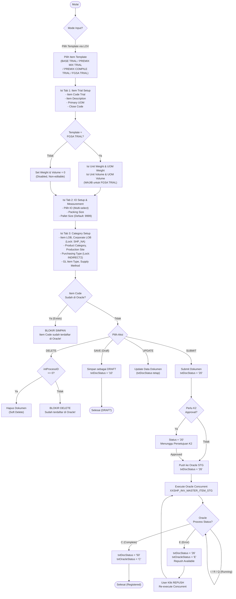
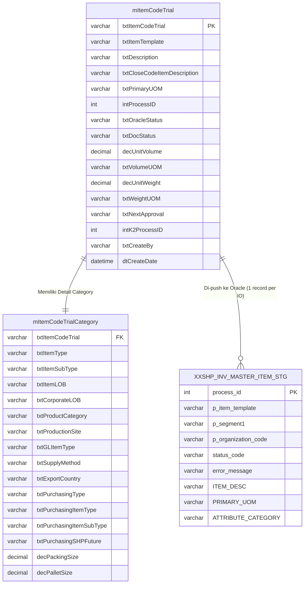
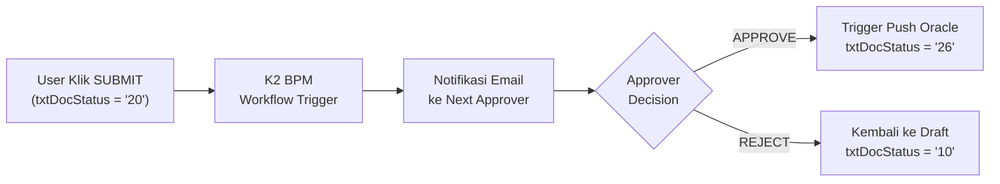

# FUNCTIONAL SPECIFICATION DOCUMENT (FSD)
## Modul: Item Code Trial
### Sistem: IDC System (New Formulation Management)

---

| Atribut                | Keterangan                                                        |
|------------------------|-------------------------------------------------------------------|
| **Nama Dokumen**       | FSD Modul Item Code Trial                                         |
| **Versi**              | 3.0                                                               |
| **Tanggal**            | 17 April 2026                                                     |
| **Divisi**             | R&D / ICT / Production Planning                                   |
| **Status**             | Draft                                                             |
| **Dibuat oleh**        | Tim ICT – IDC System                                              |

---

## Riwayat Revisi

| Versi   | Tanggal      | Diubah Oleh | Keterangan                                                                                                          |
|---------|--------------|-------------|---------------------------------------------------------------------------------------------------------------------|
| 1.0     | Apr 2026     | Tim ICT     | Initial draft – Revamp modul dari legacy KN2017 ke format SPA dengan tab.                                           |
| 2.0     | Apr 2026     | Tim ICT     | Revisi flow – klarifikasi alur dari RM Evaluation dan Oracle Staging.                                               |
| **3.0** | **Apr 2026** | **Tim ICT** | **Penulisan ulang total – fokus murni pada logic KN2017_FORMULATION, flow akurat dari source code, tanpa campur aduk modul lain.** |

---

## Daftar Isi

1. [Pendahuluan](#1-pendahuluan)
2. [Ringkasan Business Flow](#2-ringkasan-business-flow)
3. [Halaman Index](#3-halaman-index)
4. [Halaman Detail Form](#4-halaman-detail-form)
   - 4.1 [Tab 1: Item Trial Setup](#41-tab-1-item-trial-setup)
   - 4.2 [Tab 2: IO Setup & Measurement](#42-tab-2-io-setup--measurement)
   - 4.3 [Tab 3: Category Setup](#43-tab-3-category-setup)
5. [Action Bar & Status Dokumen](#5-action-bar--status-dokumen)
6. [Struktur Database & ERD](#6-struktur-database--erd)
7. [Aturan Bisnis (Business Rules)](#7-aturan-bisnis-business-rules)
8. [LOV (List of Values)](#8-lov-list-of-values)
9. [Alur Approval & Oracle Integration](#9-alur-approval--oracle-integration)
10. [Hak Akses](#10-hak-akses)
11. [Appendix A – Stored Procedures](#appendix-a--stored-procedures)
12. [Appendix B – Oracle STG Field Mapping](#appendix-b--oracle-stg-field-mapping)

---

## 1. Pendahuluan

### 1.1 Latar Belakang

Modul **Item Code Trial** adalah modul pada sistem **IDC (Integrated Data Center)** yang digunakan untuk mendaftarkan kode material baru yang masih berada dalam fase percobaan (trial). Modul ini merupakan migrasi dan revamp dari modul yang sebelumnya ada di sistem legacy **KN2017_FORMULATION** (`Master > ItemCodeTrial`).

Kode material trial berfungsi sebagai kode sementara yang digunakan dalam proses formulasi dan trial produksi di area R&D dan PPIC, sebelum akhirnya kode tersebut didaftarkan secara resmi ke sistem Oracle ERP Inventory melalui tabel staging `XXSHP_INV_MASTER_ITEM_STG`.

### 1.2 Tujuan Dokumen

1. Mendokumentasikan fungsionalitas modul Item Code Trial secara lengkap dan akurat berdasarkan source code KN2017_FORMULATION.
2. Menjadi panduan pengembangan (*development reference*) bagi Tim ICT untuk implementasi di sistem IDC baru.
3. Mendeskripsikan field, validasi, business rules, dan integrasi Oracle secara terstruktur.
4. Memastikan tidak ada pencampuran logic dari modul lain (terutama modul RM Selection / New RM Sample).

### 1.3 Ruang Lingkup

Dokumen ini **khusus** mencakup:

1. **Halaman Index** – Daftar semua Item Code Trial (dashboard summary + datatable).
2. **Halaman Detail** – Form 3-tab untuk input, edit, dan submit Item Code Trial.
3. **Integrasi Oracle** – Push data ke `XXSHP_INV_MASTER_ITEM_STG` melalui concurrent program Oracle.

Modul yang **tidak** dicakup dalam dokumen ini:
- Item Level Trial (formulasi/batch trial – modul terpisah di `Transaction/ItemLevelTrial`)
- New RM Sample Management
- Item Code Production

### 1.4 Stakeholder

| Peran                | Tim / Divisi               | Keterlibatan                                                        |
|----------------------|----------------------------|---------------------------------------------------------------------|
| Business Owner       | R&D / PPIC                 | Pemilik kebutuhan bisnis, validasi desain                           |
| ICT Developer        | Tim ICT – IDC              | Pengembangan dan implementasi di IDC System                         |
| User (Creator)       | R&D / PPIC Formulation     | Membuat dan mengelola dokumen Item Code Trial                       |
| Approver             | Supervisor / Manager       | Menyetujui atau menolak dokumen trial sebelum push Oracle           |
| Oracle Admin         | IT Oracle / ERP Team       | Monitoring hasil push ke Oracle ERP Inventory                       |

---

## 2. Ringkasan Business Flow



### 2.1 Status Dokumen

| Kode | Label              | Deskripsi                                                                   |
|------|--------------------|-----------------------------------------------------------------------------|
| `00` | New                | Status awal (objek baru, belum disimpan)                                    |
| `10` | Draft              | Dokumen disimpan sebagai draft, belum disubmit                              |
| `20` | Waiting Approval   | Dokumen disubmit, menunggu persetujuan K2 BPM                              |
| `26` | Submitted          | Push ke Oracle staging sudah berjalan / waiting result Oracle concurrent    |
| `50` | Approved/Complete  | Proses Oracle selesai sukses, item terdaftar di Oracle Inventory            |

---

## 3. Halaman Index

**Path**: `ItemCodeTrial/Index`

**Tujuan**: Menampilkan daftar semua Item Code Trial yang pernah dibuat, dengan dashboard summary status dan tabel data yang bisa difilter.

### 3.1 Dashboard Summary Cards

Dashboard menampilkan 5 kartu ringkasan berdasarkan status dokumen. Klik pada kartu akan memfilter tabel secara otomatis.

| Card               | Status Filter    | Warna Tema  | Isi                                                |
|--------------------|------------------|-------------|----------------------------------------------------|
| **Total Docs**     | ALL              | Abu-abu/Dark | Total semua dokumen Item Code Trial               |
| **Draft**          | `10`             | Kuning       | Dokumen yang tersimpan sebagai draft              |
| **Waiting Apprv.** | `20`             | Abu-abu      | Dokumen yang menunggu approval K2                 |
| **Submitted**      | `26`             | Cyan         | Dokumen yang sedang diproses Oracle concurrent    |
| **Approved**       | `50`             | Hijau        | Dokumen yang sudah berhasil terdaftar di Oracle   |

### 3.2 Action Bar

| Tombol          | Fungsi                                                              |
|-----------------|---------------------------------------------------------------------|
| Create          | Membuka halaman Detail dalam mode Create baru (kosong)              |
| Export Excel    | Export data tabel ke format Excel                                   |
| Refresh Data    | Reload data dari database                                           |

### 3.3 Tabel Data (DataTable)

Tabel menampilkan semua Item Code Trial dengan kolom:

| Kolom             | Field Database            | Keterangan                                           |
|-------------------|---------------------------|------------------------------------------------------|
| Sample Number     | `txtItemCodeTrial`        | Nomor/kode trial — klik untuk masuk mode Edit        |
| Created Date      | `dtCreateDate`            | Tanggal pembuatan dokumen                            |
| Doc Status        | `txtDocStatusDesc`        | Status dokumen (badge berwarna sesuai status)        |
| Template Type     | `txtItemTemplate`         | Template item yang dipilih (BASE TRIAL, FGSA, dll.)  |
| Item Code         | `txtItemCodeTrial`        | Kode item trial (hyperlink ke Detail)                |
| Description       | `txtDescription`          | Deskripsi item trial                                 |
| Next Approver     | `txtNextApproval`         | Username approver berikutnya                         |
| Action            | —                         | Tombol Edit / Delete (kondisional per status)        |

**Filter per Kolom**: Tersedia input filter di bawah setiap header kolom untuk filtering real-time tanpa reload page.

### 3.4 Business Rules Index

| Status Dokumen       | Aksi yang Tersedia     | Keterangan                                                         |
|----------------------|------------------------|--------------------------------------------------------------------|
| Draft (`10`)         | Edit, Delete           | Bisa diedit penuh dan dihapus (selama `intProcessID == 0`)         |
| Waiting (`20`)       | View (Read-only)       | Tidak bisa diedit, menunggu keputusan approver                     |
| Submitted (`26`)     | View, Re-Push          | Tombol Re-Push muncul jika Oracle status kosong/error              |
| Approved (`50`)      | View (Read-only)       | Read-only, tidak bisa diedit atau dihapus                          |

---

## 4. Halaman Detail Form

**Path**: `ItemCodeTrial/Detail`

**Tujuan**: Form multi-tab untuk membuat, mengedit, dan menyimpan Item Code Trial. Form menggunakan desain tab (Tab 1, Tab 2, Tab 3) tanpa perpindahan halaman antar tab.

Form Detail memiliki dua mode:
- **Mode Create** – Form kosong, `txtDocStatus = null` (New)
- **Mode Edit** – Form terisi data yang ada, `txtDocStatus` sesuai kondisi database

### 4.1 Tab 1: Item Trial Setup

Tab pertama berisi identitas pokok material trial. Pemilihan **Item Template** adalah trigger utama yang mempengaruhi field lainnya.

**Screenshot referensi design**: `NewFormulation/Views/Item Trial Formulation.html` → section `content-main`

#### 4.1.1 Field Utama

| Field                  | ID / Name                     | Tipe Input    | Mandatory | Validasi / Behavior                                                                                     |
|------------------------|-------------------------------|---------------|-----------|---------------------------------------------------------------------------------------------------------|
| Document Status        | `txtDocStatus`                | Dropdown (disabled) | Auto   | Nilai otomatis dari sistem. Tidak bisa diedit oleh user.                                           |
| Item Template          | `txtItemTemplate`             | LOV (Search)  | **Ya**    | Pilih dari master template via LOV `ItemTemplateMaster`. Trigger auto-set field Category di Tab 3.      |
| Item Code Trial        | `txtItemCodeTrial`            | Text          | **Ya**    | Maks 8 karakter, UPPERCASE. Editable hanya saat status `00` atau `null` (Create baru).                 |
| Item Description       | `txtDescription`              | Text/Textarea | **Ya**    | UPPERCASE, dapat diubah sebelum release.                                                                |
| Closed Code            | `txtCloseCodeItemDescription` | Text (readonly) | Tidak  | Read-only. Diisi oleh sistem untuk identitas kode penutupan produk.                                     |
| Primary UOM            | `txtPrimaryUOM`               | LOV (Search)  | **Ya**    | Pilih via LOV `PrimaryUOM`. Data bersumber dari `Oracle MTL_UNITS_OF_MEASURE_TL`.                       |
| Unit Volume            | `strUnitVolumeWithDecimal`    | Number (AutoNumeric) | Conditional | **Wajib AKTIF hanya jika Item Template = "FGSA TRIAL"**. Jika template lain, field di-disable & nilai = 0. |
| UOM Volume             | `txtVolumeUOM`                | LOV (Search)  | Conditional | Menggunakan LOV `UOMByUOMClass` dengan filter kelas `Volume`. Wajib jika template = FGSA TRIAL.    |
| Unit Weight            | `strUnitWeightWithDecimal`    | Number (AutoNumeric) | Conditional | **Wajib AKTIF hanya jika Item Template = "FGSA TRIAL"**. Jika template lain, field di-disable & nilai = 0. |
| UOM Weight             | `txtWeightUOM`                | LOV (Search)  | Conditional | Menggunakan LOV `UOMByUOMClass` dengan filter kelas `Weight`. Wajib jika template = FGSA TRIAL.    |

#### 4.1.2 Logic Otomatis Berdasarkan Template

Saat Item Template berubah, sistem secara otomatis mengatur nilai di Tab 1 dan Tab 3 menggunakan JavaScript:

| Template                 | txtItemType | txtGLItemType | txtPurchasingItemType | Unit Weight/Volume |
|--------------------------|-------------|---------------|-----------------------|--------------------|
| FGSA TRIAL               | `FG`        | `FG`          | `FG`                  | **Aktif (Wajib)**  |
| BASE TRIAL               | `BS`        | `RM`          | `RM`                  | Disabled (= 0)     |
| PREMIX COMPILE TRIAL     | `IC`        | `RM`          | `RM`                  | Disabled (= 0)     |
| PREMIX MIX TRIAL         | `PX`        | `RM`          | `RM`                  | Disabled (= 0)     |

> **Catatan Penting**: Logic ini berjalan di sisi client (JavaScript `$.change()`). Pastikan nilai hidden field `decUnitVolume` dan `decUnitWeight` juga diupdate menggunakan AutoNumeric binding saat field diubah.

---

### 4.2 Tab 2: IO Setup & Measurement

Tab kedua berisi konfigurasi Inventory Organization (IO), packing, satuan berat, dan volume.

**Screenshot referensi design**: `NewFormulation/Views/Item Trial Formulation.html` → section `content-measurement`

#### 4.2.1 Inventory Organization (IO)

Field IO menggunakan komponen **multi-select tagging** (setara Select2 multi-value). User dapat memilih lebih dari 1 IO.

| Field           | Tipe              | Mandatory | Behavior                                                                                     |
|-----------------|-------------------|-----------|----------------------------------------------------------------------------------------------|
| IO (tags)       | Multi-select Tags | **Ya**    | Daftar IO dari master Oracle Organization. Bisa pilih lebih dari 1. Tag bisa dihapus satu per satu. |

**IO yang tersedia** (dari Oracle `MTL_PARAMETERS` / master IO):
- ISA, SHP, KMI, KAM, MBI, RTS, KNS, IDC, GVN, TMB, NDI, NIS

> **Penting (Business Rule)**: Karena IO multi-select, push ke Oracle Staging `XXSHP_INV_MASTER_ITEM_STG` dilakukan secara **looping** — satu kali per IO yang dipilih. Artinya, jika user memilih 3 IO, Oracle akan membuat 3 record di staging.

#### 4.2.2 Packaging & Pallet

| Field        | Field Database    | Tipe              | Mandatory | Default  | Catatan                          |
|--------------|-------------------|-------------------|-----------|----------|----------------------------------|
| Packing Size | `decPackingSize`  | Number (AutoNumeric) | **Ya** | —        | Berat kemasan per satu satuan    |
| Pallet Size  | `decPalletSize`   | Number (AutoNumeric) | **Ya** | `9999`   | Default 9999 untuk sebagian besar template |

#### 4.2.3 Unit Conversion

Bagian ini digunakan untuk konfigurasi konversi satuan antara Primary UOM dengan secondary UOM untuk kebutuhan Oracle Inventory.

| Field           | Tipe     | Mandatory | Deskripsi                                        |
|-----------------|----------|-----------|--------------------------------------------------|
| Convert From    | Dropdown | Tidak     | UOM asal (biasanya sama dengan Primary UOM)      |
| Convert To      | Dropdown | Tidak     | UOM target konversi                              |
| Conversion Rate | Number   | Tidak     | Faktor konversi (mis. 1 Kg = 1000 G → rate = 1000) |

---

### 4.3 Tab 3: Category Setup

Tab ketiga berisi konfigurasi kategori item untuk Oracle ERP: LOB mapping, purchasing category, dan GL account classification.

**Screenshot referensi design**: `NewFormulation/Views/Item Trial Formulation.html` → section `content-category`

#### 4.3.1 Inventory Category (SHP Inventory)

| Field             | Field Database        | Tipe        | Mandatory | Default   | LOV / Source                    |
|-------------------|-----------------------|-------------|-----------|-----------|----------------------------------|
| Item Types        | `txtItemType`         | Text (readonly) | Auto  | —         | Otomatis dari pemilihan Template  |
| Item Subtypes     | `txtItemSubType`      | Text (readonly) | Auto  | `ALL`     | Default = "ALL", tidak bisa diubah |
| Item LOB          | `txtItemLOB`          | LOV         | **Ya**    | —         | FlexValue LOV: `FV_LOB`          |
| Corporate LOB     | `txtCorporateLOB`     | Text (readonly) | Auto  | `SHP_NA`  | Dikunci default = "SHP_NA"       |
| Product Category  | `txtProductCategory`  | LOV         | **Ya**    | —         | FlexValue LOV: `FV_PRODUCT_CATEGORY` |
| Production Site   | `txtProductionSite`   | LOV         | **Ya**    | —         | FlexValue LOV: `FV_PRODUCTION_SITE` |

#### 4.3.2 Purchasing Type (SHP Purchasing Type)

| Field                   | Field Database             | Tipe        | Mandatory | Default     | Catatan                              |
|-------------------------|----------------------------|-------------|-----------|-------------|--------------------------------------|
| Purchasing Type         | `txtPurchasingType`        | Text (readonly) | Auto  | `INDIRECT2` | Dikunci = "INDIRECT2" untuk semua template |
| Item Type (Purchasing)  | `txtPurchasingItemType`    | Text (readonly) | Auto  | —           | Otomatis dari Template (RM/FG/IC/BS) |
| Item Subtypes           | `txtPurchasingItemSubType` | Text (readonly) | Auto  | `ALL`       | Dikunci = "ALL"                      |
| SHP Future              | `txtPurchasingSHPFuture`   | Text (readonly) | Auto  | `ALL`       | Dikunci = "ALL"                      |

#### 4.3.3 Process GL Category (SHP Process GL)

| Field          | Field Database    | Tipe   | Mandatory | LOV / Source                    |
|----------------|-------------------|--------|-----------|----------------------------------|
| GL Item Types  | `txtGLItemType`   | Text (readonly) | Auto | Otomatis dari Template (RM/FG)  |
| Supply Method  | `txtSupplyMethod` | LOV    | Tidak     | FlexValue LOV: `FV_SUPPLY_METHOD` |
| Export Country | `txtExportCountry`| LOV    | Tidak     | FlexValue LOV: `FV_EXPORT_COUNTRIES` |

---

## 5. Action Bar & Status Dokumen

### 5.1 Tombol Aksi pada Detail Form

Tombol yang tampil disesuaikan dengan `txtDocStatus` dokumen:

| Tombol                  | `btn` Value           | Status Muncul           | Fungsi                                                                                    |
|-------------------------|-----------------------|-------------------------|-------------------------------------------------------------------------------------------|
| **Save / Insert**       | `INSERT`              | Status = null / 00      | Menyimpan data baru dengan status `10` (Draft)                                           |
| **Update**              | `UPDATE`              | Status = 10             | Menyimpan perubahan data. Status tidak berubah.                                          |
| **Submit**              | `SUBMIT`              | Status = 10             | Mengubah status ke `20` dan memulai workflow approval (K2 BPM).                          |
| **Delete**              | `DELETE`              | Status = 10             | Menghapus dokumen. Hanya jika `intProcessID == 0`.                                       |
| **Re-Push to Oracle**   | `RERUNINTERFACEORACLE`| Status = 26             | Menjalankan ulang Oracle Concurrent. Muncul jika Oracle status kosong/error.             |

> **Catatan Controller**: Logika ini terdapat di `ItemCodeTrialController.cs` method `[HttpPost] Detail(ItemCodeTrialViewModel obj, string btn)`.

### 5.2 View Mode (Read-Only)

Saat `txtDocStatus` != `10`, `26`, dan status = `20` atau `50`, user diarahkan ke view `DetailDeactive` (semua field disabled/readonly). Tombol aksi semua disembunyikan.

**Kondisi view aktif (form bisa diedit)**:
```
txtDocStatus == "10"  → View Detail (editable)
txtDocStatus == "26"  → View Detail (editable, + tombol Re-Push jika Oracle error)
txtDocStatus == "50"  → View Detail (editable – hanya view, tidak submit ulang)
Else                  → View DetailDeactive (readonly)
```

---

## 6. Struktur Database & ERD

### 6.1 Tabel mItemCodeTrial (Header)

Tabel utama yang menyimpan data item code trial.

| Kolom                     | Tipe          | Mandatory | Default     | Keterangan                                              |
|---------------------------|---------------|-----------|-------------|---------------------------------------------------------|
| `txtItemTemplate`         | varchar(50)   | Ya        | —           | Template item (BASE TRIAL, FGSA TRIAL, dll.)            |
| `txtItemCodeTrial`        | varchar(8)    | Ya        | —           | **Primary Key** – Kode item trial (maks 8 karakter)     |
| `txtDescription`          | varchar(240)  | Ya        | —           | Deskripsi item (UPPERCASE)                              |
| `txtCloseCodeItemDescription` | varchar(240) | Tidak  | —           | Teks identitas kode penutupan                           |
| `txtPrimaryUOM`           | varchar(20)   | Ya        | —           | Primary UOM dari Oracle MTL_UNITS_OF_MEASURE_TL         |
| `intProcessID`            | int           | Tidak     | `0`         | Process ID dari Oracle Concurrent Program               |
| `txtOracleStatus`         | varchar(10)   | Tidak     | —           | Status dari Oracle: `C` (Complete), `E` (Error), `I` (Running) |
| `txtDocStatus`            | varchar(5)    | Tidak     | `10`        | Status dokumen: 00/10/20/26/50                          |
| `decUnitVolume`           | decimal(18,4) | Tidak     | `0`         | Volume dalam satuan UOM Volume (aktif hanya FGSA TRIAL) |
| `txtVolumeUOM`            | varchar(20)   | Tidak     | —           | UOM untuk Unit Volume                                   |
| `decUnitWeight`           | decimal(18,4) | Tidak     | `0`         | Berat dalam satuan UOM Weight (aktif hanya FGSA TRIAL)  |
| `txtWeightUOM`            | varchar(20)   | Tidak     | —           | UOM untuk Unit Weight                                   |
| `txtCreateBy`             | varchar(50)   | Auto      | Login user  | Username pembuat dokumen                                |
| `dtCreateDate`            | datetime      | Auto      | Now()       | Tanggal pembuatan                                       |
| `txtUpdateBy`             | varchar(50)   | Auto      | Login user  | Username pengubah terakhir                              |
| `dtUpdateDate`            | datetime      | Auto      | Now()       | Tanggal perubahan terakhir                              |
| `txtNextApproval`         | varchar(50)   | Tidak     | —           | Username approver berikutnya (K2 BPM)                   |
| `intK2ProcessID`          | int           | Tidak     | —           | Process ID dari K2 BPM Workflow                         |

### 6.2 Tabel mItemCodeTrialCategory (Detail Kategori)

Tabel relasi 1-to-1 dengan `mItemCodeTrial` untuk data kategori Oracle.

| Kolom                     | Tipe          | Mandatory | Default      | Keterangan                                |
|---------------------------|---------------|-----------|--------------|-------------------------------------------|
| `txtItemCodeTrial`        | varchar(8)    | Ya        | —            | **Foreign Key** → `mItemCodeTrial.txtItemCodeTrial` |
| `txtItemType`             | varchar(10)   | Tidak     | —            | Tipe item Oracle (FG/RM/IC/BS/PX)         |
| `txtItemSubType`          | varchar(20)   | Tidak     | `ALL`        | Subtipe item Oracle                       |
| `txtItemLOB`              | varchar(20)   | Ya        | —            | Line of Business (dari FlexValue FV_LOB)  |
| `txtCorporateLOB`         | varchar(20)   | Auto      | `SHP_NA`     | Corporate LOB – dikunci = SHP_NA          |
| `txtProductCategory`      | varchar(50)   | Ya        | —            | Kategori produk Oracle                    |
| `txtProductionSite`       | varchar(50)   | Ya        | —            | Lokasi produksi                           |
| `txtGLItemType`           | varchar(10)   | Tidak     | —            | GL Item Type (RM/FG)                      |
| `txtSupplyMethod`         | varchar(20)   | Tidak     | —            | Metode supply (MAKE/BUY)                  |
| `txtExportCountry`        | varchar(20)   | Tidak     | —            | Negara ekspor                             |
| `txtPurchasingType`       | varchar(20)   | Auto      | `INDIRECT2`  | Purchasing Type – dikunci = INDIRECT2     |
| `txtPurchasingItemType`   | varchar(20)   | Tidak     | —            | Item type untuk purchasing (RM/FG)        |
| `txtPurchasingItemSubType`| varchar(20)   | Auto      | `ALL`        | Item subtype purchasing – dikunci = ALL   |
| `txtPurchasingSHPFuture`  | varchar(20)   | Auto      | `ALL`        | SHP Future – dikunci = ALL                |
| `decPackingSize`          | decimal(18,4) | Ya        | —            | Ukuran kemasan (satuan sesuai Primary UOM)|
| `decPalletSize`           | decimal(18,4) | Ya        | `9999`       | Ukuran pallet                             |

### 6.3 Tabel XXSHP_INV_MASTER_ITEM_STG (Oracle Staging)

Tabel staging di Oracle ERP yang menjadi target push data.

| Kolom               | Keterangan                                                      |
|---------------------|-----------------------------------------------------------------|
| `process_id`        | Primary Key – ID proses batch Oracle Concurrent Program         |
| `p_item_template`   | Template item (BASE TRIAL / FGSA TRIAL / dll.)                  |
| `p_segment1`        | Item Code Trial (= `txtItemCodeTrial`)                          |
| `p_organization_code` | Kode IO (satu record per IO yang dipilih)                    |
| `status_code`       | Status Oracle: `C`(Complete) / `E`(Error) / `I`(Incomplete)     |
| `error_message`     | Isi pesan error jika status = `E`                               |
| `ITEM_DESC`         | Deskripsi item                                                   |
| `PRIMARY_UOM`       | Primary UOM                                                     |
| `ITEM_TEMPLATE`     | Template (sama dengan `p_item_template`)                        |
| `ATTRIBUTE_CATEGORY`| Attribute category dari Oracle DFF                              |

### 6.4 ERD



---

## 7. Aturan Bisnis (Business Rules)

### 7.1 Validasi Item Code

| Rule | Deskripsi | Implementasi |
|------|-----------|--------------|
| **BR-01** | Item Code Trial maksimal **8 karakter** dan harus **UPPERCASE**. | `StringLength(8)` + `style="text-transform:uppercase"` |
| **BR-02** | Item Code **tidak boleh sudah terdaftar di Oracle** (`MTL_SYSTEM_ITEMS`). | `clsOracleItemCodeTrialBL.CheckExistsItemCodeTrial()` sebelum INSERT/UPDATE/SUBMIT. |
| **BR-03** | Item Code hanya bisa diedit saat status = `00` (New) atau `null`. Setelah disimpan, field dikunci (readonly). | Kondisi di `Detail.cshtml` → `@if(Model.txtDocStatus == "00" || Model.txtDocStatus == null)` |

### 7.2 Validasi Weight & Volume (FGSA TRIAL)

| Rule | Deskripsi |
|------|-----------|
| **BR-04** | `Unit Weight`, `UOM Weight`, `Unit Volume`, `UOM Volume` **hanya aktif (enabled)** jika `txtItemTemplate == "FGSA TRIAL"`. |
| **BR-05** | Jika template bukan FGSA TRIAL, keempat field di atas dikunci disabled dan nilainya di-set = `0`. |
| **BR-06** | Validasi di ViewModel menggunakan `[RequiredIf("txtItemTemplate", "FGSA TRIAL")]` dari library Foolproof. |

### 7.3 Validasi Delete

| Rule | Deskripsi |
|------|-----------|
| **BR-07** | Dokumen hanya bisa dihapus jika `intProcessID == 0` (belum pernah di-push ke Oracle Concurrent). |
| **BR-08** | Jika `intProcessID > 0`, sistem memblokir delete dengan pesan: *"This item code is already registered in ORACLE. Cannot be delete!"* |

### 7.4 Nilai Default yang Dikunci

| Field                     | Nilai Default  | Dapat Diubah User? |
|---------------------------|----------------|---------------------|
| `txtCorporateLOB`         | `SHP_NA`       | Tidak (read-only)   |
| `txtPurchasingType`       | `INDIRECT2`    | Tidak (read-only)   |
| `txtItemSubType`          | `ALL`          | Tidak (read-only)   |
| `txtPurchasingItemSubType`| `ALL`          | Tidak (read-only)   |
| `txtPurchasingSHPFuture`  | `ALL`          | Tidak (read-only)   |
| `decPalletSize`           | `9999`         | Ya (bisa diubah)    |

### 7.5 Logic Oracle Check (Re-Push)

| Kondisi                                        | Tampilkan Tombol Re-Push? |
|------------------------------------------------|---------------------------|
| `txtDocStatus == "26"` DAN Oracle status = `E` atau kosong | **Ya** (ViewBag.bitRepushOracle = true) |
| `txtDocStatus == "26"` DAN Oracle status = `C`             | Tidak                                  |
| Status bukan `26`                              | Tidak                                  |

---

## 8. LOV (List of Values)

Berikut daftar LOV yang digunakan di modul Item Code Trial, beserta sumber datanya:

| LOV Name              | Field yang Diisi              | Sumber Data                                     | Keterangan                                     |
|-----------------------|-------------------------------|-------------------------------------------------|------------------------------------------------|
| `ItemTemplateMaster`  | `txtItemTemplate`             | Master Template (SQL Server) atau Oracle lookup | Template: BASE TRIAL, FGSA TRIAL, PREMIX, dll. |
| `PrimaryUOM`          | `txtPrimaryUOM`               | Oracle `MTL_UNITS_OF_MEASURE_TL`                | Semua UOM yang terdaftar di Oracle             |
| `UOMByUOMClass`       | `txtVolumeUOM`, `txtWeightUOM`| Oracle `MTL_UNITS_OF_MEASURE_TL + MTL_UOM_CLASSES` | Filter berdasarkan kelas: `Volume` atau `Weight` |
| `FlexValue (FV_LOB)`  | `txtItemLOB`                  | Oracle `FND_FLEX_VALUES` (VALUE_SET = FV_LOB)   | Line of Business (KN2, KN3, KN4, KNG, dll.)   |
| `FlexValue (FV_PRODUCT_CATEGORY)` | `txtProductCategory` | Oracle `FND_FLEX_VALUES`                   | Kategori produk (POWDER, BBO, dll.)            |
| `FlexValue (FV_PRODUCTION_SITE)`  | `txtProductionSite`  | Oracle `FND_FLEX_VALUES`                   | Lokasi produksi (EXTERNAL, NA, dll.)           |
| `FlexValue (FV_SUPPLY_METHOD)`    | `txtSupplyMethod`    | Oracle `FND_FLEX_VALUES`                   | Metode supply (MAKE, BUY)                      |
| `FlexValue (FV_EXPORT_COUNTRIES)` | `txtExportCountry`   | Oracle `FND_FLEX_VALUES`                   | Negara ekspor (LOCAL, EXPORT, dll.)            |
| IO Multi-select       | IO Tags                       | Oracle `MTL_PARAMETERS` / Master IO            | Daftar Inventory Organization aktif            |

### 8.1 Struktur LOV Modal

Modal LOV standar IDC System menampilkan:

| Elemen        | Deskripsi                                                  |
|---------------|------------------------------------------------------------|
| Search Input  | Filter real-time berdasarkan kolom utama LOV               |
| Tabel Data    | Daftar pilihan dengan kolom: Code, Description (+ kolom tambahan) |
| Tombol Select | Klik → nilai ter-isi ke field tujuan, modal menutup        |

---

## 9. Alur Approval & Oracle Integration

### 9.1 K2 BPM Approval Flow



Approval dilakukan melalui K2 BPM yang terintegrasi dengan sistem. Approver menerima notifikasi email dan dapat approve/reject dari dashboard K2.

### 9.2 Push ke Oracle Concurrent

Setelah approval (atau langsung jika tidak memerlukan approval):

1. Sistem memanggil `clsOracleItemCodeTrialBL.RerunConcurrent()` atau method Oracle push.
2. Data dari `mItemCodeTrial` + `mItemCodeTrialCategory` diinsert ke `XXSHP_INV_MASTER_ITEM_STG`.
3. Karena IO bersifat multi-select, insert dilakukan **looping per IO** → N IO = N record di staging.
4. Oracle Concurrent Program berjalan memproses data staging.
5. Sistem melakukan **polling status** via `clsXXSHP_INV_MASTER_ITEM_STGBL.GetStatusMessage()`:
   - `status_code = 'C'` → Sukses, `txtDocStatus = '50'`
   - `status_code = 'E'` → Error, `txtDocStatus = '26'`, error message tersimpan
   - `status_code = 'I'/'R'/'Q'` → Masih berjalan, polling lanjut

### 9.3 Download Template Oracle

Controller juga menyediakan aksi `DownloadTemplateItemMaster` yang mendownload data dari `XXSHP_INV_MASTER_ITEM_STG` ke format Excel (`.xls`) dengan 52 kolom sesuai format upload Oracle Inventory.

---

## 10. Hak Akses

| Peran / Role         | Index View | Create | Edit (Draft) | Submit | Delete | Re-Push |
|----------------------|------------|--------|--------------|--------|--------|---------|
| R&D / PPIC Formulator| ✓          | ✓      | ✓            | ✓      | ✓      | ✗       |
| Supervisor / Manager | ✓          | ✓      | ✓            | ✓      | ✗      | ✓       |
| ICT Admin            | ✓          | ✓      | ✓            | ✓      | ✓      | ✓       |
| View Only            | ✓          | ✗      | ✗            | ✗      | ✗      | ✗       |

> Kontrol akses menggunakan `[FilterConfig.CheckUserAccess()]` attribute pada controller action.

---

## Appendix A – Stored Procedures

Berikut adalah stored procedure yang digunakan oleh modul ini di SQL Server:

| Stored Procedure              | Digunakan Oleh                 | Fungsi                                       |
|-------------------------------|--------------------------------|----------------------------------------------|
| `spMItemCodeTrialSelectAll`   | `clsMItemCodeTrialBL.SelectAll()` | Ambil semua data Item Code Trial            |
| `spMItemCodeTrialSelectOne`   | `clsMItemCodeTrialBL.SelectOne()` | Ambil satu data berdasarkan Item Code       |
| `spMItemCodeTrialInsert`      | `clsMItemCodeTrialBL.Insert()`    | Insert data baru (Save/Submit)              |
| `spMItemCodeTrialUpdate`      | `clsMItemCodeTrialBL.Update()`    | Update data yang sudah ada                  |
| `spMItemCodeTrialDelete`      | `clsMItemCodeTrialBL.Delete()`    | Delete data (soft delete)                   |
| `spMItemCodeTrialSubmit`      | `clsMItemCodeTrialBL.Submit()`    | Submit dokumen (ubah status ke 20)          |
| `spXXSHP_INV_STG_GetStatus`   | `clsXXSHP_INV_MASTER_ITEM_STGBL.GetStatusMessage()` | Cek status Oracle STG |
| `spXXSHP_INV_STG_SelectTemplate` | `clsXXSHP_INV_MASTER_ITEM_STGBL.SelectAllDownloadTemplate()` | Ambil data untuk download template |
| `spOracleCheckItemCodeTrial`  | `clsOracleItemCodeTrialBL.CheckExistsItemCodeTrial()` | Cek apakah item code sudah ada di Oracle |
| `spOracleRerunConcurrentItemTrial` | `clsOracleItemCodeTrialBL.RerunConcurrent()` | Re-trigger Oracle Concurrent Program |

---

## Appendix B – Oracle STG Field Mapping

Berikut pemetaan field dari `mItemCodeTrial` + `mItemCodeTrialCategory` ke kolom di `XXSHP_INV_MASTER_ITEM_STG` (dan kolom Excel template):

| Urutan | Kolom Excel Template       | Sumber Data (KN2017)                        | Keterangan                               |
|--------|----------------------------|---------------------------------------------|------------------------------------------|
| 1      | `SEGMENT1`                 | `txtItemCodeTrial`                          | Item Code Trial                          |
| 2      | `ORGANIZATION_CODE`        | IO dari multi-select (looping per IO)       | Kode IO                                  |
| 3      | `DESCRIPTION`              | `txtDescription`                            | Deskripsi item                           |
| 4      | `LONG_DESCRIPTION`         | *(kosong)*                                  | —                                        |
| 5      | `PRIMARY_UOM_CODE`         | `txtPrimaryUOM`                             | UOM utama                                |
| 6      | `SECONDARY_UOM_CODE`       | *(kosong)*                                  | —                                        |
| 7      | `TEMPLATE_NAME`            | `txtItemTemplate`                           | Nama template Oracle                     |
| 21     | `WEIGHT_UOM_CODE`          | `txtWeightUOM`                              | UOM berat (aktif jika FGSA TRIAL)        |
| 22     | `UNIT_WEIGHT`              | `decUnitWeight`                             | Nilai berat (aktif jika FGSA TRIAL)      |
| 23     | `VOLUME_UOM_CODE`          | `txtVolumeUOM`                              | UOM volume (aktif jika FGSA TRIAL)       |
| 24     | `UNIT_VOLUME`              | `decUnitVolume`                             | Nilai volume (aktif jika FGSA TRIAL)     |
| 39     | `ATTRIBUTE_CATEGORY`       | `ATTRIBUTE_CATEGORY` (dari Oracle STG)      | Category attribute Oracle DFF            |

> Kolom-kolom lain pada template Excel (kolom 6–20, 25–38, 40–51) diisi sebagai string kosong (`""`) untuk keperluan format upload Oracle Inventory. Hanya kolom di atas yang ter-populated dari data IDC System.
