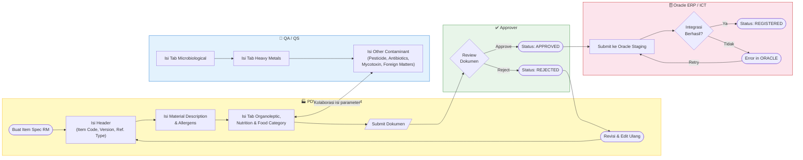
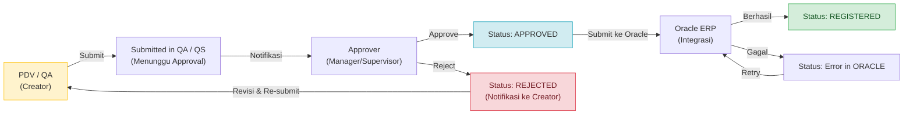
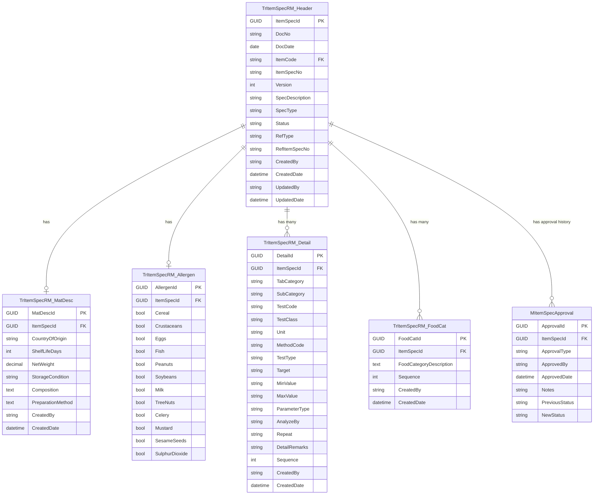

# FUNCTIONAL SPECIFICATION DOCUMENT (FSD)
## Modul: Item Spec RM (Raw Material Specification)
### Sistem: IDC System (New RM Selection)
### Versi Dokumen: 1.2

---

| Atribut                | Keterangan                                                         |
|------------------------|--------------------------------------------------------------------|
| **Nama Dokumen**       | FSD Modul Item Spec RM – Raw Material Specification                |
| **Versi**              | 1.2                                                                |
| **Tanggal**            | Mei 2026                                                           |
| **Divisi**             | PDV / QA / QS / ICT                                               |
| **Status**             | Draft                                                              |
| **Dibuat oleh**        | Tim ICT – IDC System                                               |

---

## Riwayat Revisi

| Versi   | Tanggal      | Diubah Oleh | Keterangan                                                                                          |
|---------|--------------|-------------|-----------------------------------------------------------------------------------------------------|
| **1.0** | **Mei 2026** | **Tim ICT** | Initial draft – Migrasi dan modernisasi modul Item Spec RM dari sistem lama (KN2015_RMPM.WEB / rmselection) |
| **1.2** | **Mei 2026** | **Tim ICT** | Update: flowchart diganti ke format swimlane, hapus section Struktur Halaman, istilah "kartu" diubah menjadi "Card" |

---

## Daftar Isi

1. [Pendahuluan](#1-pendahuluan)
2. [Ringkasan Business Flow](#2-ringkasan-business-flow)
3. [Halaman Index – Item Spec RM](#3-halaman-index--item-spec-rm)
   - 3.1 [Dashboard Summary Cards](#31-dashboard-summary-cards)
   - 3.2 [Action Bar](#32-action-bar)
   - 3.3 [DataTable – Daftar Item Spec RM](#33-datatable--daftar-item-spec-rm)
   - 3.4 [Business Rules Index](#34-business-rules-index)
4. [Halaman Detail – Item Spec RM](#4-halaman-detail--item-spec-rm)
   - 4.1 [Toolbar Actions](#41-toolbar-actions)
   - 4.2 [Section Header](#42-section-header)
   - 4.3 [Tab 1: Material Description](#43-tab-1-material-description)
   - 4.4 [Tab 2: Organoleptic](#44-tab-2-organoleptic)
   - 4.5 [Tab 3: Nutrition & Physical](#45-tab-3-nutrition--physical)
   - 4.6 [Tab 4: Microbiological](#46-tab-4-microbiological)
   - 4.7 [Tab 5: Heavy Metals](#47-tab-5-heavy-metals)
   - 4.8 [Tab 6: Other Contaminant](#48-tab-6-other-contaminant)
   - 4.9 [Tab 7: Food Category](#49-tab-7-food-category)
   - 4.10 [Universal Input Modal](#410-universal-input-modal)
   - 4.11 [LOV – Oracle Reference](#411-lov--oracle-reference)
   - 4.12 [LOV – RM Evaluation Reference](#412-lov--rm-evaluation-reference)
5. [Aturan Bisnis (Business Rules)](#5-aturan-bisnis-business-rules)
6. [Hak Akses & Peran Pengguna](#6-hak-akses--peran-pengguna)
7. [Alur Persetujuan (Approval Flow)](#7-alur-persetujuan-approval-flow)
8. [Struktur Database & ERD](#8-struktur-database--erd)
9. [Appendix – Status & Mapping Field](#9-appendix--status--mapping-field)

---

## 1. Pendahuluan

### 1.1 Latar Belakang

Modul **Item Spec RM** (*Raw Material Specification*) adalah bagian dari sistem IDC (*Integrated Data Center*) yang bertanggung jawab atas pembuatan, pengelolaan, dan persetujuan dokumen spesifikasi standar kualitas bahan baku (Raw Material). Modul ini merupakan salah satu inti dari siklus *RM Selection*, di mana setiap bahan baku yang akan digunakan dalam proses produksi wajib memiliki dokumen spesifikasi resmi yang telah disetujui.

Item Spec RM berfungsi sebagai **"Card Identitas + Sertifikat Kelayakan"** suatu bahan baku, yang mencakup: asal negara bahan, komposisi, masa simpan, kondisi penyimpanan, informasi alergen, serta serangkaian parameter uji laboratorium yang terorganisasi dalam berbagai tab (Organoleptic, Nutrition & Physical, Microbiological, Heavy Metals, Other Contaminant, dan Food Category).

Modul ini merupakan hasil migrasi dari sistem lama **KN2015_RMPM.WEB** (platform ASP.NET MVC VB.NET) ke arsitektur **IDC System** yang modern, berbasis REST API dan antarmuka HTML5 responsif.

### 1.2 Tujuan Dokumen

Dokumen ini bertujuan untuk:

1. Mendeskripsikan fungsionalitas **per komponen** (header, tab, modal, LOV, popup) dari modul Item Spec RM.
2. Menjadi acuan pengembangan bagi tim ICT IDC System.
3. Mendokumentasikan alur proses bisnis, desain layar, CRUD per section, LOV, dan aturan bisnis.
4. Mendokumentasikan *role-based access control* per tab dan per field berdasarkan departemen pengguna.
5. Mendokumentasikan proses migrasi dari sistem lama (KN2015_RMPM.WEB) ke arsitektur baru IDC System.
6. Menjadi referensi bagi tim QA, PDV, dan Approver untuk memahami alur kerja sistem.

### 1.3 Ruang Lingkup

Dokumen ini **hanya mencakup Item Spec RM** (Raw Material). Item Spec PM (Packaging Material) tidak termasuk dalam ruang lingkup dokumen ini dan akan dibahas dalam FSD terpisah.

| Halaman                    | Tujuan                                                       |
|----------------------------|--------------------------------------------------------------|
| `ItemSpecRMIndex.html`     | Daftar & monitoring seluruh dokumen Item Spec RM             |
| `ItemSpecRMDetail.html`    | Form input/edit Item Spec RM (Header + 7 Tab parameter)      |

### 1.4 Stakeholder

| Peran                  | Tim / Divisi              | Keterlibatan                                                                |
|------------------------|---------------------------|-----------------------------------------------------------------------------|
| Business Owner         | PDV / QA / QS             | Pemilik proses bisnis, validasi kebutuhan fungsional                        |
| ICT Developer          | IDC System Team           | Pengembangan dan implementasi modul                                         |
| PDV (Product Development) | PDV                    | Pembuat dokumen utama; mengisi header, material description, allergen, food category |
| QA / QS                | Quality Assurance/Safety  | Mengisi dan mengedit parameter uji: Microbiological, Heavy Metals, Contaminant |
| Approver               | Manager / Supervisor      | Memberikan persetujuan sebelum dokumen dikirim ke Oracle                    |
| Oracle ERP Admin       | ICT / ERP                 | Menerima data staging dan memproses registrasi ke Oracle Inventory          |

---

## 2. Ringkasan Business Flow

### 2.1 Konteks Posisi dalam Alur RM Selection

```
RM Sample Management
     │
     ▼ (Evaluation APPROVED)
Item Spec RM – Pembuatan Dokumen (DRAFT)
     │
     ▼ (Submit oleh PDV/QA)
Waiting Approval (Submitted in QA / QS)
     │
     ▼ (Approver menyetujui)
Approved
     │
     ▼ (Submit ke Oracle)
Submitted in ORACLE
     │
     ▼ (Berhasil terdaftar di ERP)
Registered (Selesai)
```

### 2.2 Flow Diagram – Proses Item Spec RM



### 2.3 Status Dokumen

| Kode Status          | Label                     | Warna Badge | Keterangan                                                              |
|----------------------|---------------------------|-------------|-------------------------------------------------------------------------|
| `DRAFT`              | Draft                     | Abu-abu     | Baru dibuat, belum disubmit                                             |
| `WAIT_APPROVAL`      | Submitted in QA / QS      | Kuning/Amber| Disubmit, menunggu persetujuan Approver                                 |
| `APPROVED`           | Approved                  | Hijau       | Sudah disetujui, siap dikirim ke Oracle                                 |
| `SUBMITTED_ORACLE`   | Submitted in ORACLE       | Biru/Hijau  | Telah dikirim ke Oracle staging                                         |
| `ERROR_ORACLE`       | Error in ORACLE           | Merah       | Gagal integrasi dengan Oracle, perlu pengecekan ulang                   |
| `REGISTERED`         | Registered                | Biru tua    | Sudah terdaftar resmi di Oracle Inventory                               |

---

## 3. Halaman Index – Item Spec RM

**Path File**: `ItemSpecRMIndex.html`

**Tujuan**: Menampilkan seluruh data Item Spec RM dalam bentuk dashboard ringkasan + DataTable dengan kemampuan filter per status.

### 3.1 Dashboard Summary Cards

Terdapat **5 Card interaktif** di bagian atas yang berfungsi sebagai filter visual sekaligus ringkasan jumlah dokumen:

| Card                   | Filter Code      | Warna Ikon   | ID Counter        | DataTable Search Pattern                              |
|-------------------------|------------------|--------------|-------------------|-------------------------------------------------------|
| Total                   | `ALL`            | Navy         | `totalCount`      | Kosongkan search (tampil semua)                       |
| Draft                   | `DRAFT`          | Kuning/Amber | `draftCount`      | Search kolom Status: `"Draft"`                        |
| Waiting Approval        | `WAIT_APPROVAL`  | Cyan/Info    | `pendingCount`    | Search kolom Status: `"Submitted in QA / QS"`         |
| Approved                | `APPROVED`       | Hijau        | `approvedCount`   | Search kolom Status: `"Approved"`                     |
| Submitted / Registered  | `REGISTERED`     | Biru         | `registeredCount` | Regex: `"Submitted in ORACLE\|Error in ORACLE"`       |

**Tampilan Dashboard Cards:**


**Behaviour Card:**
- Klik Card → Card aktif memiliki border tebal + shadow berwarna sesuai status.
- DataTable otomatis memfilter berdasarkan nilai di kolom **Status** (kolom index 1).
- Card aktif pertama kali adalah **Total** (ALL).
- Jumlah counter di-update secara dinamis saat data di-load dari API.
- Status "Submitted / Registered" menggunakan **regex search** karena mencakup 2 nilai: `Submitted in ORACLE` dan `Error in ORACLE`.

### 3.2 Action Bar

| Tombol                 | ID           | Posisi | Fungsi                                                                 |
|------------------------|--------------|--------|------------------------------------------------------------------------|
| Export Excel           | `btnExport`  | Kiri   | Export data tabel ke format Excel (.xlsx) via API                      |
| Create Item Spec RM    | `btnNew`     | Kanan  | Navigasi ke `ItemSpecRMDetail.html` tanpa parameter `?id=`             |

### 3.3 DataTable – Daftar Item Spec RM

**ID Tabel**: `dataTableItemSpec`

| Kolom          | Field Key      | Render                                                                        | Sortable |
|----------------|----------------|-------------------------------------------------------------------------------|----------|
| Doc No         | `docNo`        | Link biru ke `ItemSpecRMDetail.html?id={interfaceId}`, teks semi-bold         | Ya       |
| Status         | `status`       | Badge berwarna: Draft=abu, Submitted in QA/QS=kuning, Approved=info, Submitted=hijau, Error=merah | Ya |
| Doc Date       | `docDate`      | Format tanggal (DD-MMM-YYYY)                                                  | Ya       |
| Item Code      | `itemCode`     | Text biasa (kode item Oracle Inventory)                                       | Ya       |
| Item Spec      | `itemSpec`     | Text biasa (format: `S-[ITEM CODE]`)                                          | Ya       |
| Vers.          | `version`      | Angka versi dokumen                                                           | Ya       |
| Description    | `description`  | Text biasa (deskripsi spesifikasi)                                            | Ya       |
| Inserted By    | `insertedBy`   | Nama user yang membuat dokumen                                                | Ya       |
| Next Approval  | `nextApproval` | Nama approver berikutnya dari sistem Magic/Oracle                             | Tidak    |
| Action         | –              | Tombol **Edit** → `ItemSpecRMDetail.html?id={interfaceId}`                    | Tidak    |

**Tampilan DataTable Daftar Item Spec RM:**


**CRUD dari Halaman Index:**

| Operasi    | Cara                                                        | Keterangan                                        |
|------------|-------------------------------------------------------------|---------------------------------------------------|
| **Create** | Klik tombol "Create Item Spec RM"                           | Buka halaman detail kosong (mode Create)          |
| **Read**   | Klik link "Doc No" atau tombol "Edit" di kolom Action       | Buka halaman detail terisi data (mode Read/Edit)  |
| **Update** | Dari halaman detail (tombol Save)                           | Tidak bisa edit langsung dari Index               |
| **Delete** | Tidak tersedia di UI (soft delete via Admin)                | Hanya dokumen berstatus DRAFT yang dapat dihapus  |

### 3.4 Business Rules Index

| Status                | Action Tersedia        | Keterangan                                                        |
|-----------------------|------------------------|-------------------------------------------------------------------|
| Draft                 | Edit / Delete          | Dapat diedit dan dihapus (soft delete via Admin)                  |
| Submitted in QA / QS  | View (Read-only)       | Tidak dapat diedit selama menunggu persetujuan                    |
| Approved              | View (Read-only)       | Read-only setelah disetujui                                       |
| Submitted in ORACLE   | View (Read-only)       | Data sudah dikirim ke Oracle staging                              |
| Error in ORACLE       | View / Retry           | Dapat disubmit ulang ke Oracle                                    |
| Registered            | View (Read-only)       | Data resmi terdaftar di Oracle, tidak dapat diubah                |

---

## 4. Halaman Detail – Item Spec RM

**Path File**: `ItemSpecRMDetail.html`

**Tujuan**: Form untuk membuat atau mengedit dokumen Item Spec RM. Terdiri dari **Section Header** dan **7 Tab** parameter yang terorganisir secara logis berdasarkan kategori pengujian.

### 4.1 Toolbar Actions

| Tombol     | ID           | Warna   | Kondisi Aktif                     | Fungsi                                                                   |
|------------|--------------|---------|-----------------------------------|--------------------------------------------------------------------------|
| Print      | `btnPrint`   | Primary | Selalu aktif                      | Membuka dialog cetak / generate PDF dari dokumen                         |
| Save       | `btnSave`    | Success | Selalu aktif (status DRAFT)       | Simpan data (Save Draft), bisa dilanjutkan nanti                         |
| Submit     | `btnSubmit`  | Warning | Selalu aktif (validasi mandatory) | Submit untuk persetujuan; ubah status menjadi "Submitted in QA / QS"     |
| Back       | –            | Danger  | Selalu aktif                      | Kembali ke `ItemSpecRMIndex.html` tanpa menyimpan perubahan              |

**Business Rule Toolbar:**
- Tombol **Save** dan **Submit** hanya aktif selama status dokumen adalah `DRAFT` atau `REJECTED`.
- Jika status `Submitted in QA / QS`, `Approved`, atau lebih lanjut → semua field dan tombol edit **dinonaktifkan** (read-only mode).
- Tombol **Print** selalu aktif di semua status.

### 4.2 Section Header


Section Header berisi informasi identitas utama dokumen. Ditampilkan dalam satu card (`card.Header Details`) di bagian atas halaman detail.

#### 4.2.1 Fields – Header

| Field Name         | ID Elemen       | Tipe                    | Mandatory | Default      | Keterangan                                                                      |
|--------------------|-----------------|-------------------------|-----------|--------------|---------------------------------------------------------------------------------|
| Doc Date           | `docDate`       | Date (readonly)         | Ya (Auto) | Hari ini     | Tanggal dokumen, digenerate otomatis oleh sistem                                |
| Doc No             | `docNo`         | Text (readonly)         | Ya (Auto) | (auto-gen)   | Nomor dokumen unik, format: `[SEQ]-RM-SPC-[MM]-[YY]`, digenerate otomatis      |
| Item Code          | `txtItemCode`   | Text + LOV Button       | Ya        | (kosong)     | Kode item dari Oracle Inventory. Tombol LOV: `btnSearchItemCode`                |
| Item Spec No.      | `txtItemSpec`   | Text (readonly)         | Ya (Auto) | (auto-fill)  | Auto-fill saat Item Code dipilih. Format: `S-[ITEM CODE]`                       |
| Version            | –               | Number (editable)       | Ya        | 1            | Versi dokumen spesifikasi. Dapat diedit manual                                   |
| Spec Description   | –               | Text (editable)         | Tidak     | (auto-fill)  | Deskripsi spesifikasi. Auto-fill dari data Oracle/RM Eval jika ada referensi    |
| Spec Type          | –               | Select (dropdown)       | Ya        | Raw Material | Pilihan: `Raw Material` / `Packaging Material`. Untuk modul ini selalu RM       |
| Ref. Type          | `refType`       | Select (dropdown)       | Tidak     | (kosong)     | Sumber referensi data. Pilihan: `Oracle (Inventory)` / `RM Evaluation`          |
| Reference Item Spec| `refItemSpec`   | Text + LOV Button       | Tidak     | (kosong)     | Nomor spec referensi. Tombol LOV: `btnSearchRef`. Aktif setelah Ref. Type dipilih |

#### 4.2.2 Business Rules – Header

**Auto-generate Doc No:**
```
Format: [SEQ_3DIGIT]-RM-SPC-[MM]-[YY]
Contoh: 001-RM-SPC-04-26
- SEQ    : Nomor urut 3 digit, reset tiap bulan
- MM     : Bulan (2 digit)
- YY     : Tahun (2 digit)
```

**Auto-fill Item Spec No:**
```
Setelah Item Code dipilih dari LOV:
  Item Spec No = "S-" + Item Code
  Contoh: Item Code = "RMFLA256" → Item Spec No = "S-RMFLA256"
```

**Ref. Type & Reference Item Spec:**
```
Jika Ref. Type dipilih:
  - "Oracle (Inventory)"  → Buka LOV Oracle Modal (lovOracleModal)
  - "RM Evaluation"       → Buka LOV RM Evaluation Modal (lovRMEvalModal)

Setelah referensi dipilih:
  → Seluruh field Material Description ter-copy
  → Seluruh checkbox Allergen ter-set
  → Seluruh tabel parameter (semua 7 tab) ter-populate otomatis
  → Pengguna hanya perlu menyesuaikan nilai yang berbeda
```

**CRUD – Header Section:**

| Operasi    | Cara                                          | Keterangan                                                     |
|------------|-----------------------------------------------|----------------------------------------------------------------|
| **Create** | Buka halaman tanpa `?id=` query string        | Semua field kosong, Doc No & Doc Date digenerate otomatis      |
| **Read**   | Buka halaman dengan `?id={interfaceId}`       | Field terisi dari data tersimpan                               |
| **Update** | Edit field yang editable → klik **Save**      | Doc Date, Doc No, Item Spec No adalah read-only (tidak diubah) |
| **Submit** | Klik **Submit** → konfirmasi SweetAlert       | Validasi field mandatory, lalu ubah status                     |

---

### 4.3 Tab 1: Material Description

**Tab ID**: `#navs-material-description`  
**Role PDV**: Edit penuh  
**Role QA/QS**: Read-only

Tab ini berisi informasi deskripsi material dan informasi alergen. Dibagi menjadi **dua bagian**: Material Properties dan Allergens Information.


#### 4.3.1 Material Properties Fields

| Field Name          | ID Elemen             | Tipe          | Mandatory | Default  | Keterangan                                                   |
|---------------------|-----------------------|---------------|-----------|----------|--------------------------------------------------------------|
| Country of Origin   | `txtOrigin`           | Text          | Tidak     | (kosong) | Negara asal bahan baku. Contoh: `Indonesia`, `Australia`     |
| Shelf Life (Days)   | `decShelfLife`        | Number        | Tidak     | 365      | Masa simpan dalam satuan hari                                |
| Net Weight (Per UOM)| `decNetWeight`        | Text / Decimal| Tidak     | (kosong) | Berat bersih per satuan UOM (unit of measure)                |
| Storage Condition   | `txtStorageCondition` | Text          | Tidak     | (kosong) | Kondisi penyimpanan. Contoh: `Keep in dry place, 25°C`       |
| Composition         | `txtComposition`      | Textarea      | Tidak     | (kosong) | Daftar komposisi bahan lengkap                               |
| Preparation Method  | `txtPreparationMethod`| Textarea      | Tidak     | (kosong) | Metode persiapan penggunaan bahan                            |

#### 4.3.2 Allergens Information

Bagian alergen ditampilkan sebagai **grid checkbox** (4 kolom) dalam sebuah box berwarna abu-abu muda.

| ID Checkbox           | Label Alergen             | Keterangan                                      |
|-----------------------|---------------------------|-------------------------------------------------|
| `chkAlgnCereal`       | Cereal containing Gluten  | Sereal mengandung gluten (gandum, rye, barley)  |
| `chkAlgnCrustaceae`   | Crustaceans               | Udang, lobster, kepiting                        |
| `chkAlgnEgg`          | Eggs                      | Telur dan produk turunannya                     |
| `chkAlgnFish`         | Fish                      | Ikan dan produk turunannya                      |
| `chkAlgnPeanuts`      | Peanuts                   | Kacang tanah                                    |
| `chkAlgnSoybeans`     | Soybeans                  | Kacang kedelai                                  |
| `chkAlgnMilk`         | Milk / Dairy              | Susu dan produk susu                            |
| `chkAlgnTree`         | Tree Nuts                 | Kacang pohon (almond, walnut, hazelnut, dll.)   |
| `chkAlgnCelery`       | Celery                    | Seledri dan produk turunannya                   |
| `chkAlgnMustard`      | Mustard                   | Mustard dan produk turunannya                   |
| `chkAlgnSesame`       | Sesame Seeds              | Biji wijen                                      |
| `chkAlgnSulphite`     | Sulphur Dioxide           | Sulfur dioksida dan sulfit (≥10 ppm)            |

**Business Rules – Allergens:**
- PDV dapat **mencentang dan membatalkan centang** semua checkbox alergen.
- QA/QS berstatus **read-only** untuk seluruh bagian Material Description dan Allergens.
- Jika referensi dipilih, checkbox alergen terisi otomatis sesuai data referensi.

**CRUD – Tab Material Description:**

| Operasi    | Cara                                   | Keterangan                                      |
|------------|----------------------------------------|-------------------------------------------------|
| **Create** | Isi form manual atau via referensi     | Field kosong, checkbox alergen semua unchecked  |
| **Read**   | Data ter-load saat halaman dibuka      | Semua field dan checkbox menampilkan nilai tersimpan |
| **Update** | Ubah nilai field → klik **Save**       | Hanya PDV yang dapat mengedit                   |
| **Delete** | Tidak ada (field di-clear secara manual)| Tidak ada operasi delete per field              |

---

### 4.4 Tab 2: Organoleptic

**Tab ID**: `#navs-organoleptic`  
**Tabel ID**: `tbDTOrganoleptic`  
**Role PDV**: Edit & Delete  
**Role QA/QS**: Edit (tanpa Delete)

Tab ini berisi parameter uji **organoleptik** (penilaian indera: warna, bau, rasa, tekstur). Ditampilkan dalam **DataTable** yang dapat dimodifikasi melalui Universal Input Modal.

#### 4.4.1 Kolom DataTable – Organoleptic

| Kolom           | Field Key       | Keterangan                                                    |
|-----------------|-----------------|---------------------------------------------------------------|
| No              | (auto-increment)| Nomor urut baris                                              |
| Test Code       | `testCode`      | Kode pengujian dari master data lab                           |
| Test Class      | `testClass`     | Kategori/kelas pengujian                                      |
| Unit            | `unit`          | Satuan pengujian (%, mg/kg, CFU/g, dll.)                      |
| Method Code     | `methodCode`    | Metode pengujian yang digunakan                               |
| Test Type       | `testType`      | Tipe pengujian (Critical, Major, Minor, dll.)                 |
| Target          | `target`        | Nilai target spec                                             |
| Min             | `minValue`      | Batas minimum yang diterima                                   |
| Max             | `maxValue`      | Batas maksimum yang diterima                                  |
| Parameter Type  | `parameterType` | Klasifikasi parameter (Critical, Major, Minor, Informational) |
| Analyze By      | `analyzeBy`     | Pihak yang menganalisa (Internal Lab / External Lab)          |
| Repeat          | `repeat`        | Apakah perlu diulang (Yes / No)                               |
| Detail Remarks  | `detail`        | Catatan tambahan                                              |
| Action          | –               | Tombol **Edit** + **Delete** (Delete hanya untuk PDV)         |

**Tampilan Tab Organoleptic:**


**CRUD – Tab Organoleptic:**

| Operasi    | Cara                                                | Role            | Keterangan                             |
|------------|-----------------------------------------------------|-----------------|----------------------------------------|
| **Create** | Klik **Add / Edit Row** → isi Universal Input Modal | PDV & QA/QS     | Tambah baris baru ke DataTable         |
| **Read**   | Data tampil di DataTable                            | Semua           | Baca data yang sudah tersimpan         |
| **Update** | Klik tombol **Edit** pada baris → modal terbuka     | PDV & QA/QS     | Edit data baris yang dipilih           |
| **Delete** | Klik tombol **Delete** pada baris                   | PDV saja        | QA/QS tidak memiliki tombol Delete     |

---

### 4.5 Tab 3: Nutrition & Physical

**Tab ID**: `#navs-nutrition`  
**Tabel ID**: `tbDTNutrition`  
**Role PDV**: Edit & Delete  
**Role QA/QS**: Edit saja (tanpa Delete)

Tab ini berisi parameter uji **nutrisi dan fisik** bahan baku (kadar protein, lemak, karbohidrat, energi, viskositas, dll.).

**Kolom DataTable** identik dengan Tab Organoleptic (lihat Bagian 4.4.1).


**CRUD – Tab Nutrition & Physical:**

| Operasi    | Cara                             | Role            | Keterangan                              |
|------------|----------------------------------|-----------------|-----------------------------------------|
| **Create** | Tombol **Add / Edit Row**        | PDV & QA/QS     | Tambah baris baru                       |
| **Read**   | Data tampil di DataTable         | Semua           | –                                       |
| **Update** | Tombol **Edit** di baris         | PDV & QA/QS     | Edit baris yang dipilih                 |
| **Delete** | Tombol **Delete** di baris       | PDV saja        | QA/QS tidak dapat menghapus baris       |

---

### 4.6 Tab 4: Microbiological

**Tab ID**: `#navs-microbiological`  
**Tabel ID**: `tbDTMicrobiological`  
**Role PDV**: Tidak bisa edit  
**Role QA/QS**: Edit & Delete penuh

Tab ini berisi parameter uji **mikrobiologi** (Total Plate Count, E. Coli, Salmonella, Listeria, dll.). **PDV tidak berwenang** untuk mengedit atau menghapus data di tab ini.

**Kolom DataTable** identik dengan Tab Organoleptic (lihat Bagian 4.4.1), kecuali tombol Action hanya muncul untuk QA/QS.


**CRUD – Tab Microbiological:**

| Operasi    | Cara                             | Role        | Keterangan                              |
|------------|----------------------------------|-------------|-----------------------------------------|
| **Create** | Tombol **Add / Edit Row**        | QA/QS saja  | PDV tidak dapat menambah baris          |
| **Read**   | Data tampil di DataTable         | Semua       | PDV dapat membaca tapi tidak mengedit   |
| **Update** | Tombol **Edit** di baris         | QA/QS saja  | –                                       |
| **Delete** | Tombol **Delete** di baris       | QA/QS saja  | –                                       |

---

### 4.7 Tab 5: Heavy Metals

**Tab ID**: `#navs-heavy-metals`  
**Tabel ID**: `tbDTHeavyMetals`  
**Role PDV**: Tidak bisa edit  
**Role QA/QS**: Edit & Delete penuh

Tab ini berisi parameter uji **logam berat** (Timbal/Lead, Merkuri/Mercury, Kadmium/Cadmium, Arsen/Arsenic, dll.). Berlaku aturan akses yang sama dengan Tab Microbiological.

**Kolom DataTable** identik dengan Tab Organoleptic (lihat Bagian 4.4.1).


**CRUD – Tab Heavy Metals:**

| Operasi    | Cara                             | Role        | Keterangan                              |
|------------|----------------------------------|-------------|-----------------------------------------|
| **Create** | Tombol **Add / Edit Row**        | QA/QS saja  | PDV tidak dapat menambah baris          |
| **Read**   | Data tampil di DataTable         | Semua       | –                                       |
| **Update** | Tombol **Edit** di baris         | QA/QS saja  | –                                       |
| **Delete** | Tombol **Delete** di baris       | QA/QS saja  | –                                       |

---

### 4.8 Tab 6: Other Contaminant

**Tab ID**: `#navs-other-contaminant`  
**Role PDV**: Tidak bisa edit  
**Role QA/QS**: Edit & Delete penuh

Tab ini berisi **4 sub-tabel** kontaminan lain yang masing-masing memiliki tombol tambah sendiri:

| Sub-tabel         | ID DataTable                       | Icon       | Contoh Parameter                          |
|-------------------|------------------------------------|------------|-------------------------------------------|
| Pesticide         | `tbDTOtherContaminantPesticide`    | fa-bug     | Chlorpyrifos, DDT, Glyphosate             |
| Antibiotics       | `tbDTOtherContaminantAntibiotics`  | fa-capsules| Tetracycline, Ampicillin, Chloramphenicol |
| Mycotoxin Residue | `tbDTOtherContaminantMycotoxin`    | fa-vial    | Aflatoxin B1, Ochratoxin A, Zearalenone   |
| Foreign Matters   | `tbDTOtherContaminantForeignMatters`| fa-search-minus | Logam, plastik, benda asing lainnya  |

**Tombol Add per Sub-tabel:**

| Sub-tabel         | Tombol                    | Fungsi                                                          |
|-------------------|---------------------------|-----------------------------------------------------------------|
| Pesticide         | `+ Add Pesticide`         | `detailManager.openEditModal('OtherContaminantPesticide', null)` |
| Antibiotics       | `+ Add Antibiotics`       | `detailManager.openEditModal('OtherContaminantAntibiotics', null)` |
| Mycotoxin Residue | `+ Add Mycotoxin`         | `detailManager.openEditModal('OtherContaminantMycotoxin', null)` |
| Foreign Matters   | `+ Add Foreign Matters`   | `detailManager.openEditModal('OtherContaminantForeignMatters', null)` |

**Kolom DataTable** untuk masing-masing sub-tabel identik dengan Tab Organoleptic (lihat Bagian 4.4.1).


**CRUD – Tab Other Contaminant:**

| Operasi    | Cara                               | Role        | Keterangan                              |
|------------|------------------------------------|-------------|-----------------------------------------|
| **Create** | Tombol **Add [Sub-tabel]**         | QA/QS saja  | PDV tidak dapat menambah baris          |
| **Read**   | Data tampil di masing-masing tabel | Semua       | –                                       |
| **Update** | Tombol **Edit** di baris           | QA/QS saja  | –                                       |
| **Delete** | Tombol **Delete** di baris         | QA/QS saja  | –                                       |

---

### 4.9 Tab 7: Food Category

**Tab ID**: `#navs-food-category`  
**Tabel ID**: `tbDTFoodCategory`  
**Role PDV**: Edit & Delete penuh  
**Role QA/QS**: Tidak bisa edit

Tab ini berisi informasi **kategori pangan** dari bahan baku (klasifikasi Codex Alimentarius / BPOM). **QA/QS tidak berwenang** untuk mengedit tab ini.

#### 4.9.1 Kolom DataTable – Food Category

| Kolom                      | Field Key           | Keterangan                                                    |
|----------------------------|---------------------|---------------------------------------------------------------|
| No                         | (auto-increment)    | Nomor urut baris                                              |
| Food Category Description  | `foodCategoryDesc`  | Deskripsi kategori pangan lengkap (textarea dalam modal)      |
| Action                     | –                   | Tombol **Edit** + **Delete** (hanya untuk PDV)                |

**Catatan**: Tab Food Category menggunakan form berbeda di Universal Input Modal (lihat Bagian 4.10.2 – Food Category Fields).


**CRUD – Tab Food Category:**

| Operasi    | Cara                             | Role      | Keterangan                              |
|------------|----------------------------------|-----------|-----------------------------------------|
| **Create** | Tombol **Add / Edit Row**        | PDV saja  | QA/QS tidak dapat menambah baris        |
| **Read**   | Data tampil di DataTable         | Semua     | –                                       |
| **Update** | Tombol **Edit** di baris         | PDV saja  | –                                       |
| **Delete** | Tombol **Delete** di baris       | PDV saja  | –                                       |

---

### 4.10 Universal Input Modal

**Modal ID**: `universalInputModal`  
**Judul Modal**: `Form Entry: [Nama Tab]`


Modal ini digunakan **bersama** oleh semua tab (kecuali Material Description) untuk proses Add/Edit data parameter. Konten modal berubah secara dinamis tergantung tab yang aktif.

#### 4.10.1 Common Form Fields (Tab 2–5 + Sub-tabel Other Contaminant)

Digunakan untuk tab: Organoleptic, Nutrition & Physical, Microbiological, Heavy Metals, Pesticide, Antibiotics, Mycotoxin, Foreign Matters.

| Field Name      | ID Elemen           | Tipe   | Mandatory | Keterangan                                                     |
|-----------------|---------------------|--------|-----------|----------------------------------------------------------------|
| Test Code       | `txtTestCode`       | Text   | Ya        | Kode pengujian dari master data lab                            |
| Test Class      | `txtTestClass`      | Text   | Tidak     | Kategori kelas pengujian                                       |
| Unit            | `txtTestUnit`       | Text   | Tidak     | Satuan pengujian (%, mg/L, CFU/g, ppm, ppb, dll.)             |
| Method Code     | `txtTestMethodCode` | Text   | Tidak     | Kode metode pengujian                                          |
| Test Type       | `txtTestType`       | Text   | Tidak     | Tipe parameter (Critical, Major, Minor, dll.)                  |
| Target          | `txtTarget`         | Text   | Tidak     | Nilai target yang diinginkan                                   |
| Min             | `txtMin`            | Text   | Tidak     | Batas nilai minimum yang diterima                              |
| Max             | `txtMax`            | Text   | Tidak     | Batas nilai maksimum yang diterima                             |
| Parameter Type  | `txtParameterType`  | Text   | Tidak     | Klasifikasi tingkat kekritisan parameter                       |
| Analyze By      | `txtAnalyzeBy`      | Text   | Tidak     | Pihak yang melakukan analisa (Internal Lab / External Lab)     |
| Repeat          | `txtRepeat`         | Text   | Tidak     | Apakah pengujian perlu diulang (Yes / No)                      |
| Detail Remarks  | `txtDetail`         | Text   | Tidak     | Catatan atau keterangan tambahan                               |

**Tombol Modal:**

| Tombol        | ID             | Fungsi                                                             |
|---------------|----------------|--------------------------------------------------------------------|
| Cancel        | –              | Menutup modal tanpa menyimpan; `data-bs-dismiss="modal"`           |
| Save Changes  | `btnSaveModal` | Validasi field mandatory → simpan ke DataTable; tutup modal        |

#### 4.10.2 Food Category Fields (Tab Food Category)

Khusus Tab Food Category, modal menampilkan field berbeda (Common Fields disembunyikan):

| Field Name                  | ID Elemen            | Tipe     | Mandatory | Keterangan                                    |
|-----------------------------|----------------------|----------|-----------|-----------------------------------------------|
| Food Category Description   | `txtFoodCategoryDesc`| Textarea | Ya        | Deskripsi lengkap kategori pangan (4 baris)   |

#### 4.10.3 Behaviour Modal

```
Saat tombol "Add / Edit Row" diklik:
  1. Sistem deteksi tab yang aktif (data-tab-id pada nav-link)
  2. Jika tab = "FoodCategory" → tampilkan #foodCategoryFields, sembunyikan #commonFormFields
  3. Jika tab lain              → tampilkan #commonFormFields, sembunyikan #foodCategoryFields
  4. Judul modal diupdate: "Form Entry: [Nama Tab]"
  5. Jika mode Edit: semua field ter-populate dari data baris yang dipilih
  6. Jika mode Add:  semua field kosong

Saat tombol "Save Changes" diklik:
  1. Validasi field mandatory (minimal Test Code tidak kosong untuk Common Fields)
  2. Jika valid → data disimpan ke DataTable (LocalStorage sementara / via API)
  3. Modal ditutup otomatis
  4. DataTable di-refresh untuk menampilkan data terbaru
```

---

### 4.11 LOV – Oracle Reference

**Modal ID**: `lovOracleModal`  
**Dipanggil oleh**: Tombol LOV di field `refItemSpec` saat `refType = "ORACLE"`

LOV ini memungkinkan user memilih **Item Spec yang sudah terdaftar di Oracle Inventory** sebagai referensi data untuk dokumen baru.

**Tampilan Modal:**
- Header: Background biru primary, judul `Oracle Item Reference` + ikon database
- Body: DataTable dengan 3 kolom

| Kolom        | Keterangan                                                      |
|--------------|-----------------------------------------------------------------|
| Action       | Tombol **Select Spec** (biru primary)                           |
| Item Spec No.| Nomor spesifikasi item di Oracle (contoh: `S-RMFLA256`)         |
| Description  | Deskripsi lengkap item beserta asal negara                      |

**Sumber Data:**
```
API Endpoint: GET /api/ItemSpec/GetOracleSpecReference?search={term}
Sumber DB:    Oracle Inventory – Item Spec yang sudah terdaftar (status Registered)
```


**Setelah user klik "Select Spec":**
```javascript
detailManager.selectRefItem(itemSpecNo, description)
  → Set field refItemSpec = itemSpecNo
  → Trigger auto-fill: load seluruh data spec dari API berdasarkan itemSpecNo
  → Populate Material Description, Allergens, semua tabel parameter
  → Modal ditutup
```

---

### 4.12 LOV – RM Evaluation Reference

**Modal ID**: `lovRMEvalModal`  
**Dipanggil oleh**: Tombol LOV di field `refItemSpec` saat `refType = "RMEVAL"`

LOV ini memungkinkan user memilih **hasil RM Evaluation** sebagai referensi data, menghubungkan proses evaluasi awal bahan baku dengan pembuatan spec resminya.

**Tampilan Modal:**
- Header: Background kuning warning, judul `RM Evaluation Reference` + ikon mikroskop
- Body: DataTable dengan 4 kolom

| Kolom        | Keterangan                                                      |
|--------------|-----------------------------------------------------------------|
| Action       | Tombol **Select Spec** (kuning warning)                         |
| Eval No      | Nomor evaluasi RM (format: `RME-YYYY-XXXX`)                     |
| Item Spec No.| Nomor spec hasil evaluasi                                       |
| Supplier     | Nama supplier yang dievaluasi                                   |

**Sumber Data:**
```
API Endpoint: GET /api/ItemSpec/GetRMEvalReference?search={term}
Sumber DB:    Modul RM Evaluation – data evaluasi dengan status Approved/Completed
```


**Setelah user klik "Select Spec":**
```javascript
detailManager.selectRefItem(itemSpecNo, evalNo)
  → Set field refItemSpec = itemSpecNo
  → Trigger auto-fill: load data dari RM Evaluation
  → Populate Material Description, Allergens, semua tabel parameter
  → Modal ditutup
```

---

## 5. Aturan Bisnis (Business Rules)

### 5.1 Pembuatan Dokumen

| Rule ID | Aturan                                                                                                 |
|---------|--------------------------------------------------------------------------------------------------------|
| BR-01   | Setiap dokumen Item Spec RM harus memiliki **Item Code** yang valid dari Oracle Inventory             |
| BR-02   | **Doc No** dan **Doc Date** digenerate otomatis oleh sistem saat dokumen pertama kali dibuat          |
| BR-03   | **Item Spec No** = `"S-" + Item Code` digenerate otomatis setelah Item Code dipilih                   |
| BR-04   | Jika Ref. Type dipilih (Oracle/RM Eval), semua field material dan parameter ter-populate otomatis     |
| BR-05   | Pengguna hanya perlu menyesuaikan nilai yang berbeda dari referensi; tidak perlu input dari nol       |

### 5.2 Pengisian & Validasi

| Rule ID | Aturan                                                                                                 |
|---------|--------------------------------------------------------------------------------------------------------|
| BR-06   | Field **Item Code** wajib diisi sebelum dokumen dapat disimpan                                        |
| BR-07   | Tombol Submit tidak dapat diklik jika field mandatory belum terisi (validasi client-side + server-side) |
| BR-08   | Data parameter uji (semua tab) tidak wajib diisi sebelum Submit, namun direkomendasikan oleh proses bisnis |
| BR-09   | Setiap baris parameter harus memiliki minimal **Test Code** yang terisi                               |
| BR-10   | Nilai **Min** tidak boleh lebih besar dari nilai **Max** jika keduanya diisi                          |

### 5.3 Status & Transisi

| Rule ID | Aturan                                                                                                          |
|---------|-----------------------------------------------------------------------------------------------------------------|
| BR-11   | Dokumen hanya dapat diedit saat status = `DRAFT` atau `REJECTED`                                               |
| BR-12   | Status `Submitted in QA / QS`, `Approved`, `Submitted in ORACLE`, dan `Registered` bersifat **read-only**      |
| BR-13   | Setelah Submit berhasil, status berubah menjadi `Submitted in QA / QS` dan notifikasi dikirim ke Approver      |
| BR-14   | Approver dapat **Approve** atau **Reject** dokumen                                                             |
| BR-15   | Jika Rejected, dokumen kembali ke mode DRAFT dan dapat diedit ulang serta disubmit kembali                     |
| BR-16   | Setelah Approved, hanya sistem/admin yang dapat melakukan Submit ke Oracle                                     |
| BR-17   | Jika terjadi **Error in ORACLE**, dokumen dapat di-retry submit ke Oracle tanpa perlu approval ulang            |

### 5.4 Referensi & Copy Data

| Rule ID | Aturan                                                                                                    |
|---------|-----------------------------------------------------------------------------------------------------------|
| BR-18   | Referensi dapat dipilih dari **Oracle Inventory** (spec yang sudah terdaftar) atau **RM Evaluation**      |
| BR-19   | Pemilihan referensi meng-copy **seluruh** data (material desc, allergens, semua parameter) ke dokumen baru |
| BR-20   | Setelah copy, pengguna bebas mengubah nilai tanpa mempengaruhi dokumen referensi asli                     |
| BR-21   | Referensi hanya dapat dipilih saat dokumen berstatus DRAFT (belum disubmit)                              |

---

## 6. Hak Akses & Peran Pengguna

### 6.1 Matrix Akses per Bagian/Tab

| Bagian / Tab              | PDV (Product Dev.) bisa? | QA/QS bisa?              |
|---------------------------|--------------------------|--------------------------|
| Header (Item Code, Doc No, Version, Spec Desc) | ✅ Edit penuh | ❌ Read-only |
| Material Description (semua field)              | ✅ Edit penuh | ❌ Read-only |
| Allergens Information (semua checkbox)          | ✅ Edit penuh | ❌ Read-only |
| Organoleptic                                    | ✅ Edit & Delete | ✅ Edit saja (tanpa Delete) |
| Nutrition & Physical                            | ✅ Edit & Delete | ✅ Edit saja (tanpa Delete) |
| Microbiological                                 | ❌ Tidak bisa edit | ✅ Edit & Delete penuh |
| Heavy Metals                                    | ❌ Tidak bisa edit | ✅ Edit & Delete penuh |
| Other Contaminant (Pesticide, Antibiotics, Mycotoxin, Foreign Matters) | ❌ Tidak bisa edit | ✅ Edit & Delete penuh |
| Food Category                                   | ✅ Edit & Delete | ❌ Tidak bisa edit |
| Tombol Submit                                   | ✅ Dapat submit | ✅ Dapat submit |
| Tombol Save                                     | ✅ Dapat save | ✅ Dapat save |
| Referensi (Copy From)                           | ✅ Dapat memilih | ❌ Read-only |

**Tampilan saat QA/QS Role aktif – Header Read-Only:**


**Tampilan saat QA/QS Role aktif – Tab Microbiological (Edit aktif):**


### 6.2 Implementasi Role di Sistem

**Kontrol akses** dilakukan secara client-side melalui mekanisme berikut:

```javascript
// Prototype: simulasi role via toggle switch
const isQARole = document.getElementById('roleToggle').checked;

// Untuk produksi: role diambil dari session/JWT user yang login
const userDept = session.Department; // "PDV" / "QA" / "QS"
const isQARole = (userDept === "QA" || userDept === "QS");
```

**Behaviour saat QA/QS Role aktif:**
- Seluruh field di Section Header → `readonly`
- Seluruh field di Tab Material Description → `readonly`
- Seluruh checkbox Allergens → `disabled`
- DataTable Organoleptic & Nutrition → tombol **Delete** disembunyikan
- DataTable Microbiological, Heavy Metals, Other Contaminant → tombol **Edit** dan **Delete** tampil
- DataTable Food Category → tombol **Add**, **Edit**, **Delete** disembunyikan

---

## 7. Alur Persetujuan (Approval Flow)

### 7.1 Diagram Approval



### 7.2 Notifikasi

| Event                          | Penerima Notifikasi           | Channel               |
|--------------------------------|-------------------------------|-----------------------|
| Dokumen disubmit               | Approver (Manager/Supervisor) | Email + In-app notif  |
| Dokumen diapprove              | Creator (PDV/QA yang submit)  | Email + In-app notif  |
| Dokumen direject               | Creator (PDV/QA yang submit)  | Email + In-app notif  |
| Submit ke Oracle berhasil      | Creator + ICT Admin           | In-app notif          |
| Error in ORACLE                | Creator + ICT Admin           | Email + In-app notif  |

### 7.3 Pembatasan Approval

| Kondisi                                   | Aturan                                                                   |
|-------------------------------------------|--------------------------------------------------------------------------|
| Self-approval                             | Creator tidak dapat menyetujui dokumennya sendiri                        |
| Multiple approver                         | Jika lebih dari 1 approver, semua harus menyetujui (sequential approval) |
| Re-approval setelah revisi                | Setelah Reject + Edit, dokumen harus disubmit ulang dan diapprove ulang  |

---

## 8. Struktur Database & ERD

### 8.1 Tabel Utama

| Tabel / Entitas           | Keterangan                                                              |
|---------------------------|-------------------------------------------------------------------------|
| `TrItemSpecRM_Header`     | Header dokumen Item Spec RM (DocNo, ItemCode, Status, Version, dll.)    |
| `TrItemSpecRM_MatDesc`    | Data Material Description (Origin, ShelfLife, NetWeight, dll.)          |
| `TrItemSpecRM_Allergen`   | Data alergen yang dipilih (1 row per dokumen, flag per alergen)         |
| `TrItemSpecRM_Detail`     | Detail parameter uji (satu baris per parameter, semua tab kecuali FoodCat) |
| `TrItemSpecRM_FoodCat`    | Data Food Category (deskripsi kategori pangan)                          |
| `MItemSpecApproval`       | Riwayat approval (siapa menyetujui, kapan, catatan reject)              |

### 8.2 Entity Relationship Diagram



### 8.3 Kolom TabCategory di TrItemSpecRM_Detail

| Nilai `TabCategory`      | Nilai `SubCategory`   | Diisi oleh |
|--------------------------|-----------------------|------------|
| `Organoleptic`           | `-`                   | PDV & QA   |
| `NutritionPhysical`      | `-`                   | PDV & QA   |
| `Microbiological`        | `-`                   | QA/QS      |
| `HeavyMetals`            | `-`                   | QA/QS      |
| `OtherContaminant`       | `Pesticide`           | QA/QS      |
| `OtherContaminant`       | `Antibiotics`         | QA/QS      |
| `OtherContaminant`       | `Mycotoxin`           | QA/QS      |
| `OtherContaminant`       | `ForeignMatters`      | QA/QS      |

---

## 9. Appendix – Status & Mapping Field

### 9.1 Mapping Status Code

| Kode Sistem          | Label Tampilan              | Warna Badge          | DB Value            |
|----------------------|-----------------------------|----------------------|---------------------|
| `DRAFT`              | Draft                       | `bg-label-secondary` | `'DRAFT'`           |
| `WAIT_APPROVAL`      | Submitted in QA / QS        | `bg-label-warning`   | `'WAIT_APPROVAL'`   |
| `APPROVED`           | Approved                    | `bg-label-info`      | `'APPROVED'`        |
| `SUBMITTED_ORACLE`   | Submitted in ORACLE         | `bg-label-success`   | `'SUBMITTED_ORACLE'`|
| `ERROR_ORACLE`       | Error in ORACLE             | `bg-label-danger`    | `'ERROR_ORACLE'`    |
| `REGISTERED`         | Registered                  | `bg-label-primary`   | `'REGISTERED'`      |

### 9.2 Mapping Field Header ke Database

| Field UI               | Kolom DB (TrItemSpecRM_Header) | Tipe Data     | Keterangan                          |
|------------------------|--------------------------------|---------------|-------------------------------------|
| Doc Date               | `DocDate`                      | DATE          | Tanggal generate dokumen            |
| Doc No                 | `DocNo`                        | VARCHAR(30)   | Format: `NNN-RM-SPC-MM-YY`          |
| Item Code              | `ItemCode`                     | VARCHAR(50)   | FK ke Oracle Inventory Items        |
| Item Spec No.          | `ItemSpecNo`                   | VARCHAR(60)   | Format: `S-[ItemCode]`              |
| Version                | `Version`                      | INTEGER       | Default: 1                          |
| Spec Description       | `SpecDescription`              | VARCHAR(255)  | Deskripsi dokumen spec              |
| Spec Type              | `SpecType`                     | VARCHAR(20)   | `'RM'` untuk Item Spec RM           |
| Ref. Type              | `RefType`                      | VARCHAR(20)   | `'ORACLE'` / `'RMEVAL'` / NULL      |
| Reference Item Spec    | `RefItemSpecNo`                | VARCHAR(60)   | Nomor spec referensi (nullable)     |
| Status                 | `Status`                       | VARCHAR(30)   | Lihat mapping status di 9.1         |

### 9.3 Perbandingan Sistem Lama vs Sistem Baru

| Aspek                     | Sistem Lama (KN2015 / rmselection)              | Sistem Baru (IDC System)                                |
|---------------------------|-------------------------------------------------|---------------------------------------------------------|
| Platform                  | ASP.NET MVC VB.NET – Razor VBHTML               | REST API + HTML5 modern (Bootstrap 5)                   |
| Halaman Daftar            | Tabel biasa, tanpa ringkasan statistik          | Dashboard dengan 5 Card summary interaktif             |
| Filter Status             | Tidak ada filter cepat                          | Klik Card → filter tabel otomatis                      |
| Form Input Parameter      | Popup FancyBox window terpisah                  | Bootstrap Modal terpusat di halaman yang sama           |
| Role Control              | Server-side (`@If Dept = "QA"`)                 | Client-side via session/JWT (prototype: toggle switch)  |
| Copy Referensi            | AJAX fill dari RM Evaluation atau Oracle        | LOV modal picker dengan AJAX fill otomatis              |
| Keamanan ID Dokumen       | ID dienkripsi Rijndael via URL                  | `interfaceId` terenkripsi via URL query string          |
| Export Data               | Tidak tersedia                                  | Tombol Export Excel tersedia                            |
| Notifikasi                | Email manual                                    | In-app notification + Email terintegrasi                |
| Audit Trail               | Terbatas                                        | Riwayat approval lengkap di `MItemSpecApproval`         |

---

*Dokumen ini dibuat sebagai FSD Modul Item Spec RM – IDC System · Versi 1.0 · Mei 2026*
