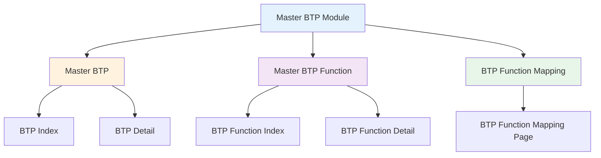
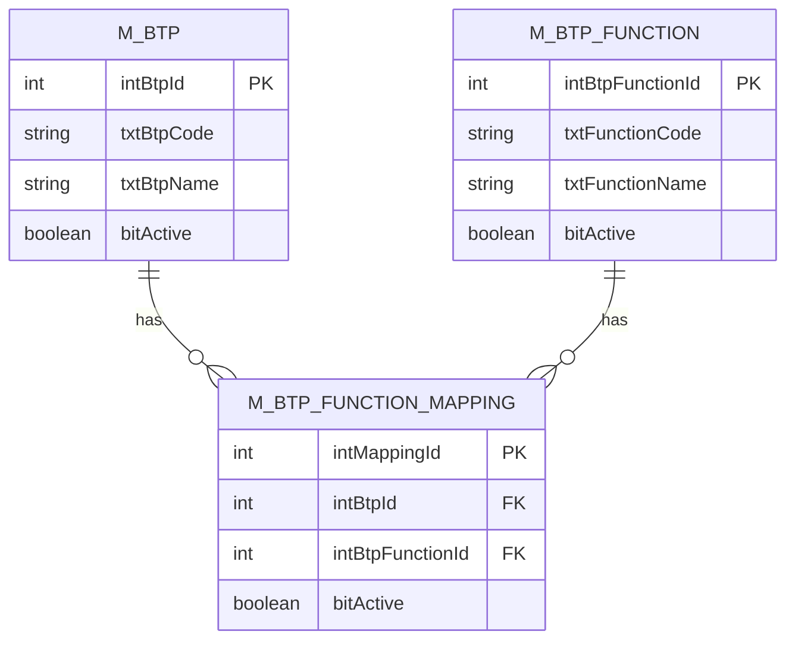

# FUNCTIONAL SPECIFICATION DOCUMENT
## Master BTP (Bahan Tambahan Pangan)

**Document Version:** 1.0  
**Date:** 16 Februari 2026  
**Project:** IDC System - RM Selection Module  
**Module:** Master BTP

---

## 1. INTRODUCTION

### 1.1 Purpose
Dokumen ini menjelaskan spesifikasi fungsional untuk module Master BTP (Bahan Tambahan Pangan) dalam sistem IDC (Integrated Data Center) untuk RM Selection. Module ini dirancang untuk mengelola data master BTP, fungsi BTP, dan mapping antara BTP dengan fungsinya sesuai dengan regulasi BPOM.

### 1.2 Scope
Module Master BTP mencakup tiga sub-module utama:
1. **Master BTP** - Pengelolaan data BTP berdasarkan kode INS (International Numbering System)
2. **Master BTP Function** - Pengelolaan fungsi BTP berdasarkan Peraturan BPOM
3. **BTP Function Mapping** - Mapping relasi antara BTP dengan fungsi-fungsinya

### 1.3 Definitions and Acronyms

| Term | Definition |
|------|------------|
| BTP | Bahan Tambahan Pangan (Food Additive) |
| INS | International Numbering System untuk food additives |
| BPOM | Badan Pengawas Obat dan Makanan |
| PERKA BPOM | Peraturan Kepala Badan Pengawas Obat dan Makanan |
| IDC | Integrated Data Center |
| CRUD | Create, Read, Update, Delete |

### 1.4 References
- Peraturan BPOM tentang Bahan Tambahan Pangan (berbagai nomor tahun 2013-2014)
- Codex Alimentarius - International Numbering System for Food Additives
- Existing RM Selection System Documentation

---

## 2. SYSTEM OVERVIEW

### 2.1 Module Architecture



### 2.2 Module Relationship



---

## 3. FUNCTIONAL REQUIREMENTS

### 3.1 Master BTP

#### 3.1.1 BTP Index Page

**Page:** `BTPIndex.html`  
**Purpose:** Menampilkan daftar semua BTP yang terdaftar dalam sistem

**Features:**
1. **Data Grid Display**
   - Menampilkan list BTP dalam format tabel
   - Kolom: BTP Code, BTP Name, Active Status, Action
   - Sortable columns
   - Searchable data

2. **Action Buttons**
   - **Create New** - Navigasi ke halaman BTP Detail untuk create new record
   - **Edit** - Navigasi ke halaman BTP Detail untuk edit existing record
   - **Function** - Navigasi ke halaman BTP Function Mapping untuk manage fungsi BTP

3. **Status Indicator**
   - Badge hijau untuk Active
   - Badge merah untuk Inactive

**UI Components:**
- Breadcrumb: `Master / BTP`
- Header: "Data List"
- Create Button: Top-right corner
- Table: Striped, hover effect, bordered

**Sample Data:**
```
BTP Code: INS. 170(I)
BTP Name: Kalsium karbonat (Calcium carbonate)
Active: Yes
```

#### 3.1.2 BTP Detail Page

**Page:** `BTPDetail.html`  
**Purpose:** Form untuk create/edit data BTP

**Form Fields:**

| Field Name | Field Type | Required | Validation | Description |
|------------|------------|----------|------------|-------------|
| BTP Code | Text Input | Yes | Unique, Max 50 chars | Kode BTP sesuai INS |
| BTP Name | Text Input | Yes | Max 200 chars | Nama BTP (Indonesia & English) |
| Active | Checkbox | No | Boolean | Status aktif/non-aktif |

**Actions:**
- **Save** - Simpan data BTP (create atau update)
- **Back** - Kembali ke BTP Index tanpa save

**Validation Rules:**
1. BTP Code wajib diisi dan harus unique
2. BTP Name wajib diisi
3. BTP Code tidak boleh mengandung special characters kecuali titik (.), kurung (), dan spasi
4. Default Active = True untuk new record

**Success Flow:**
1. User mengisi form
2. Click Save button
3. System validate data
4. Show success message: "Data has been saved successfully"
5. Redirect ke BTP Index

**Error Handling:**
- Jika BTP Code sudah exist: "BTP Code already exists"
- Jika required field kosong: "Please fill all required fields"

---

### 3.2 Master BTP Function

#### 3.2.1 BTP Function Index Page

**Page:** `BTPFunctionIndex.html`  
**Purpose:** Menampilkan daftar fungsi BTP berdasarkan regulasi BPOM

**Features:**
1. **Data Grid Display**
   - Kolom: Function Code, Function Name, Active Status, Action
   - Sortable & searchable

2. **Action Buttons**
   - **Create New** - Create new BTP Function
   - **Edit** - Edit existing BTP Function

**Sample Data:**
```
Function Code: PERKA-BPOM 08-2013
Function Name: PENGATUR KEASAMAN
Active: Yes
```

**List of BTP Functions:**
1. PERKA-BPOM 08-2013 - PENGATUR KEASAMAN
2. PERKA BPOM 37-2013 - PEWARNA
3. PERKA BPOM 15-2013 - PENGENTAL
4. PERKA BPOM 09-2013 - PENGERAS
5. PERKA BPOM 11-2013 - PENGEMBANG
6. PERKA BPOM 21-2013 - PERETENSI WARNA
7. PERKA BPOM 24-2013 - PENSTABIL
8. PERKA BPOM 07-2013 - PERLAKUAN TEPUNG
9. PERKA BPOM 10-2013 - ANTIKEMPAL
10. PERKA BPOM 13-2013 - ANTIBUIH
11. PERKA BPOM 38-2013 - ANTIOKSIDAN
12. PERKA BPOM 4-2013 - PENGKARBONASI
13. PERKA BPOM 16-2013 - GARAM PENGEMULSI
14. PERKA BPOM 17-2013 - GAS UNTUK KEMASAN
15. PERKA BPOM 5-2013 - HUMEKTAN
16. PERKA BPOM 12-2013 - PELAPIS
17. PERKA BPOM 4-2014 - PEMANIS
18. PERKA BPOM 6-2013 - PEMBAWA
19. PERKA BPOM 19-2013 - PEMBENTUK GEL
20. PERKA BPOM 22-2013 - PEMBUIH
21. PERKA BPOM 36-2013 - PENGAWET
22. PERKA BPOM 20-2013 - PENGEMULSI
23. PERKA BPOM 23-2013 - PENGUAT RASA
24. PERKA BPOM 25-2013 - PENINGKAT VOLUME
25. PERKA BPOM 14-2013 - PROPELAN
26. PERKA BPOM 18-2013 - SEKUESTRAN

#### 3.2.2 BTP Function Detail Page

**Page:** `BTPFunctionDetail.html`  
**Purpose:** Form untuk create/edit BTP Function

**Form Fields:**

| Field Name | Field Type | Required | Validation | Description |
|------------|------------|----------|------------|-------------|
| Function Code | Text Input | Yes | Unique, Max 50 chars | Kode regulasi BPOM |
| Function Name | Text Input | Yes | Max 200 chars | Nama fungsi BTP |
| Active | Checkbox | No | Boolean | Status aktif/non-aktif |

**Actions:**
- **Save** - Simpan data BTP Function
- **Back** - Kembali ke BTP Function Index

**Validation Rules:**
1. Function Code wajib diisi dan harus unique
2. Function Name wajib diisi
3. Function Code format: "PERKA BPOM XX-YYYY" atau "PERKA-BPOM XX-YYYY"
4. Default Active = True

---

### 3.3 BTP Function Mapping

#### 3.3.1 BTP Function Mapping Page

**Page:** `BTPFunctionMapping.html`  
**Purpose:** Mapping relasi antara BTP dengan fungsi-fungsinya (many-to-many relationship)

**Page Structure:**

**Section 1: BTP Header Information (Read-Only)**
- BTP Code (readonly)
- BTP Name (readonly)
- Active Status (readonly, disabled checkbox)

**Section 2: BTP Functions Table (Editable)**

**Table Columns:**
- Action (Delete button)
- Function Code (with search button)
- Function Name (readonly)
- Active (checkbox)

**Features:**

1. **Add BTP Function**
   - Button: "Add BTP Function" (top-right of table)
   - Action: Menambah row baru ke table
   - New row akan muncul di top of table

2. **Search BTP Function**
   - Button: Search icon di setiap row
   - Action: Membuka modal "Select BTP Function"
   - Modal features:
     - Search box untuk filter function
     - Table dengan kolom: Action, Function Code, Function Name
     - Select button untuk memilih function
   - Setelah select: Function Code dan Name auto-populate ke row

3. **Delete Function**
   - Button: Delete di setiap row
   - Action: Remove row dari table
   - No confirmation dialog (instant delete)

4. **Active Status**
   - Checkbox di setiap row
   - Default: Checked (active)
   - User dapat uncheck untuk set inactive

**Actions:**
- **Save** - Simpan semua mapping (bulk save)
- **Back** - Kembali ke BTP Index

**Modal: Select BTP Function**

**Features:**
- Search input untuk filter data
- Real-time filtering (keyup event)
- Filter by: Function Code OR Function Name
- Case-insensitive search
- Table display dengan Select button

**Search Behavior:**
```javascript
// Filter logic
filter = searchInput.toLowerCase()
results = btpFunctions.filter(f => 
    f.code.toLowerCase().includes(filter) || 
    f.name.toLowerCase().includes(filter)
)
```

**Sample Mapping:**
```
BTP: INS. 170(I) - Kalsium karbonat (Calcium carbonate)
Functions:
  1. PERKA-BPOM 08-2013 - PENGATUR KEASAMAN (Active)
  2. PERKA BPOM 10-2013 - ANTIKEMPAL (Active)
```

**Validation Rules:**
1. Tidak boleh ada duplicate function dalam satu BTP
2. Minimal harus ada 1 function untuk save
3. Function Code dan Name wajib diisi (via search)

**Save Flow:**
1. User click Save button
2. System validate:
   - Check duplicate functions
   - Check minimal 1 function exists
   - Check all required fields filled
3. System save all mappings in bulk
4. Show success message
5. Redirect ke BTP Index

**Error Handling:**
- Duplicate function: "Function already added to this BTP"
- No function: "Please add at least one function"
- Empty function: "Please select function for all rows"

---

## 4. DATABASE SPECIFICATION

### 4.1 Table: M_BTP

**Purpose:** Menyimpan master data BTP

**Columns:**

| Column Name | Data Type | Length | Nullable | Default | Description |
|-------------|-----------|--------|----------|---------|-------------|
| intBtpId | INT | - | No | Auto | Primary Key |
| txtBtpCode | VARCHAR | 50 | No | - | Kode BTP (INS) |
| txtBtpName | VARCHAR | 200 | No | - | Nama BTP |
| bitActive | BIT | - | No | 1 | Status aktif |
| txtCreatedBy | VARCHAR | 50 | No | - | User pembuat |
| dtCreatedDate | DATETIME | - | No | GETDATE() | Tanggal dibuat |
| txtModifiedBy | VARCHAR | 50 | Yes | NULL | User terakhir modifikasi |
| dtModifiedDate | DATETIME | Yes | NULL | Tanggal terakhir modifikasi |

**Indexes:**
- PRIMARY KEY: intBtpId
- UNIQUE INDEX: txtBtpCode
- INDEX: bitActive

**Sample Data:**
```sql
INSERT INTO M_BTP (txtBtpCode, txtBtpName, bitActive, txtCreatedBy, dtCreatedDate)
VALUES 
('INS. 170(I)', 'Kalsium karbonat (Calcium carbonate)', 1, 'SYSTEM', GETDATE()),
('INS. 260', 'Asam asetat (Acetic acid)', 1, 'SYSTEM', GETDATE()),
('INS.262I', 'Natrium asetat (Sodium acetate)', 1, 'SYSTEM', GETDATE());
```

### 4.2 Table: M_BTP_FUNCTION

**Purpose:** Menyimpan master fungsi BTP berdasarkan regulasi BPOM

**Columns:**

| Column Name | Data Type | Length | Nullable | Default | Description |
|-------------|-----------|--------|----------|---------|-------------|
| intBtpFunctionId | INT | - | No | Auto | Primary Key |
| txtFunctionCode | VARCHAR | 50 | No | - | Kode regulasi BPOM |
| txtFunctionName | VARCHAR | 200 | No | - | Nama fungsi BTP |
| bitActive | BIT | - | No | 1 | Status aktif |
| txtCreatedBy | VARCHAR | 50 | No | - | User pembuat |
| dtCreatedDate | DATETIME | - | No | GETDATE() | Tanggal dibuat |
| txtModifiedBy | VARCHAR | 50 | Yes | NULL | User terakhir modifikasi |
| dtModifiedDate | DATETIME | Yes | NULL | Tanggal terakhir modifikasi |

**Indexes:**
- PRIMARY KEY: intBtpFunctionId
- UNIQUE INDEX: txtFunctionCode
- INDEX: bitActive

**Sample Data:**
```sql
INSERT INTO M_BTP_FUNCTION (txtFunctionCode, txtFunctionName, bitActive, txtCreatedBy, dtCreatedDate)
VALUES 
('PERKA-BPOM 08-2013', 'PENGATUR KEASAMAN', 1, 'SYSTEM', GETDATE()),
('PERKA BPOM 37-2013', 'PEWARNA', 1, 'SYSTEM', GETDATE()),
('PERKA BPOM 15-2013', 'PENGENTAL', 1, 'SYSTEM', GETDATE());
```

### 4.3 Table: M_BTP_FUNCTION_MAPPING

**Purpose:** Mapping relasi many-to-many antara BTP dan fungsinya

**Columns:**

| Column Name | Data Type | Length | Nullable | Default | Description |
|-------------|-----------|--------|----------|---------|-------------|
| intMappingId | INT | - | No | Auto | Primary Key |
| intBtpId | INT | - | No | - | Foreign Key ke M_BTP |
| intBtpFunctionId | INT | - | No | - | Foreign Key ke M_BTP_FUNCTION |
| bitActive | BIT | - | No | 1 | Status aktif |
| txtCreatedBy | VARCHAR | 50 | No | - | User pembuat |
| dtCreatedDate | DATETIME | - | No | GETDATE() | Tanggal dibuat |
| txtModifiedBy | VARCHAR | 50 | Yes | NULL | User terakhir modifikasi |
| dtModifiedDate | DATETIME | Yes | NULL | Tanggal terakhir modifikasi |

**Indexes:**
- PRIMARY KEY: intMappingId
- FOREIGN KEY: intBtpId REFERENCES M_BTP(intBtpId)
- FOREIGN KEY: intBtpFunctionId REFERENCES M_BTP_FUNCTION(intBtpFunctionId)
- UNIQUE INDEX: (intBtpId, intBtpFunctionId) - Prevent duplicate mapping
- INDEX: bitActive

**Sample Data:**
```sql
-- Kalsium karbonat dapat berfungsi sebagai Pengatur Keasaman dan Antikempal
INSERT INTO M_BTP_FUNCTION_MAPPING (intBtpId, intBtpFunctionId, bitActive, txtCreatedBy, dtCreatedDate)
VALUES 
(1, 1, 1, 'SYSTEM', GETDATE()),  -- INS. 170(I) -> PENGATUR KEASAMAN
(1, 9, 1, 'SYSTEM', GETDATE());  -- INS. 170(I) -> ANTIKEMPAL
```

---

## 5. BUSINESS RULES

### 5.1 Master BTP Rules

1. **Uniqueness**
   - BTP Code harus unique dalam sistem
   - Tidak boleh ada duplicate BTP Code

2. **Naming Convention**
   - BTP Code mengikuti format INS (International Numbering System)
   - Format: "INS. XXX" atau "INS. XXX(Y)" dimana Y adalah sub-kategori
   - BTP Name harus include nama Indonesia dan English dalam kurung

3. **Active Status**
   - Default Active = True untuk new record
   - Inactive BTP tidak dapat digunakan dalam Document Sample
   - Inactive BTP tetap muncul di list tapi dengan badge merah

4. **Deletion**
   - Soft delete (set bitActive = 0)
   - Hard delete tidak diperbolehkan jika sudah ada relasi ke table lain
   - Check constraint: Cannot delete BTP yang sudah digunakan dalam Document Sample

### 5.2 Master BTP Function Rules

1. **Uniqueness**
   - Function Code harus unique
   - Format: "PERKA BPOM XX-YYYY" atau "PERKA-BPOM XX-YYYY"

2. **Regulatory Compliance**
   - Function Code harus sesuai dengan regulasi BPOM yang berlaku
   - Function Name harus dalam bahasa Indonesia (uppercase)

3. **Active Status**
   - Default Active = True
   - Inactive Function tidak dapat di-assign ke BTP

### 5.3 BTP Function Mapping Rules

1. **Many-to-Many Relationship**
   - Satu BTP dapat memiliki multiple functions
   - Satu function dapat dimiliki oleh multiple BTP
   - Contoh: Kalsium karbonat dapat berfungsi sebagai Pengatur Keasaman dan Antikempal

2. **Duplicate Prevention**
   - Tidak boleh ada duplicate mapping (same BTP + same Function)
   - System harus validate sebelum save

3. **Minimum Requirement**
   - Setiap BTP harus memiliki minimal 1 function
   - Validation saat save mapping

4. **Cascade Rules**
   - Jika BTP di-set inactive, semua mapping-nya juga inactive
   - Jika Function di-set inactive, semua mapping-nya juga inactive

5. **Bulk Save**
   - Semua mapping di-save sekaligus (bulk operation)
   - Transaction: All or nothing (rollback jika ada error)

---

## 6. USER INTERFACE SPECIFICATIONS

### 6.1 Common UI Elements

**Color Scheme:**
- Primary Color: Blue (#0d6efd)
- Success Color: Green (#198754)
- Warning Color: Orange (#ffc107)
- Danger Color: Red (#dc3545)
- Info Color: Cyan (#0dcaf0)

**Buttons:**
- Primary: Blue background, white text
- Success: Green background, white text
- Warning: Orange background, dark text
- Danger: Red background, white text
- Secondary: Gray background, white text

**Icons:**
- Create: `fas fa-plus`
- Edit: `fas fa-edit`
- Delete: `fas fa-minus-circle`
- Save: `fas fa-save`
- Back: `fas fa-arrow-left`
- Search: `fas fa-search`
- Function: `fas fa-cog`

**Table Styling:**
- Striped rows
- Hover effect
- Bordered
- Responsive (horizontal scroll on mobile)

**Form Layout:**
- Label width: 2 columns (col-md-2 atau col-md-3)
- Input width: 10 columns (col-md-10 atau col-md-9)
- Horizontal form layout

### 6.2 Responsive Design

**Breakpoints:**
- Desktop: >= 992px
- Tablet: 768px - 991px
- Mobile: < 768px

**Mobile Behavior:**
- Table: Horizontal scroll
- Form: Stack vertically
- Buttons: Full width on mobile

### 6.3 Accessibility

**Requirements:**
- All form inputs have labels
- Buttons have descriptive text or aria-label
- Color contrast ratio >= 4.5:1
- Keyboard navigation support
- Focus indicators visible

---

## 7. API SPECIFICATIONS

### 7.1 Master BTP APIs

#### 7.1.1 Get All BTP
```
GET /api/master/btp
Response: Array of BTP objects
```

#### 7.1.2 Get BTP by ID
```
GET /api/master/btp/{id}
Response: BTP object
```

#### 7.1.3 Create BTP
```
POST /api/master/btp
Request Body:
{
  "txtBtpCode": "INS. 170(I)",
  "txtBtpName": "Kalsium karbonat (Calcium carbonate)",
  "bitActive": true
}
Response: Created BTP object with ID
```

#### 7.1.4 Update BTP
```
PUT /api/master/btp/{id}
Request Body:
{
  "txtBtpCode": "INS. 170(I)",
  "txtBtpName": "Kalsium karbonat (Calcium carbonate)",
  "bitActive": true
}
Response: Updated BTP object
```

#### 7.1.5 Delete BTP (Soft Delete)
```
DELETE /api/master/btp/{id}
Response: Success message
```

### 7.2 Master BTP Function APIs

#### 7.2.1 Get All BTP Functions
```
GET /api/master/btp-function
Response: Array of BTP Function objects
```

#### 7.2.2 Get BTP Function by ID
```
GET /api/master/btp-function/{id}
Response: BTP Function object
```

#### 7.2.3 Create BTP Function
```
POST /api/master/btp-function
Request Body:
{
  "txtFunctionCode": "PERKA-BPOM 08-2013",
  "txtFunctionName": "PENGATUR KEASAMAN",
  "bitActive": true
}
Response: Created BTP Function object with ID
```

#### 7.2.4 Update BTP Function
```
PUT /api/master/btp-function/{id}
Request Body:
{
  "txtFunctionCode": "PERKA-BPOM 08-2013",
  "txtFunctionName": "PENGATUR KEASAMAN",
  "bitActive": true
}
Response: Updated BTP Function object
```

### 7.3 BTP Function Mapping APIs

#### 7.3.1 Get Mappings by BTP ID
```
GET /api/master/btp/{btpId}/functions
Response: Array of mapped functions
```

#### 7.3.2 Save BTP Function Mappings (Bulk)
```
POST /api/master/btp/{btpId}/functions
Request Body:
{
  "mappings": [
    {
      "intBtpFunctionId": 1,
      "bitActive": true
    },
    {
      "intBtpFunctionId": 9,
      "bitActive": true
    }
  ]
}
Response: Success message with count of saved mappings
```

#### 7.3.3 Delete Mapping
```
DELETE /api/master/btp-function-mapping/{mappingId}
Response: Success message
```

---

## 8. VALIDATION & ERROR HANDLING

### 8.1 Client-Side Validation

**Required Field Validation:**
```javascript
if (!txtBtpCode.value) {
    showError("BTP Code is required");
    return false;
}
```

**Uniqueness Validation:**
```javascript
// Check via AJAX before submit
const exists = await checkBtpCodeExists(txtBtpCode.value);
if (exists) {
    showError("BTP Code already exists");
    return false;
}
```

**Format Validation:**
```javascript
// BTP Code format
const btpCodePattern = /^INS\.\s[\d]+(\([IVX]+\))?$/;
if (!btpCodePattern.test(txtBtpCode.value)) {
    showError("Invalid BTP Code format. Use: INS. XXX or INS. XXX(Y)");
    return false;
}
```

### 8.2 Server-Side Validation

**Validation Rules:**
1. All client-side validations must be repeated on server
2. SQL injection prevention
3. XSS prevention (sanitize input)
4. CSRF token validation

**Error Response Format:**
```json
{
  "success": false,
  "message": "Validation failed",
  "errors": [
    {
      "field": "txtBtpCode",
      "message": "BTP Code already exists"
    }
  ]
}
```

### 8.3 Error Messages

**Indonesian Error Messages:**
- "Kode BTP wajib diisi"
- "Nama BTP wajib diisi"
- "Kode BTP sudah terdaftar"
- "Format Kode BTP tidak valid"
- "Minimal harus ada 1 fungsi BTP"
- "Fungsi BTP sudah ditambahkan"
- "Gagal menyimpan data. Silakan coba lagi"

**English Error Messages:**
- "BTP Code is required"
- "BTP Name is required"
- "BTP Code already exists"
- "Invalid BTP Code format"
- "At least one BTP function is required"
- "BTP function already added"
- "Failed to save data. Please try again"

---

## 9. SECURITY REQUIREMENTS

### 9.1 Authentication
- User harus login untuk akses module
- Session timeout: 30 menit
- Auto-logout jika inactive

### 9.2 Authorization
- Role-based access control (RBAC)
- Permissions:
  - `master.btp.view` - View BTP data
  - `master.btp.create` - Create new BTP
  - `master.btp.edit` - Edit existing BTP
  - `master.btp.delete` - Delete BTP
  - `master.btp.function.manage` - Manage BTP functions

### 9.3 Data Security
- Input sanitization
- SQL injection prevention (parameterized queries)
- XSS prevention (encode output)
- CSRF token untuk semua POST/PUT/DELETE requests

### 9.4 Audit Trail
- Log semua create/update/delete operations
- Log fields:
  - User ID
  - Action (CREATE/UPDATE/DELETE)
  - Table name
  - Record ID
  - Old value (for UPDATE)
  - New value
  - Timestamp
  - IP Address

---

## 10. PERFORMANCE REQUIREMENTS

### 10.1 Response Time
- Page load: < 2 seconds
- API response: < 500ms
- Search/filter: < 200ms (real-time)

### 10.2 Scalability
- Support up to 10,000 BTP records
- Support up to 100 BTP Functions
- Support up to 50,000 mappings
- Concurrent users: 50

### 10.3 Optimization
- Database indexing on frequently queried columns
- Caching for master data (BTP, BTP Function)
- Lazy loading for large datasets
- Pagination: 50 records per page

---

## 11. TESTING REQUIREMENTS

### 11.1 Unit Testing
- Test all validation functions
- Test all business logic
- Test all API endpoints
- Coverage target: >= 80%

### 11.2 Integration Testing
- Test BTP CRUD operations
- Test BTP Function CRUD operations
- Test BTP Function Mapping operations
- Test cascade delete/update

### 11.3 UI Testing
- Test all forms
- Test all buttons
- Test modal interactions
- Test responsive design
- Browser compatibility: Chrome, Firefox, Edge, Safari

### 11.4 User Acceptance Testing (UAT)
- Test with real BTP data
- Test with real BPOM regulations
- Validate with QA team
- Validate with end users

---

## 12. DEPLOYMENT REQUIREMENTS

### 12.1 Environment
- Development: Local/Dev server
- Staging: Staging server
- Production: Production server

### 12.2 Database Migration
- Create tables: M_BTP, M_BTP_FUNCTION, M_BTP_FUNCTION_MAPPING
- Insert seed data (BTP Functions from BPOM regulations)
- Create indexes
- Create foreign keys

### 12.3 Rollback Plan
- Database backup before deployment
- Rollback script prepared
- Rollback procedure documented

---

## 13. MAINTENANCE & SUPPORT

### 13.1 Data Maintenance
- Regular update BTP data sesuai Codex Alimentarius
- Regular update BTP Function sesuai regulasi BPOM terbaru
- Archive inactive data (older than 5 years)

### 13.2 System Maintenance
- Monthly database optimization
- Quarterly security audit
- Annual penetration testing

### 13.3 Support
- Level 1: Help desk (user questions)
- Level 2: Technical support (bug fixes)
- Level 3: Development team (enhancements)

---

## 14. APPENDIX

### 14.1 Sample BTP Data

**Top 20 Most Common BTP:**
1. INS. 170(I) - Kalsium karbonat (Calcium carbonate)
2. INS. 260 - Asam asetat (Acetic acid)
3. INS. 330 - Asam sitrat (Citric acid)
4. INS. 500(II) - Natrium hidrogen karbonat (Sodium hydrogen carbonate)
5. INS. 621 - Mononatrium L-glutamat (Monosodium L-glutamate)
6. INS. 211 - Natrium benzoat (Sodium benzoate)
7. INS. 202 - Kalium sorbat (Potassium sorbate)
8. INS. 300 - Asam askorbat (Ascorbic acid)
9. INS. 466 - Natrium karboksimetil selulosa (Sodium carboxymethyl cellulose)
10. INS. 471 - Mono dan digliserida asam lemak (Mono- and di-glycerides of fatty acids)

### 14.2 Glossary of BTP Functions

| Function Code | Function Name (ID) | Function Name (EN) |
|---------------|-------------------|-------------------|
| PERKA-BPOM 08-2013 | PENGATUR KEASAMAN | Acidity Regulator |
| PERKA BPOM 37-2013 | PEWARNA | Coloring Agent |
| PERKA BPOM 15-2013 | PENGENTAL | Thickening Agent |
| PERKA BPOM 38-2013 | ANTIOKSIDAN | Antioxidant |
| PERKA BPOM 36-2013 | PENGAWET | Preservative |
| PERKA BPOM 4-2014 | PEMANIS | Sweetener |
| PERKA BPOM 20-2013 | PENGEMULSI | Emulsifier |
| PERKA BPOM 23-2013 | PENGUAT RASA | Flavor Enhancer |

### 14.3 Change Log

| Version | Date | Author | Changes |
|---------|------|--------|---------|
| 1.0 | 2026-02-16 | Development Team | Initial FSD creation |

---

**END OF DOCUMENT**
