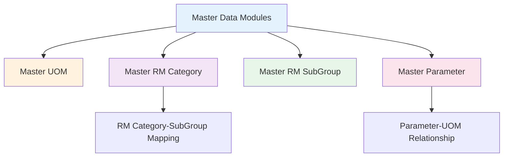
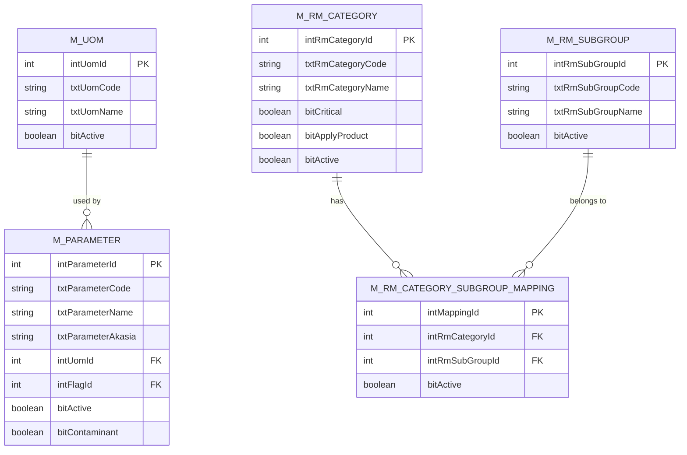

# FUNCTIONAL SPECIFICATION DOCUMENT
## Master Data Modules - RM Selection System

**Document Version:** 1.0  
**Date:** 16 Februari 2026  
**Project:** IDC System - RM Selection Module  
**Module:** Master Data (UOM, RM Category, RM SubGroup, Parameter)

---

## 1. INTRODUCTION

### 1.1 Purpose
Dokumen ini menjelaskan spesifikasi fungsional untuk module-module Master Data dalam sistem IDC (Integrated Data Center) untuk RM Selection. Module-module ini dirancang untuk mengelola data referensi yang digunakan dalam proses evaluasi dan seleksi Raw Material.

### 1.2 Scope
Dokumen ini mencakup 4 master data modules utama:
1. **Master UOM (Unit of Measurement)** - Pengelolaan satuan pengukuran
2. **Master RM Category** - Pengelolaan kategori Raw Material
3. **Master RM SubGroup** - Pengelolaan sub-group Raw Material
4. **Master Parameter** - Pengelolaan parameter testing dan evaluasi

### 1.3 Definitions and Acronyms

| Term | Definition |
|------|------------|
| UOM | Unit of Measurement (Satuan Pengukuran) |
| RM | Raw Material (Bahan Baku) |
| IDC | Integrated Data Center |
| CRUD | Create, Read, Update, Delete |
| LOV | List of Values |

---

## 2. SYSTEM OVERVIEW

### 2.1 Module Architecture



### 2.2 Module Relationships



---

## 3. MASTER UOM (UNIT OF MEASUREMENT)

### 3.1 Overview
Master UOM mengelola satuan pengukuran yang digunakan dalam sistem untuk parameter testing, spesifikasi produk, dan evaluasi Raw Material.

### 3.2 UOM Index Page

**Page:** `MasterUOMIndex.html`  
**Purpose:** Menampilkan daftar semua UOM yang terdaftar dalam sistem

**Features:**
1. **Data Grid Display**
   - Kolom: UOM Code, UOM Name, Active Status, Action
   - Sortable & searchable
   - Pagination support

2. **Action Buttons**
   - **Create New** - Create new UOM
   - **Edit** - Edit existing UOM

**Sample Data:**
```
UOM Code: Kg
UOM Name: Kilogram
Active: Yes
```

**Common UOM Categories:**
1. **Weight/Mass:** Kg, g, mg, mcg, µg
2. **Volume:** l, ml, cc
3. **Percentage:** %, % b/v, % b/b, %ww
4. **Concentration:** ppm, ppb, mg/kg, µg/kg, mg/L
5. **Microbiological:** cfu/gr, cfu/ml, MPN, /g, /ml
6. **Dimension:** m, cm, mm, µm, Micron, Mesh
7. **Per 100 units:** mg/100gr, g/100ml, IU/100gr
8. **Energy:** KKal
9. **Special:** Brix, deg, Qualitative, nil

### 3.3 UOM Detail Page

**Page:** `MasterUOMDetail.html`  
**Purpose:** Form untuk create/edit UOM

**Form Fields:**

| Field Name | Field Type | Required | Validation | Description |
|------------|------------|----------|------------|-------------|
| UOM Code | Text Input | Yes | Unique, Max 50 chars | Kode satuan pengukuran |
| UOM Name | Text Input | Yes | Max 200 chars | Nama satuan pengukuran |
| Active | Checkbox | No | Boolean | Status aktif/non-aktif |

**Validation Rules:**
1. UOM Code wajib diisi dan harus unique
2. UOM Name wajib diisi
3. UOM Code case-sensitive (Kg ≠ kg)
4. Default Active = True

**Business Rules:**
- UOM yang sudah digunakan dalam Parameter tidak dapat dihapus
- Inactive UOM tidak dapat dipilih dalam form Parameter baru
- UOM Code harus mengikuti standard internasional (SI units, imperial units, dll)

---

## 4. MASTER RM CATEGORY

### 4.1 Overview
Master RM Category mengelola kategori Raw Material berdasarkan jenis dan fungsi bahan baku. Setiap kategori dapat memiliki multiple sub-groups.

### 4.2 RM Category Index Page

**Page:** `RMCategoryIndex.html`  
**Purpose:** Menampilkan daftar kategori Raw Material

**Features:**
1. **Data Grid Display**
   - Kolom: RM Category Code, RM Category Name, Active Status, Action
   - Sortable & searchable

2. **Action Buttons**
   - **Create New** - Create new RM Category
   - **Edit** - Edit existing RM Category
   - **Sub Group** - Manage SubGroup mapping untuk category

**Sample Data:**
```
RM Category Code: A0
RM Category Name: Dairy and its derivatives
Active: Yes
```

**Standard RM Categories:**
- **A0/A1:** Dairy Products
- **B0/B1:** Carbohydrate, sugar, & Fiber
- **C0/C1:** Fat (non dairy) and its derivatives
- **D0/D1:** Protein (non dairy) and its derivatives
- **E0:** Flavouring
- **F0/F2:** Vitamins & Minerals
- **G0:** Food Additives
- **H0:** Fruits & Vegetables
- **I0/I1/I2:** Active Ingredient / Probiotic
- **J0:** Seasoning, Spices, Herbs & Extracts
- **K0:** Grains & Cereals
- **L1:** Meat and fish products
- **M0:** Cocoa, Coffee & Tea
- **N0:** Base Ingredient

### 4.3 RM Category Detail Page

**Page:** `RMCategoryDetail.html`  
**Purpose:** Form untuk create/edit RM Category

**Form Fields:**

| Field Name | Field Type | Required | Validation | Description |
|------------|------------|----------|------------|-------------|
| RM Category Code | Text Input | Yes | Unique, Max 10 chars | Kode kategori RM |
| RM Category Name | Text Input | Yes | Max 200 chars | Nama kategori RM |
| Critical | Checkbox | No | Boolean | Menandakan kategori critical |
| Apply Product | Checkbox | No | Boolean | Kategori applicable untuk produk |
| Active | Checkbox | No | Boolean | Status aktif/non-aktif |

**Field Descriptions:**

**Critical Flag:**
- Menandakan bahwa RM dalam kategori ini adalah critical ingredient
- Critical RM memerlukan approval tambahan
- Contoh: Active Ingredient, Probiotic

**Apply Product Flag:**
- Menandakan bahwa kategori ini applicable untuk produk tertentu
- Digunakan untuk filtering dalam product formulation
- Contoh: Dairy Products untuk produk susu

**Validation Rules:**
1. RM Category Code wajib diisi dan harus unique
2. RM Category Name wajib diisi
3. Code format: [A-Z][0-9] (contoh: A0, B1, F2)
4. Default Active = True, Critical = False, Apply Product = False

### 4.4 RM Category-SubGroup Mapping Page

**Page:** `RMCategorySubGroupMapping.html`  
**Purpose:** Mapping relasi many-to-many antara RM Category dan SubGroup

**Page Structure:**

**Section 1: RM Category Header (Read-Only)**
- RM Category Code
- RM Category Name
- Active Status

**Section 2: SubGroup Mapping Table**

**Table Columns:**
- Action (Delete button)
- Sub Group Code (with search button)
- Sub Group Name (readonly)
- Active (checkbox)

**Features:**

1. **Add SubGroup**
   - Button: "Add RM Sub Group"
   - Opens modal untuk select SubGroup
   - New row prepended to top of table

2. **Search SubGroup Modal**
   - Real-time search/filter
   - Filter by Code OR Name
   - Select button untuk memilih SubGroup

3. **Delete SubGroup**
   - Instant delete (no confirmation)
   - Remove row dari table

4. **Bulk Save**
   - Save all mappings sekaligus
   - Transaction: All or nothing

**Sample Mapping:**
```
RM Category: A0 - Dairy and its derivatives
SubGroups:
  1. SMP - Skim Milk Powder (Active)
  2. WMP - Whole Milk Powder (Active)
  3. CAS - Caseinate (Active)
  4. WPC - Whey Protein Concentrate (Active)
```

**Validation Rules:**
1. Tidak boleh duplicate SubGroup dalam satu Category
2. Minimal harus ada 1 SubGroup untuk save
3. SubGroup Code dan Name wajib diisi (via search)

---

## 5. MASTER RM SUBGROUP

### 5.1 Overview
Master RM SubGroup mengelola sub-kategori dari Raw Material. SubGroup memberikan klasifikasi yang lebih detail dari Category.

### 5.2 RM SubGroup Index Page

**Page:** `RMSubGroupIndex.html`  
**Purpose:** Menampilkan daftar RM SubGroup

**Features:**
1. **Data Grid Display**
   - Kolom: RM Sub Group Code, RM Sub Group Name, Active Status, Action
   - Sortable & searchable

2. **Action Buttons**
   - **Create New** - Create new RM SubGroup
   - **Edit** - Edit existing RM SubGroup

**Sample Data:**
```
RM Sub Group Code: SMP
RM Sub Group Name: Skim Milk Powder
Active: Yes
```

**Common SubGroups by Category:**

**Dairy (A0/A1):**
- SMP - Skim Milk Powder
- WMP - Whole Milk Powder
- CAS - Caseinate
- MPC - Milk Protein Concentrate
- WPC - Whey Protein Concentrate
- WPH - Whey Protein Hydrolisate
- LAC - Lactose
- CHE - Cheese

**Vitamins & Minerals (F0/F2):**
- VIA - Vit A
- VIB - Vit B
- VIC - Vit C
- VID - Vit D
- VIE - Vit E
- CAL - Calcium
- IRO - Iron
- ZIN - Zinc

**Carbohydrate (B0/B1):**
- SUG - Sugar
- MAL - Maltodextrine
- LAC - Lactose
- FIB - Fiber
- STA - Starches

**Fat (C0/C1):**
- FPO - Fat Powder
- VOI - Vegetable Oil
- DHA - Docosahexaenoic Acid
- ARA - Arachidonic Acid

**Food Additives (G0):**
- TAS - Thickener and Stabilizer
- AOX - Antioxidant
- EMU - Emulsifier
- SWE - Sweetener
- COL - Colorant
- PRE - Preservatives

### 5.3 RM SubGroup Detail Page

**Page:** `RMSubGroupDetail.html`  
**Purpose:** Form untuk create/edit RM SubGroup

**Form Fields:**

| Field Name | Field Type | Required | Validation | Description |
|------------|------------|----------|------------|-------------|
| RM Sub Group Code | Text Input | Yes | Unique, Max 10 chars | Kode sub-group RM |
| RM Sub Group Name | Text Input | Yes | Max 200 chars | Nama sub-group RM |
| Active | Checkbox | No | Boolean | Status aktif/non-aktif |

**Validation Rules:**
1. RM Sub Group Code wajib diisi dan harus unique
2. RM Sub Group Name wajib diisi
3. Code format: 2-4 uppercase letters (contoh: SMP, WPC, DHA)
4. Default Active = True

**Business Rules:**
- SubGroup yang sudah di-map ke Category tidak dapat dihapus
- Inactive SubGroup tidak dapat di-assign ke Category baru
- SubGroup dapat belong to multiple Categories

---

## 6. MASTER PARAMETER

### 6.1 Overview
Master Parameter mengelola parameter testing dan evaluasi yang digunakan dalam proses quality control dan evaluasi Raw Material.

### 6.2 Parameter Index Page

**Page:** `ParameterIndex.html`  
**Purpose:** Menampilkan daftar parameter testing

**Features:**
1. **Data Grid Display**
   - Kolom: Parameter Code, Parameter Name, Active Status, Action
   - Sortable & searchable

2. **Action Buttons**
   - **Create New** - Create new Parameter
   - **Edit** - Edit existing Parameter

**Sample Data:**
```
Parameter Code: 301
Parameter Name: P. aeruginosa
Active: Yes
```

**Parameter Categories:**

**1. Microbiological Parameters:**
- Standard Plate Count (cfu/gr, cfu/ml)
- Coliform (cfu/gr, cfu/ml, MPN)
- E. Coli (MPN/gr, MPN/ml)
- Yeast & Mould (cfu/gr, cfu/ml)
- Salmonella (/25g, /25ml)
- S. Aureus (cfu/gr, cfu/ml, MPN)
- Bacillus cereus (cfu/gr, cfu/ml, MPN)
- Total Probiotic
- Bifidobacteria

**2. Nutritional Parameters:**
- Moisture
- Ash
- Protein
- Fat
- Carbohydrate
- Total Sugar
- Dietary Fiber
- Energy

**3. Vitamins:**
- VIT A, D, E, K, C
- VIT B1-B12
- Biotin, Folic Acid, Choline
- Beta Carotene

**4. Minerals:**
- Calcium, Iron, Zinc
- Sodium, Potassium, Magnesium
- Phosphorus, Selenium, Copper
- Chromium, Iodine, Manganese

**5. Fatty Acids:**
- Saturated Fatty Acid
- Trans Fatty Acid
- PUFA, MUFA, MCT
- Linoleic Acid, Alpha Linoleic Acid
- EPA, DHA, AA

**6. Amino Acids:**
- Lysine, Leucine, Isoleucine
- Valine, Threonine, Methionine
- Phenylalanine, Tryptophan
- Arginine, Histidine
- Taurine, Carnitine

**7. Contaminants:**
- Heavy Metals (Pb, Cd, Hg, As)
- Aflatoxin (B1, M1, Total)
- Dioxin & Furan
- PAH, Benzo(a)pyrene
- Pesticide Residues

**8. Other Parameters:**
- pH
- Acidity
- Peroxide Value
- Free Fatty Acid
- Moisture
- Ash

### 6.3 Parameter Detail Page

**Page:** `ParameterDetail.html`  
**Purpose:** Form untuk create/edit Parameter

**Form Fields:**

| Field Name | Field Type | Required | Validation | Description |
|------------|------------|----------|------------|-------------|
| Parameter Code | Text Input | Yes | Unique, Max 10 chars | Kode parameter (auto-generated) |
| Parameter Name | Text Input | Yes | Max 200 chars | Nama parameter |
| Parameter AKASIA | Text Input | No | Max 200 chars | Nama parameter di sistem AKASIA |
| Unit of Measure | LOV (UOM) | Yes | Must exist in M_UOM | Satuan pengukuran |
| Flag | LOV | No | - | Flag kategori parameter |
| Active | Checkbox | No | Boolean | Status aktif |
| Contaminant | Checkbox | No | Boolean | Menandakan parameter contaminant |

**Field Descriptions:**

**Parameter Code:**
- Auto-generated sequential number
- Format: 3-digit number (001, 002, ..., 999)
- Readonly saat edit

**Parameter AKASIA:**
- Mapping ke sistem legacy AKASIA
- Optional field
- Digunakan untuk data migration/integration

**Unit of Measure:**
- LOV dari Master UOM
- Search modal dengan filter
- Wajib diisi

**Flag:**
- Kategori parameter (Nutritional, Microbiological, Contaminant, dll)
- LOV dari Master Flag (belum diimplementasikan dalam prototype)

**Contaminant Flag:**
- Menandakan parameter adalah contaminant
- Contaminant parameters memerlukan special handling
- Contoh: Heavy metals, Aflatoxin, Pesticides

**Validation Rules:**
1. Parameter Code unique dan auto-generated
2. Parameter Name wajib diisi
3. UOM wajib dipilih dari LOV
4. Default Active = True, Contaminant = False

**UOM Selection:**
- Modal popup dengan search functionality
- Real-time filter by Code OR Name
- Select button untuk memilih UOM
- Selected UOM ditampilkan di form

---

## 7. DATABASE SPECIFICATIONS

### 7.1 Table: M_UOM

**Purpose:** Menyimpan master Unit of Measurement

**Columns:**

| Column Name | Data Type | Length | Nullable | Default | Description |
|-------------|-----------|--------|----------|---------|-------------|
| intUomId | INT | - | No | Auto | Primary Key |
| txtUomCode | VARCHAR | 50 | No | - | Kode UOM |
| txtUomName | VARCHAR | 200 | No | - | Nama UOM |
| bitActive | BIT | - | No | 1 | Status aktif |
| txtCreatedBy | VARCHAR | 50 | No | - | User pembuat |
| dtCreatedDate | DATETIME | - | No | GETDATE() | Tanggal dibuat |
| txtModifiedBy | VARCHAR | 50 | Yes | NULL | User terakhir modifikasi |
| dtModifiedDate | DATETIME | Yes | NULL | Tanggal terakhir modifikasi |

**Indexes:**
- PRIMARY KEY: intUomId
- UNIQUE INDEX: txtUomCode
- INDEX: bitActive

### 7.2 Table: M_RM_CATEGORY

**Purpose:** Menyimpan master kategori Raw Material

**Columns:**

| Column Name | Data Type | Length | Nullable | Default | Description |
|-------------|-----------|--------|----------|---------|-------------|
| intRmCategoryId | INT | - | No | Auto | Primary Key |
| txtRmCategoryCode | VARCHAR | 10 | No | - | Kode kategori RM |
| txtRmCategoryName | VARCHAR | 200 | No | - | Nama kategori RM |
| bitCritical | BIT | - | No | 0 | Flag critical ingredient |
| bitApplyProduct | BIT | - | No | 0 | Flag apply to product |
| bitActive | BIT | - | No | 1 | Status aktif |
| txtCreatedBy | VARCHAR | 50 | No | - | User pembuat |
| dtCreatedDate | DATETIME | - | No | GETDATE() | Tanggal dibuat |
| txtModifiedBy | VARCHAR | 50 | Yes | NULL | User terakhir modifikasi |
| dtModifiedDate | DATETIME | Yes | NULL | Tanggal terakhir modifikasi |

**Indexes:**
- PRIMARY KEY: intRmCategoryId
- UNIQUE INDEX: txtRmCategoryCode
- INDEX: bitActive, bitCritical

### 7.3 Table: M_RM_SUBGROUP

**Purpose:** Menyimpan master sub-group Raw Material

**Columns:**

| Column Name | Data Type | Length | Nullable | Default | Description |
|-------------|-----------|--------|----------|---------|-------------|
| intRmSubGroupId | INT | - | No | Auto | Primary Key |
| txtRmSubGroupCode | VARCHAR | 10 | No | - | Kode sub-group RM |
| txtRmSubGroupName | VARCHAR | 200 | No | - | Nama sub-group RM |
| bitActive | BIT | - | No | 1 | Status aktif |
| txtCreatedBy | VARCHAR | 50 | No | - | User pembuat |
| dtCreatedDate | DATETIME | - | No | GETDATE() | Tanggal dibuat |
| txtModifiedBy | VARCHAR | 50 | Yes | NULL | User terakhir modifikasi |
| dtModifiedDate | DATETIME | Yes | NULL | Tanggal terakhir modifikasi |

**Indexes:**
- PRIMARY KEY: intRmSubGroupId
- UNIQUE INDEX: txtRmSubGroupCode
- INDEX: bitActive

### 7.4 Table: M_RM_CATEGORY_SUBGROUP_MAPPING

**Purpose:** Mapping relasi many-to-many antara Category dan SubGroup

**Columns:**

| Column Name | Data Type | Length | Nullable | Default | Description |
|-------------|-----------|--------|----------|---------|-------------|
| intMappingId | INT | - | No | Auto | Primary Key |
| intRmCategoryId | INT | - | No | - | Foreign Key ke M_RM_CATEGORY |
| intRmSubGroupId | INT | - | No | - | Foreign Key ke M_RM_SUBGROUP |
| bitActive | BIT | - | No | 1 | Status aktif |
| txtCreatedBy | VARCHAR | 50 | No | - | User pembuat |
| dtCreatedDate | DATETIME | - | No | GETDATE() | Tanggal dibuat |
| txtModifiedBy | VARCHAR | 50 | Yes | NULL | User terakhir modifikasi |
| dtModifiedDate | DATETIME | Yes | NULL | Tanggal terakhir modifikasi |

**Indexes:**
- PRIMARY KEY: intMappingId
- FOREIGN KEY: intRmCategoryId REFERENCES M_RM_CATEGORY(intRmCategoryId)
- FOREIGN KEY: intRmSubGroupId REFERENCES M_RM_SUBGROUP(intRmSubGroupId)
- UNIQUE INDEX: (intRmCategoryId, intRmSubGroupId)
- INDEX: bitActive

### 7.5 Table: M_PARAMETER

**Purpose:** Menyimpan master parameter testing

**Columns:**

| Column Name | Data Type | Length | Nullable | Default | Description |
|-------------|-----------|--------|----------|---------|-------------|
| intParameterId | INT | - | No | Auto | Primary Key |
| txtParameterCode | VARCHAR | 10 | No | - | Kode parameter |
| txtParameterName | VARCHAR | 200 | No | - | Nama parameter |
| txtParameterAkasia | VARCHAR | 200 | Yes | NULL | Nama parameter di AKASIA |
| intUomId | INT | - | No | - | Foreign Key ke M_UOM |
| intFlagId | INT | - | Yes | NULL | Foreign Key ke M_FLAG |
| bitActive | BIT | - | No | 1 | Status aktif |
| bitContaminant | BIT | - | No | 0 | Flag contaminant |
| txtCreatedBy | VARCHAR | 50 | No | - | User pembuat |
| dtCreatedDate | DATETIME | - | No | GETDATE() | Tanggal dibuat |
| txtModifiedBy | VARCHAR | 50 | Yes | NULL | User terakhir modifikasi |
| dtModifiedDate | DATETIME | Yes | NULL | Tanggal terakhir modifikasi |

**Indexes:**
- PRIMARY KEY: intParameterId
- UNIQUE INDEX: txtParameterCode
- FOREIGN KEY: intUomId REFERENCES M_UOM(intUomId)
- INDEX: bitActive, bitContaminant

---

## 8. BUSINESS RULES

### 8.1 Master UOM Rules

1. **Uniqueness**
   - UOM Code harus unique (case-sensitive)
   - Kg ≠ kg ≠ KG

2. **Deletion Rules**
   - Cannot delete UOM yang sudah digunakan dalam Parameter
   - Soft delete (set bitActive = 0)

3. **Standard Compliance**
   - UOM Code harus mengikuti standard internasional
   - SI units preferred (kg, g, l, ml)

### 8.2 Master RM Category Rules

1. **Code Format**
   - Format: [A-Z][0-9] (contoh: A0, B1, F2)
   - Single letter + single digit

2. **Critical Flag**
   - Critical categories require additional approval
   - Examples: Active Ingredient (I0), Probiotic (I1)

3. **Apply Product Flag**
   - Used for product formulation filtering
   - Examples: Dairy (A0) for milk products

4. **SubGroup Requirement**
   - Each active Category should have at least 1 SubGroup
   - Warning if Category has no SubGroups

### 8.3 Master RM SubGroup Rules

1. **Code Format**
   - 2-4 uppercase letters
   - Descriptive abbreviation (SMP, WPC, DHA)

2. **Many-to-Many Relationship**
   - SubGroup can belong to multiple Categories
   - Example: LAC (Lactose) can be in both Dairy (A0) and Carbohydrate (B0)

3. **Deletion Rules**
   - Cannot delete SubGroup yang sudah di-map ke Category
   - Cannot delete SubGroup yang sudah digunakan dalam RM Master

### 8.4 Master Parameter Rules

1. **Code Generation**
   - Auto-generated sequential number
   - Format: 001, 002, ..., 999
   - Cannot be manually edited

2. **UOM Requirement**
   - Every Parameter must have UOM
   - UOM must be active

3. **Contaminant Flag**
   - Contaminant parameters require special handling
   - Examples: Heavy metals, Mycotoxins, Pesticides
   - Contaminants have stricter acceptance criteria

4. **AKASIA Integration**
   - Parameter AKASIA field untuk legacy system mapping
   - Optional but recommended untuk data migration

---

## 9. API SPECIFICATIONS

### 9.1 Master UOM APIs

```
GET /api/master/uom
GET /api/master/uom/{id}
POST /api/master/uom
PUT /api/master/uom/{id}
DELETE /api/master/uom/{id}
```

### 9.2 Master RM Category APIs

```
GET /api/master/rm-category
GET /api/master/rm-category/{id}
POST /api/master/rm-category
PUT /api/master/rm-category/{id}
DELETE /api/master/rm-category/{id}
GET /api/master/rm-category/{id}/subgroups
POST /api/master/rm-category/{id}/subgroups (bulk save)
```

### 9.3 Master RM SubGroup APIs

```
GET /api/master/rm-subgroup
GET /api/master/rm-subgroup/{id}
POST /api/master/rm-subgroup
PUT /api/master/rm-subgroup/{id}
DELETE /api/master/rm-subgroup/{id}
```

### 9.4 Master Parameter APIs

```
GET /api/master/parameter
GET /api/master/parameter/{id}
POST /api/master/parameter
PUT /api/master/parameter/{id}
DELETE /api/master/parameter/{id}
GET /api/master/parameter/by-category/{category}
```

---

## 10. USER INTERFACE SPECIFICATIONS

### 10.1 Common UI Elements

**Table Styling:**
- Striped rows
- Hover effect
- Bordered
- Responsive (horizontal scroll on mobile)

**Form Layout:**
- Label width: 2 columns (col-md-2)
- Input width: 10 columns (col-md-10)
- Horizontal form layout

**Buttons:**
- Primary: Blue (#0d6efd)
- Success: Green (#198754)
- Warning: Orange (#ffc107)
- Danger: Red (#dc3545)
- Info: Cyan (#0dcaf0)

**Icons:**
- Create: `fas fa-plus`
- Edit: `fas fa-edit`
- Delete: `fas fa-minus-circle`
- Save: `fas fa-save`
- Back: `fas fa-arrow-left`
- Search: `fas fa-search`

### 10.2 LOV Modal Pattern

**Standard LOV Modal Features:**
1. Search input dengan real-time filter
2. Table dengan kolom: Action, Code, Name
3. Select button di setiap row
4. Max height 400px dengan scroll
5. Filter by Code OR Name (case-insensitive)

**Implementation:**
```javascript
function openLOV() {
    if (!modal) modal = new bootstrap.Modal(document.getElementById('lovModal'));
    populateModal();
    modal.show();
}

function populateModal(filter = '') {
    const filtered = data.filter(d => 
        d.code.toLowerCase().includes(filter.toLowerCase()) || 
        d.name.toLowerCase().includes(filter.toLowerCase())
    );
    // Render filtered data
}

function selectItem(data) {
    // Populate form fields
    modal.hide();
}
```

---

## 11. VALIDATION & ERROR HANDLING

### 11.1 Client-Side Validation

**Required Field:**
```javascript
if (!field.value) {
    showError("Field is required");
    return false;
}
```

**Uniqueness Check:**
```javascript
const exists = await checkUniqueness(code);
if (exists) {
    showError("Code already exists");
    return false;
}
```

### 11.2 Server-Side Validation

**Validation Rules:**
1. Repeat all client-side validations
2. SQL injection prevention
3. XSS prevention
4. CSRF token validation

**Error Response Format:**
```json
{
  "success": false,
  "message": "Validation failed",
  "errors": [
    {
      "field": "txtUomCode",
      "message": "UOM Code already exists"
    }
  ]
}
```

---

## 12. SECURITY & PERFORMANCE

### 12.1 Security
- Role-based access control (RBAC)
- Audit trail untuk semua CRUD operations
- Input sanitization
- SQL injection prevention

### 12.2 Performance
- Database indexing
- Caching untuk master data
- Lazy loading untuk large datasets
- Pagination: 50 records per page

---

## 13. APPENDIX

### 13.1 Sample Data Counts

| Master | Estimated Records |
|--------|------------------|
| UOM | ~130 records |
| RM Category | ~30 records |
| RM SubGroup | ~200 records |
| Parameter | ~300 records |

### 13.2 Change Log

| Version | Date | Author | Changes |
|---------|------|--------|---------|
| 1.0 | 2026-02-16 | Development Team | Initial FSD creation |

---

**END OF DOCUMENT**
