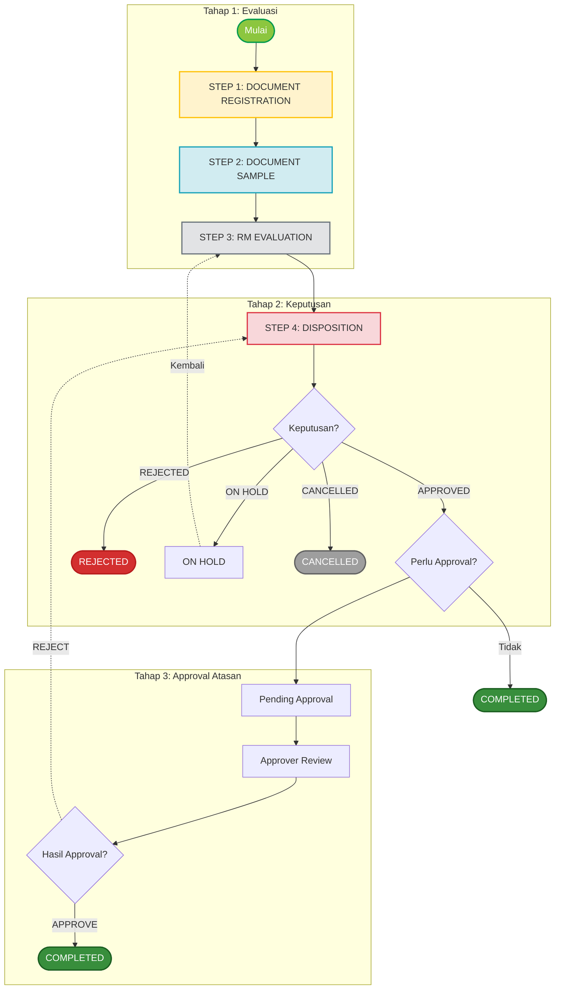
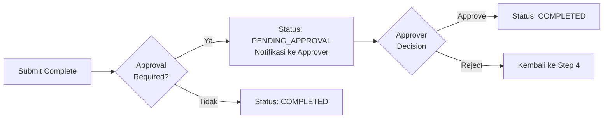
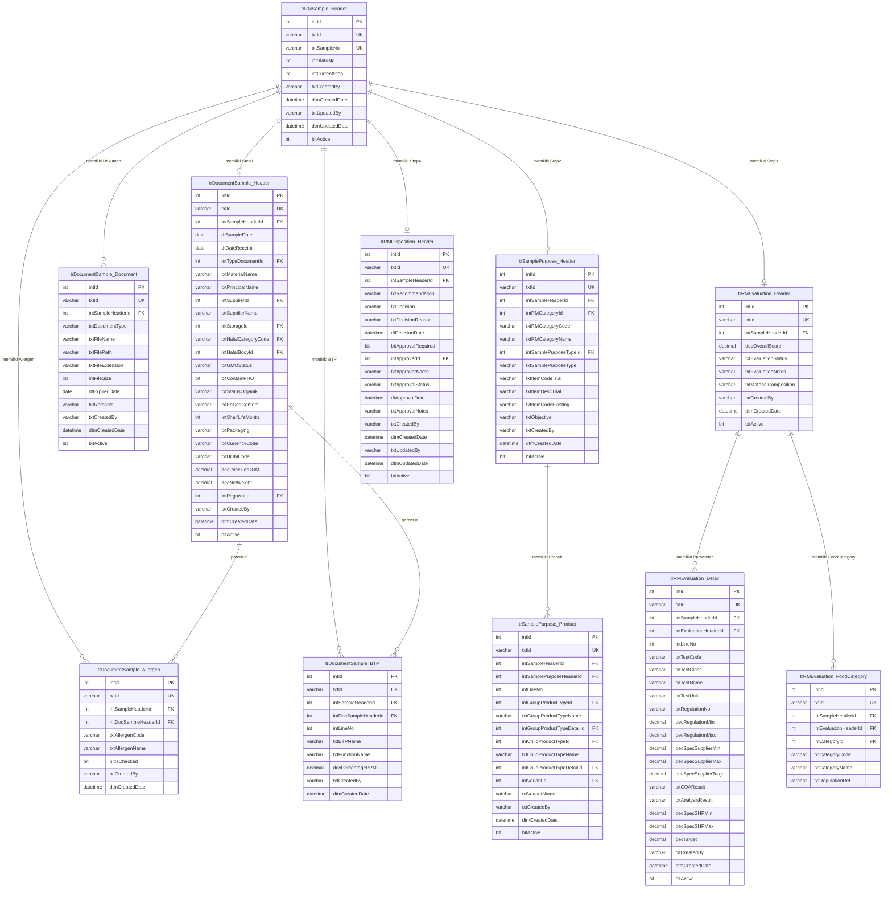
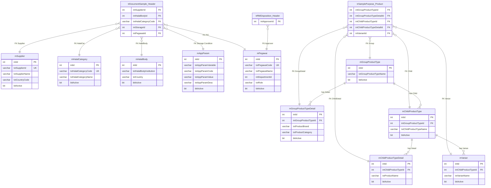
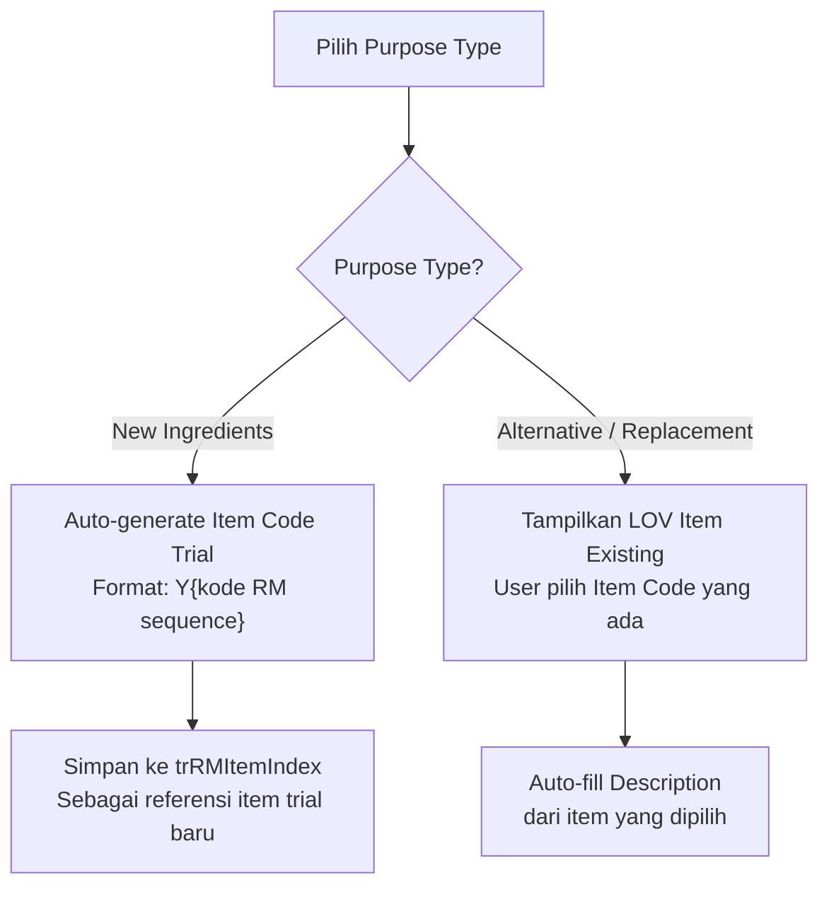

# FUNCTIONAL SPECIFICATION DOCUMENT (FSD)
## Modul: New RM Sample Management
### Sistem: IDC System (New RM Selection)

---

| Atribut          | Keterangan                                           |
|------------------|------------------------------------------------------|
| **Nama Dokumen** | FSD Modul New RM Sample Management                   |
| **Versi**        | 3.1                                                  |
| **Tanggal**      | 9 April 2026                                         |
| **Divisi**       | R&D / Procurement / ICT                              |
| **Status**       | Draft                                                |
| **Dibuat oleh**  | Tim ICT – IDC System                                 |

---

## Riwayat Revisi

| Versi   | Tanggal       | Diubah Oleh     | Keterangan                                                                                  |
|---------|---------------|-----------------|----------------------------------------------------------------------------------------------|
| 1.0     | —             | Tim ICT         | Initial draft                                                                               |
| 1.8     | Feb 2026      | Tim ICT         | Penambahan ERD, DDL scripts, modul RM Database                                              |
| 1.9     | Feb 2026      | Tim ICT         | Update field EG-DEG di Step 3, data LOV dari MAppParam                                     |
| 2.0     | Apr 2026      | Tim ICT         | Penghapusan Shipping Method; penambahan Status Organik & Potensi EG-DEG ke accordion Halal, GMO & PHO |
| 2.1     | Apr 2026      | Tim ICT         | Update informasi I2MS Project No LOV, revisi field Supplier & Material                     |
| **3.1** | **Apr 2026**  | **Tim ICT**     | **Pembahasan detail per accordion, per step, dengan CRUD operation, LOV workflow, dan screenshot UI** |

---

## Daftar Isi

1. [Pendahuluan](#1-pendahuluan)
2. [Ringkasan Business Flow](#2-ringkasan-business-flow)
3. [Halaman Index – New RM Sample](#3-halaman-index--new-rm-sample)
4. [Halaman Detail – Wizard Form 4 Step](#4-halaman-detail--wizard-form-4-step)
   - 4.1 [Step Navigator & Progress Bar](#41-step-navigator--progress-bar)
   - 4.2 [Step 1: Document Registration](#42-step-1-document-registration)
     - 4.2.1 [Accordion A: Header Info (Type Document, Sample No, Tanggal)](#421-accordion-a-header-info)
     - 4.2.2 [Accordion B: Supplier & Material](#422-accordion-b-supplier--material)
     - 4.2.3 [Accordion C: Pricing & Packaging](#423-accordion-c-pricing--packaging)
     - 4.2.4 [Accordion D: Storage & Shelf Life](#424-accordion-d-storage--shelf-life)
     - 4.2.5 [Accordion E: Halal, GMO & PHO](#425-accordion-e-halal-gmo--pho)
     - 4.2.6 [Accordion F: Allergen Information](#426-accordion-f-allergen-information)
     - 4.2.7 [Accordion G: BTP Content](#427-accordion-g-btp-content)
     - 4.2.8 [Accordion H: Project Members (PIC)](#428-accordion-h-project-members-pic)
     - 4.2.9 [Accordion I: Document Attachment](#429-accordion-i-document-attachment)
   - 4.3 [Step 2: Document Sample (Sample Purpose)](#43-step-2-document-sample-sample-purpose)
     - 4.3.1 [Form Header Step 2](#431-form-header-step-2)
     - 4.3.2 [Tabel Apply To Product](#432-tabel-apply-to-product)
     - 4.3.3 [LOV Group Product Modal](#433-lov-group-product-modal)
   - 4.4 [Step 3: RM Evaluation](#44-step-3-rm-evaluation)
   - 4.5 [Step 4: Disposition](#45-step-4-disposition)
5. [Struktur Database](#5-struktur-database)
6. [Aturan Bisnis](#6-aturan-bisnis)
7. [List of Values (LOV) & Referensi Data](#7-list-of-values-lov--referensi-data)
8. [Hak Akses & Peran Pengguna](#8-hak-akses--peran-pengguna)
9. [Notifikasi](#9-notifikasi)
10. [Appendix A – SQL Server DDL Scripts](#appendix-a--sql-server-ddl-scripts)

---

## 1. Pendahuluan

Modul **New RM Sample Management** merupakan modul dalam sistem IDC (Integrated Data Center) untuk mengelola proses pengajuan, evaluasi, dan disposisi sample Raw Material baru dari supplier. Modul ini dirancang untuk menggantikan proses manual yang sebelumnya dilakukan melalui email dan spreadsheet, menjadi alur terstandardisasi dengan workflow yang terstruktur dan terdokumentasi secara digital.

### 1.1 Tujuan Dokumen

Dokumen ini bertujuan untuk:

1. Menjelaskan fungsionalitas lengkap modul New RM Sample Management di sistem IDC.
2. Menjadi acuan pengembangan (*development reference*) bagi tim ICT.
3. Mendeskripsikan alur proses secara detail per accordion / per section, desain layar, struktur database, serta aturan bisnis yang berlaku.
4. Mendokumentasikan field, validasi, dan business rules untuk setiap step workflow secara mendetail.
5. Menyertakan screenshot UI aktual untuk setiap section penting.

### 1.2 Ruang Lingkup

Dokumen ini mencakup dua halaman utama:

1. `NewRMSampleIndex.html` – Halaman daftar & monitoring semua RM Sample
2. `NewRMSampleDetail.html` – Halaman wizard form 4-step untuk input, evaluasi, dan disposisi sample

**Empat Step Workflow:**

| Step | Nama                  | Deskripsi                                                 |
|------|-----------------------|-----------------------------------------------------------|
| 1    | Document Registration | Pendaftaran dan dokumentasi sample RM dari supplier       |
| 2    | Document Sample       | Analisis tujuan dan kebutuhan sample, mapping ke produk   |
| 3    | RM Evaluation         | Testing dan evaluasi teknis sample di laboratorium        |
| 4    | Disposition           | Review final dan keputusan approve / reject / on hold     |

### 1.3 Stakeholder

| Peran                  | Tim / Nama              | Keterlibatan                                               |
|------------------------|-------------------------|-------------------------------------------------------------|
| Business Owner         | Procurement / R&D       | Pemilik proses bisnis, validasi kebutuhan                  |
| ICT Developer          | KN IT                   | Pengembangan dan implementasi                              |
| Sample Requestor (PIC) | Procurement Team        | Menerima sample, dokumentasi awal, koordinasi supplier     |
| R&D Team               | R&D Department          | Analisis purpose, mapping produk, set requirement          |
| Lab / QC Team          | Laboratorium / QC       | Testing sample, validasi compliance, quality scoring       |
| Decision Maker         | Manager / Supervisor    | Review hasil evaluasi, keputusan final (approve/reject)    |
| Approver               | Management              | Final approval untuk sample yang di-approve (jika perlu)  |

---

## 2. Ringkasan Business Flow

### 2.1 Proses As-Is (Manual)

Sebelum sistem IDC, proses evaluasi RM Sample dilakukan secara manual:

| Aspek              | Proses Lama (Manual)                        | Proses Baru (IDC)                              |
|--------------------|---------------------------------------------|------------------------------------------------|
| Pencatatan         | Spreadsheet Excel / Email                   | Database terpusat, web-based                   |
| Tracking           | Manual, tidak real-time                     | Dashboard otomatis, real-time                  |
| Dokumen Pendukung  | File attachment via email                   | Upload langsung ke sistem, per tahap           |
| Audit Trail        | Tidak ada / tidak terstruktur               | Full history log setiap perubahan              |
| Notifikasi         | Manual (email pribadi)                      | Otomatis oleh sistem                           |
| Keputusan          | Verbal / email tidak terstruktur            | Formal disposition dengan timestamp & reason   |

### 2.2 Proses To-Be (Sistem IDC)

#### 2.2.1 Flow Diagram



#### 2.2.2 Status Sample

| Kode               | Label              | Deskripsi                                                              |
|--------------------|--------------------|------------------------------------------------------------------------|
| `DRAFT`            | Draft              | Baru dibuat, wizard belum selesai                                      |
| `PENDING`          | Pending            | Dalam proses evaluasi (salah satu step sedang berjalan)                |
| `PENDING_APPROVAL` | Pending Approval   | Disposisi Approved, menunggu approval atasan                           |
| `COMPLETED`        | Completed          | Semua step selesai, keputusan final sudah diberikan                    |
| `REJECTED`         | Rejected           | Keputusan disposisi adalah Rejected                                    |
| `ON_HOLD`          | On Hold            | Ditunda, menunggu informasi tambahan                                   |
| `CANCELLED`        | Cancelled          | Dibatalkan oleh PIC (hanya saat masih Draft)                          |

---

## 3. Halaman Index – New RM Sample

**Path**: `NewRMSampleIndex.html`

**Tujuan**: Menampilkan semua RM Sample dalam bentuk daftar tabel, dilengkapi dashboard ringkasan berdasarkan workflow stage.

### 3.1 Dashboard Summary Cards

| Card               | Warna               | Isi                                                   |
|--------------------|---------------------|-------------------------------------------------------|
| Total Samples      | Biru (Primary)      | Total semua sample yang terdaftar                     |
| Step 1: Document   | Kuning (Warning)    | Sample yang sedang di tahap dokumentasi               |
| Step 2: Analysis   | Cyan (Info)         | Sample yang sedang di tahap analisis purpose          |
| Step 3: Evaluation | Abu-abu (Secondary) | Sample yang sedang di tahap evaluasi teknis           |
| Completed          | Hijau (Success)     | Sample yang sudah selesai (approved/rejected)         |

### 3.2 Action Bar

| Tombol              | Fungsi                                                              |
|---------------------|---------------------------------------------------------------------|
| Create New Sample   | Arahkan ke halaman Detail dengan wizard fresh (mode Create)         |
| Export Excel        | Export data tabel ke format Excel (.xlsx)                           |

### 3.3 Tabel Daftar Sample

| Kolom          | Sumber Data          | Keterangan                                          |
|----------------|----------------------|-----------------------------------------------------|
| Sample No      | `txtSampleNo`        | Nomor unik sample (format: XXX-R-RM-MM-YY)          |
| Material Name  | `txtMaterialName`    | Nama material/RM yang di-sample                     |
| Supplier Name  | `txtSupplierName`    | Nama supplier yang mengajukan sample                |
| Date           | `dtSubmissionDate`   | Tanggal submission sample                           |
| Workflow Stage | `txtWorkflowStage`   | Tahap workflow saat ini (Badge berwarna)             |
| Status         | `txtStatus`          | Status sample (Badge warna sesuai status)           |
| Action         | —                    | Dropdown: Edit / View / Delete                      |

### 3.4 Business Rules Index

| Status Sample    | Tombol Action | Keterangan                                            |
|------------------|---------------|-------------------------------------------------------|
| Draft            | Edit / Delete | Bisa diedit dan dihapus (soft delete)                 |
| Pending          | Edit          | Bisa diedit (lanjutkan wizard)                        |
| Completed        | View          | Read-only, tidak bisa diedit atau dihapus             |
| Rejected         | View          | Read-only                                             |
| On Hold          | Edit          | Bisa diedit untuk kembali ke Step 3                   |

---

## 4. Halaman Detail – Wizard Form 4 Step

**Path**: `NewRMSampleDetail.html`

**Tujuan**: Form wizard 4 step untuk mengelola lifecycle lengkap RM Sample dari dokumentasi hingga disposition.

---

### 4.1 Step Navigator & Progress Bar

> Screenshot: Step Navigator (Header Wizard)


**Deskripsi**: Di bagian atas halaman detail terdapat progress bar wizard 4 langkah. Setiap step memiliki:
- **Nomor Step** (1, 2, 3, 4)
- **Ikon** yang mewakili konten (file, flask, clipboard, check)
- **Label** nama step

**Perilaku:**
- Step yang sudah dilewati ditampilkan sebagai **completed** (ikon centang, warna hijau)
- Step aktif ditampilkan sebagai **active** (warna biru, tebal)
- Step yang belum dicapai ditampilkan sebagai **inactive** (abu-abu)
- User **tidak dapat** melompat ke step depan yang belum dilalui
- User **dapat** kembali ke step sebelumnya kapan saja

**Tombol Navigasi Bawah Halaman:**

| Tombol          | Visibilitas      | Fungsi                                                |
|-----------------|------------------|-------------------------------------------------------|
| Previous        | Step 2, 3, 4     | Kembali ke step sebelumnya (data tersimpan sementara) |
| Next Step       | Step 1, 2, 3     | Lanjut ke step berikutnya (validasi mandatory dulu)   |
| Save Draft      | Semua Step       | Simpan sebagai draft, lanjutkan nanti                 |
| Submit Complete | Step 4 saja      | Submit final, ubah status ke Completed/Pending Approval |
| Back to Index   | Semua Step       | Kembali ke halaman Index tanpa mengubah data          |

---

### 4.2 Step 1: Document Registration

**Fungsi Utama:**
- Mendokumentasikan informasi dasar sample RM dari supplier
- Input data supplier, material, pricing, quantity, informasi Halal-GMO-Organik
- Upload dokumen pendukung (COA, MSDS, Spec Sheet, dll)

Step 1 terdiri dari beberapa **accordion** yang dapat di-expand dan di-collapse secara independen. Beberapa accordion wajib diisi sebelum user dapat lanjut ke Step 2.

---

#### 4.2.1 Accordion A: Header Info

**Lokasi**: Bagian paling atas Step 1, selalu terbuka (tidak bisa di-collapse).

> Screenshot: Step 1 – Supplier & Material (Full View termasuk Header)


**Field-field Header:**

| Field Name      | ID Elemen           | Tipe          | Mandatory | Validasi              | Keterangan                                                    |
|-----------------|---------------------|---------------|-----------|-----------------------|---------------------------------------------------------------|
| Type Document   | `txtTypeDocument`   | Dropdown/LOV  | Ya        | Harus dipilih         | Jenis dokumen: New Material / Replacement / Alternative       |
| Sample No       | `txtSampleNo`       | Text (Read-only) | Auto   | Auto-generated        | Nomor unik sample, format: `{DEPT}-R-RM-{MM}-{YY}`           |
| I2MS Project No | `txtI2MSProjectNo`  | LOV Modal     | Tidak     | Opsional              | Nomor proyek I2MS terkait — dipilih via modal popup           |
| Sample Date     | `sampleDate`        | Date Picker   | Ya        | Format: DD/MM/YYYY    | Tanggal sample dibuat                                         |
| Date of Receipt | `receiptDate`       | Date Picker   | Ya        | Format: DD/MM/YYYY    | Tanggal penerimaan fisik sample dari supplier                 |

**Operasi CRUD:**

| Operasi | Keterangan                                                     |
|---------|----------------------------------------------------------------|
| Create  | Semua field kosong, `txtSampleNo` di-generate otomatis oleh sistem |
| Read    | Field terisi dengan data yang sudah tersimpan                  |
| Update  | Semua field bisa diedit kecuali `txtSampleNo`                  |
| Delete  | Tidak ada delete per field — delete sample dilakukan dari Index |

**LOV: I2MS Project No**

Saat user klik tombol search di sebelah field I2MS Project No, sebuah modal popup akan muncul menampilkan daftar nomor proyek I2MS. User memilih satu, lalu nomor proyek ter-isi otomatis.

| Kolom di LOV   | Keterangan                         |
|----------------|------------------------------------|
| Project No     | Nomor proyek I2MS                  |
| Project Name   | Nama proyek                        |
| Year           | Tahun proyek                       |
| Action         | Tombol Select                      |

---

#### 4.2.2 Accordion B: Supplier & Material

**Deskripsi**: Accordion untuk mencatat identitas material dan supplier yang mengajukan sample.

> Screenshot: Step 1 – Supplier & Material


**Field Detail:**

| Field Name   | ID Elemen                          | Tipe       | Mandatory | Validasi               | Keterangan                                        |
|--------------|------------------------------------|------------|-----------|------------------------|---------------------------------------------------|
| Material Name| `materialName`                     | Text       | Ya        | Min 3, Max 200 char    | Nama material/RM yang di-sample                   |
| Supplier     | `DocumentSample_txtSupplierName`   | LOV Modal  | Ya        | Harus dipilih dari LOV | Supplier yang mengajukan sample                   |
| Principal    | `principalName`                    | Text       | Tidak     | Max 200 char           | Nama manufacturer / principal                     |
| Country      | `DocumentSample_txtCountryName`    | LOV Modal  | Tidak     | Opsional               | Negara manufaktur                                 |
| Plant Site   | `plantSite`                        | Text       | Tidak     | Max 200 char           | Lokasi pabrik                                     |

**Operasi CRUD:**

| Operasi | Keterangan                                                                |
|---------|---------------------------------------------------------------------------|
| Create  | User mengisi Material Name, memilih Supplier via LOV, isi field opsional  |
| Read    | Data ditampilkan setelah tersimpan                                        |
| Update  | Semua field bisa diedit kapan saja selama status belum Completed          |
| Delete  | Tidak ada delete per field                                                |

**LOV: Supplier**

User klik ikon 🔍 di sebelah field Supplier untuk membuka modal daftar supplier aktif.

| Kolom di LOV   | Keterangan                           |
|----------------|--------------------------------------|
| Supplier Code  | Kode supplier di sistem              |
| Supplier Name  | Nama supplier (bisa search)          |
| Country        | Negara asal supplier                 |
| Action         | Tombol Select                        |

Setelah dipilih, field `DocumentSample_txtSupplierName` ter-isi otomatis.

**LOV: Country**

Modal daftar negara. User bisa ketik untuk filter. Setelah dipilih, field Country ter-isi.

---

#### 4.2.3 Accordion C: Pricing & Packaging

**Deskripsi**: Accordion untuk input informasi harga dan kemasan sample yang diterima.

> Screenshot: Step 1 – Pricing & Packaging


**Field Detail:**

| Field Name  | ID Elemen                        | Tipe      | Mandatory    | Validasi                   | Keterangan                            |
|-------------|----------------------------------|-----------|--------------|----------------------------|---------------------------------------|
| Currency    | `DocumentSample_txtCurrencyName` | LOV Modal | Conditional  | Wajib jika Price diisi     | Mata uang harga (USD, IDR, EUR)       |
| Price       | `price`                          | Number    | Tidak        | Numeric, >= 0              | Harga per satuan UOM                  |
| UOM         | `DocumentSample_txtUOMName`      | LOV Modal | Ya           | Harus dipilih dari LOV     | Unit of Measure (kg, liter, pcs, dll) |
| Packing Size| `netWeight`                      | Number    | Ya           | Numeric, > 0               | Berat bersih sample yang diterima     |
| Packaging   | `packaging`                      | Text      | Tidak        | Max 200 char               | Informasi kemasan (bag, drum, sachet) |

**Business Rule:**
- Jika field **Price** diisi dengan nilai > 0, maka **Currency** menjadi **mandatory**
- UOM wajib diisi, karena berkaitan dengan Packing Size
- Price bisa dikosongkan jika sample diterima gratis (promotional sample)

**Operasi CRUD:**

| Operasi | Keterangan                                                            |
|---------|-----------------------------------------------------------------------|
| Create  | User isi Price (opsional), pilih Currency dan UOM via LOV, isi berat |
| Read    | Data tampil setelah tersimpan                                         |
| Update  | Semua field bisa diedit                                               |
| Delete  | Tidak ada delete per field                                            |

---

#### 4.2.4 Accordion D: Storage & Shelf Life

**Deskripsi**: Accordion untuk mencatat kondisi penyimpanan yang optimal dan masa simpan material.

> Screenshot: Step 1 – Storage & Shelf Life


**Field Detail:**

| Field Name         | ID Elemen                            | Tipe      | Mandatory | Validasi       | Keterangan                                     |
|--------------------|--------------------------------------|-----------|-----------|----------------|------------------------------------------------|
| Storage Condition  | `DocumentSample_txtStorageCondition` | LOV Modal | Ya        | Harus dipilih  | Kondisi penyimpanan (sumber: `mAppParam`)       |
| Shelf Life (Months)| `shelfLife`                          | Number    | Tidak     | Numeric, > 0   | Masa simpan dalam jumlah bulan                 |

> **Catatan v2.0**: Field **Shipping Method** (`shipping`) telah **dihapus** dari accordion ini sejak versi 2.0.

**Sumber Data Storage Condition:**

Data kondisi penyimpanan diambil dari tabel `mAppParam` dengan filter:
```sql
WHERE txtAppParamVariable = 'IDC_STORAGE_CONDITION'
```

Contoh nilai yang tersedia: *Suhu Ruang (25°C)*, *Refrigerated (2–8°C)*, *Frozen (-18°C)*, *Cool & Dry*.

**Operasi CRUD:**

| Operasi | Keterangan                                             |
|---------|--------------------------------------------------------|
| Create  | Pilih Storage Condition via LOV, isi Shelf Life        |
| Read    | Data tampil setelah tersimpan                          |
| Update  | Storage Condition dan Shelf Life bisa diubah           |
| Delete  | Tidak ada delete per field                             |

---

#### 4.2.5 Accordion E: Halal, GMO & PHO

**Deskripsi**: Accordion untuk mencatat status kehalalan, GMO, PHO, Status Organik, dan potensi kandungan EG/DEG material.

> Screenshot: Step 1 – Halal, GMO & PHO


**Field Detail:**

| Field Name                        | ID Elemen                | Tipe             | Mandatory | Validasi               | Keterangan                                                              |
|-----------------------------------|--------------------------|------------------|-----------|------------------------|-------------------------------------------------------------------------|
| Halal Category                    | `Halal_txtHalalDesc`     | LOV Modal        | Tidak     | Opsional               | Kategori halal material (RMFL, RMPF, RMSL)                              |
| Halal Body                        | `Halal_txtHalalBodyInst` | LOV Modal        | Tidak     | Opsional               | Lembaga sertifikasi halal (MUI, JAKIM, MUIS, dll.)                      |
| GMO Status                        | `Halal_txtGMOStatusDesc` | LOV Modal        | Ya        | Harus dipilih          | Status GMO: Non GMO / GMO Free / PCR Negative                           |
| Contains PHO                      | `pho`                    | Dropdown         | Ya        | Yes / No               | Apakah mengandung Partially Hydrogenated Oil                            |
| **Status Organik** *(Baru v2.0)*  | `evalStatusOrganik`      | Dropdown         | Tidak     | NON ORGANIK / ORGANIK  | Status organik material (source: `mAppParam`)                           |
| **Potensi EG DEG** *(Baru v2.0)*  | `evalEgDeg`              | Multi-select     | Tidak     | Pilih satu atau lebih  | N/A, Gliserol, Polietilen Glikol, Propilen Glikol, Sorbitol Cair        |

**Sumber Data LOV:**

| LOV               | Sumber                  | Query                                            |
|-------------------|-------------------------|--------------------------------------------------|
| Halal Category    | Master Halal Category   | `SELECT * FROM mHalalCategory WHERE bitActive=1` |
| Halal Body        | Master Halal Body       | `SELECT * FROM mHalalBody WHERE bitActive=1`     |
| GMO Status        | `mAppParam`             | `WHERE txtAppParamVariable='IDC_GMO_STATUS'`     |
| Status Organik    | `mAppParam`             | `WHERE txtAppParamVariable='IDC_STATUS_ORGANIK'` |
| Potensi EG DEG    | `mAppParam`             | `WHERE txtAppParamVariable='IDC_EG_DEG_OPTION'`  |

**Business Rules:**
- **Contains PHO = Yes** → Sistem akan memblokir proses lebih lanjut dan menampilkan pesan peringatan: *"Contain PHO in Document Sample is YES, Process Terminated!!"*
- **Potensi EG DEG** menggunakan komponen **Select2 multi-select** — user bisa memilih lebih dari satu opsi sekaligus
- Default value untuk Potensi EG DEG: **N/A**
- Nilai EG DEG disimpan sebagai JSON/CSV di kolom `txtEgDegContent`

**Operasi CRUD:**

| Operasi | Keterangan                                                              |
|---------|-------------------------------------------------------------------------|
| Create  | Pilih GMO Status (wajib), isi field lain (opsional)                    |
| Read    | Data tampil setelah tersimpan                                           |
| Update  | Semua field bisa diubah                                                 |
| Delete  | Tidak ada delete per field. Reset via pilihan ulang / kosongkan field   |

---

#### 4.2.6 Accordion F: Allergen Information

**Deskripsi**: Accordion untuk menandai jenis allergen yang terkandung dalam material, sesuai regulasi keamanan pangan.

> Screenshot: Step 1 – Allergen Information


**Cara Pengisian:**
- Ditampilkan dalam bentuk **checklist grid** (multiple checkbox)
- User mencentang allergen yang ada dalam material tersebut
- Tidak ada yang dicentang = material bebas dari semua allergen yang terdaftar

**Daftar Allergen yang Tersedia:**

| Kode Allergen     | Nama Allergen                                          |
|-------------------|--------------------------------------------------------|
| CEREAL_GLUTEN     | Cereals containing Gluten (Wheat, Rye, Barley, Oats)  |
| EGG               | Eggs and egg products                                  |
| FISH              | Fish and fish products                                 |
| PEANUTS           | Peanuts and peanut products                            |
| SOY               | Soybeans and soy products                              |
| MILK              | Milk and milk products (including lactose)             |
| NUTS              | Tree Nuts (Almonds, Cashews, Walnuts, etc.)            |
| CELERY            | Celery and celery products                             |
| MUSTARD           | Mustard and mustard products                           |
| SESAME            | Sesame seeds and sesame products                       |
| SULPHITES         | Sulphur dioxide and sulphites (> 10 mg/kg)             |
| LUPIN             | Lupin and lupin products                               |
| MOLLUSCS          | Molluscs and mollusc products                          |
| CRUSTACEANS       | Crustaceans and crustacean products                    |

**Operasi CRUD:**

| Operasi | Keterangan                                                                                     |
|---------|------------------------------------------------------------------------------------------------|
| Create  | User mencentang allergen yang relevan. Default: semua tidak dicentang (material bebas allergen) |
| Read    | Checkbox menampilkan status yang sudah tersimpan                                               |
| Update  | User bisa centang / uncheck kapan saja                                                         |
| Delete  | Menghapus centang = menghapus allergen dari data. Tidak ada delete per baris                   |

**Penyimpanan:**
- Setiap allergen yang dicentang disimpan sebagai 1 row di tabel `trDocumentSample_Allergen`
- Kolom `bitIsChecked = 1` jika dicentang

---

#### 4.2.7 Accordion G: BTP Content

**Deskripsi**: Accordion untuk mencatat kandungan BTP (Bahan Tambahan Pangan) yang terdapat dalam material sample.

> Screenshot: Step 1 – BTP Content


**Struktur Tabel BTP:**

| Kolom          | Keterangan                                |
|----------------|-------------------------------------------|
| BTP Name       | Nama bahan tambahan pangan (text input)   |
| Function       | Fungsi BTP (Emulsifier, Preservative, dll)|
| PPM (%)        | Persentase kandungan dalam ppm            |
| Action         | Tombol Hapus baris                        |

**Operasi CRUD – BTP Content:**

| Operasi | Cara                                | Keterangan                                                  |
|---------|-------------------------------------|-------------------------------------------------------------|
| **Create** | Klik tombol **+ Add BTP**        | Menambahkan baris baru ke tabel BTP untuk diisi manual      |
| **Read**   | Tabel menampilkan semua baris    | Data diload dari `trDocumentSample_BTP` saat form dibuka    |
| **Update** | Edit langsung di cell tabel      | Setiap field dalam tabel bisa diedit langsung (inline edit) |
| **Delete** | Klik ikon 🗑️ di kolom Action   | Menghapus baris BTP. Konfirmasi diperlukan jika sudah saved |

**Validasi:**
- BTP Name tidak boleh kosong jika row sudah ditambahkan
- PPM harus berupa angka positif
- Tidak ada batasan jumlah baris BTP

**Penyimpanan:**
- Setiap baris BTP disimpan sebagai 1 row di `trDocumentSample_BTP`
- Kolom `intLineNo` untuk urutan baris

---

#### 4.2.8 Accordion H: Project Members (PIC)

**Deskripsi**: Section untuk menampilkan dan mengelola daftar anggota tim proyek yang terlibat dalam evaluasi sample ini. PIC ditentukan berdasarkan departemen yang terlibat.

**Cara Kerja:**
- PIC List ter-populate otomatis berdasarkan **Item Code PM** yang dipilih di Step 2
- Jika Item Code PM belum dipilih, tombol tambah PIC di-disable
- PIC dapat ditambahkan secara manual per departemen
- Setiap departemen memiliki satu assignee (pegawai)

**Struktur Tabel PIC:**

| Kolom       | Keterangan                                      |
|-------------|-------------------------------------------------|
| No          | Nomor urut baris                                |
| Departemen  | Badge nama departemen (dari master departemen)  |
| Assignee    | Dropdown pilihan pegawai di departemen tersebut |
| Action      | Tombol Hapus baris                              |

**Operasi CRUD – Project Members:**

| Operasi | Cara                                        | Keterangan                                                          |
|---------|---------------------------------------------|---------------------------------------------------------------------|
| **Create** | Auto-fill saat Item Code PM dipilih      | Sistem membuat baris PIC per departemen berdasarkan struktur proyek  |
| **Create** | Klik tombol **+ Add PIC** (manual)       | Tambah PIC baru dengan memilih departemen dan assignee              |
| **Read**   | Tabel menampilkan semua PIC terkait      | Diload dari data yang tersimpan                                     |
| **Update** | Ubah dropdown Assignee di baris          | Mengganti pegawai yang ditugaskan                                   |
| **Delete** | Klik ikon 🗑️ di kolom Action            | Hapus anggota tim dari daftar PIC                                   |

**Business Rule:**
- Minimal 1 PIC harus ada sebelum form dapat di-submit ke Step 2
- Assignee yang dipilih akan menerima notifikasi saat sample masuk ke tahap mereka

---

#### 4.2.9 Accordion I: Document Attachment

**Deskripsi**: Section untuk upload dan mengelola dokumen pendukung sample (COA, MSDS, Spec Sheet, Halal Certificate, dll).

> Screenshot: Step 2 – Document Upload (juga tersedia di Step 1)


**Struktur Tabel Dokumen:**

| Kolom         | Keterangan                                                     |
|---------------|----------------------------------------------------------------|
| Document Type | Jenis dokumen (Dropdown: COA, MSDS, Spec Sheet, Halal, dll)    |
| Remarks       | Keterangan tambahan tentang dokumen                            |
| File Name     | Nama file setelah diupload                                     |
| Upload Date   | Tanggal file diupload (auto)                                   |
| Action        | Tombol Preview dan Hapus                                       |

**Format File yang Didukung:**

| Format | Ekstensi                                            |
|--------|-----------------------------------------------------|
| PDF    | `.pdf`                                             |
| Word   | `.doc`, `.docx`                                    |
| Excel  | `.xls`, `.xlsx`                                    |
| Image  | `.jpg`, `.jpeg`, `.png`                            |

**Ukuran maksimum**: **10 MB** per file.

**Operasi CRUD – Document Attachment:**

| Operasi | Cara                                              | Keterangan                                                       |
|---------|---------------------------------------------------|------------------------------------------------------------------|
| **Create** | Pilih Document Type → klik **Browse/Upload**  | Pilih file dari komputer, sistem simpan ke server                |
| **Read**   | Tabel menampilkan semua file yang sudah diupload | File Name bisa diklik untuk preview/download                    |
| **Update** | Tidak ada edit file — upload ulang jika perlu   | Hapus file lama lalu upload yang baru                            |
| **Delete** | Klik ikon 🗑️ di kolom Action                   | Hapus file dari sistem dan database. Hanya bisa jika status Draft/Pending |

**Business Rule:**
- Satu sample boleh memiliki lebih dari satu file
- File yang sudah diupload **tidak bisa diedit** (harus hapus lalu upload ulang)
- File hanya bisa dihapus saat status = **Draft** atau **Pending**
- Setiap file disimpan dengan path server di `trDocumentSample_Document`

---

### 4.3 Step 2: Document Sample (Sample Purpose)

**Fungsi Utama:**
- Mendefinisikan tujuan dan alasan pengajuan sample
- Mapping sample ke product/formula yang akan menggunakan material
- Input informasi RM Category, Purpose Type, dan Item Code

> Screenshot: Step 2 – Full View


---

#### 4.3.1 Form Header Step 2

**Field Detail:**

| Field Name           | ID Elemen              | Tipe      | Mandatory | Validasi                 | Keterangan                                                     |
|----------------------|------------------------|-----------|-----------|--------------------------|----------------------------------------------------------------|
| RM Category          | `rmCategory`           | LOV Modal | Ya        | Harus dipilih            | Kategori RM (Dairy, Flavoring, dll.)                           |
| Purpose Type         | `txtSamplePurposeType` | LOV Modal | Ya        | Harus dipilih            | Tujuan: New Ingredients / Alternative / dll.                   |
| Item Code PM         | `hidItemCodePM` / `txtItemCodePM` | LOV Modal | Ya | Harus dipilih  | Kode item PM — trigger auto-fill PIC table                     |
| Item PM Description  | `txtItemCodePMDesc`    | Text (readonly) | Auto | Auto-filled from LOV | Deskripsi item PM, terisi otomatis saat Item Code PM dipilih  |
| Item Code Trial      | `itemCode`             | Text      | Ya        | Auto-generate atau manual | Kode item trial baru (format: Y + kode RM)                    |
| Item Description     | `itemDesc`             | Text      | Ya        | Max 200 char             | Deskripsi item trial                                           |
| Objective            | `objective`            | Textarea  | Tidak     | Max 2000 char            | Tujuan penggunaan sample                                       |
| Analysis Deadline    | `dtAnalysisDeadline`   | Date      | Ya        | >= Tanggal hari ini      | Target deadline analisis sample                                |

**Business Rule – Purpose Type:**
- Jika Purpose Type = **New Ingredients** → sistem akan generate **Item Code Trial** baru secara otomatis berdasarkan RM Category + counter
- Jika Purpose Type lain (Alternative / Replacement) → user memilih **Item Code Existing** dari LOV

**LOV: RM Category**

| Kolom di LOV     | Keterangan            |
|------------------|-----------------------|
| Category Code    | Kode kategori RM      |
| Category Name    | Nama kategori         |
| Sub Group Code   | Sub group material    |

**LOV: Purpose Type**

| Nilai                  | Keterangan                                          |
|------------------------|-----------------------------------------------------|
| New Ingredients        | Material baru yang belum pernah digunakan           |
| Alternative Material   | Material pengganti dari yang sudah ada              |
| Replacement Material   | Material pengganti karena discontinue/masalah       |
| Rework / Retrial       | Pengulangan trial untuk material yang sudah pernah dievaluasi |

---

#### 4.3.2 Tabel Apply To Product

**Deskripsi**: Tabel dinamis untuk mapping sample ke satu atau lebih produk yang akan menggunakan material ini. Setiap baris mewakili satu kombinasi Group Product + Product + Variance.

**Struktur Tabel:**

| Kolom    | Mandatory | Jenis Input    | Keterangan                                               |
|----------|-----------|----------------|----------------------------------------------------------|
| Delete   | —         | Tombol         | Hapus baris dari tabel                                   |
| Group    | Ya        | LOV Modal      | Nama Group Brand (misal: Morinaga, Milna) — via tombol 🔍 |
| Product  | Ya (auto) | Text (readonly) | Nama produk — auto-isi setelah Group dipilih dari LOV   |
| Variance | Ya (auto) | Text (readonly) | Nama variance produk — auto-isi setelah Group dipilih   |

**Operasi CRUD – Apply To Product:**

| Operasi | Cara                                                | Keterangan                                                    |
|---------|-----------------------------------------------------|---------------------------------------------------------------|
| **Create** | Klik tombol **+ Add Data**                      | Menambah baris baru ke tabel dengan field kosong              |
| **Read**   | Tabel menampilkan semua baris yang sudah dipilih | Data diload dari `trSamplePurpose_Product`                    |
| **Update** | Klik tombol 🔍 di kolom Group untuk pilih ulang | Membuka LOV untuk mengganti pilihan Group/Product/Variance    |
| **Delete** | Klik tombol **Delete** (merah/kuning) di kolom 1 | Menghapus baris dari tabel. Tidak perlu konfirmasi            |

**Hidden Inputs per Baris:**

Setiap baris menyimpan beberapa nilai tersembunyi yang diperlukan untuk backend:

| Hidden Field               | ID Format                   | Keterangan                    |
|----------------------------|-----------------------------|-------------------------------|
| Group Product Type Detail  | `varGrpDetailId_{id}`       | ID detail grup produk         |
| Group Product Type         | `varGrpId_{id}`             | ID grup produk                |
| Child Product Type Detail  | `varChildDetailId_{id}`     | ID detail child produk        |
| Child Product Type         | `varChildId_{id}`           | ID child produk               |
| Variant ID                 | `varVarianId_{id}`          | ID variant produk             |

---

#### 4.3.3 LOV Group Product Modal

**Deskripsi**: Modal popup yang muncul ketika user klik tombol 🔍 di kolom **Group** pada tabel Apply To Product. User memilih kombinasi Group Brand, Product, dan Variance dari daftar ini.

> Screenshot: Step 2 – LOV Group Product Modal


**Sumber Data LOV:**
- **Endpoint / SP**: `spGroupProductDetailSelectLOV` (via controller `GroupProductDetailLOV`)
- **Data Source Badge**: Ditampilkan di header modal sebagai tooltip informatif

**Fitur di Modal:**

| Fitur        | Keterangan                                                 |
|--------------|------------------------------------------------------------|
| Search Box   | Filter real-time berdasarkan Group, Product, atau Variance |
| Show entries | Dropdown pilihan jumlah baris ditampilkan (50, 100)        |
| Sticky Header| Header tabel tetap terlihat saat scroll                    |
| Select Button| Klik **Select** → data ter-isi ke baris tabel secara otomatis |

**Kolom di Modal LOV:**

| No | Kolom                         | Keterangan                         |
|----|-------------------------------|------------------------------------|
| 1  | Action                        | Tombol **Select**                  |
| 2  | Id                            | ID internal                        |
| 3  | Product Brand                 | Nama brand produk (mis: Morinaga)  |
| 4  | Product                       | Nama produk (mis: Chil School Powder) |
| 5  | Varian                        | Nama variasi (mis: MIX)            |
| 6  | Product Category              | Kategori produk (Powder, Biscuit)  |
| 7  | Int Group Product Type Id     | ID internal group                  |
| 8  | Int Child Product Type Detail Id | ID internal child detail        |
| 9  | Int Child Product Type Id     | ID internal child                  |
| 10 | Int Sample Purpose Detail Id  | ID untuk linking ke Sample Purpose |
| 11 | Int Varian Id                 | ID varian                          |

**Setelah Select Diklik:**
1. Modal menutup otomatis
2. Field **Group**, **Product**, dan **Variance** di baris tabel ter-isi otomatis
3. Semua hidden input juga ter-update dengan nilai ID yang benar

---

### 4.4 Step 3: RM Evaluation

> **Catatan (UI Status):** Saat ini form di aplikasi baru selesai dikembangkan hingga **Step 2 (Sample Purpose)**. Oleh karena itu, *screenshot antarmuka (UI)* pada dokumen FSD ini hanya mencakup Step 1 dan Step 2. Sedangkan fitur dan validasi untuk Step 3 dan Step 4 di bawah ini dispesifikasikan berdasarkan kerangka logical yang sedang dikerjakan.


**Fungsi Utama:**
- Input hasil testing dan evaluasi teknis sample di laboratorium
- Comparison dengan spec requirement dan existing material
- Terdiri dari beberapa tab kategori parameter uji

**Sub-Accordion / Tab Kategori Uji:**

| Tab                | Keterangan                                           |
|--------------------|------------------------------------------------------|
| Organoleptic       | Penampakan, warna, aroma, tekstur, rasa             |
| Nutrition          | Kadar protein, lemak, karbohidrat, kalori, dll       |
| Microbiology       | TPC, Coliform, Salmonella, Listeria, dll             |
| Heavy Metal        | Lead (Pb), Mercury (Hg), Arsenic (As), Cadmium (Cd) |
| Antibiotics        | Chloramphenicol, Tetracyclin, dll                    |
| Mycotoxin          | Aflatoxin, Ochratoxin, Deoxynivalenol, dll           |
| Pesticides         | Pesticide residue sesuai regulasi                    |
| Foreign Material   | Glass, Metal, Plastics, Insects                      |

**Struktur Kolom per Tab (Tabel Parameter Uji):**

| Kolom                        | Keterangan                                          |
|------------------------------|-----------------------------------------------------|
| Test Code                    | Kode parameter uji (LOV Search)                    |
| Test Class                   | Physical / Chemical / Microbiology                  |
| Regulation No                | Nomor regulasi acuan                               |
| Regulation Min / Max         | Batas regulasi minimum dan maksimum                |
| Spec Supplier Min / Max / Target | Nilai spec dari supplier                       |
| COA Result                   | Hasil dari dokumen COA                             |
| Analysis Result              | Hasil analisa laboratorium internal                |
| Spec SHP Min / Max           | Nilai spec internal SHP                            |
| Target                       | Nilai target                                       |
| Status Conformance           | Conform / Non Conform per parameter                |
| Action                       | Hapus baris                                        |

**Operasi CRUD – Parameter Uji (per tab):**

| Operasi | Cara                                         | Keterangan                                          |
|---------|----------------------------------------------|-----------------------------------------------------|
| Create  | Klik **+ Add Parameter** di tab yang relevan | Tambah baris parameter baru, pilih Test Code via LOV |
| Read    | Tabel menampilkan parameter yang sudah diisi | Data diload dari `trRMEvaluation_Detail`             |
| Update  | Edit langsung nilai di cell tabel            | Inline edit untuk semua nilai numerik dan teks       |
| Delete  | Klik ikon 🗑️ di kolom Action               | Hapus parameter dari evaluasi                       |

**Field Lainnya di Step 3:**

| Field Name           | ID Elemen                | Mandatory | Keterangan                             |
|----------------------|--------------------------|-----------|----------------------------------------|
| Penyusun Bahan Baku  | `txtMaterialComposition` | Tidak     | Deskripsi komposisi bahan baku         |
| Evaluation Notes     | `txtEvaluationNotes`     | Tidak     | Catatan tambahan evaluator             |

---

### 4.5 Step 4: Disposition

**Fungsi Utama:**
- Review summary lengkap dari semua step sebelumnya (read-only)
- Input keputusan final (Approved / Rejected / On Hold)
- Setup approval workflow jika keputusan memerlukan persetujuan atasan

**Field Detail:**

| Field Name          | ID Elemen             | Mandatory   | Validasi               | Keterangan                                            |
|---------------------|-----------------------|-------------|------------------------|-------------------------------------------------------|
| Disposition Decision| `txtDisposition`      | Ya          | Pilih dari dropdown    | Keputusan: Approved / Rejected / On Hold / Cancelled  |
| Decision Date       | `dtDecisionDate`      | Auto        | Auto: Current Date     | Tanggal keputusan dibuat                              |
| Decision By         | `txtDecisionBy`       | Auto        | Auto from Login User   | User yang membuat keputusan                           |
| Reason              | `txtReason`           | Ya          | Min 10, Max 1000 char  | Alasan keputusan (wajib untuk semua jenis keputusan)  |
| Next Action         | `txtNextAction`       | Tidak       | Max 500 char           | Action plan selanjutnya (jika On Hold / Approved)     |
| Approval Required   | `bitApprovalRequired` | Tidak       | Boolean (Yes/No)       | Apakah memerlukan approval atasan                     |
| Approver            | `txtApproverId`       | Conditional | LOV Selection          | Wajib jika Approval Required = Yes                    |

**Logika Status Setelah Submit:**



**Summary Review Section (Read-Only):**
- Bagian atas Step 4 menampilkan ringkasan dari Step 1: Material, Supplier, Halal Status
- Ringkasan dari Step 2: Tujuan sample, mapping produk
- Ringkasan dari Step 3: Skor keseluruhan dan status conformance
- Link ke dokumen attachment

---

## 5. Struktur Database

> **Database**: SQL Server – `IDC_Formulation`
> **Engine**: Microsoft SQL Server

### 5.1 Konvensi Penamaan

| Prefix     | Tipe Data        | Contoh                         |
|------------|------------------|--------------------------------|
| `int`      | INT (auto-inc)   | `intId`, `intSampleHeaderId`   |
| `txt`      | VARCHAR          | `txtSampleNo`, `txtMaterialName` |
| `dt`/`dtm` | DATE / DATETIME  | `dtSampleDate`, `dtmCreatedDate` |
| `dec`      | DECIMAL          | `decPricePerUOM`               |
| `bit`      | BIT              | `bitActive`, `bitApprovalRequired` |
| `tr`       | Tabel transaksi  | `trRMSample_Header`            |
| `m`        | Tabel master     | `mDepartment`, `mAppParam`     |

**Primary Key Convention (Dual PK):**
- `intId` — INT IDENTITY auto-increment (untuk FK reference)
- `txtId` — VARCHAR(50) GUID (unique business key)

**Audit Fields (setiap tabel transaksi):**
`txtCreatedBy`, `dtmCreatedDate`, `txtUpdatedBy`, `dtmUpdatedDate`, `bitActive`

### 5.2 Entity Relationship Diagram (ERD)

#### 5.2.1 ERD – Transaksi Workflow (11 Tabel)

Diagram berikut menampilkan seluruh relasi tabel transaksi yang digunakan dalam 4 tahap workflow New RM Sample:



#### 5.2.2 ERD – Relasi ke Tabel Master

Diagram berikut menunjukkan ketergantungan tabel transaksi terhadap tabel-tabel master yang digunakan untuk LOV / referensi data:




### 5.3 Tabel Transaksi (Ringkasan)

| Tabel                       | Step | Keterangan                                |
|-----------------------------|------|-------------------------------------------|
| `trRMSample_Header`         | All  | Header utama workflow                     |
| `trDocumentSample_Header`   | 1    | Data dokumentasi sample                   |
| `trDocumentSample_Allergen` | 1    | Checklist allergen                        |
| `trDocumentSample_BTP`      | 1    | Kandungan BTP                             |
| `trDocumentSample_Document` | 1    | File attachment                           |
| `trSamplePurpose_Header`    | 2    | Data tujuan sample                        |
| `trSamplePurpose_Product`   | 2    | Mapping ke produk (Apply To Product)      |
| `trRMEvaluation_Header`     | 3    | Summary hasil evaluasi                    |
| `trRMEvaluation_Detail`     | 3    | Parameter uji per kategori                |
| `trRMEvaluation_FoodCategory`| 3   | Mapping kategori pangan untuk regulasi    |
| `trRMDisposition_Header`    | 4    | Keputusan final dan approval              |

---

## 6. Aturan Bisnis

### 6.1 Pembuatan Sample

1. **Sample No** bersifat read-only dan di-generate otomatis saat save pertama kali, format: `{DEPT}-R-RM-{MM}-{YY}`.
2. **Submission Date** default adalah tanggal hari ini dan tidak dapat diubah manual.
3. **Status** awal adalah `DRAFT` dan tidak dapat diubah manual.

### 6.2 Navigasi Wizard

1. User harus menyelesaikan step secara **berurutan** — tidak bisa lompat ke step yang belum dilalui.
2. Data tersimpan otomatis ketika user berpindah step (klik Next Step).
3. Tombol **Previous** tersedia di Step 2, 3, dan 4 untuk kembali ke step sebelumnya tanpa kehilangan data.
4. Draft bisa diedit kapan saja sebelum Submit Complete.

### 6.3 Validasi Field per Step

**Step 1:**
1. Type Document wajib dipilih
2. Material Name wajib diisi (min 3 karakter)
3. Supplier wajib dipilih dari LOV
4. UOM wajib dipilih
5. Packing Size wajib diisi (> 0)
6. Storage Condition wajib dipilih
7. GMO Status wajib dipilih
8. Contains PHO wajib dipilih (Yes/No)
9. Jika Price diisi (> 0), Currency wajib dipilih
10. Jika Contains PHO = Yes → proses dihentikan otomatis

**Step 2:**
1. RM Category wajib dipilih
2. Purpose Type wajib dipilih
3. Item Code PM wajib dipilih
4. Item Code Trial wajib ada (auto-generate atau manual)
5. Analysis Deadline wajib diisi dan >= tanggal hari ini
6. Minimal 1 baris di tabel Apply To Product

**Step 3:**
1. Tidak ada validasi mandatory khusus di Step 3
2. Minimal ada 1 parameter uji yang diisi (recommended)

**Step 4:**
1. Disposition Decision wajib dipilih
2. Reason wajib diisi (min 10 karakter)
3. Jika Approval Required = Yes → Approver wajib dipilih

### 6.4 Upload Dokumen

1. Format file yang diizinkan: **PDF, DOC, DOCX, XLS, XLSX, JPG, PNG**
2. Ukuran maksimum: **10 MB** per file
3. Multiple file diperbolehkan per sample
4. File yang sudah diupload bisa dihapus hanya saat status masih **Draft** atau **Pending**

### 6.5 Submit & Perubahan Status

1. Tombol **Submit Complete** hanya muncul di Step 4 (Disposition)
2. Setelah Submit Complete:
   - Jika `bitApprovalRequired = 0`: status berubah menjadi `COMPLETED`
   - Jika `bitApprovalRequired = 1`: status berubah menjadi `PENDING_APPROVAL`, notifikasi dikirim ke Approver
3. Sample dengan status **Completed** atau **Rejected** tidak bisa diedit dan tidak bisa dihapus

### 6.6 Item Code Trial – Logic Auto Generate



---

## 7. List of Values (LOV) & Referensi Data

| LOV Name              | Sumber Data           | Query / SP                                                   | Field Tujuan                          |
|-----------------------|-----------------------|--------------------------------------------------------------|---------------------------------------|
| Type Document         | `M_TYPE_DOCUMENT`     | `SELECT * FROM M_TYPE_DOCUMENT WHERE bitActive = 1`          | `txtTypeDocument`                     |
| I2MS Project No       | IDC Project Master    | Modal LOV dengan search                                      | `txtI2MSProjectNo`                    |
| Supplier              | `M_SUPPLIER`          | `SELECT * FROM M_SUPPLIER WHERE bitActive = 1`               | `DocumentSample_txtSupplierName`      |
| Country               | `M_COUNTRY`           | `SELECT * FROM M_COUNTRY WHERE bitActive = 1`                | `DocumentSample_txtCountryName`       |
| Currency              | `M_CURRENCY`          | `SELECT * FROM M_CURRENCY WHERE bitActive = 1`               | `DocumentSample_txtCurrencyName`      |
| UOM                   | `M_UOM`               | `SELECT * FROM M_UOM WHERE bitActive = 1`                    | `DocumentSample_txtUOMName`           |
| Storage Condition     | `mAppParam`           | `WHERE txtAppParamVariable = 'IDC_STORAGE_CONDITION'`        | `DocumentSample_txtStorageCondition`  |
| Halal Category        | Master Halal Cat      | `SELECT * FROM mHalalCategory WHERE bitActive = 1`           | `Halal_txtHalalDesc`                  |
| Halal Body            | Master Halal Body     | `SELECT * FROM mHalalBody WHERE bitActive = 1`               | `Halal_txtHalalBodyInst`              |
| GMO Status            | `mAppParam`           | `WHERE txtAppParamVariable = 'IDC_GMO_STATUS'`               | `Halal_txtGMOStatusDesc`              |
| Status Organik        | `mAppParam`           | `WHERE txtAppParamVariable = 'IDC_STATUS_ORGANIK'`           | `evalStatusOrganik`                   |
| Potensi EG DEG        | `mAppParam`           | `WHERE txtAppParamVariable = 'IDC_EG_DEG_OPTION'`            | `evalEgDeg` (multi-select)            |
| RM Category           | `mRMCategory`         | `SELECT * FROM mRMCategory WHERE bitActive = 1`              | `rmCategory`                          |
| Purpose Type          | `mSamplePurposeType`  | `SELECT * FROM mSamplePurposeType WHERE bitActive = 1`       | `txtSamplePurposeType`                |
| Item Code PM          | `mItemPM`             | LOV Modal + auto-fill dept structure                         | `txtItemCodePM`, `hidItemCodePM`      |
| Group Product         | SP                    | `EXEC spGroupProductDetailSelectLOV`                         | Tabel Apply To Product                |
| Test Parameter        | Master Param Uji      | `SELECT * FROM mTestParameter WHERE bitActive = 1`           | Per tab di Step 3                     |
| Approver              | `M_PEGAWAI`           | `WHERE txtRole IN ('MANAGER','ADMIN') AND bitActive=1`       | `txtApproverId`                       |

---

## 8. Hak Akses & Peran Pengguna

| Peran            | Buat  | Edit (Sendiri) | Edit Step 3 | Upload Dok | Submit | Approve | Lihat Semua |
|------------------|-------|----------------|-------------|------------|--------|---------|-------------|
| PIC / Requestor  | ✓     | ✓              | ✗           | ✓          | ✓      | ✗       | ✗           |
| R&D Team         | ✓     | ✓              | ✓           | ✓          | ✓      | ✗       | ✗           |
| Lab / QC Team    | ✗     | ✗              | ✓           | ✓          | ✗      | ✗       | ✗           |
| Manager          | ✗     | ✗              | ✗           | ✗          | ✗      | ✓       | ✓           |
| Administrator    | ✓     | ✓              | ✓           | ✓          | ✓      | ✓       | ✓           |

---

## 9. Notifikasi

| Event                                  | Penerima                          | Jenis            |
|----------------------------------------|-----------------------------------|------------------|
| Sample baru berhasil dibuat            | PIC (konfirmasi)                  | In-App           |
| Sample masuk ke Step 3 (Evaluation)    | Lab / QC Team terkait             | Email + In-App   |
| Sample Submit Complete (butuh approval)| Approver                          | Email + In-App   |
| Approver telah approve                 | PIC / Requestor                   | Email + In-App   |
| Approver telah reject                  | PIC / Requestor                   | Email + In-App   |
| Sample Completed                       | PIC / Requestor                   | Email + In-App   |
| Sample Rejected (Disposisi)            | PIC / R&D Team                    | Email + In-App   |
| Reminder deadline analysis             | PIC / Evaluator yang belum action | Email (Terjadwal)|

---

*Dokumen ini dibuat berdasarkan analisis kebutuhan sistem dan kode sumber yang ada oleh tim ICT.*
*Revisi dokumen dilakukan jika ada perubahan spesifikasi dari Business Owner.*

**End of Document**

---

## Appendix A – SQL Server DDL Scripts

> **Database:** `IDC_Formulation` (SQL Server)
> **Konvensi:** Nama tabel `tr` prefix + PascalCase. Dual PK: `intId` (IDENTITY) + `txtId` (VARCHAR GUID).

### A.1 `trRMSample_Header` — Unified Workflow Header

```sql
IF OBJECT_ID('dbo.trRMSample_Header', 'U') IS NULL
BEGIN
    CREATE TABLE [dbo].[trRMSample_Header](
        [intId]           INT           IDENTITY(1,1) NOT NULL,
        [txtId]           VARCHAR(50)   NOT NULL,
        [txtSampleNo]     VARCHAR(50)   NOT NULL,
        [intStatusId]     INT           NOT NULL DEFAULT 0,
        [intCurrentStep]  INT           NOT NULL DEFAULT 1,
        [txtCreatedBy]    VARCHAR(100)  NOT NULL,
        [dtmCreatedDate]  DATETIME      NOT NULL DEFAULT GETDATE(),
        [txtUpdatedBy]    VARCHAR(100)  NULL,
        [dtmUpdatedDate]  DATETIME      NULL,
        [bitActive]       BIT           NOT NULL DEFAULT 1,
        CONSTRAINT [PK_trRMSample_Header] PRIMARY KEY ([intId]),
        CONSTRAINT [UQ_trRMSample_Header_txtId] UNIQUE ([txtId]),
        CONSTRAINT [UQ_trRMSample_Header_SampleNo] UNIQUE ([txtSampleNo])
    )
END
GO
```

### A.2 `trDocumentSample_Header` — Step 1 (v2.0)

> **v2.0**: Kolom `txtShippingMethod` dihapus. Ditambah `txtStatusOrganik` dan `txtEgDegContent`.

```sql
IF OBJECT_ID('dbo.trDocumentSample_Header', 'U') IS NULL
BEGIN
    CREATE TABLE [dbo].[trDocumentSample_Header](
        [intId]                INT           IDENTITY(1,1) NOT NULL,
        [txtId]                VARCHAR(50)   NOT NULL,
        [intSampleHeaderId]    INT           NOT NULL,
        [dtSampleDate]         DATE          NOT NULL,
        [intTypeDocumentId]    INT           NOT NULL,
        [txtMaterialName]      VARCHAR(200)  NOT NULL,
        [txtPrincipalName]     VARCHAR(200)  NOT NULL,
        [intSupplierId]        INT           NULL,
        [txtSupplierName]      VARCHAR(200)  NOT NULL,
        [intShelfLifeMonth]    INT           NOT NULL,
        [txtPackaging]         VARCHAR(200)  NOT NULL,
        -- [txtShippingMethod] VARCHAR(200) NULL  -- REMOVED in v2.0
        [intStorageId]         INT           NOT NULL,
        [txtHalalCategoryCode] VARCHAR(10)   NOT NULL,
        [intHalalBodyId]       INT           NOT NULL,
        [dtDateReceipt]        DATE          NOT NULL,
        [txtCurrencyCode]      VARCHAR(10)   NOT NULL,
        [txtUOMCode]           VARCHAR(10)   NOT NULL,
        [decPricePerUOM]       DECIMAL(18,2) NULL,
        [decNetWeight]         DECIMAL(18,4) NULL,
        [intPegawaiId]         INT           NOT NULL,
        [txtGMOStatus]         VARCHAR(50)   NOT NULL,
        [bitContainPHO]        BIT           NOT NULL DEFAULT 0,
        [txtStatusOrganik]     VARCHAR(50)   NULL,   -- NEW in v2.0
        [txtEgDegContent]      VARCHAR(MAX)  NULL,   -- NEW in v2.0 (JSON)
        [txtCreatedBy]         VARCHAR(100)  NOT NULL,
        [dtmCreatedDate]       DATETIME      NOT NULL DEFAULT GETDATE(),
        [txtUpdatedBy]         VARCHAR(100)  NULL,
        [dtmUpdatedDate]       DATETIME      NULL,
        [bitActive]            BIT           NOT NULL DEFAULT 1,
        CONSTRAINT [PK_trDocumentSample_Header] PRIMARY KEY ([intId]),
        CONSTRAINT [UQ_trDocumentSample_Header_txtId] UNIQUE ([txtId]),
        CONSTRAINT [FK_trDocumentSample_Header_Sample] FOREIGN KEY ([intSampleHeaderId])
            REFERENCES [dbo].[trRMSample_Header]([intId])
    )
END
GO
```

### A.3 Child Tables Step 1

```sql
-- trDocumentSample_Allergen
IF OBJECT_ID('dbo.trDocumentSample_Allergen', 'U') IS NULL
BEGIN
    CREATE TABLE [dbo].[trDocumentSample_Allergen](
        [intId]                INT          IDENTITY(1,1) NOT NULL,
        [txtId]                VARCHAR(50)  NOT NULL,
        [intSampleHeaderId]    INT          NOT NULL,
        [intDocSampleHeaderId] INT          NOT NULL,
        [txtAllergenCode]      VARCHAR(50)  NOT NULL,
        [txtAllergenName]      VARCHAR(200) NOT NULL,
        [bitIsChecked]         BIT          NOT NULL DEFAULT 0,
        [txtCreatedBy]         VARCHAR(100) NOT NULL,
        [dtmCreatedDate]       DATETIME     NOT NULL DEFAULT GETDATE(),
        CONSTRAINT [PK_trDocumentSample_Allergen] PRIMARY KEY ([intId]),
        CONSTRAINT [FK_trDocumentSample_Allergen_Sample] FOREIGN KEY ([intSampleHeaderId])
            REFERENCES [dbo].[trRMSample_Header]([intId])
    )
END
GO

-- trDocumentSample_BTP
IF OBJECT_ID('dbo.trDocumentSample_BTP', 'U') IS NULL
BEGIN
    CREATE TABLE [dbo].[trDocumentSample_BTP](
        [intId]                INT            IDENTITY(1,1) NOT NULL,
        [txtId]                VARCHAR(50)    NOT NULL,
        [intSampleHeaderId]    INT            NOT NULL,
        [intDocSampleHeaderId] INT            NOT NULL,
        [intLineNo]            INT            NOT NULL,
        [txtBTPName]           VARCHAR(200)   NOT NULL,
        [txtFunctionName]      VARCHAR(200)   NOT NULL,
        [decPercentagePPM]     DECIMAL(18,4)  NOT NULL,
        [txtCreatedBy]         VARCHAR(100)   NOT NULL,
        [dtmCreatedDate]       DATETIME       NOT NULL DEFAULT GETDATE(),
        CONSTRAINT [PK_trDocumentSample_BTP] PRIMARY KEY ([intId]),
        CONSTRAINT [FK_trDocumentSample_BTP_Sample] FOREIGN KEY ([intSampleHeaderId])
            REFERENCES [dbo].[trRMSample_Header]([intId])
    )
END
GO

-- trDocumentSample_Document
IF OBJECT_ID('dbo.trDocumentSample_Document', 'U') IS NULL
BEGIN
    CREATE TABLE [dbo].[trDocumentSample_Document](
        [intId]             INT           IDENTITY(1,1) NOT NULL,
        [txtId]             VARCHAR(50)   NOT NULL,
        [intSampleHeaderId] INT           NOT NULL,
        [txtDocumentType]   VARCHAR(50)   NOT NULL,
        [txtFileName]       VARCHAR(255)  NOT NULL,
        [txtFilePath]       VARCHAR(500)  NOT NULL,
        [txtFileExtension]  VARCHAR(10)   NOT NULL,
        [intFileSize]       INT           NULL,
        [dtExpiredDate]     DATE          NULL,
        [txtRemarks]        VARCHAR(MAX)  NULL,
        [txtCreatedBy]      VARCHAR(100)  NOT NULL,
        [dtmCreatedDate]    DATETIME      NOT NULL DEFAULT GETDATE(),
        [bitActive]         BIT           NOT NULL DEFAULT 1,
        CONSTRAINT [PK_trDocumentSample_Document] PRIMARY KEY ([intId]),
        CONSTRAINT [FK_trDocumentSample_Document_Sample] FOREIGN KEY ([intSampleHeaderId])
            REFERENCES [dbo].[trRMSample_Header]([intId])
    )
END
GO
```

### A.4 Step 2: trSamplePurpose

```sql
-- trSamplePurpose_Header
IF OBJECT_ID('dbo.trSamplePurpose_Header', 'U') IS NULL
BEGIN
    CREATE TABLE [dbo].[trSamplePurpose_Header](
        [intId]                   INT           IDENTITY(1,1) NOT NULL,
        [txtId]                   VARCHAR(50)   NOT NULL,
        [intSampleHeaderId]       INT           NOT NULL,
        [intRMCategoryId]         INT           NULL,
        [txtRMCategoryCode]       VARCHAR(50)   NOT NULL,
        [txtRMCategoryName]       VARCHAR(200)  NOT NULL,
        [intSamplePurposeTypeId]  INT           NULL,
        [txtSamplePurposeType]    VARCHAR(100)  NOT NULL,
        [txtItemCodeTrial]        VARCHAR(50)   NOT NULL,
        [txtItemDescTrial]        VARCHAR(200)  NOT NULL,
        [txtItemCodeExisting]     VARCHAR(50)   NULL,
        [txtObjective]            VARCHAR(MAX)  NULL,
        [txtCreatedBy]            VARCHAR(100)  NOT NULL,
        [dtmCreatedDate]          DATETIME      NOT NULL DEFAULT GETDATE(),
        [txtUpdatedBy]            VARCHAR(100)  NULL,
        [dtmUpdatedDate]          DATETIME      NULL,
        [bitActive]               BIT           NOT NULL DEFAULT 1,
        CONSTRAINT [PK_trSamplePurpose_Header] PRIMARY KEY ([intId]),
        CONSTRAINT [FK_trSamplePurpose_Header_Sample] FOREIGN KEY ([intSampleHeaderId])
            REFERENCES [dbo].[trRMSample_Header]([intId])
    )
END
GO

-- trSamplePurpose_Product (Apply To Product)
IF OBJECT_ID('dbo.trSamplePurpose_Product', 'U') IS NULL
BEGIN
    CREATE TABLE [dbo].[trSamplePurpose_Product](
        [intId]                     INT           IDENTITY(1,1) NOT NULL,
        [txtId]                     VARCHAR(50)   NOT NULL,
        [intSampleHeaderId]         INT           NOT NULL,
        [intSamplePurposeHeaderId]  INT           NOT NULL,
        [intLineNo]                 INT           NOT NULL,
        [intGroupProductTypeId]     INT           NULL,
        [txtGroupProductTypeName]   VARCHAR(200)  NOT NULL,
        [intChildProductTypeId]     INT           NULL,
        [txtChildProductTypeName]   VARCHAR(200)  NOT NULL,
        [intVariantId]              INT           NULL,
        [txtVariantName]            VARCHAR(200)  NOT NULL,
        [txtCreatedBy]              VARCHAR(100)  NOT NULL,
        [dtmCreatedDate]            DATETIME      NOT NULL DEFAULT GETDATE(),
        [bitActive]                 BIT           NOT NULL DEFAULT 1,
        CONSTRAINT [PK_trSamplePurpose_Product] PRIMARY KEY ([intId]),
        CONSTRAINT [FK_trSamplePurpose_Product_Sample] FOREIGN KEY ([intSampleHeaderId])
            REFERENCES [dbo].[trRMSample_Header]([intId]),
        CONSTRAINT [FK_trSamplePurpose_Product_Purpose] FOREIGN KEY ([intSamplePurposeHeaderId])
            REFERENCES [dbo].[trSamplePurpose_Header]([intId])
    )
END
GO
```

### A.5 Step 3: trRMEvaluation

```sql
-- trRMEvaluation_Header
IF OBJECT_ID('dbo.trRMEvaluation_Header', 'U') IS NULL
BEGIN
    CREATE TABLE [dbo].[trRMEvaluation_Header](
        [intId]                   INT           IDENTITY(1,1) NOT NULL,
        [txtId]                   VARCHAR(50)   NOT NULL,
        [intSampleHeaderId]       INT           NOT NULL,
        [decOverallScore]         DECIMAL(5,2)  NULL,
        [txtEvaluationStatus]     VARCHAR(50)   NOT NULL DEFAULT 'DRAFT',
        [txtEvaluationNotes]      VARCHAR(MAX)  NULL,
        [txtMaterialComposition]  VARCHAR(MAX)  NULL,
        [txtCreatedBy]            VARCHAR(100)  NOT NULL,
        [dtmCreatedDate]          DATETIME      NOT NULL DEFAULT GETDATE(),
        [bitActive]               BIT           NOT NULL DEFAULT 1,
        CONSTRAINT [PK_trRMEvaluation_Header] PRIMARY KEY ([intId]),
        CONSTRAINT [FK_trRMEvaluation_Header_Sample] FOREIGN KEY ([intSampleHeaderId])
            REFERENCES [dbo].[trRMSample_Header]([intId])
    )
END
GO

-- trRMEvaluation_Detail
IF OBJECT_ID('dbo.trRMEvaluation_Detail', 'U') IS NULL
BEGIN
    CREATE TABLE [dbo].[trRMEvaluation_Detail](
        [intId]                    INT           IDENTITY(1,1) NOT NULL,
        [txtId]                    VARCHAR(50)   NOT NULL,
        [intSampleHeaderId]        INT           NOT NULL,
        [intEvaluationHeaderId]    INT           NOT NULL,
        [intLineNo]                INT           NOT NULL,
        [txtTestCode]              VARCHAR(50)   NOT NULL,
        [txtTestClass]             VARCHAR(100)  NOT NULL,
        [txtTestName]              VARCHAR(200)  NOT NULL,
        [txtTestUnit]              VARCHAR(20)   NULL,
        [txtRegulationNo]          VARCHAR(100)  NULL,
        [decRegulationMin]         DECIMAL(18,4) NULL,
        [decRegulationMax]         DECIMAL(18,4) NULL,
        [decSpecSupplierMin]       DECIMAL(18,4) NULL,
        [decSpecSupplierMax]       DECIMAL(18,4) NULL,
        [decSpecSupplierTarget]    DECIMAL(18,4) NULL,
        [txtCOAResult]             VARCHAR(200)  NULL,
        [txtAnalysisResult]        VARCHAR(200)  NULL,
        [decSpecSHPMin]            DECIMAL(18,4) NULL,
        [decSpecSHPMax]            DECIMAL(18,4) NULL,
        [decTarget]                DECIMAL(18,4) NULL,
        [txtCreatedBy]             VARCHAR(100)  NOT NULL,
        [dtmCreatedDate]           DATETIME      NOT NULL DEFAULT GETDATE(),
        [bitActive]                BIT           NOT NULL DEFAULT 1,
        CONSTRAINT [PK_trRMEvaluation_Detail] PRIMARY KEY ([intId]),
        CONSTRAINT [FK_trRMEvaluation_Detail_Eval] FOREIGN KEY ([intEvaluationHeaderId])
            REFERENCES [dbo].[trRMEvaluation_Header]([intId])
    )
END
GO
```

### A.6 Step 4: trRMDisposition_Header

```sql
IF OBJECT_ID('dbo.trRMDisposition_Header', 'U') IS NULL
BEGIN
    CREATE TABLE [dbo].[trRMDisposition_Header](
        [intId]                INT           IDENTITY(1,1) NOT NULL,
        [txtId]                VARCHAR(50)   NOT NULL,
        [intSampleHeaderId]    INT           NOT NULL,
        [txtRecommendation]    VARCHAR(MAX)  NULL,
        [txtDecision]          VARCHAR(20)   NULL,
        [txtDecisionReason]    VARCHAR(MAX)  NULL,
        [dtDecisionDate]       DATETIME      NULL,
        [bitApprovalRequired]  BIT           NOT NULL DEFAULT 0,
        [intApproverId]        INT           NULL,
        [txtApproverName]      VARCHAR(200)  NULL,
        [txtApprovalStatus]    VARCHAR(20)   NULL,
        [dtApprovalDate]       DATETIME      NULL,
        [txtApprovalNotes]     VARCHAR(MAX)  NULL,
        [txtCreatedBy]         VARCHAR(100)  NOT NULL,
        [dtmCreatedDate]       DATETIME      NOT NULL DEFAULT GETDATE(),
        [txtUpdatedBy]         VARCHAR(100)  NULL,
        [dtmUpdatedDate]       DATETIME      NULL,
        [bitActive]            BIT           NOT NULL DEFAULT 1,
        CONSTRAINT [PK_trRMDisposition_Header] PRIMARY KEY ([intId]),
        CONSTRAINT [UQ_trRMDisposition_Header_txtId] UNIQUE ([txtId]),
        CONSTRAINT [FK_trRMDisposition_Header_Sample] FOREIGN KEY ([intSampleHeaderId])
            REFERENCES [dbo].[trRMSample_Header]([intId])
    )
END
GO
```

---

*Dokumen ini dibuat berdasarkan analisis kode sumber aktual oleh tim ICT — versi 3.1 mencakup detail per section UI beserta screenshot dan operasi CRUD.*
