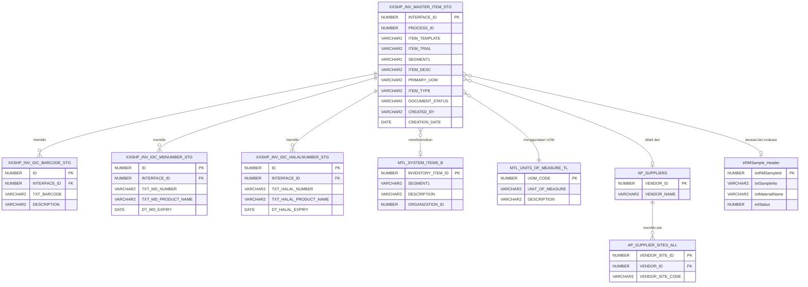
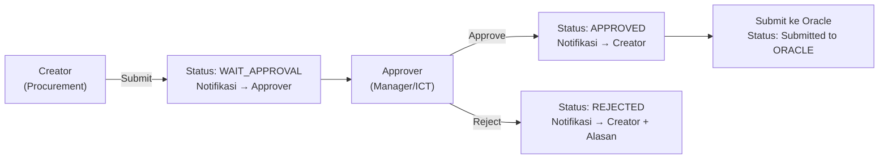
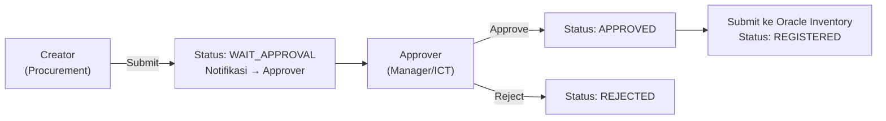

# FUNCTIONAL SPECIFICATION DOCUMENT (FSD)
## Modul: Oracle Registration – Item Trial & Item Production
### Sistem: IDC System (New RM Selection)

---

| Atribut          | Keterangan                                                   |
|------------------|--------------------------------------------------------------|
| **Nama Dokumen** | FSD Modul Oracle Registration – Item Trial & Item Production |
| **Versi**        | 1.0                                                          |
| **Tanggal**      | 9 April 2026                                                 |
| **Divisi**       | Procurement / ICT                                            |
| **Status**       | Draft                                                        |
| **Dibuat oleh**  | Tim ICT – IDC System                                         |

---

## Riwayat Revisi

| Versi   | Tanggal      | Diubah Oleh | Keterangan                                                                                    |
|---------|--------------|-------------|-----------------------------------------------------------------------------------------------|
| **1.0** | **Apr 2026** | **Tim ICT** | **Initial draft – Migrasi dan modernisasi modul Oracle Registration dari sistem lama (RMPM)** |

---

## Daftar Isi

1. [Pendahuluan](#1-pendahuluan)
2. [Ringkasan Business Flow](#2-ringkasan-business-flow)
3. [Modul 1: Item Trial](#3-modul-1-item-trial)
   - 3.1 [Halaman Index – Item Trial](#31-halaman-index--item-trial)
   - 3.2 [Halaman Detail – Item Trial](#32-halaman-detail--item-trial)
   - 3.3 [Tab: Item Trial Setup](#33-tab-item-trial-setup)
   - 3.4 [Tab: Inventory Setup](#34-tab-inventory-setup)
   - 3.5 [Tab: Purchasing Setup](#35-tab-purchasing-setup)
4. [Modul 2: Item Production](#4-modul-2-item-production)
   - 4.1 [Halaman Index – Item Production](#41-halaman-index--item-production)
   - 4.2 [Halaman Detail – Item Production](#42-halaman-detail--item-production)
   - 4.3 [Mode Selector: Trial vs Non-Trial](#43-mode-selector-trial-vs-non-trial)
   - 4.4 [Tab: Item Production (General Info)](#44-tab-item-production-general-info)
   - 4.5 [Tab: Measurement](#45-tab-measurement)
   - 4.6 [Section: Compliance & Certification](#46-section-compliance--certification)
   - 4.7 [Section: Purchasing Information](#47-section-purchasing-information)
   - 4.8 [Detail Tables: Barcode, MD Number, Halal Number](#48-detail-tables-barcode-md-number-halal-number)
5. [Struktur Database & ERD](#5-struktur-database--erd)
6. [Aturan Bisnis](#6-aturan-bisnis)
7. [List of Values (LOV) & Referensi Data](#7-list-of-values-lov--referensi-data)
8. [Hak Akses & Peran Pengguna](#8-hak-akses--peran-pengguna)
9. [Alur Persetujuan (Approval Flow)](#9-alur-persetujuan-approval-flow)
10. [Appendix A – Status Dokumen](#appendix-a--status-dokumen)

---

## 1. Pendahuluan

### 1.1 Latar Belakang

Modul **Oracle Registration** adalah bagian dari sistem IDC (*Integrated Data Center*) yang bertanggung jawab atas proses pendaftaran data item baru ke sistem ERP Oracle. Modul ini merupakan ujung dari siklus *Raw Material (RM) Selection*, di mana setelah sebuah bahan baku dievaluasi dan disetujui melalui **RM Sample Management**, data item tersebut harus didaftarkan secara resmi ke Oracle Inventory untuk dapat digunakan dalam proses pengadaan dan produksi.

Modul ini terdiri dari dua sub-menu utama:

1. **Item Trial** – Proses pendaftaran item dengan status *trial* (percobaan), sebagai langkah awal sebelum item resmi masuk ke production.
2. **Item Production** – Proses pendaftaran item yang siap diproduksi atau dipasarkan secara komersial, di mana item trial telah lulus evaluasi dan mendapat kode item produksi resmi.

### 1.2 Tujuan Dokumen

Dokumen ini bertujuan untuk:

1. Mendeskripsikan fungsionalitas lengkap modul Oracle Registration (Item Trial dan Item Production).
2. Menjadi acuan pengembangan (*development reference*) bagi tim ICT IDC System.
3. Menjelaskan alur proses bisnis, desain layar, struktur database, aturan bisnis, dan LOV yang digunakan.
4. Mendokumentasikan behaviour field, validasi, dan interaksi antar modul (terutama dengan RM Sample Management).
5. Mendokumentasikan proses migrasi dari sistem lama (KN2015_RMPM.WEB) ke arsitektur baru IDC System.

### 1.3 Ruang Lingkup

Dokumen ini mencakup empat halaman web utama:

| Kode Halaman             | Tujuan                                                                |
|--------------------------|-----------------------------------------------------------------------|
| `ItemTrialIndex.html`    | Daftar & monitoring seluruh Item Trial yang terdaftar                |
| `ItemTrialDetail.html`   | Form input / edit data Item Trial                                     |
| `ItemProductionIndex.html` | Daftar & monitoring seluruh Item Production yang terdaftar          |
| `ItemProductionDetail.html` | Form input / edit data Item Production (dengan Measurement tab)   |

### 1.4 Stakeholder

| Peran                  | Tim / Divisi             | Keterlibatan                                                       |
|------------------------|--------------------------|--------------------------------------------------------------------|
| Business Owner         | Procurement / R&D        | Pemilik proses bisnis, validasi kebutuhan fungsional               |
| ICT Developer          | KN IT / IDC System Team  | Pengembangan dan implementasi modul                                |
| RM Requestor / PIC     | Procurement              | Pengguna utama, membuat data Item Trial setelah RM disetujui       |
| Production Coordinator | Produksi / Supply Chain  | Menggunakan data Item Production untuk BOM dan pengadaan           |
| Oracle ERP Admin       | ICT / ERP                | Menerima data staging lalu memproses registrasi ke Oracle Inventory|
| Approver               | Manager / Supervisor ICT | Memberikan persetujuan sebelum data dikirim ke Oracle              |

---

## 2. Ringkasan Business Flow

### 2.1 Konteks Posisi dalam Alur RM Selection

Modul Oracle Registration berada di **akhir alur RM Selection**, setelah proses evaluasi selesai:

```
RM Sample Management
     │
     ▼ (Evaluation APPROVED)
Oracle Registration – Item Trial
     │
     ▼ (Trial APPROVED & Submitted to Oracle)
Oracle Registration – Item Production
     │
     ▼ (Production REGISTERED)
Oracle Inventory (ERP Production Data)
```

### 2.2 Flow Diagram – Proses Oracle Registration

```mermaid
flowchart TD
    Start(["Mulai"]) --> RMApproved["RM Sample Evaluation\nDisetujui"]
    RMApproved --> CreateTrial["Buat Item Trial\n(ItemTrialDetail.html)"]
    CreateTrial --> FillTrial["Isi Data:\n- Item Template\n- RM Eval No\n- Item Code Trial\n- Primary UOM\n- IO / Inventory Setup\n- Purchasing Setup"]
    FillTrial --> SaveDraft["Save Draft"]
    SaveDraft --> ReviewTrial["Review & Submit\nItem Trial"]
    ReviewTrial --> ApprovalTrial{"Approval\nRequired?"}
    ApprovalTrial -->|"Ya"| WaitApproval["Waiting For Approval"]
    WaitApproval --> ApproverAction{"Keputusan\nApprover"}
    ApproverAction -->|"Approve"| ApprovedTrial["Status: APPROVED"]
    ApproverAction -->|"Reject"| RejectedTrial(["REJECTED"])
    ApprovedTrial --> SubmitOracle["Submit to Oracle\n(Status: Submitted to ORACLE)"]
    ApprovalTrial -->|"Tidak"| ApprovedTrial

    SubmitOracle --> CreateProd["Buat Item Production\n(ItemProductionDetail.html)"]
    CreateProd --> SelectMode{"Mode\nProduksi"}
    SelectMode -->|"Trial"| TrialMode["Pilih Item Code Trial\nvia LOV"]
    SelectMode -->|"Non-Trial"| NonTrialMode["Input langsung\ntanpa Trial Code"]

    TrialMode --> FillProd["Isi Data:\n- Item Code / General Item\n- Shelf Life\n- Item Description\n- Primary UOM\n- Compliance Data\n- Purchasing Info\n- Measurement (Tab 2)"]
    NonTrialMode --> FillProd
    FillProd --> SaveProd["Save Draft"]
    SaveProd --> SubmitProd["Submit Item Production"]
    SubmitProd --> ApprovalProd{"Approval?"}
    ApprovalProd -->|"Ya"| WaitProdApproval["Waiting For Approval"]
    WaitProdApproval --> ProdApproverAction{"Keputusan"}
    ProdApproverAction -->|"Approve"| OracleIntegration["Submit ke Oracle\nInventory (ERP)"]
    ProdApproverAction -->|"Reject"| RejectedProd(["REJECTED"])
    ApprovalProd -->|"Tidak"| OracleIntegration
    OracleIntegration --> Registered(["REGISTERED\n(Selesai)"])

    style Start fill:#8CC63F,color:#fff,stroke:#009B4D
    style Registered fill:#388E3C,color:#fff,stroke:#1B5E20
    style RejectedTrial fill:#D32F2F,color:#fff,stroke:#B71C1C
    style RejectedProd fill:#D32F2F,color:#fff,stroke:#B71C1C
    style CreateTrial fill:#FFF3CD,stroke:#FFC107
    style CreateProd fill:#D1ECF1,stroke:#17A2B8
    style OracleIntegration fill:#E2E3E5,stroke:#6C757D
```



### 2.3 Status Dokumen

| Kode Status           | Label                  | Warna Badge | Keterangan                                                                 |
|-----------------------|------------------------|-------------|----------------------------------------------------------------------------|
| `DRAFT`               | Draft                  | Abu-abu     | Baru dibuat, belum disubmit                                                |
| `WAIT_APPROVAL`       | Waiting For Approval   | Cyan        | Menunggu persetujuan Approver                                              |
| `APPROVED`            | Approved               | Hijau       | Sudah disetujui, siap dikirim ke Oracle                                    |
| `SUBMITTED_ORACLE`    | Submitted to ORACLE    | Biru        | Telah dikirim ke staging Oracle (untuk Item Trial)                         |
| `REJECTED`            | Rejected               | Merah       | Ditolak oleh Approver                                                      |
| `REGISTERED`          | Registered             | Biru tua    | Sudah terdaftar di Oracle Inventory (khusus Item Production)               |

---

## 3. Modul 1: Item Trial

### 3.1 Halaman Index – Item Trial

**Path File**: `ItemTrialIndex.html`

**Tujuan**: Menampilkan seluruh data Item Trial dalam bentuk daftar tabel yang dilengkapi dengan dashboard ringkasan berdasarkan status dokumen. User dapat memfilter data dengan mengklik kartu status.

**Tampilan Halaman:**


#### 3.1.1 Dashboard Summary Cards

| Kartu           | Filter Code     | Warna Ikon    | ID Counter     | Keterangan                                     |
|-----------------|-----------------|---------------|----------------|------------------------------------------------|
| Total           | `ALL`           | Navy          | `totalCount`   | Total semua item trial yang terdaftar          |
| Draft           | `DRAFT`         | Kuning/Amber  | `draftCount`   | Item yang masih dalam status draft             |
| Waiting Approval| `WAIT_APPROVAL` | Cyan          | `pendingCount` | Item yang menunggu persetujuan                 |
| Approved        | `APPROVED`      | Hijau         | `approvedCount`| Item yang sudah disetujui                      |
| Submitted to Oracle | `SUBMITTED` | Biru          | `submittedCount`| Item yang sudah dikirim ke Oracle             |

**Comportamiento Kartu**: Klik kartu → filter kolom "Document Status" di DataTable secara otomatis. Kartu yang aktif menampilkan efek border dan shadow berwarna sesuai status.

#### 3.1.2 Action Bar

| Tombol              | ID Tombol   | Fungsi                                                            |
|---------------------|-------------|-------------------------------------------------------------------|
| Export Excel        | `btnExport` | Export data tabel ke format Excel (.xlsx)                         |
| Create New Item Trial | `btnNew`  | Navigasi ke `ItemTrialDetail.html` (mode Create, tanpa `?id=...`) |

#### 3.1.3 Tabel Daftar Item Trial

**ID DataTable**: `dataTableItemTrial`

| No | Kolom           | Field Key      | Keterangan                                                                  |
|----|-----------------|----------------|-----------------------------------------------------------------------------|
| 1  | Document Status | `status`       | Badge berwarna sesuai status (Draft=abu, Waiting=cyan, Approved=hijau)      |
| 2  | Item Template   | `template`     | Template item: RM TRIAL / PM TRIAL                                          |
| 3  | Item Code       | `itemCode`     | Kode item trial — link ke halaman detail                                    |
| 4  | Description     | `itemDesc`     | Deskripsi item trial                                                        |
| 5  | Primary UOM     | `uom`          | Unit of Measure utama (kg, liter, pcs)                                      |
| 6  | Created By      | `createdBy`    | Nama user yang membuat                                                      |
| 7  | Created Date    | `createdDate`  | Tanggal pembuatan                                                           |
| 8  | Next Approver   | `nextApprover` | Nama approver berikutnya (dari sistem Magic/approval)                       |
| 9  | Action          | `action`       | Tombol **View** → link ke `ItemTrialDetail.html?id={interfaceId}`           |

#### 3.1.4 Business Rules Index

| Kondisi Status     | Action yang Tersedia | Keterangan                                              |
|--------------------|----------------------|---------------------------------------------------------|
| Draft              | View / Edit / Delete | Dapat diedit dan dihapus (soft delete)                  |
| Waiting Approval   | View                 | Read-only selama menunggu approval                      |
| Approved           | View                 | Read-only setelah disetujui                             |
| Submitted to Oracle| View                 | Read-only, data sudah dikirim ke Oracle staging         |
| Rejected           | View / Edit          | Dapat diedit ulang dan disubmit kembali                 |

---

### 3.2 Halaman Detail – Item Trial

**Path File**: `ItemTrialDetail.html`

**Tujuan**: Form untuk membuat atau mengedit data Item Trial, terdiri dari tiga tab yang terorganisir secara logis berdasarkan kategori data.

**Tampilan Halaman:**


**Struktur Halaman:**

```
[Page Toolbar]
    - Judul: "Item Trial"
    - Subtitle: "Create / Edit Detail Information of Item Trial"
    - Tombol: [Submit] [Save Draft] [Back]

[Tab Navigation]
    - Tab 1: Item Trial Setup    (fa-info-circle)
    - Tab 2: Inventory Setup     (fa-warehouse)
    - Tab 3: Purchasing Setup    (fa-shopping-cart)

[Tab Content Area]
    - (Konten sesuai tab aktif)
```

#### 3.2.1 Toolbar Actions

| Tombol       | ID         | Tipe       | Fungsi                                                                     |
|--------------|------------|------------|----------------------------------------------------------------------------|
| Submit       | `btnSubmit`| Warning    | Submit data untuk proses approval. Validasi mandatory fields dulu          |
| Save Draft   | `btnSave`  | Success    | Simpan sebagai Draft, bisa dilanjutkan nanti                               |
| Back         | —          | Outline    | Kembali ke `ItemTrialIndex.html` tanpa menyimpan perubahan                 |

---

### 3.3 Tab: Item Trial Setup

**Tab ID**: `#tab-item-trial`

Berisi informasi dasar item trial yang wajib diisi sebelum dapat disimpan atau disubmit.

#### 3.3.1 Kolom Kiri – Informasi Utama

| Field Name      | ID Elemen       | Tipe           | Mandatory | Validasi                      | Keterangan                                                                         |
|-----------------|-----------------|----------------|-----------|-------------------------------|------------------------------------------------------------------------------------|
| Item Template   | `itemTemplate`  | Text (readonly)| Ya        | Nilai tetap: "RM TRIAL"       | Hardcoded, tidak dapat diubah user. Menentukan logika field lain                   |
| RM Eval No      | `rmEvalNo`      | LOV Modal      | Ya        | Harus dipilih dari LOV        | Nomor Evaluasi RM dari modul RM Sample. Sumber: RM Sample Module (status ≠ Draft/Step 1) |
| Item Code Trial | `itemCodeTrial` | Text (readonly)| Ya (Auto) | Auto-isi dari RM Eval No      | Kode item yang digenerate dari proses evaluasi. Terisi otomatis setelah RM Eval dipilih |
| Item Description| `itemDesc`      | Textarea (readonly) | Tidak | Auto-isi                    | Deskripsi item, terisi otomatis dari pilihan RM Eval No                            |

**Business Rule – Item Template:**
- Nilai tetap `RM TRIAL` karena modul ini khusus untuk bahan baku (Raw Material)
- Jika template = `RM TRIAL` → `Item Type` di tab Inventory otomatis = `RM`
- Jika template = `PM TRIAL` → `Item Type` di tab Inventory otomatis = `PM`

**LOV: RM Eval No**

Saat user klik tombol 🔍 di sebelah field RM Eval No, modal popup muncul menampilkan daftar nomor evaluasi RM yang tersedia.

| Kolom di LOV   | Keterangan                                              |
|----------------|---------------------------------------------------------|
| Eval No        | Nomor evaluasi RM (dari tabel RM Sample)                |
| Sample No      | Nomor sample terkait                                    |
| Material Name  | Nama material yang dievaluasi                           |
| Supplier       | Nama supplier                                           |
| Status         | Status evaluasi (hanya tampil status ≥ Step 2)          |
| Action         | Tombol **Select**                                       |

**Setelah RM Eval No dipilih**, sistem otomatis mengisi:
- `itemCodeTrial` ← kode item dari evaluasi
- `itemDesc` ← deskripsi material
- `packingSize` ← nilai net weight dari evaluasi

#### 3.3.2 Kolom Kanan – UOM & Packaging

| Field Name   | ID Elemen    | Tipe           | Mandatory | Validasi           | Keterangan                                                                         |
|--------------|--------------|----------------|-----------|--------------------|------------------------------------------------------------------------------------|
| Primary UOM  | `primaryUOM` | LOV Modal      | Ya        | Harus dipilih      | Unit of Measure utama. Sumber: Oracle `MTL_UNITS_OF_MEASURE_TL` (melalui LOV AllUOM) |
| Packing Size | `packingSize`| Number (readonly)| Tidak   | Numeric ≥ 0        | Ukuran kemasan. Auto-isi dari Net Weight field RM Evaluation                        |
| Pallet Size  | `palletSize` | Number         | Tidak     | Numeric ≥ 0, default 9999 | Ukuran palet per pengiriman. Dapat diubah user                             |

**LOV: Primary UOM**

| Kolom di LOV | Keterangan                         |
|--------------|------------------------------------|
| UOM Code     | Kode satuan (kg, liter, pcs, dll.) |
| UOM Name     | Nama lengkap satuan                |
| Action       | Tombol **Select**                  |

Sumber data: `Oracle MTL_UNITS_OF_MEASURE_TL` (via API endpoint AllUOM)

#### 3.3.3 Notes Banner

Di bawah kedua kolom, terdapat **info banner** berwarna gelap yang memberikan panduan kepada user:

- Pilih **Item Template** terlebih dahulu untuk mengaktifkan pencarian Item Code
- **RM TRIAL** → Item Type otomatis "RM" | **PM TRIAL** → Item Type otomatis "PM"
- Mengubah template akan menghapus semua data yang sudah diisi
- Description & UOM auto-isi dari pilihan Item Code

#### 3.3.4 Operasi CRUD – Tab Item Trial Setup

| Operasi    | Cara                                          | Keterangan                                          |
|------------|-----------------------------------------------|-----------------------------------------------------|
| **Create** | Klik "Create New Item Trial" dari Index       | Semua field kosong, Item Template = "RM TRIAL"      |
| **Read**   | Buka dari link di Index (`?id=...`)           | Semua field terisi dari data tersimpan              |
| **Update** | Edit field yang aktif lalu klik Save Draft    | Hanya field non-readonly yang bisa diubah           |
| **Delete** | Dari halaman Index (soft delete)              | Tidak ada tombol delete di halaman detail           |

---

### 3.4 Tab: Inventory Setup

**Tab ID**: `#tab-inventory`

Berisi konfigurasi data inventory untuk Oracle Inventory module yang bersifat SHP (Sarihusada Generasi Mahardika) specific.

#### 3.4.1 Kolom Kiri – SHP Inventory

| Field Name      | ID Elemen       | Tipe        | Mandatory | Default | Validasi      | Keterangan                                                                |
|-----------------|-----------------|-------------|-----------|---------|---------------|---------------------------------------------------------------------------|
| IO              | `ioCode`        | Select2 Multi-select | Ya | — | Minimal 1 dipilih | IO = Inventory Organization. Daftar IO SHP. Sumber: Oracle `MTL_PARAMETERS` |
| Item Type       | `itemType`      | Text (readonly)| Ya     | RM      | Hardcoded     | Otomatis terisi berdasarkan Item Template (RM/PM)                         |
| Item Sub Type   | `itemSubType`   | Text (readonly)| Tidak  | ALL     | Hardcoded     | Nilai default "ALL", tidak dapat diubah                                   |
| Item LOB        | `itemLob`       | Text (readonly)| Tidak  | KNG     | Hardcoded     | Line of Business: KNG (Kalbe Nutritionals Group). Hardcoded               |

**List IO yang Tersedia:**

| IO Code | IO Code | IO Code | IO Code | IO Code |
|---------|---------|---------|---------|---------|
| ISA     | SHP     | KMI     | KAM     | MBI     |
| NKK     | MPR     | UJA     | RTS     | TMB     |
| TPI     | MAR     | FIN     | TRS     | LNK     |
| DKE     | KNS     | BTU     | ALN     | MDT     |
| GVN     | IDC     | AVI     | ABC     | PTP     |
| QAC     | GPP     | —       | —       | —       |

#### 3.4.2 Kolom Kanan – Data Turunan

| Field Name      | ID Elemen       | Tipe        | Mandatory | Default  | Keterangan                                         |
|-----------------|-----------------|-------------|-----------|----------|----------------------------------------------------|
| Corporate LOB   | `corporateLob`  | Text (readonly)| Tidak  | SHP_NA   | Kode corporate Line of Business, nilai tetap        |
| Product Category| `productCategory`| Text (readonly)| Tidak | NA      | Kategori produk, nilai tetap "NA"                  |
| Production Site | `productionSite`| Text (readonly)| Tidak  | NA      | Lokasi produksi, nilai tetap "NA"                  |

> **Catatan**: Semua field di kolom kanan bersifat **hardcoded** (readonly dengan nilai default yang tidak berubah). Nilai ini ditentukan oleh konfigurasi Oracle per organisasi SHP.

---

### 3.5 Tab: Purchasing Setup

**Tab ID**: `#tab-purchasing`

Berisi konfigurasi data purchasing yang dibutuhkan oleh Oracle Purchasing module. Seluruh field di tab ini bersifat **hardcoded** (readonly) karena nilai-nilai ini merupakan standar konfigurasi organisasi.

#### 3.5.1 Kolom Kiri

| Field Name       | ID Elemen       | Tipe        | Nilai Default | Keterangan                                         |
|------------------|-----------------|-------------|---------------|----------------------------------------------------|
| Purchasing Types | `purchasingTypes`| Text (readonly)| INDIRECT2  | Tipe purchasing standar organisasi SHP              |
| Item Types       | `itemTypes`     | Text (readonly)| RM        | Sama dengan Item Type di Inventory Setup            |

#### 3.5.2 Kolom Kanan

| Field Name    | ID Elemen    | Tipe        | Nilai Default | Keterangan                                              |
|---------------|--------------|-------------|---------------|---------------------------------------------------------|
| Item Sub Types| `itemSubTypes`| Text (readonly)| ALL       | Subtipe item, nilai tetap "ALL"                         |
| SHP Future    | `shpFuture`  | Text (readonly)| ALL       | Flag SHP Future untuk konfigurasi Oracle item attribute |

---

## 4. Modul 2: Item Production

### 4.1 Halaman Index – Item Production

**Path File**: `ItemProductionIndex.html`

**Tujuan**: Menampilkan seluruh data Item Production dalam bentuk daftar tabel, dilengkapi dashboard ringkasan berdasarkan status dokumen.

**Tampilan Halaman:**


#### 4.1.1 Dashboard Summary Cards

| Kartu           | Filter Code    | Warna Ikon | ID Counter       | Keterangan                                        |
|-----------------|----------------|------------|------------------|---------------------------------------------------|
| Total           | `ALL`          | Navy       | `totalCount`     | Total semua item production yang terdaftar        |
| Draft           | `DRAFT`        | Kuning     | `draftCount`     | Item dalam status draft                           |
| Waiting Approval| `WAIT_APPROVAL`| Cyan       | `pendingCount`   | Item menunggu persetujuan approval                |
| Approved        | `APPROVED`     | Hijau      | `approvedCount`  | Item yang sudah disetujui                         |
| Registered      | `REGISTERED`   | Biru       | `registeredCount`| Item yang berhasil terdaftar di Oracle Inventory  |

**Catatan Filtering**: Status "Registered" menggunakan regex search untuk mencakup `Submitted to ORACLE` dan `Registered`.

#### 4.1.2 Action Bar

| Tombol                    | ID Tombol   | Fungsi                                                               |
|---------------------------|-------------|----------------------------------------------------------------------|
| Export Excel              | `btnExport` | Export data tabel ke format Excel (.xlsx)                            |
| Create New Item Production| `btnNew`    | Navigasi ke `ItemProductionDetail.html` (mode Create)                |

#### 4.1.3 Tabel Daftar Item Production

**ID DataTable**: `dataTableItemProduction`

| No | Kolom          | Field Key       | Keterangan                                                                |
|----|----------------|-----------------|---------------------------------------------------------------------------|
| 1  | Document Status| `status`        | Badge berwarna sesuai status                                              |
| 2  | Item Template  | `template`      | Template: RM / PM / RM TRIAL / PM TRIAL                                   |
| 3  | Item Code      | `itemCode`      | Kode item production (link ke detail)                                     |
| 4  | Description    | `itemDesc`      | Deskripsi item                                                            |
| 5  | Primary UOM    | `uom`           | Unit of Measure utama                                                     |
| 6  | Created By     | `createdBy`     | User pembuat                                                              |
| 7  | Created Date   | `createdDate`   | Tanggal dibuat                                                            |
| 8  | Next Approver  | `nextApprover`  | Approver berikutnya dari sistem approval                                  |
| 9  | Action         | `action`        | Tombol **View** → `ItemProductionDetail.html?id={interfaceId}`            |

---

### 4.2 Halaman Detail – Item Production

**Path File**: `ItemProductionDetail.html`

**Tujuan**: Form untuk membuat atau mengedit data Item Production, dilengkapi dengan mode selector (Trial/Non-Trial) dan dua tab utama.

**Tampilan Halaman:**


**Struktur Halaman:**

```
[Page Toolbar]
    - Judul: "Item Production Detail"
    - Badge Mode: "Trial Mode" / "Non-Trial Mode"
    - Tombol: [Save] [Submit] [Print] [Back]

[Mode Selector Card]
    - Toggle: [🔬 Trial] [🏭 Non-Trial]
    - Deskripsi mode aktif

[Tab Navigation]
    - Tab 1: Item Production    (fa-info-circle) – General Info
    - Tab 2: Measurement        (fa-ruler-combined) – Unit Conversion & Packaging

[Tab Content]
    - [Tab 1 Content]
        - Panel Kiri: Item Information + data tables (Barcode, MD Number, Halal Number)
        - Panel Kanan: Compliance & Certification + Purchasing Information
    - [Tab 2 Content]
        - Packaging & Pallet
        - Unit Conversion
        - Weight & Volume
```

#### 4.2.1 Toolbar Actions

| Tombol   | ID         | Status Awal | Fungsi                                                                            |
|----------|------------|-------------|-----------------------------------------------------------------------------------|
| Save     | `btnSave`  | Enabled     | Simpan data sebagai Draft (SAVE action)                                           |
| Submit   | `btnSubmit`| Enabled     | Submit untuk proses approval (SUBMIT action)                                      |
| Print    | `btnPrint` | **Disabled** (enable setelah ada ID) | Cetak dokumen Item Production (via fancybox/print) |
| Back     | —          | —           | Kembali ke `ItemProductionIndex.html`                                             |

---

### 4.3 Mode Selector: Trial vs Non-Trial

Sebelum mengisi form, user **wajib memilih mode produksi**:

| Mode      | ID Radio      | Value      | Keterangan                                                    |
|-----------|---------------|------------|---------------------------------------------------------------|
| Trial     | `modeTrial`   | `TRIAL`    | Default. Item Production berasal dari Item Trial yang ada     |
| Non-Trial | `modeNonTrial`| `NONTRIAL` | Item Production langsung tanpa melalui proses Trial          |

**Efek Mode pada Form:**

| Kondisi         | Mode Trial                                    | Mode Non-Trial                              |
|-----------------|-----------------------------------------------|---------------------------------------------|
| Label field     | "Item Code Trial"                             | "Item Code"                                 |
| LOV Item Code   | Pilih dari Item Trial ter-approve             | Input langsung / pilih dari Oracle Items    |
| Badge Header    | "Trial Mode" (biru)                           | "Non-Trial Mode" (abu-abu/secondary)        |
| Field General Item| Aktif setelah Item Code Trial dipilih       | Aktif langsung                              |

---

### 4.4 Tab: Item Production (General Info)

**Tab ID**: `#tab-general`

#### 4.4.1 Panel Kiri – Item Information

| Field Name          | ID Elemen        | Tipe           | Mandatory | Validasi               | Keterangan                                                                              |
|---------------------|------------------|----------------|-----------|------------------------|-----------------------------------------------------------------------------------------|
| Item Template       | `itemTemplate`   | Text (readonly)| Ya        | Default: "RM"          | Hardcoded berdasarkan template yang digunakan (RM / PM)                                 |
| Item Code Trial     | `itemCodeTrial`  | LOV Modal      | Ya (Trial)| Pilih dari LOV         | Kode item trial yang sudah di-approve. Sumber: `XXSHP_INV_MASTER_ITEM_STG` + Oracle `MTL_SYSTEM_ITEMS_B` |
| Item Code (General) | `generalItem`    | Text (readonly)| —         | Auto-isi dari LOV      | Kode item general yang berasal dari pemilihan Item Code Trial                           |
| General Item        | `genNew`/`genExist`| Radio Button| Tidak     | New (N) / Existing (E) | Menentukan apakah item ini baru di Oracle atau sudah ada. Mempengaruhi LOV Item Code PM  |
| Segment 1           | `segment1`       | LOV Modal      | Conditional| Wajib jika "Existing"  | Kode Oracle Item yang sudah ada. Sumber: Oracle `MTL_SYSTEM_ITEMS_B`                    |
| Shelf Life (Month)  | `shelfLife`      | Number         | Tidak     | Numeric ≥ 0            | Masa simpan dalam bulan                                                                 |
| Shelf Life Open Pack| `shelfLifeOpenPack`| Number      | Tidak     | Numeric ≥ 0            | Masa simpan setelah kemasan dibuka, dalam hari                                          |
| Item Description    | `itemDescription`| Textarea       | Ya        | Min 3, Max 500 char    | Deskripsi lengkap item production                                                       |
| Closed Code         | `closedCode`     | Textarea       | Ya        | Max 200 char           | Kode tertutup / internal alias item                                                     |
| Primary UOM         | `primaryUOM`     | LOV Modal      | Ya        | Pilih dari LOV         | Unit of Measure utama. Sumber: Oracle `MTL_UNITS_OF_MEASURE_TL`                         |

**Business Rule – General Item (New vs Existing):**

```
Jika General Item = "New" (N):
  → Tombol LOV Segment 1 (btnItemCodePM) DISABLED
  → Field Segment1 diisi otomatis dari GENERAL_ITEM value (Trial Code)

Jika General Item = "Existing" (E):
  → Tombol LOV Segment 1 (btnItemCodePM) ENABLED
  → User harus memilih kode Oracle item yang sudah ada dari LOV
  → Field Segment1 dikosongkan, user pilih manual
```

**LOV: Item Code Trial (`lovItemTrialModal`)**

| Kolom      | Keterangan                                             |
|------------|--------------------------------------------------------|
| Action     | Tombol **Select**                                      |
| Item Trial | Kode item trial                                        |
| Item Prod  | Kode item production terkait (jika sudah ada)          |
| Item Desc  | Deskripsi item                                         |
| Packing Size| Ukuran kemasan                                        |
| UOM        | Unit of Measure                                        |
| Closed Code| Kode tertutup                                          |
| Creation Date| Tanggal pembuatan item trial                         |

---

### 4.5 Tab: Measurement

**Tab ID**: `#tab-measurement`

Tab ini berisi data pengukuran yang diperlukan untuk konfigurasi Oracle Inventory agar sistem dapat menghitung kebutuhan material secara akurat.

#### 4.5.1 Sub-Section: Packaging & Pallet

| Field Name   | ID Elemen        | Tipe   | Mandatory | Validasi        | Keterangan                               |
|--------------|------------------|--------|-----------|-----------------|------------------------------------------|
| Packing Size | `txtPackagingSize`| Text  | Ya        | Decimal > 0     | Ukuran kemasan per unit (mis: 25.000 kg) |
| Pallet Size  | `txtPalletSize`   | Text  | Ya        | Decimal > 0     | Jumlah kemasan per palet                 |

#### 4.5.2 Sub-Section: Unit Conversion

Memungkinkan konversi antara dua unit berbeda yang digunakan dalam Oracle Inventory.

| Field Name        | ID Elemen          | Tipe       | Mandatory | Keterangan                                              |
|-------------------|--------------------|------------|-----------|---------------------------------------------------------|
| From Unit         | `uomConvFrom`      | LOV Modal  | Tidak     | Unit asal. Sumber: Oracle UOM. Tombol: `btnUomConvFrom` |
| To Unit           | `uomConvTo`        | LOV Modal  | Tidak     | Unit tujuan. Sumber: Oracle UOM. Tombol: `btnUomConvTo` |
| Conversion Value  | `txtUnitConversion`| Number     | Tidak     | Nilai konversi: 1 [From] = X [To]. Presisi 8 desimal   |

**Tampilan Formula Konversi:**
```
[1] [From Unit] = [Conversion Value] [To Unit]
```

#### 4.5.3 Sub-Section: Weight

| Field Name             | ID Elemen                | Tipe   | Mandatory | Keterangan                             |
|------------------------|--------------------------|---------|-----------|----------------------------------------|
| Unit of Measure Value  | `decUnitOfMeasureWeight` | Text    | Ya        | Nilai berat per unit. Label: "Kg"      |

#### 4.5.4 Sub-Section: Volume

| Field Name             | ID Elemen                | Tipe   | Mandatory | Keterangan                             |
|------------------------|--------------------------|---------|-----------|----------------------------------------|
| Unit of Measure Value  | `decUnitOfMeasureVolume` | Text    | Ya        | Nilai volume per unit. Label: "M3"     |

---

### 4.6 Section: Compliance & Certification

Berada di **Panel Kanan Tab 1**. Konten berubah berdasarkan **Item Template** (RM atau PM).

#### 4.6.1 Field Halal (Semua Template)

| Field Name   | ID Elemen  | Tipe      | Mandatory | Keterangan                                                                              |
|--------------|------------|-----------|-----------|-----------------------------------------------------------------------------------------|
| Halal Country| `country`  | LOV Modal | Tidak     | Negara asal sertifikasi halal. Sumber: `FND_LOOKUP_VALUES` (Oracle). Tombol: `btnCountry` |

#### 4.6.2 Field Khusus RM Template (`.group-rm-only`)

| Field Name | ID Elemen  | Tipe      | Mandatory | Keterangan                                                                         |
|------------|------------|-----------|-----------|------------------------------------------------------------------------------------|
| Halal Logo | `halalLogo`| LOV Modal | Tidak     | Tipe logo halal di kemasan. Sumber: Oracle `FND_LOOKUP_VALUES (HALAL_LOGO)`        |
| Halal Body | `halalBody`| LOV Modal | Tidak     | Lembaga sertifikasi halal (MUI, JAKIM, dll.). Sumber: `FND_LOOKUP_VALUES (HALAL_BODY)` |

#### 4.6.3 Field Khusus PM Template (`.group-pm-only`)

| Field Name       | ID Elemen      | Tipe      | Mandatory | Keterangan                                                |
|------------------|----------------|-----------|-----------|-----------------------------------------------------------|
| Forestry Cert    | `forestryCert` | Text      | Tidak     | Indikator kebutuhan sertifikasi kehutanan (FSC, PEFC)     |
| Forestry Body    | `forestryBody` | Text      | Tidak     | Lembaga sertifikasi kehutanan                             |
| Forestry Valid   | `forestryValid`| Date      | Tidak     | Tanggal kedaluwarsa sertifikasi kehutanan                 |
| Forestry Number  | `forestryNum`  | Text      | Tidak     | Nomor sertifikat kehutanan                                |
| Pecah KN         | `pecahKn`      | Checkbox  | Tidak     | Flag "Pecah KN" untuk pengelompokan khusus item           |

**Business Rule – Visibility Compliance Fields:**

```
Jika Item Template = RM  → Tampilkan: Halal Country, Halal Logo, Halal Body
                            Sembunyikan: Forestry fields, Pecah KN
Jika Item Template = PM  → Tampilkan: Halal Country, Forestry fields, Pecah KN
                            Sembunyikan: Halal Logo, Halal Body
```

---

### 4.7 Section: Purchasing Information

| Field Name    | ID Elemen      | Tipe      | Mandatory | Keterangan                                                                                  |
|---------------|----------------|-----------|-----------|---------------------------------------------------------------------------------------------|
| Purchased SHP?| `purchasedSHPYes`/`purchasedSHPNo` | Radio (Yes/No) | Tidak | Apakah item dibeli oleh SHP. Mempengaruhi sumber data Supplier LOV |
| Supplier Item | `supplierItem` | Text      | Tidak     | Kode item dari sisi supplier (nomor katalog supplier)                                       |
| Supplier Name | `supplierName` | LOV Modal | Ya        | Nama supplier. Tombol: `btnSupplier`. Sumber berbeda berdasarkan *Purchased SHP?*           |
| Principal Name| `principalName`| LOV Modal | Ya        | Nama principal/brand pemilik. Tombol: `btnPrincipal`. Aktif setelah Supplier dipilih        |

**Business Rule – Supplier LOV berdasarkan "Purchased SHP?":**

| Kondisi                  | Sumber Data Supplier                                             |
|--------------------------|------------------------------------------------------------------|
| Purchased SHP = YES      | Oracle `AP_SUPPLIERS` (vendor resmi Oracle) + mAppParam         |
| Purchased SHP = NO       | mAppParam only (daftar internal)                                 |

**Business Rule – Principal LOV:**
- Tombol Principal (`btnPrincipal`) **DISABLED** sampai Supplier dipilih
- Setelah Supplier dipilih → ENABLED
- Sumber: Oracle `AP_SUPPLIER_SITES_ALL` (Vendor Sites, filter by VENDOR_ID)

---

### 4.8 Detail Tables: Barcode, MD Number, Halal Number

Di bagian bawah Panel Kiri Tab 1, terdapat tiga sub-tabel dinamis yang terhubung dengan item production.

#### 4.8.1 Tabel Barcode

**Modal LOV ID**: `lovBarcodeModal`

| Kolom     | Keterangan                       |
|-----------|----------------------------------|
| Action    | Tombol Select                    |
| Barcode   | Nilai barcode item                |
| Item Code | Kode item terkait barcode        |
| Country   | Negara berlaku barcode           |
| Description| Deskripsi barcode                |

**Operasi CRUD Barcode:**

| Operasi    | Cara                               | Keterangan                                         |
|------------|------------------------------------|----------------------------------------------------|
| **Create** | Klik tombol **+** → Modal LOV      | Pilih barcode dari daftar, tambah ke tabel         |
| **Read**   | Tabel menampilkan semua barcode    | Diload dari `XXSHP_INV_IDC_BARCODE_STG`            |
| **Update** | Tidak support inline edit          | Hapus lama, tambah baru                            |
| **Delete** | Klik tombol **–** di baris tabel   | Hapus barcode dari daftar item                     |

#### 4.8.2 Tabel MD Number (AKASIA)

**Modal LOV ID**: `lovMDNumberModal`

MD Number adalah nomor registrasi produk di BPOM (Badan Pengawas Obat dan Makanan) – dikenal juga sebagai AKASIA Number.

| Kolom      | Keterangan                                   |
|------------|----------------------------------------------|
| Action     | Tombol Select                                |
| AKASIA No  | Nomor registrasi BPOM (AKASIA)               |
| MD No      | Nomor MD (Marketing Declaration)             |
| Nama Dagang| Nama dagang produk                           |
| Nama Produk| Nama produk yang terdaftar                   |

**Operasi CRUD MD Number:**

| Operasi    | Cara                            | Keterangan                                         |
|------------|---------------------------------|----------------------------------------------------|
| **Create** | Klik tombol **+** → Modal LOV   | Pilih MD Number dari sistem AKASIA, tambah ke tabel|
| **Read**   | Tabel menampilkan semua MD No   | Diload dari `XXSHP_INV_IDC_MDNUMBER_STG`           |
| **Delete** | Klik tombol **–** di baris      | Hapus nomor MD dari daftar item                    |

#### 4.8.3 Tabel Halal Number

**Modal LOV ID**: `lovHalalNumberModal`

| Kolom         | Keterangan                           |
|---------------|--------------------------------------|
| Action        | Tombol Select                        |
| Halal Number  | Nomor sertifikat halal               |
| Halal Product | Nama produk dalam sertifikat         |
| Expiry Date   | Tanggal kedaluwarsa sertifikat       |

**Operasi CRUD Halal Number:**

| Operasi    | Cara                            | Keterangan                                          |
|------------|---------------------------------|-----------------------------------------------------|
| **Create** | Klik tombol **+** → Modal LOV   | Pilih nomor halal dari daftar, tambah ke tabel      |
| **Read**   | Tabel menampilkan semua sertifikat| Diload dari `XXSHP_INV_IDC_HALALNUMBER_STG`        |
| **Delete** | Klik tombol **–** di baris      | Hapus nomor halal dari daftar item                  |

---

## 5. Struktur Database & ERD

### 5.1 Tabel Utama

#### 5.1.1 XXSHP_INV_MASTER_ITEM_STG (Staging Table – Item Trial & Production)

Tabel staging utama yang menyimpan data item sebelum dikirim ke Oracle Inventory.

| Kolom               | Tipe Data      | Nullable | Keterangan                                                         |
|---------------------|----------------|----------|--------------------------------------------------------------------|
| `INTERFACE_ID`      | NUMBER         | NOT NULL | Primary Key, ID unik dokumen                                       |
| `PROCESS_ID`        | NUMBER         | NULL     | ID proses staging ke Oracle                                        |
| `ITEM_TEMPLATE`     | VARCHAR2(50)   | NOT NULL | Template: RM TRIAL / PM TRIAL / RM / PM                            |
| `ITEM_TRIAL`        | VARCHAR2(100)  | NULL     | Kode item trial                                                    |
| `SEGMENT1`          | VARCHAR2(100)  | NULL     | Kode item Oracle (Segment 1 = Item Code di Oracle Inventory)       |
| `ITEM_DESC`         | VARCHAR2(500)  | NULL     | Deskripsi item                                                     |
| `ALIAS_NAME`        | VARCHAR2(200)  | NULL     | Closed code / alias                                                |
| `PRIMARY_UOM`       | VARCHAR2(50)   | NOT NULL | Unit of Measure utama                                              |
| `ITEM_TYPE`         | VARCHAR2(50)   | NULL     | Tipe item: RM / PM                                                 |
| `ITEM_SUB_TYPE`     | VARCHAR2(50)   | NULL     | Sub tipe: ALL                                                      |
| `ITEM_LOB`          | VARCHAR2(50)   | NULL     | Line of Business: KNG                                              |
| `CORPORATE_LOB`     | VARCHAR2(50)   | NULL     | Corporate LOB: SHP_NA                                              |
| `PRODUCT_CATEGORY`  | VARCHAR2(50)   | NULL     | Kategori produk: NA                                                |
| `PRODUCTION_SITE`   | VARCHAR2(50)   | NULL     | Site produksi: NA                                                  |
| `PURCHASING_TYPES`  | VARCHAR2(50)   | NULL     | Tipe purchasing: INDIRECT2                                         |
| `ITEM_TYPES`        | VARCHAR2(50)   | NULL     | Tipe item purchasing                                               |
| `ITEM_SUB_TYPES`    | VARCHAR2(50)   | NULL     | Sub tipe purchasing: ALL                                           |
| `SHP_FUTURE`        | VARCHAR2(50)   | NULL     | Flag masa depan: ALL                                               |
| `PACKING_SIZE`      | NUMBER(18,3)   | NULL     | Ukuran kemasan                                                     |
| `PALLET_SIZE`       | NUMBER(18,3)   | NULL     | Ukuran palet                                                       |
| `SHELF_LIFE`        | NUMBER(10)     | NULL     | Masa simpan (bulan)                                                |
| `SHELF_LIFE_OPEN_PACK`| NUMBER(10)   | NULL     | Masa simpan setelah buka kemasan (hari)                            |
| `GENERAL_ITEM`      | VARCHAR2(100)  | NULL     | Kode general item (dari Oracle)                                    |
| `GENERAL_ITEM_CHECKED`| VARCHAR2(1)  | NULL     | Flag New/Existing: N/E                                             |
| `SUPPLIER_NAME`     | VARCHAR2(200)  | NULL     | Nama supplier                                                      |
| `SUPPLIER_ITEM`     | VARCHAR2(100)  | NULL     | Kode item dari supplier                                            |
| `VENDOR_ID`         | NUMBER         | NULL     | ID vendor Oracle (dari AP_SUPPLIERS)                               |
| `VENDOR_SITE_ID`    | NUMBER         | NULL     | ID site vendor Oracle                                              |
| `SUPPLIER_SITE`     | VARCHAR2(100)  | NULL     | Kode site supplier                                                 |
| `PRINCIPAL`         | VARCHAR2(200)  | NULL     | Nama principal                                                     |
| `BAR_CODE`          | VARCHAR2(100)  | NULL     | Barcode item                                                       |
| `COUNTRY`           | VARCHAR2(100)  | NULL     | Negara asal Halal                                                  |
| `CHALAL_NO`         | VARCHAR2(100)  | NULL     | Nomor sertifikat Halal                                             |
| `CHALAL_VALID`      | DATE           | NULL     | Tanggal kedaluwarsa Halal                                          |
| `HALAL_LOGO`        | VARCHAR2(100)  | NULL     | Tipe logo halal                                                    |
| `HALAL_BODY`        | VARCHAR2(100)  | NULL     | Lembaga sertifikasi halal                                          |
| `AKASIA_NUM`        | VARCHAR2(100)  | NULL     | Nomor AKASIA/MD BPOM                                               |
| `CMD_NO`            | VARCHAR2(100)  | NULL     | Nomor CMD                                                          |
| `CMD_VALID`         | DATE           | NULL     | Tanggal kedaluwarsa CMD                                            |
| `NEED_FORESTRY_CERT`| VARCHAR2(50)   | NULL     | Flag kebutuhan sertifikasi kehutanan (PM only)                     |
| `FORESTRY_CERT_BODY`| VARCHAR2(100)  | NULL     | Lembaga sertifikasi kehutanan                                      |
| `FORESTRY_CERT_VALID_TO`| DATE      | NULL     | Tanggal kedaluwarsa sertifikasi                                    |
| `FORESTRY_CERT_NUM` | VARCHAR2(100)  | NULL     | Nomor sertifikat kehutanan                                         |
| `PECAH_KN`          | CHAR(1)        | NULL     | Flag Pecah KN (PM only)                                            |
| `DOCUMENT_STATUS`   | VARCHAR2(50)   | NOT NULL | Status dokumen (DRAFT/WAIT_APPROVAL/APPROVED/SUBMITTED to ORACLE)  |
| `NEXT_APPROVER`     | VARCHAR2(200)  | NULL     | Nama approver berikutnya                                           |
| `CREATED_BY`        | VARCHAR2(100)  | NOT NULL | Pembuat dokumen                                                    |
| `CREATION_DATE`     | DATE           | NOT NULL | Tanggal pembuatan                                                  |
| `LAST_UPDATED_BY`   | VARCHAR2(100)  | NULL     | Pengedit terakhir                                                  |
| `LAST_UPDATE_DATE`  | DATE           | NULL     | Tanggal edit terakhir                                              |

#### 5.1.2 XXSHP_INV_IDC_BARCODE_STG

| Kolom        | Tipe Data    | Keterangan                              |
|--------------|--------------|-----------------------------------------|
| `ID`         | NUMBER       | Primary Key                             |
| `INTERFACE_ID`| NUMBER      | FK → XXSHP_INV_MASTER_ITEM_STG          |
| `TXT_BARCODE`| VARCHAR2(100)| Nilai barcode                           |
| `DESCRIPTION`| VARCHAR2(200)| Deskripsi barcode                       |

#### 5.1.3 XXSHP_INV_IDC_MDNUMBER_STG

| Kolom              | Tipe Data    | Keterangan                              |
|--------------------|--------------|-----------------------------------------|
| `ID`               | NUMBER       | Primary Key                             |
| `INTERFACE_ID`     | NUMBER       | FK → XXSHP_INV_MASTER_ITEM_STG          |
| `TXT_MD_NUMBER`    | VARCHAR2(100)| Nomor MD / AKASIA                       |
| `TXT_MD_PRODUCT_NAME`| VARCHAR2(200)| Nama produk dalam sertifikat          |
| `TXT_MD_PRODUCTION_SITE`| VARCHAR2(100)| Lokasi produksi                    |
| `DT_MD_EXPIRY`     | DATE         | Tanggal kedaluwarsa                     |

#### 5.1.4 XXSHP_INV_IDC_HALALNUMBER_STG

| Kolom                | Tipe Data    | Keterangan                              |
|----------------------|--------------|-----------------------------------------|
| `ID`                 | NUMBER       | Primary Key                             |
| `INTERFACE_ID`       | NUMBER       | FK → XXSHP_INV_MASTER_ITEM_STG          |
| `TXT_HALAL_NUMBER`   | VARCHAR2(100)| Nomor sertifikat halal                  |
| `TXT_HALAL_PRODUCT_NAME`| VARCHAR2(200)| Nama produk dalam sertifikat         |
| `DT_HALAL_EXPIRY`    | DATE         | Tanggal kedaluwarsa sertifikat          |

### 5.2 ERD – Entity Relationship Diagram



---

## 6. Aturan Bisnis

### 6.1 Aturan Global

| ID   | Aturan Bisnis                                                                                          |
|------|--------------------------------------------------------------------------------------------------------|
| BR-01| Setiap dokumen harus melalui proses Approval sebelum dapat dikirim ke Oracle                          |
| BR-02| Dokumen berstatus **Draft** dapat diedit dan dihapus                                                   |
| BR-03| Dokumen berstatus **Waiting Approval** atau lebih tinggi **tidak dapat diedit** oleh Creator           |
| BR-04| Dokumen berstatus **Rejected** dapat diedit ulang dan disubmit kembali                                 |
| BR-05| Pengiriman ke Oracle hanya dapat dilakukan setelah status **Approved**                                 |
| BR-06| Satu Item Trial dapat menghasilkan satu atau lebih Item Production                                     |

### 6.2 Aturan Item Trial

| ID   | Aturan Bisnis                                                                                                |
|------|--------------------------------------------------------------------------------------------------------------|
| BR-IT-01| Item Template **RM TRIAL** otomatis mengisi `Item Type = RM` di Inventory Setup                        |
| BR-IT-02| Item Template **PM TRIAL** otomatis mengisi `Item Type = PM` di Inventory Setup                        |
| BR-IT-03| Mengubah Item Template setelah data diisi akan **menghapus semua isian** di form                       |
| BR-IT-04| Field `RM Eval No` hanya menampilkan record dari RM Sample yang statusnya **≥ Step 2** (bukan Draft)   |
| BR-IT-05| Setelah RM Eval No dipilih, field `Item Code Trial`, `Item Desc`, dan `Packing Size` **auto-filled**   |
| BR-IT-06| Field `IO` di Inventory Setup menggunakan **Select2 multi-select** — minimal 1 IO harus dipilih       |
| BR-IT-07| Semua field di Inventory Setup (kecuali IO) bersifat **hardcoded** dan tidak dapat diubah user        |
| BR-IT-08| Semua field di Purchasing Setup bersifat **hardcoded** dan tidak dapat diubah user                    |

### 6.3 Aturan Item Production

| ID   | Aturan Bisnis                                                                                                      |
|------|---------------------------------------------------------------------------------------------------------------------|
| BR-IP-01| Mode **Trial** memerlukan pemilihan Item Code Trial yang sudah ada dan di-approve                            |
| BR-IP-02| Mode **Non-Trial** memungkinkan input Item Production langsung tanpa Item Trial                              |
| BR-IP-03| Tombol **Supplier LOV** hanya aktif setelah Item Code Trial dipilih (mode Trial)                            |
| BR-IP-04| Tombol **Principal LOV** hanya aktif setelah Supplier dipilih                                               |
| BR-IP-05| Jika **Purchased SHP? = Yes** → Supplier diambil dari Oracle AP_SUPPLIERS                                   |
| BR-IP-06| Jika **Purchased SHP? = No** → Supplier diambil dari mAppParam (daftar internal)                            |
| BR-IP-07| Field Compliance RM (Halal Logo, Halal Body) **hanya tampil** jika Item Template = RM                       |
| BR-IP-08| Field Compliance PM (Forestry fields, Pecah KN) **hanya tampil** jika Item Template = PM                    |
| BR-IP-09| Jika General Item = **"New"** → Tombol LOV Item Code PM **DISABLED**, Segment1 otomatis dari Trial Code     |
| BR-IP-10| Jika General Item = **"Existing"** → Tombol LOV Item Code PM **ENABLED**, user harus pilih manual          |
| BR-IP-11| Tombol **Print** DISABLED saat mode Create (belum ada ID). ENABLED setelah dokumen disimpan pertama kali    |

---

## 7. List of Values (LOV) & Referensi Data

### 7.1 Daftar LOV yang Digunakan

| LOV Name              | Nama Modal / Endpoint            | Sumber Data Oracle / IDC                          | Digunakan Di                    |
|-----------------------|----------------------------------|----------------------------------------------------|----------------------------------|
| RM Eval No            | Modal RM Evaluation              | `trRMSample_Header` (status ≥ Step 2)              | Item Trial – Tab 1               |
| ItemTemplateForTrial  | Modal Item Template              | Hardcoded (RM TRIAL / PM TRIAL)                    | Item Trial – Tab 1               |
| Item Code Trial       | `lovItemTrialModal`              | `XXSHP_INV_MASTER_ITEM_STG` + Oracle MTL_SYSTEM_ITEMS_B | Item Production – Tab 1   |
| Inventory Org (IO)    | Select2 multi-select             | Oracle `MTL_PARAMETERS`                            | Item Trial – Inventory Setup      |
| UOM (AllUOM)          | `lovUomModal`                    | Oracle `MTL_UNITS_OF_MEASURE_TL`                   | Item Trial & Item Production      |
| UOM Conv From/To      | Modal UOM Conversion             | Oracle `MTL_UNITS_OF_MEASURE_TL`                   | Item Production – Measurement     |
| Supplier Oracle       | `lovSupplierModal`               | Oracle `AP_SUPPLIERS`                              | Item Production – Purchasing      |
| Principal Oracle      | `lovPrincipalModal`              | Oracle `AP_SUPPLIER_SITES_ALL`                     | Item Production – Purchasing      |
| Halal Country         | `lovCountryModal`                | Oracle `FND_LOOKUP_VALUES` (country lookup)        | Item Production – Compliance      |
| Halal Logo            | Modal Halal Logo                 | Oracle `FND_LOOKUP_VALUES (HALAL_LOGO)`            | Item Production – Compliance      |
| Halal Body            | Modal Halal Body                 | Oracle `FND_LOOKUP_VALUES (HALAL_BODY)`            | Item Production – Compliance      |
| Barcode               | `lovBarcodeModal`                | `XXSHP_INV_IDC_BARCODE_STG`                        | Item Production – Detail Table    |
| MD Number (AKASIA)    | `lovMDNumberModal`               | `XXSHP_INV_IDC_MDNUMBER_STG` / AKASIA sistem       | Item Production – Detail Table    |
| Halal Number          | `lovHalalNumberModal`            | `XXSHP_INV_IDC_HALALNUMBER_STG`                    | Item Production – Detail Table    |
| Item Code PM (Oracle) | `btnItemCodePM`                  | Oracle `MTL_SYSTEM_ITEMS_B` by ITEM_TEMPLATE       | Item Production – General Item    |

### 7.2 Nilai Hardcoded

| Field              | Nilai        | Berlaku Di        | Keterangan                                         |
|--------------------|--------------|-------------------|----------------------------------------------------|
| Item Template (Trial)| RM TRIAL   | Item Trial        | Default template untuk Item Trial RM               |
| Item Type          | RM / PM      | Inventory Setup   | Auto dari template                                 |
| Item Sub Type      | ALL          | Inventory Setup   | Nilai tetap                                        |
| Item LOB           | KNG          | Inventory Setup   | Kalbe Nutritionals Group                           |
| Corporate LOB      | SHP_NA       | Inventory Setup   | SHP default                                        |
| Product Category   | NA           | Inventory Setup   | Nilai "Not Applicable"                             |
| Production Site    | NA           | Inventory Setup   | Nilai "Not Applicable"                             |
| Purchasing Types   | INDIRECT2    | Purchasing Setup  | Tipe purchasing SHP standar                        |
| SHP Future         | ALL          | Purchasing Setup  | Flag future All                                    |

---

## 8. Hak Akses & Peran Pengguna

| Peran               | Create Trial | Edit Trial | Submit Trial | Approve Trial | Create Prod | Edit Prod | Submit Prod | Approve Prod |
|---------------------|:---:        |:---:       |:---:         |:---:         |:---:        |:---:       |:---:        |:---:         |
| Procurement User    | ✅           | ✅ (Draft) | ✅            | ❌           | ✅           | ✅ (Draft) | ✅           | ❌           |
| ICT / ERP Admin     | ✅           | ✅          | ✅            | ✅             | ✅           | ✅          | ✅           | ✅            |
| Manager / Supervisor| ❌           | ❌          | ❌            | ✅             | ❌           | ❌          | ❌           | ✅            |
| Read-Only User      | ❌           | ❌          | ❌            | ❌             | ❌           | ❌          | ❌           | ❌            |

---

## 9. Alur Persetujuan (Approval Flow)

### 9.1 Flow Approval Item Trial



### 9.2 Flow Approval Item Production



### 9.3 Notifikasi

| Event                  | Penerima Notifikasi              | Konten                                          |
|------------------------|----------------------------------|-------------------------------------------------|
| Submit Item Trial      | Approver                         | "Item Trial [Kode] menunggu persetujuan Anda"   |
| Approved Item Trial    | Creator                          | "Item Trial [Kode] telah disetujui"             |
| Rejected Item Trial    | Creator                          | "Item Trial [Kode] ditolak. Alasan: [...]"      |
| Submit Item Production | Approver                         | "Item Production [Kode] menunggu persetujuan"   |
| Approved Item Prod     | Creator                          | "Item Production [Kode] telah disetujui"        |
| Registered to Oracle   | Creator + ICT Admin              | "Item [Kode] berhasil terdaftar di Oracle"      |

---

## Appendix A – Status Dokumen

### A.1 Perbandingan Status: Sistem Lama vs Sistem Baru

| Status Sistem Lama (RMPM.WEB) | Status Sistem Baru (IDC)  | Keterangan                                          |
|-------------------------------|---------------------------|-----------------------------------------------------|
| (tidak ada visual status)     | Draft                     | Baru dibuat, belum disubmit                         |
| (submit form langsung)        | Waiting For Approval      | Menunggu persetujuan                                |
| (approved via Oracle workflow)| Approved                  | Disetujui                                           |
| (langsung ke Oracle)          | Submitted to ORACLE       | Dikirim ke staging Oracle                           |
| (tidak ada)                   | Rejected                  | Baru ada di sistem IDC                              |

### A.2 Mapping Field: Sistem Lama → Sistem Baru

| Field Lama (VBhtml – RMPM.WEB)                   | ID Elemen Baru (IDC)     | Keterangan                   |
|---------------------------------------------------|--------------------------|------------------------------|
| `clsXXSHP_INV_MASTER_ITEM_STG.iTEM_TEMPLATE`     | `itemTemplate`           | Sama                         |
| `clsXXSHP_INV_MASTER_ITEM_STG.iTEM_TRIAL`        | `itemCodeTrial` / `rmEvalNo` | Dipecah: RM Eval No baru  |
| `clsXXSHP_INV_MASTER_ITEM_STG.iTEM_DESC`         | `itemDescription`        | Sama                         |
| `clsXXSHP_INV_MASTER_ITEM_STG.pRIMARY_UOM`       | `primaryUOM`             | Sama                         |
| `clsXXSHP_INV_MASTER_ITEM_STG.ITEM_TYPE`         | `itemType`               | Sama (hardcoded)             |
| `clsXXSHP_INV_MASTER_ITEM_STG.ITEM_LOB`          | `itemLob`                | Sama (hardcoded: KNG)        |
| `clsXXSHP_INV_MASTER_ITEM_STG.PACKING_SIZE`      | `packingSize`            | Sama                         |
| `clsXXSHP_INV_MASTER_ITEM_STG.PALLET_SIZE`       | `palletSize`             | Sama                         |
| `clsXXSHP_INV_MASTER_ITEM_STG.VENDOR_ID`         | `vendorId` (hidden)      | Sama                         |
| `clsXXSHP_INV_MASTER_ITEM_STG.sUPPLIER_NAME`     | `supplierName`           | Sama                         |
| `clsXXSHP_INV_MASTER_ITEM_STG.pRINCIPAL`         | `principalName`          | Sama                         |
| `clsXXSHP_INV_MASTER_ITEM_STG.BAR_CODE`          | Tabel Barcode            | Dipindah ke sub-tabel        |
| `clsXXSHP_INV_MASTER_ITEM_STG.AKASIA_NUM`        | Tabel MD Number          | Dipindah ke sub-tabel        |
| `clsXXSHP_INV_MASTER_ITEM_STG.cHALAL_NO`         | Tabel Halal Number       | Dipindah ke sub-tabel        |
| `clsXXSHP_INV_MASTER_ITEM_STG.hALAL_LOGO`        | `halalLogo`              | Sama                         |
| `clsXXSHP_INV_MASTER_ITEM_STG.hALAL_BODY`        | `halalBody`              | Sama                         |
| `clsXXSHP_INV_MASTER_ITEM_STG.pECAH_KN`          | `pecahKn`                | Sama                         |
| `clsXXSHP_INV_MASTER_ITEM_STG.SHELF_LIFE`        | `shelfLife`              | Sama                         |
| Pembayaran types (INDIRECT2)                      | `purchasingTypes`        | Sama (hardcoded)             |
| `clsXXSHP_INV_MASTER_ITEM_STG.gENERAL_ITEM_CHECKED` | `genNew`/`genExist`   | Sama (Radio New/Existing)    |

---

*Dokumen ini merupakan FSD versi 1.0 – Oracle Registration Module (Item Trial & Item Production)*
*Sistem: IDC System – New RM Selection*
*Tim ICT – April 2026*
