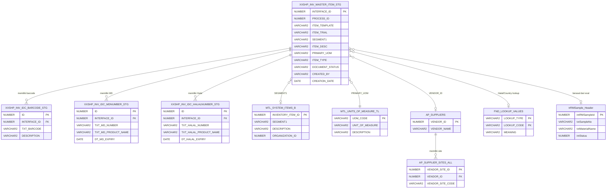
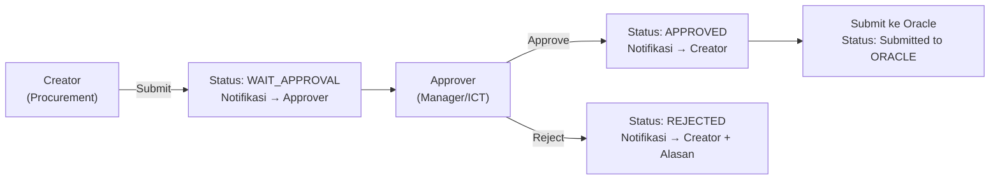
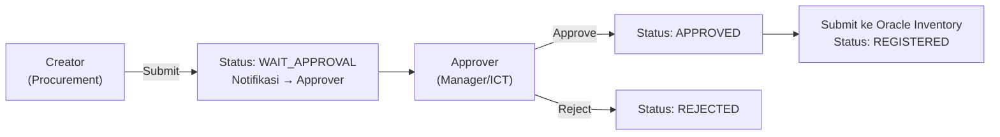

# FUNCTIONAL SPECIFICATION DOCUMENT (FSD)
## Modul: Oracle Registration – Item Trial & Item Production
### Sistem: IDC System (New RM Selection)

---

| Atribut                | Keterangan                                                   |
|------------------------|--------------------------------------------------------------|
| **Nama Dokumen**       | FSD Modul Oracle Registration – Item Trial & Item Production |
| **Versi**              | 1.1                                                          |
| **Tanggal**            | 9 April 2026                                                 |
| **Divisi**             | Procurement / ICT                                            |
| **Status**             | Draft                                                        |
| **Dibuat oleh**        | Tim ICT – IDC System                                         |

---

## Riwayat Revisi

| Versi   | Tanggal      | Diubah Oleh | Keterangan                                                                                                |
|---------|--------------|-------------|-----------------------------------------------------------------------------------------------------------|
| **1.0** | **Apr 2026** | **Tim ICT** | Initial draft – Migrasi dan modernisasi modul Oracle Registration dari sistem lama (RMPM)                 |
| **1.1** | **Apr 2026** | **Tim ICT** | Revisi: Detail per-tab, per-LOV, per-popup. Tambah screenshot tiap komponen UI. CRUD dibahas per section. |

---

## Daftar Isi

1. [Pendahuluan](#1-pendahuluan)
2. [Ringkasan Business Flow](#2-ringkasan-business-flow)
3. [Modul 1: Item Trial](#3-modul-1-item-trial)
   - 3.1 [Halaman Index – Item Trial](#31-halaman-index--item-trial)
   - 3.2 [Halaman Detail – Item Trial](#32-halaman-detail--item-trial)
   - 3.3 [Tab 1: Item Trial Setup](#33-tab-1-item-trial-setup)
   - 3.4 [Tab 2: Inventory Setup](#34-tab-2-inventory-setup)
   - 3.5 [Tab 3: Purchasing Setup](#35-tab-3-purchasing-setup)
   - 3.6 [Popup & Konfirmasi – Item Trial](#36-popup--konfirmasi--item-trial)
4. [Modul 2: Item Production](#4-modul-2-item-production)
   - 4.1 [Halaman Index – Item Production](#41-halaman-index--item-production)
   - 4.2 [Halaman Detail – Item Production](#42-halaman-detail--item-production)
   - 4.3 [Mode Selector: Trial vs Non-Trial](#43-mode-selector-trial-vs-non-trial)
   - 4.4 [Tab 1: Item Production (General Info)](#44-tab-1-item-production-general-info)
   - 4.5 [LOV – Item Code Trial](#45-lov--item-code-trial)
   - 4.6 [LOV – Primary UOM](#46-lov--primary-uom)
   - 4.7 [Accordion: Barcode](#47-accordion-barcode)
   - 4.8 [Accordion: MD Number (AKASIA)](#48-accordion-md-number-akasia)
   - 4.9 [Accordion: Halal Number](#49-accordion-halal-number)
   - 4.10 [Section: Compliance & Certification](#410-section-compliance--certification)
   - 4.11 [LOV – Halal Country](#411-lov--halal-country)
   - 4.12 [LOV – Halal Logo (RM Only)](#412-lov--halal-logo-rm-only)
   - 4.13 [LOV – Halal Body (RM Only)](#413-lov--halal-body-rm-only)
   - 4.14 [Section: Purchasing Information](#414-section-purchasing-information)
   - 4.15 [LOV – Supplier Name](#415-lov--supplier-name)
   - 4.16 [LOV – Principal Name](#416-lov--principal-name)
   - 4.17 [Tab 2: Measurement](#417-tab-2-measurement)
   - 4.18 [Popup & Konfirmasi – Item Production](#418-popup--konfirmasi--item-production)
5. [Struktur Database & ERD](#5-struktur-database--erd)
6. [Aturan Bisnis (Business Rules)](#6-aturan-bisnis-business-rules)
7. [List of Values (LOV) & Referensi Data](#7-list-of-values-lov--referensi-data)
8. [Hak Akses & Peran Pengguna](#8-hak-akses--peran-pengguna)
9. [Alur Persetujuan (Approval Flow)](#9-alur-persetujuan-approval-flow)
10. [Appendix A – Status & Mapping Field](#appendix-a--status--mapping-field)

---

## 1. Pendahuluan

### 1.1 Latar Belakang

Modul **Oracle Registration** adalah bagian dari sistem IDC (*Integrated Data Center*) yang bertanggung jawab atas proses pendaftaran data item baru ke sistem ERP Oracle. Modul ini merupakan ujung dari siklus *Raw Material (RM) Selection*, di mana setelah sebuah bahan baku dievaluasi dan disetujui melalui **RM Sample Management**, data item tersebut harus didaftarkan secara resmi ke Oracle Inventory untuk dapat digunakan dalam proses pengadaan dan produksi.

Modul ini terdiri dari dua sub-menu utama:

1. **Item Trial** – Proses pendaftaran item dengan status *trial* (percobaan), sebagai langkah awal sebelum item resmi masuk ke production. Terdiri dari 3 tab: **Item Trial Setup**, **Inventory Setup**, dan **Purchasing Setup**.

2. **Item Production** – Proses pendaftaran item yang siap diproduksi secara komersial. Terdiri dari 2 tab: **Item Production** (General Info) dan **Measurement**. Dilengkapi mode selector Trial/Non-Trial dan 3 accordion sub-table (Barcode, MD Number, Halal Number).

### 1.2 Tujuan Dokumen

Dokumen ini bertujuan untuk:

1. Mendeskripsikan fungsionalitas **per komponen** (tab, accordion, LOV, popup) dari modul Oracle Registration.
2. Menjadi acuan pengembangan bagi tim ICT IDC System.
3. Mendokumentasikan alur proses bisnis, desain layar, CRUD per section, LOV, dan aturan bisnis.
4. Mendokumentasikan behaviour field, validasi, dan interaksi antar modul.
5. Mendokumentasikan proses migrasi dari sistem lama (KN2015_RMPM.WEB) ke arsitektur baru IDC System.

### 1.3 Ruang Lingkup

| Halaman                    | Tujuan                                                    |
|----------------------------|-----------------------------------------------------------|
| `ItemTrialIndex.html`      | Daftar & monitoring seluruh Item Trial                    |
| `ItemTrialDetail.html`     | Form input/edit Item Trial (3 tab)                        |
| `ItemProductionIndex.html` | Daftar & monitoring seluruh Item Production               |
| `ItemProductionDetail.html`| Form input/edit Item Production (2 tab, 3 sub-tabel)      |

### 1.4 Stakeholder

| Peran                  | Tim / Divisi             | Keterlibatan                                                       |
|------------------------|--------------------------|--------------------------------------------------------------------|
| Business Owner         | Procurement / R&D        | Pemilik proses bisnis, validasi kebutuhan fungsional               |
| ICT Developer          | KN IT / IDC System Team  | Pengembangan dan implementasi modul                                |
| RM Requestor / PIC     | Procurement              | Pengguna utama, membuat Item Trial setelah RM disetujui            |
| Production Coordinator | Produksi / Supply Chain  | Menggunakan data Item Production untuk BOM dan pengadaan           |
| Oracle ERP Admin       | ICT / ERP                | Menerima data staging dan memproses registrasi ke Oracle Inventory |
| Approver               | Manager / Supervisor ICT | Memberikan persetujuan sebelum data dikirim ke Oracle              |

---

## 2. Ringkasan Business Flow

### 2.1 Konteks Posisi dalam Alur RM Selection

```
RM Sample Management
     │
     ▼ (Evaluation APPROVED)
Oracle Registration – Item Trial
     │
     ▼ (Trial APPROVED & Submitted to Oracle)
Oracle Registration – Item Production
     │
     ▼ (Production REGISTERED)
Oracle Inventory (ERP Production Data)
```

### 2.2 Flow Diagram – Proses Oracle Registration

```mermaid
flowchart TD
    Start(["Mulai"]) --> RMApproved["RM Sample Evaluation\nDisetujui"]
    RMApproved --> CreateTrial["Buat Item Trial\n(ItemTrialDetail.html)"]
    CreateTrial --> FillTrial["Isi Data:\n- Item Template\n- RM Eval No\n- Item Code Trial\n- Primary UOM\n- IO / Inventory Setup\n- Purchasing Setup"]
    FillTrial --> SaveDraft["Save Draft"]
    SaveDraft --> ReviewTrial["Review & Submit\nItem Trial"]
    ReviewTrial --> ApprovalTrial{"Approval\nRequired?"}
    ApprovalTrial -->|"Ya"| WaitApproval["Waiting For Approval"]
    WaitApproval --> ApproverAction{"Keputusan\nApprover"}
    ApproverAction -->|"Approve"| ApprovedTrial["Status: APPROVED"]
    ApproverAction -->|"Reject"| RejectedTrial(["REJECTED"])
    ApprovedTrial --> SubmitOracle["Submit to Oracle\n(Status: Submitted to ORACLE)"]
    ApprovalTrial -->|"Tidak"| ApprovedTrial

    SubmitOracle --> CreateProd["Buat Item Production\n(ItemProductionDetail.html)"]
    CreateProd --> SelectMode{"Mode\nProduksi"}
    SelectMode -->|"Trial"| TrialMode["Pilih Item Code Trial\nvia LOV"]
    SelectMode -->|"Non-Trial"| NonTrialMode["Input langsung\ntanpa Trial Code"]

    TrialMode --> FillProd["Isi Data:\n- Item Code / General Item\n- Shelf Life\n- Item Description\n- Primary UOM\n- Compliance Data\n- Purchasing Info\n- Measurement (Tab 2)"]
    NonTrialMode --> FillProd
    FillProd --> SaveProd["Save Draft"]
    SaveProd --> SubmitProd["Submit Item Production"]
    SubmitProd --> ApprovalProd{"Approval?"}
    ApprovalProd -->|"Ya"| WaitProdApproval["Waiting For Approval"]
    WaitProdApproval --> ProdApproverAction{"Keputusan"}
    ProdApproverAction -->|"Approve"| OracleIntegration["Submit ke Oracle\nInventory (ERP)"]
    ProdApproverAction -->|"Reject"| RejectedProd(["REJECTED"])
    ApprovalProd -->|"Tidak"| OracleIntegration
    OracleIntegration --> Registered(["REGISTERED\n(Selesai)"])

    style Start fill:#8CC63F,color:#fff,stroke:#009B4D
    style Registered fill:#388E3C,color:#fff,stroke:#1B5E20
    style RejectedTrial fill:#D32F2F,color:#fff,stroke:#B71C1C
    style RejectedProd fill:#D32F2F,color:#fff,stroke:#B71C1C
    style CreateTrial fill:#FFF3CD,stroke:#FFC107
    style CreateProd fill:#D1ECF1,stroke:#17A2B8
    style OracleIntegration fill:#E2E3E5,stroke:#6C757D
```



### 2.3 Status Dokumen

| Kode Status        | Label                | Warna Badge | Keterangan                                                              |
|--------------------|----------------------|-------------|-------------------------------------------------------------------------|
| `DRAFT`            | Draft                | Abu-abu     | Baru dibuat, belum disubmit                                             |
| `WAIT_APPROVAL`    | Waiting For Approval | Cyan        | Menunggu persetujuan Approver                                           |
| `APPROVED`         | Approved             | Hijau       | Sudah disetujui, siap dikirim ke Oracle                                 |
| `SUBMITTED_ORACLE` | Submitted to ORACLE  | Biru        | Telah dikirim ke staging Oracle (Item Trial)                            |
| `REJECTED`         | Rejected             | Merah       | Ditolak oleh Approver                                                   |
| `REGISTERED`       | Registered           | Biru tua    | Sudah terdaftar di Oracle Inventory (Item Production)                   |

---

## 3. Modul 1: Item Trial

### 3.1 Halaman Index – Item Trial

**Path File**: `ItemTrialIndex.html`

**Tujuan**: Menampilkan seluruh data Item Trial dalam bentuk dashboard ringkasan + DataTable dengan kemampuan filter per status.

**Tampilan Halaman:**


#### 3.1.1 Dashboard Summary Cards

Terdapat 5 kartu interaktif di bagian atas yang berfungsi sebagai filter visual sekaligus ringkasan jumlah dokumen:

| Kartu               | Filter Code     | Warna Ikon   | ID Counter      | DataTable Search Pattern             |
|---------------------|-----------------|--------------|-----------------|--------------------------------------|
| Total               | `ALL`           | Navy         | `totalCount`    | Kosongkan search (tampil semua)      |
| Draft               | `DRAFT`         | Kuning/Amber | `draftCount`    | Search kolom 0: "Draft"              |
| Waiting Approval    | `WAIT_APPROVAL` | Cyan         | `pendingCount`  | Search kolom 0: "Waiting For Approval"|
| Approved            | `APPROVED`      | Hijau        | `approvedCount` | Search kolom 0: "Approved"           |
| Submitted to Oracle | `SUBMITTED`     | Biru         | `submittedCount`| Search kolom 0: "Submitted to ORACLE"|

**Behaviour Kartu:**
- Klik kartu → kartu aktif memiliki border tebal + shadow berwarna sesuai status.
- DataTable otomatis memfilter berdasarkan nilai di kolom "Document Status" (kolom index 0).
- Kartu aktif pertama kali adalah **Total** (ALL).
- Jumlah counter di-update secara dinamis saat data di-load dari API/mock data.

#### 3.1.2 Action Bar

| Tombol              | ID          | Posisi         | Fungsi                                                         |
|---------------------|-------------|----------------|----------------------------------------------------------------|
| Export Excel        | `btnExport` | Kiri           | Export data tabel ke format Excel (.xlsx) via API              |
| Create New Item Trial | `btnNew`  | Kanan          | Navigasi ke `ItemTrialDetail.html` tanpa parameter `?id=`      |

#### 3.1.3 DataTable – Daftar Item Trial

**ID Tabel**: `dataTableItemTrial` (diinisialisasi oleh `MasterPage.initIndex()`)

| Kolom          | Field Key      | Render                                                          | Sortable |
|----------------|----------------|-----------------------------------------------------------------|----------|
| Document Status| `status`       | Badge berwarna: Draft=abu, Waiting=cyan, Approved=hijau         | Ya       |
| Item Template  | `template`     | Text biasa (RM TRIAL / PM TRIAL)                                | Ya       |
| Item Code      | `itemCode`     | Link biru ke `ItemTrialDetail.html?id={interfaceId}`            | Ya       |
| Description    | `itemDesc`     | Text biasa                                                      | Ya       |
| Primary UOM    | `uom`          | Text biasa (kg, liter, pcs)                                     | Ya       |
| Created By     | `createdBy`    | Text biasa                                                      | Ya       |
| Created Date   | `createdDate`  | Format tanggal                                                  | Ya (default desc) |
| Next Approver  | `nextApprover` | Text nama approver dari sistem Magic                            | Tidak    |
| Action         | `action`       | Tombol **View** → `ItemTrialDetail.html?id={interfaceId}`       | Tidak    |

**CRUD dari Halaman Index:**

| Operasi    | Cara                                                            | Keterangan                                        |
|------------|-----------------------------------------------------------------|---------------------------------------------------|
| **Create** | Klik tombol "Create New Item Trial"                             | Buka detail form kosong (mode Create)             |
| **Read**   | Klik link "Item Code" atau tombol "View" di kolom Action        | Buka detail form terisi data (mode Read/Edit)     |
| **Update** | Dari halaman detail (tombol Save Draft)                         | Tidak bisa edit langsung dari Index               |
| **Delete** | Tidak tersedia di UI (soft delete via Admin)                    | Hanya status DRAFT yang dapat dihapus             |

#### 3.1.4 Business Rules Index

| Kondisi Status      | Action Tersedia   | Keterangan                                              |
|---------------------|-------------------|---------------------------------------------------------|
| Draft               | View / Edit       | Dapat diedit dan dihapus (soft delete via Admin)        |
| Waiting Approval    | View (Read-only)  | Tidak dapat diedit selama menunggu persetujuan          |
| Approved            | View (Read-only)  | Read-only setelah disetujui                             |
| Submitted to Oracle | View (Read-only)  | Data sudah dikirim ke Oracle staging                    |
| Rejected            | View / Edit       | Dapat diedit ulang dan disubmit kembali                 |

---

### 3.2 Halaman Detail – Item Trial

**Path File**: `ItemTrialDetail.html`

**Tujuan**: Form untuk membuat atau mengedit data Item Trial. Terdiri dari **3 tab** yang terorganisir secara logis.

**Tampilan Halaman:**


#### 3.2.1 Struktur Halaman

```
[Page Toolbar]
    ┌─────────────────────────────────────────────────────────┐
    │  ✎ Item Trial                                           │
    │  Create / Edit Detail Information of Item Trial         │
    │                           [Submit] [Save Draft] [Back]  │
    └─────────────────────────────────────────────────────────┘

[Tab Navigation]
    ┌──────────────────────┬──────────────────┬──────────────────┐
    │  ℹ Tab 1:            │  🏭 Tab 2:       │  🛒 Tab 3:       │
    │  Item Trial Setup    │  Inventory Setup  │  Purchasing Setup│
    └──────────────────────┴──────────────────┴──────────────────┘

[Tab Content Area]
    - (Konten berubah sesuai tab yang aktif)
```

#### 3.2.2 Toolbar Actions

| Tombol     | ID          | Warna   | Kondisi      | Fungsi                                                       |
|------------|-------------|---------|--------------|--------------------------------------------------------------|
| Submit     | `btnSubmit` | Warning | Selalu aktif | Submit data untuk proses approval (validasi mandatory fields dulu) |
| Save Draft | `btnSave`   | Success | Selalu aktif | Simpan sebagai Draft, bisa dilanjutkan nanti                 |
| Back       | —           | Outline | Selalu aktif | Kembali ke `ItemTrialIndex.html` tanpa simpan                |

---

### 3.3 Tab 1: Item Trial Setup

**Tab ID**: `#tab-item-trial`  
**Icon**: `fas fa-info-circle`

Tab ini berisi informasi utama item trial. Dibagi menjadi **2 panel kolom** (kiri & kanan).


#### 3.3.1 Panel Kiri – Informasi Utama

| Field Name      | ID Elemen       | Tipe            | Mandatory | Default     | Keterangan                                                                          |
|-----------------|-----------------|-----------------|-----------|-------------|-------------------------------------------------------------------------------------|
| Item Template   | `itemTemplate`  | Text (readonly) | Ya        | (kosong)    | Diisi via LOV. Menentukan logika seluruh form. Tombol LOV: `btnItemTemplate`        |
| RM Eval No      | `rmEvalNo`      | Text + LOV btn  | Ya        | (kosong)    | Nomor Evaluasi RM. Tombol LOV: `btnRmEval`. Auto-fill 3 field lain setelah dipilih  |
| Item Code Trial | `itemCodeTrial` | Text (readonly) | Ya (Auto) | (auto-fill) | Auto-isi dari pemilihan RM Eval No                                                  |
| Item Description| `itemDesc`      | Textarea (readonly) | Tidak | (auto-fill) | Auto-isi deskripsi material dari RM Eval No                                         |

**Business Rule – Item Template:**

```
Template dipilih via LOV (btnItemTemplate):
  RM TRIAL → Item Type di Inventory = "RM", Purchasing Types = "INDIRECT2"
  PM TRIAL → Item Type di Inventory = "PM"

Jika template sudah dipilih dan user ganti ke template lain:
  → Muncul konfirmasi SweetAlert: "Change Item Template?"
  → Jika OK: data form dihapus, template baru diterapkan
  → Jika Cancel: template tidak berubah
```

**LOV: Item Template**

Menggunakan generic LOV (`openLOV()`). Berisi daftar statis:

| Code     | Description                |
|----------|----------------------------|
| RM TRIAL | Raw Material Trial         |
| PM TRIAL | Packaging Material Trial   |

**LOV: RM Eval No**

| Kolom         | Keterangan                                              |
|---------------|---------------------------------------------------------|
| Action        | Tombol **Select** (biru)                                |
| Code          | Nomor evaluasi RM (RMS-24-XXXX)                         |
| Description   | Label: "RMS-24-XXXX (Nama Material)"                    |

**Setelah RM Eval No dipilih, sistem otomatis mengisi:**

| Field         | Sumber Data        |
|---------------|--------------------|
| `itemCodeTrial`| `item.itemCode`   |
| `itemDesc`    | `item.desc`        |
| `primaryUOM`  | `item.uom`         |
| `packingSize` | `item.netWeight`   |


#### 3.3.2 Panel Kanan – UOM & Packaging

| Field Name   | ID Elemen    | Tipe              | Mandatory | Default | Validasi                    | Keterangan                                   |
|--------------|--------------|-------------------|-----------|---------|-----------------------------|----------------------------------------------|
| Primary UOM  | `primaryUOM` | Text + LOV btn    | Ya        | (auto)  | Harus dipilih dari LOV      | Tombol LOV: `btnUOM`. Sumber: Oracle MTL_UOM |
| Packing Size | `packingSize`| Number (readonly) | Tidak     | (auto)  | ≥ 0                         | Auto-isi dari Net Weight RM Evaluation       |
| Pallet Size  | `palletSize` | Number (editable) | Tidak     | 9999    | ≥ 0, harus ≥ Packing Size   | Dapat diubah user                            |

**LOV: Primary UOM**


| Kolom    | Keterangan                         |
|----------|------------------------------------|
| Action   | Tombol **Select** (biru)           |
| Code     | Kode UOM (KG, LT, EA, ROL, PCS)   |
| Description | Nama lengkap unit               |

**Sumber data**: `Oracle MTL_UNITS_OF_MEASURE_TL` (via API endpoint `AllUOM`)

LOV ini dilengkapi **filter/search bar** di bagian atas popup untuk mempermudah pencarian satuan.

**Validasi Pallet Size vs Packing Size:**

```
Syarat: palletSize >= packingSize
Jika TIDAK memenuhi → SweetAlert Error:
  "Pallet Size must be greater than or equal to Packing Size."
  Focus diarahkan ke field palletSize
```

#### 3.3.3 Notes Banner (Info Box)

Di bawah kedua panel, terdapat **banner informasi** berwarna gelap (bg-dark) dengan teks putih:

```
ℹ️ Catatan:
• Pilih Item Template terlebih dahulu untuk mengaktifkan pencarian Item Code
• RM TRIAL → Item Type otomatis "RM" | PM TRIAL → Item Type otomatis "PM"
• Mengubah template akan menghapus semua data yang sudah diisi
• Description & UOM auto-isi dari pilihan Item Code
```

#### 3.3.4 CRUD – Tab Item Trial Setup

| Operasi    | Cara                                         | Keterangan                                                |
|------------|----------------------------------------------|-----------------------------------------------------------|
| **Create** | Buka halaman tanpa `?id=` query string       | Semua field kosong, siap diisi dari awal                  |
| **Read**   | Buka halaman dengan `?id={interfaceId}`      | Field terisi dari data tersimpan (loadFromQueryString)    |
| **Update** | Edit field → klik **Save Draft**             | Hanya field non-readonly bisa diubah                      |
| **Submit** | Klik **Submit** → konfirmasi SweetAlert      | Validasi mandatory dulu, lalu ubah status ke WAIT_APPROVAL|
| **Delete** | Tidak ada tombol di halaman detail           | Hanya via Admin atau dari halaman Index (jika status DRAFT)|

---

### 3.4 Tab 2: Inventory Setup

**Tab ID**: `#tab-inventory`  
**Icon**: `fas fa-warehouse`

Berisi konfigurasi data inventory untuk Oracle Inventory module yang bersifat SHP-specific.


#### 3.4.1 Panel Kiri – SHP Inventory Configuration

| Field Name   | ID Elemen    | Tipe                  | Mandatory | Default | Keterangan                                                                              |
|--------------|--------------|-----------------------|-----------|---------|-----------------------------------------------------------------------------------------|
| IO           | `ioCode`     | Select2 Multi-select  | Ya        | —       | Inventory Organization. List IO SHP. Minimal 1 harus dipilih. Sumber: Oracle `MTL_PARAMETERS` |
| Item Type    | `itemType`   | Text (readonly)       | Ya        | RM/PM   | Auto dari Item Template (RM TRIAL → "RM", PM TRIAL → "PM"). Hardcoded                  |
| Item Sub Type| `itemSubType`| Text (readonly)       | Tidak     | ALL     | Nilai tetap "ALL". Hardcoded                                                            |
| Item LOB     | `itemLob`    | Text (readonly)       | Tidak     | KNG     | Line of Business: KNG (Kalbe Nutritionals Group). Hardcoded                             |

**Daftar IO yang Tersedia (Select2 Multi-select):**

| Baris 1 | Baris 2 | Baris 3 | Baris 4 | Baris 5 |
|---------|---------|---------|---------|---------|
| ISA     | SHP     | KMI     | KAM     | MBI     |
| NKK     | MPR     | UJA     | RTS     | TMB     |
| TPI     | MAR     | FIN     | TRS     | LNK     |
| DKE     | KNS     | BTU     | ALN     | MDT     |
| GVN     | IDC     | AVI     | ABC     | PTP     |
| QAC     | GPP     | —       | —       | —       |

**Business Rule IO:**
- Menggunakan komponen **Select2** (dropdown searchable multi-select)
- User dapat memilih **satu atau lebih** IO
- Minimal **1 IO wajib dipilih** sebelum form bisa disimpan/disubmit
- Pemilihan IO menentukan di organisasi Oracle mana item ini akan didaftarkan

#### 3.4.2 Panel Kanan – Data Turunan (Hardcoded)

| Field Name       | ID Elemen         | Tipe           | Default  | Keterangan                                          |
|------------------|-------------------|----------------|----------|-----------------------------------------------------|
| Corporate LOB    | `corporateLob`    | Text (readonly)| SHP_NA   | Kode corporate Line of Business. Nilai tetap        |
| Product Category | `productCategory` | Text (readonly)| NA       | Kategori produk. Nilai "Not Applicable"             |
| Production Site  | `productionSite`  | Text (readonly)| NA       | Lokasi produksi. Nilai "Not Applicable"             |

> **Catatan**: Semua field di panel kanan bersifat **hardcoded** (readonly). Nilai-nilai ini merupakan konfigurasi standar Oracle untuk organisasi SHP dan tidak dapat diubah oleh user.

#### 3.4.3 CRUD – Tab Inventory Setup

| Operasi    | Cara                                | Keterangan                                                         |
|------------|-------------------------------------|--------------------------------------------------------------------|
| **Create** | Pilih IO dari dropdown Select2      | IO bisa multiple select                                            |
| **Read**   | Data IO ter-restore dari database   | Multi-select menampilkan semua IO yang pernah dipilih              |
| **Update** | Ubah pilihan IO → Save Draft        | Hanya field IO yang bisa diubah user; lainnya hardcoded            |
| **Delete** | Tidak ada operasi delete per field  | Field hardcoded tidak bisa dihapus nilainya                        |

---

### 3.5 Tab 3: Purchasing Setup

**Tab ID**: `#tab-purchasing`  
**Icon**: `fas fa-shopping-cart`

Berisi konfigurasi data purchasing untuk Oracle Purchasing module. **Seluruh field bersifat hardcoded** (readonly).


#### 3.5.1 Panel Kiri

| Field Name       | ID              | Tipe           | Nilai Default | Keterangan                                          |
|------------------|-----------------|----------------|---------------|-----------------------------------------------------|
| Purchasing Types | `purchasingTypes`| Text (readonly)| INDIRECT2     | Tipe purchasing standar organisasi SHP              |
| Item Types       | `itemTypes`     | Text (readonly)| RM / PM       | Sama dengan Item Type di Inventory Setup            |

#### 3.5.2 Panel Kanan

| Field Name    | ID            | Tipe           | Nilai Default | Keterangan                                              |
|---------------|---------------|----------------|---------------|---------------------------------------------------------|
| Item Sub Types| `itemSubTypes`| Text (readonly)| ALL           | Subtipe item, nilai tetap "ALL"                         |
| SHP Future    | `shpFuture`   | Text (readonly)| ALL           | Flag SHP Future untuk konfigurasi Oracle item attribute |

> **Catatan**: Semua nilai adalah konfigurasi Oracle standar yang ditentukan oleh tim ERP. User tidak dapat mengubah nilai apapun di tab ini. Tab ini hanya bersifat informatif untuk memverifikasi konfigurasi yang akan dikirim ke Oracle.

---

### 3.6 Popup & Konfirmasi – Item Trial

Seluruh popup menggunakan library **SweetAlert2** (Swal).

#### 3.6.1 Popup – Validasi Error (Mandatory)

**Dipicu oleh**: Klik Save Draft atau Submit saat field mandatory belum diisi.

**Field Mandatory yang Divalidasi:**
| Field         | ID Elemen       | Pesan Error                             |
|---------------|-----------------|------------------------------------------|
| Item Template | `itemTemplate`  | "Item Template is required."            |
| Item Code Trial| `itemCodeTrial`| "Item Code Trial is required."          |
| Primary UOM   | `primaryUOM`    | "Primary UOM is required."              |
| Pallet Size   | `palletSize`    | "Pallet Size must be ≥ Packing Size."   |

**Tampilan Popup Error:**
- Icon: ❌ (error)
- Tombol: **OK**
- Setelah ditutup: focus diarahkan ke field yang error

#### 3.6.2 Popup – Save Draft (Berhasil)

**Dipicu oleh**: Klik tombol **Save Draft** setelah validasi lulus.


| Atribut    | Nilai                                    |
|------------|------------------------------------------|
| Title      | "Saved!"                                 |
| Text       | "Item Trial has been saved as Draft."   |
| Icon       | ✅ (success)                             |
| Tombol     | **OK**                                   |

#### 3.6.3 Popup – Submit Konfirmasi

**Dipicu oleh**: Klik tombol **Submit** setelah validasi lulus.


**Langkah 1 – Konfirmasi:**

| Atribut    | Nilai                                        |
|------------|----------------------------------------------|
| Title      | "Submit Item Trial?"                         |
| Text       | "Data will be submitted for approval."       |
| Icon       | ❓ (question)                                |
| Tombol     | **Submit** (biru primary) + **Cancel**       |

**Langkah 2 – Berhasil disubmit (setelah klik Submit):**

| Atribut    | Nilai                                        |
|------------|----------------------------------------------|
| Title      | "Submitted!"                                 |
| Icon       | ✅ (success)                                 |
| Timer      | Auto-close 1500ms (tanpa tombol konfirmasi)  |

#### 3.6.4 Popup – Ganti Item Template

**Dipicu oleh**: User memilih template berbeda dari yang sudah terisi.

| Atribut        | Nilai                                                                                   |
|----------------|-----------------------------------------------------------------------------------------|
| Title          | "Change Item Template?"                                                                 |
| HTML           | "Changing template from **[lama]** to **[baru]** will clear your current form data."   |
| Icon           | ⚠️ (warning)                                                                           |
| Tombol         | **OK** (hijau) + **Cancel**                                                             |
| Setelah OK     | Form dihapus, template baru diterapkan, muncul success mini-popup auto-close 1500ms    |
| Setelah Cancel | Template tidak berubah, form tidak terhapus                                             |

---

## 4. Modul 2: Item Production

### 4.1 Halaman Index – Item Production

**Path File**: `ItemProductionIndex.html`

**Tujuan**: Menampilkan seluruh data Item Production dalam bentuk DataTable dengan dashboard ringkasan status.

**Tampilan Halaman:**


#### 4.1.1 Dashboard Summary Cards

| Kartu           | Filter Code     | Warna Ikon | ID Counter       | DataTable Search                     |
|-----------------|-----------------|------------|------------------|--------------------------------------|
| Total           | `ALL`           | Navy       | `totalCount`     | Kosongkan search                     |
| Draft           | `DRAFT`         | Kuning     | `draftCount`     | Search: "Draft"                      |
| Waiting Approval| `WAIT_APPROVAL` | Cyan       | `pendingCount`   | Search: "Waiting For Approval"       |
| Approved        | `APPROVED`      | Hijau      | `approvedCount`  | Search: "Approved"                   |
| Registered      | `REGISTERED`    | Biru       | `registeredCount`| Regex: "Submitted to ORACLE\|Registered" |

**Catatan**: Status "Registered" menggunakan **regex search** karena mencakup 2 nilai: `Submitted to ORACLE` dan `Registered`.

#### 4.1.2 DataTable – Daftar Item Production

**ID DataTable**: `dataTableItemProduction`

| Kolom          | Field Key       | Render                                                                    | Sortable |
|----------------|-----------------|---------------------------------------------------------------------------|----------|
| Document Status| `status`        | Badge warna sesuai status                                                 | Ya       |
| Item Template  | `template`      | Text (RM / PM / RM TRIAL / PM TRIAL)                                      | Ya       |
| Item Code      | `itemCode`      | Link biru ke `ItemProductionDetail.html?id={interfaceId}`                 | Ya       |
| Description    | `itemDesc`      | Text biasa                                                                | Ya       |
| Primary UOM    | `uom`           | Text biasa                                                                | Ya       |
| Created By     | `createdBy`     | Text biasa                                                                | Ya       |
| Created Date   | `createdDate`   | Format tanggal (default sort descending)                                  | Ya       |
| Next Approver  | `nextApprover`  | Nama approver berikutnya dari sistem Magic                                | Tidak    |
| Action         | `action`        | Tombol **View** → `ItemProductionDetail.html?id={interfaceId}`            | Tidak    |

---

### 4.2 Halaman Detail – Item Production

**Path File**: `ItemProductionDetail.html`

**Tujuan**: Form input/edit data Item Production dengan mode selector Trial/Non-Trial dan 2 tab utama.

**Tampilan Halaman – Trial Mode (Default):**


#### 4.2.1 Struktur Halaman

```
[Page Toolbar]
    ┌─────────────────────────────────────────────────────────────────┐
    │  📦 Item Production Detail         [Trial Mode Badge]           │
    │  Create or update Item Production information                   │
    │                         [Save] [Submit] [Print] [◀ Back]       │
    └─────────────────────────────────────────────────────────────────┘

[Mode Selector Card]
    ┌─────────────────────────────────────────────────────────────────┐
    │ Production Process Mode                                          │
    │ Select whether item originates from Trial or Non-Trial          │
    │                              [🔬 Trial]  [🏭 Non-Trial]        │
    └─────────────────────────────────────────────────────────────────┘

[Tab Navigation]
    ┌───────────────────────────┬──────────────────────────────┐
    │ ℹ Tab 1: Item Production  │ 📐 Tab 2: Measurement        │
    └───────────────────────────┴──────────────────────────────┘

[Tab Content]
    - Tab 1:
        Panel Kiri: Item Information + 3 Accordion Sub-Table
        Panel Kanan: Compliance & Certification + Purchasing

    - Tab 2:
        Packaging & Pallet
        Unit Conversion
        Weight & Volume
```

#### 4.2.2 Toolbar Actions

| Tombol   | ID          | Warna   | Status Awal   | Fungsi                                                               |
|----------|-------------|---------|---------------|----------------------------------------------------------------------|
| Save     | `btnSave`   | Success | Enabled       | Simpan sebagai Draft; validasi mandatory fields                      |
| Submit   | `btnSubmit` | Warning | Enabled       | Submit untuk approval; validasi mandatory fields                     |
| Print    | `btnPrint`  | Info    | **Disabled**  | Print dokumen. ENABLED hanya setelah dokumen memiliki `id` (edit mode)|
| Back     | —           | Outline | —             | Kembali ke `ItemProductionIndex.html` tanpa menyimpan               |

---

### 4.3 Mode Selector: Trial vs Non-Trial

Mode selector adalah komponen Toggle Radio Button yang berada di atas tab navigation.

| Mode      | Radio ID      | Value      | Badge Judul      | Keterangan                                               |
|-----------|---------------|------------|------------------|----------------------------------------------------------|
| Trial     | `modeTrial`   | `TRIAL`    | "Trial Mode" (biru)| Default. Item Production berasal dari Item Trial        |
| Non-Trial | `modeNonTrial`| `NONTRIAL` | "Non-Trial Mode" (kuning) | Item Production langsung tanpa Trial Code        |

**Tampilan – Non-Trial Mode:**


**Popup Konfirmasi Ganti Mode:**


Saat user mengklik mode yang berbeda dari mode aktif:

| Atribut      | Nilai                                                        |
|--------------|--------------------------------------------------------------|
| Title        | "Are you sure?"                                              |
| Text         | "Changing mode will clear all currently filled data!"        |
| Icon         | ⚠️ (warning)                                                |
| Tombol       | **Yes, change it!** (primary) + **Cancel** (secondary)       |
| Setelah Yes  | Mode berubah, form di-reset, muncul success popup           |
| Setelah Cancel | Mode tidak berubah, radio button kembali ke posisi semula |

**Efek Mode pada Form:**

| Field/Komponen   | Mode Trial                              | Mode Non-Trial                          |
|------------------|-----------------------------------------|-----------------------------------------|
| Label field LOV  | "Item Code Trial"                       | "Item Code"                             |
| Sumber LOV Code  | Dari Item Trial yang ter-approve        | Dari Oracle MTL_SYSTEM_ITEMS_B          |
| Badge Header     | "Trial Mode" (bg-primary/biru)          | "Non-Trial Mode" (bg-warning)           |
| Tombol btnItemCodeTrial | LOV ke Item Trial APPROVED       | LOV ke Oracle Item langsung             |

---

### 4.4 Tab 1: Item Production (General Info)

**Tab ID**: `#tab-general`  
**Icon**: `fas fa-info-circle`

Terdiri dari **2 panel kolom** (kiri & kanan).

#### 4.4.1 Panel Kiri – Item Information

| Field Name          | ID Elemen          | Tipe            | Mandatory    | Keterangan                                                                                |
|---------------------|--------------------|-----------------|--------------|-------------------------------------------------------------------------------------------|
| Item Template       | `itemTemplate`     | Dropdown Select | Ya           | Pilih RM atau PM via dropdown. Tooltip info-circle ada di sebelah kanan                   |
| Item Code Trial     | `itemCodeTrial`    | Text + LOV btn  | Ya (Trial)   | LOV ke Item Trial approved. Tombol: `btnItemCodeTrial`. Label berubah berdsarkan mode     |
| Item Code (General) | `generalItem`      | Text (readonly) | —            | Auto-isi dari pemilihan Item Code Trial                                                   |
| General Item (New/Existing) | `genNew`/`genExist` | Radio Btn | Tidak   | Pilih New = item baru di Oracle, Existing = item sudah ada di Oracle                      |
| Segment 1 (Oracle Item) | `segment1`    | Text + LOV btn  | Conditional  | Wajib jika General Item = "Existing". Tombol: `btnItemCodePM`                             |
| Shelf Life (Month)  | `shelfLife`        | Number          | Tidak        | Masa simpan dalam bulan. Default 0                                                        |
| Shelf Life Open Pack (Days) | `shelfLifeOpenPack` | Number | Tidak      | Masa simpan setelah kemasan dibuka (hari). Default 0                                      |
| Item Description    | `itemDescription`  | Textarea        | Ya           | Deskripsi lengkap item. Min 3 karakter                                                    |
| Closed Code         | `closedCode`       | Textarea        | Ya           | Kode tertutup / internal alias item. Max 200 karakter                                     |
| Primary UOM         | `primaryUOM`       | Text + LOV btn  | Ya           | UOM utama. Tombol: `btnItemUOM`. Sumber: Oracle `MTL_UNITS_OF_MEASURE_TL`                 |

**Business Rule – Dropdown Template RM vs PM:**

```
RM → Tampil: Halal Logo, Halal Body
     Sembunyikan: Forestry fields, Pecah KN
     
PM → Tampil: Forestry fields, Pecah KN
     Sembunyikan: Halal Logo, Halal Body
     
Ganti template saat data sudah ada:
  → SweetAlert warning: "Switching RM/PM will clear all inputs and sub-tables!"
  → Jika OK: Clear form + clear 3 accordion (Barcode, MD, Halal) + re-render Compliance UI
```

**Business Rule – General Item Radio:**

```
New (N):
  → Tombol LOV Segment1 (btnItemCodePM) DISABLED
  → Field Segment1 auto-isi dari nilai GENERAL_ITEM (Trial Code)

Existing (E):
  → Tombol LOV Segment1 (btnItemCodePM) ENABLED  
  → Field Segment1 dikosongkan, user wajib pilih Oracle item dari LOV
```

---

### 4.5 LOV – Item Code Trial

**Modal ID**: `lovItemTrialModal`  
**Tombol Trigger**: `btnItemCodeTrial` (hijau, icon 🔍)


LOV ini menggunakan **DataTable** dengan fitur pagination (5 rows per page) dan sorting.

**Header LOV:**

| Kolom       | Keterangan                                       |
|-------------|--------------------------------------------------|
| Action      | Tombol **Select** (biru)                         |
| Item Trial  | Kode item trial (RM-TRIAL-XXXX / PM-TRIAL-XXXX)  |
| Item Prod   | Kode item production terkait (jika ada)          |
| Item Desc   | Deskripsi item                                   |
| Packing Size| Ukuran kemasan per unit                          |
| UOM         | Unit of Measure                                  |
| Closed Code | Kode tertutup                                    |
| Creation Date| Tanggal pembuatan item trial                    |

**Sumber Data**: `mockItemTrialRMData` (RM mode) / `mockItemTrialPMData` (PM mode) → API: `XXSHP_INV_MASTER_ITEM_STG` filter by template + status ≥ APPROVED.

**Setelah Select:**
```
itemCodeTrial  ← row.itemTrial
generalItem    ← row.itemProd  
itemDescription← row.itemDesc
primaryUOM     ← row.uom
closedCode     ← row.closedCode
packingSize    ← row.packingSize (di Measurement tab)
```
→ Tombol `btnSupplier` dan `btnPrincipal` ENABLED  
→ Radio `rbGeneralItem` ENABLED

---

### 4.6 LOV – Primary UOM

**Modal ID**: `lovUomModal`  
**Tombol Trigger**: `btnItemUOM` (hijau)


LOV ini juga digunakan untuk **Unit Conversion** di Tab 2 (From Unit dan To Unit). State `uomTarget` menentukan field mana yang diisi:

| `uomTarget` | Field yang diisi    | Tombol Trigger        |
|-------------|---------------------|-----------------------|
| `PRIMARY`   | `primaryUOM`        | `btnItemUOM`          |
| `FROM`      | `uomConvFrom`       | `btnUomConvFrom`      |
| `TO`        | `uomConvTo`         | `btnUomConvTo`        |

**Kolom LOV:**

| Kolom    | Keterangan            |
|----------|-----------------------|
| Action   | Tombol **Select**     |
| UOM Code | Kode satuan           |
| UOM Name | Nama satuan lengkap   |

**Sumber data**: `Oracle MTL_UNITS_OF_MEASURE_TL` (via API `AllUOM`)

---

### 4.7 Accordion: Barcode

**Section dalam**: Panel Kiri Tab 1 (di bawah Item Information)  
**Tabel ID**: `barcodeTable`  
**Tombol Tambah**: `addBarcodeBtn`  
**Modal LOV ID**: `lovBarcodeModal`

**Tabel Barcode:**

| Kolom   | Keterangan                      |
|---------|---------------------------------|
| No      | Nomor urut (auto)               |
| Barcode | Nilai barcode item              |
| Description| Keterangan barcode           |
| Action  | Tombol hapus `–` (btn-danger)   |

Saat belum ada data, tabel menampilkan baris: *"No data available"*.

**LOV Barcode (`lovBarcodeModal`):**

| Kolom       | Keterangan                           |
|-------------|--------------------------------------|
| Action      | Tombol **Select** (biru)             |
| Barcode     | Nilai barcode                        |
| Item Code   | Kode item terkait barcode            |
| Country     | Negara berlaku                       |
| Description | Deskripsi barcode                    |

**CRUD Barcode:**

| Operasi    | Cara                                      | Keterangan                                                          |
|------------|-------------------------------------------|---------------------------------------------------------------------|
| **Create** | Klik tombol `+` (addBarcodeBtn) → LOV     | Modal Barcode muncul dengan DataTable list. Klik Select             |
| **Read**   | Tampil di tabel `barcodeTable`            | Data dirender dari `state.subTableData.barcode`                     |
| **Update** | Tidak supported inline                    | Hapus row lama, tambah row baru dengan nilai koreksi               |
| **Delete** | Klik tombol `-` (btn-danger) di baris     | Data di-remove dari array `state.subTableData.barcode`, re-render  |

**Validasi:** Barcode yang sudah ada di tabel tidak bisa ditambahkan lagi (duplicate check).

---

### 4.8 Accordion: MD Number (AKASIA)

**Section dalam**: Panel Kiri Tab 1 (di bawah Barcode)  
**Tabel ID**: `mdNumberTable`  
**Tombol Tambah**: `addMDNumberBtn`  
**Modal LOV ID**: `lovMDNumberModal`


**Penjelasan**: MD Number adalah Nomor Registrasi Produk di **BPOM** (Badan Pengawas Obat dan Makanan), dikenal juga sebagai **AKASIA Number**.

**Tabel MD Number:**

| Kolom          | Keterangan                                 |
|----------------|--------------------------------------------|
| No             | Nomor urut (auto)                          |
| MD Number      | Nomor MD / AKASIA (mis: MD-123456789012)   |
| Product Name   | Nama produk dalam sertifikat MD            |
| Production Site| Lokasi produksi tercantum di sertifikat    |
| Expiry Date    | Tanggal kedaluwarsa sertifikat MD          |
| Action         | Tombol hapus `–` (btn-danger)              |

**LOV MD Number (`lovMDNumberModal`):**

| Kolom      | Keterangan                          |
|------------|-------------------------------------|
| Action     | Tombol **Select** (biru)            |
| AKASIA No  | Nomor registrasi BPOM (AKASIA)      |
| MD No      | Nomor Marketing Declaration         |
| Nama Dagang| Nama dagang produk                  |
| Nama Produk| Nama produk yang terdaftar di BPOM  |

**CRUD MD Number:**

| Operasi    | Cara                                       | Keterangan                                                       |
|------------|--------------------------------------------|------------------------------------------------------------------|
| **Create** | Klik `+` (addMDNumberBtn) → Modal LOV      | DataTable list dari `XXSHP_INV_IDC_MDNUMBER_STG` / AKASIA sistem|
| **Read**   | Tampil di `mdNumberTable`                  | Data dari `state.subTableData.mdNumber`                          |
| **Update** | Tidak supported                            | Hapus + tambah ulang                                             |
| **Delete** | Tombol `-` di baris tabel                  | Remove dari array, re-render tabel                               |

---

### 4.9 Accordion: Halal Number

**Section dalam**: Panel Kiri Tab 1 (di bawah MD Number)  
**Tabel ID**: `halalNumberTable`  
**Tombol Tambah**: `addHalalNumberBtn`  
**Modal LOV ID**: `lovHalalNumberModal`

**Tabel Halal Number:**

| Kolom        | Keterangan                                     |
|--------------|------------------------------------------------|
| No           | Nomor urut (auto)                              |
| Halal Number | Nomor sertifikat halal (mis: MUI-12345678)     |
| Product Name | Nama produk dalam sertifikat halal             |
| Expiry Date  | Tanggal kedaluwarsa sertifikat halal           |
| Action       | Tombol hapus `–` (btn-danger)                  |

**LOV Halal Number (`lovHalalNumberModal`):**

| Kolom         | Keterangan                           |
|---------------|--------------------------------------|
| Action        | Tombol **Select** (biru)             |
| Halal Number  | Nomor sertifikat halal               |
| Halal Product | Nama produk dalam sertifikat         |
| Expiry Date   | Tanggal kedaluwarsa sertifikat       |

**CRUD Halal Number:**

| Operasi    | Cara                                         | Keterangan                                                   |
|------------|----------------------------------------------|--------------------------------------------------------------|
| **Create** | Klik `+` (addHalalNumberBtn) → Modal LOV     | DataTable list dari `XXSHP_INV_IDC_HALALNUMBER_STG`          |
| **Read**   | Tampil di `halalNumberTable`                 | Data dari `state.subTableData.halalNumber`                   |
| **Update** | Tidak supported                              | Hapus + tambah ulang                                         |
| **Delete** | Tombol `-` di baris tabel                    | Remove dari array, re-render table                           |

---

### 4.10 Section: Compliance & Certification

**Lokasi**: Panel Kanan Tab 1

Section ini bersifat **dinamis**: konten berubah berdasarkan nilai **Item Template** (RM atau PM).

#### 4.10.1 Field Halal – Berlaku untuk Semua Template

| Field Name   | ID          | Tipe      | Mandatory | Keterangan                                                            |
|--------------|-------------|-----------|-----------|-----------------------------------------------------------------------|
| Halal Country| `country`   | LOV Modal | Tidak     | Negara asal sertifikasi halal. Tombol: `btnCountry`. Sumber: Oracle `FND_LOOKUP_VALUES` |

#### 4.10.2 Field Khusus Template RM (`.group-rm-only`)

Tampil hanya jika Item Template = **RM**.

| Field Name | ID          | Tipe      | Mandatory | Keterangan                                                              |
|------------|-------------|-----------|-----------|-------------------------------------------------------------------------|
| Halal Logo | `halalLogo` | LOV Modal | Tidak     | Tipe logo halal yang muncul di kemasan. Tombol: `btnHalalLogo`. Sumber: Oracle `FND_LOOKUP_VALUES (HALAL_LOGO)` |
| Halal Body | `halalBody` | LOV Modal | Tidak     | Lembaga sertifikasi halal (MUI, JAKIM, dll.). Tombol: `btnHalalBody`. Sumber: `FND_LOOKUP_VALUES (HALAL_BODY)` |

#### 4.10.3 Field Khusus Template PM (`.group-pm-only`)

Tampil hanya jika Item Template = **PM**.

| Field Name     | ID               | Tipe     | Mandatory | Keterangan                                              |
|----------------|------------------|----------|-----------|---------------------------------------------------------|
| Forestry Cert  | `forestryCert`   | Text     | Tidak     | Indikator kebutuhan sertifikasi kehutanan (FSC, PEFC)   |
| Forestry Body  | `forestryBody`   | Text     | Tidak     | Lembaga sertifikasi kehutanan                           |
| Forestry Valid | `forestryValid`  | Date     | Tidak     | Tanggal kedaluwarsa sertifikasi kehutanan               |
| Forestry Number| `forestryNum`    | Text     | Tidak     | Nomor sertifikat kehutanan                              |
| Pecah KN       | `pecahKn`        | Checkbox | Tidak     | Flag "Pecah KN" – pengelompokan khusus item PM          |

**Business Rule – Visibility Compliance:**

```
Template = RM:
  TAMPIL:    .group-rm-only → Halal Logo, Halal Body
  SEMBUNYIKAN: .group-pm-only → Forestry fields, Pecah KN
  Forestry fields → readOnly = TRUE
  btnHalalLogo, btnHalalBody → ENABLED

Template = PM:
  TAMPIL:    .group-pm-only → Forestry fields, Pecah KN
  SEMBUNYIKAN: .group-rm-only → Halal Logo, Halal Body
  Forestry fields → readOnly = FALSE
  btnHalalLogo, btnHalalBody → DISABLED
  pecahKn checkbox → ENABLED
```

---

### 4.11 LOV – Halal Country

**Modal ID**: `lovCountryModal`  
**Tombol Trigger**: `btnCountry`


| Kolom        | Keterangan                    |
|--------------|-------------------------------|
| Action       | Tombol **Select** (biru)      |
| Code         | Kode negara (mis: ID, MY, SA) |
| Country Name | Nama negara lengkap           |

**Sumber data**: Oracle `FND_LOOKUP_VALUES` (country lookup)  
**Setelah Select**: Field `country` terisi dengan `row.countryName`

---

### 4.12 LOV – Halal Logo (RM Only)

**Modal ID**: `lovHalalLogoModal`  
**Tombol Trigger**: `btnHalalLogo`  
**Kondisi Active**: Hanya saat Item Template = RM. Jika PM → tombol DISABLED.


| Kolom  | Keterangan                                       |
|--------|--------------------------------------------------|
| Action | Tombol **Select** (biru)                         |
| Name   | Nama/kode logo halal (mis: MUI, JAKIM-LOGO, dll.)|

**Sumber data**: Oracle `FND_LOOKUP_VALUES (HALAL_LOGO)`  
**Setelah Select**: Field `halalLogo` terisi dengan `row.name`

---

### 4.13 LOV – Halal Body (RM Only)

**Modal ID**: `lovHalalBodyModal`  
**Tombol Trigger**: `btnHalalBody`  
**Kondisi Active**: Hanya saat Item Template = RM. Jika PM → tombol DISABLED.


| Kolom  | Keterangan                                          |
|--------|-----------------------------------------------------|
| Action | Tombol **Select** (biru)                            |
| Name   | Nama lembaga sertifikasi halal (MUI, JAKIM, dll.)   |

**Sumber data**: Oracle `FND_LOOKUP_VALUES (HALAL_BODY)`  
**Setelah Select**: Field `halalBody` terisi dengan `row.name`

---

### 4.14 Section: Purchasing Information

**Lokasi**: Panel Kanan Tab 1, di bawah Compliance & Certification

| Field Name     | ID Elemen         | Tipe           | Mandatory | Keterangan                                                                            |
|----------------|-------------------|----------------|-----------|---------------------------------------------------------------------------------------|
| Purchased SHP? | `purchasedSHPYes`/`purchasedSHPNo` | Radio (Yes/No) | Tidak | Toggle Yes/No dengan efek visual hijau/merah. Mempengaruhi sumber LOV Supplier |
| Supplier Item  | `supplierItem`    | Text           | Tidak     | Kode item dari sisi supplier (nomor katalog supplier internal)                       |
| Supplier Name  | `supplierName`    | Text + LOV btn | Ya        | Tombol: `btnSupplier`. Sumber berbeda berdasarkan "Purchased SHP?"                   |
| Principal Name | `principalName`   | Text + LOV btn | Ya        | Tombol: `btnPrincipal`. Aktif hanya setelah Supplier dipilih                         |

**Toggle Purchased SHP – Visual:**
- Tampil sebagai toggle button grup (`yesno-toggle`):
  - **Yes**: hijau terang (bg: #198754) dengan efek scale-up
  - **No**: merah (bg: #dc3545) dengan efek scale-up

**Business Rule Supplier LOV berdasarkan "Purchased SHP?":**

| Kondisi           | Sumber Data Supplier                                             |
|-------------------|------------------------------------------------------------------|
| Purchased SHP = YES | Oracle `AP_SUPPLIERS` (vendor resmi Oracle) + mAppParam        |
| Purchased SHP = NO  | mAppParam only (daftar internal non-Oracle)                    |

**Business Rule Principal LOV:**
```
Tombol Principal (btnPrincipal) DISABLED sampai Supplier dipilih
Setelah Supplier dipilih:
  → btnPrincipal ENABLED
  → LOV Principal load dari Oracle AP_SUPPLIER_SITES_ALL
     (filter by VENDOR_ID dari Supplier yang dipilih)
```

---

### 4.15 LOV – Supplier Name

**Modal ID**: `lovSupplierModal`  
**Tombol Trigger**: `btnSupplier`


| Kolom         | Keterangan                           |
|---------------|--------------------------------------|
| Action        | Tombol **Select** (biru)             |
| Supplier ID   | ID vendor Oracle (`AP_SUPPLIERS`)    |
| Supplier Name | Nama supplier                        |

**Sumber data**:
- Jika Purchased SHP = YES → `mockSupplierData` (Oracle AP_SUPPLIERS + mAppParam)
- Jika Purchased SHP = NO → mAppParam only

**Setelah Select**:
```
vendorId (hidden)  ← row.supplierId
supplierName       ← row.supplierName
btnPrincipal       → ENABLED (unlock)
```

---

### 4.16 LOV – Principal Name

**Modal ID**: `lovPrincipalModal`  
**Tombol Trigger**: `btnPrincipal`  
**Kondisi**: Hanya aktif setelah Supplier dipilih.

| Kolom          | Keterangan                                               |
|----------------|----------------------------------------------------------|
| Action         | Tombol **Select** (biru)                                 |
| ID             | ID site vendor Oracle (`AP_SUPPLIER_SITES_ALL`)          |
| Site Code      | Kode site (mis: JAKARTAS01)                              |
| Principal Name | Nama principal / brand owner                             |

**Sumber data**: Oracle `AP_SUPPLIER_SITES_ALL` (filter by VENDOR_ID dari Supplier terpilih)

**Setelah Select**:
```
vendorSiteId (hidden)  ← row.id
supplierSite (hidden)  ← row.siteCode
principalName          ← row.principalName
interfaceId (hidden)   ← diisi dari state
```

---

### 4.17 Tab 2: Measurement

**Tab ID**: `#tab-measurement`  
**Icon**: `fas fa-ruler-combined`


Tab ini berisi 4 sub-section data pengukuran untuk konfigurasi Oracle Inventory.

#### 4.17.1 Sub-Section: Packaging & Pallet

| Field Name   | ID                 | Tipe   | Mandatory | Validasi    | Keterangan                                 |
|--------------|--------------------|--------|-----------|-------------|--------------------------------------------|
| Packing Size | `txtPackagingSize` | Text   | Ya        | Decimal > 0 | Ukuran kemasan per unit (mis: 25.000 kg)   |
| Pallet Size  | `txtPalletSize`    | Text   | Ya        | Decimal > 0 | Jumlah kemasan per palet                   |

#### 4.17.2 Sub-Section: Unit Conversion

Memungkinkan konversi antara dua unit yang digunakan dalam Oracle Inventory.

| Field Name       | ID                  | Tipe      | Mandatory | Keterangan                                                 |
|------------------|---------------------|-----------|-----------|-------------------------------------------------------------|
| From Unit        | `uomConvFrom`       | LOV Modal | Tidak     | Unit asal. Tombol: `btnUomConvFrom`. Sumber: Oracle UOM    |
| To Unit          | `uomConvTo`         | LOV Modal | Tidak     | Unit tujuan. Tombol: `btnUomConvTo`. Sumber: Oracle UOM    |
| Conversion Value | `txtUnitConversion` | Number    | Tidak     | Nilai konversi. Presisi 8 desimal (step=0.00000001)        |

**Formula konversi yang tampil di layar:**
```
[ 1 ] [From Unit Label] = [Conversion Value] [To Unit Label]
```

Saat user memilih unit, label di dalam input group otomatis berubah:
- `conv-from-label` → mengikuti nilai `uomConvFrom`
- `conv-to-label` → mengikuti nilai `uomConvTo`

**Kedua tombol LOV (From/To) menggunakan Modal yang sama (`lovUomModal`)** dengan state `uomTarget = 'FROM'` atau `uomTarget = 'TO'`.

#### 4.17.3 Sub-Section: Weight

| Field Name            | ID                       | Tipe | Mandatory | Keterangan                    |
|-----------------------|--------------------------|------|-----------|-------------------------------|
| Unit of Measure Value | `decUnitOfMeasureWeight` | Text | Ya        | Nilai berat. Label suffix: Kg |

#### 4.17.4 Sub-Section: Volume

| Field Name            | ID                       | Tipe | Mandatory | Keterangan                     |
|-----------------------|--------------------------|------|-----------|--------------------------------|
| Unit of Measure Value | `decUnitOfMeasureVolume` | Text | Ya        | Nilai volume. Label suffix: M3 |

---

### 4.18 Popup & Konfirmasi – Item Production

#### 4.18.1 Popup – Ganti Mode (Trial ↔ Non-Trial)

Dibahas di **Section 4.3** dengan screenshot.

#### 4.18.2 Popup – Ganti Template (RM ↔ PM)

| Atribut      | Nilai                                                                |
|--------------|----------------------------------------------------------------------|
| Title        | "Change Template?"                                                   |
| Text         | "Switching RM/PM will clear all inputs and sub-tables!"              |
| Icon         | ⚠️ (warning)                                                        |
| Tombol       | **Yes, change!** + **Cancel**                                        |
| Setelah Yes  | Clear form, clear 3 accordion (Barcode/MD/Halal), re-render Compliance UI |

#### 4.18.3 Popup – Save (Berhasil)


| Atribut | Nilai                              |
|---------|------------------------------------|
| Title   | "Saved!"                          |
| Text    | "Item Production has been saved." |
| Icon    | ✅ (success)                       |
| Tombol  | **OK**                            |

#### 4.18.4 Popup – Submit Konfirmasi

| Atribut  | Nilai                                                   |
|----------|---------------------------------------------------------|
| Title    | "Submit Item Production?"                               |
| Text     | "Data will be submitted for approval."                  |
| Icon     | ❓ (question)                                           |
| Tombol   | **Submit** (primary biru) + **Cancel**                  |
| Setelah Submit | Muncul success popup "Submitted!" auto-close 1500ms |

#### 4.18.5 Popup – Validasi Error

Sama seperti Item Trial, validasi wajib dilakukan sebelum Save/Submit:

| Field          | ID                | Pesan Error                                         |
|----------------|-------------------|-----------------------------------------------------|
| Item Code Trial| `itemCodeTrial`   | "Item Code Trial is required."                      |
| Item Description| `itemDescription`| "Item Description is required."                     |
| Primary UOM    | `primaryUOM`      | "Primary UOM is required."                          |
| Supplier Name  | `supplierName`    | "Supplier Name is required."                        |
| Principal Name | `principalName`   | "Principal Name is required."                       |
| Packing Size   | `txtPackagingSize`| "Packing Size must be greater than 0."              |

---

## 5. Struktur Database & ERD

### 5.1 Tabel Utama

#### 5.1.1 XXSHP_INV_MASTER_ITEM_STG

Tabel staging utama yang menyimpan data item trial dan item production sebelum dikirim ke Oracle Inventory.

| Kolom                  | Tipe Data     | Nullable | Keterangan                                                          |
|------------------------|---------------|----------|---------------------------------------------------------------------|
| `INTERFACE_ID`         | NUMBER        | NOT NULL | Primary Key, ID unik dokumen                                        |
| `PROCESS_ID`           | NUMBER        | NULL     | ID proses staging ke Oracle                                         |
| `ITEM_TEMPLATE`        | VARCHAR2(50)  | NOT NULL | RM TRIAL / PM TRIAL / RM / PM                                       |
| `ITEM_TRIAL`           | VARCHAR2(100) | NULL     | Kode item trial                                                     |
| `SEGMENT1`             | VARCHAR2(100) | NULL     | Kode item Oracle (Segment 1 = Item Code di Oracle Inventory)        |
| `ITEM_DESC`            | VARCHAR2(500) | NULL     | Deskripsi item                                                       |
| `ALIAS_NAME`           | VARCHAR2(200) | NULL     | Closed code / alias                                                 |
| `PRIMARY_UOM`          | VARCHAR2(50)  | NOT NULL | Unit of Measure utama                                               |
| `ITEM_TYPE`            | VARCHAR2(50)  | NULL     | Tipe item: RM / PM                                                  |
| `ITEM_SUB_TYPE`        | VARCHAR2(50)  | NULL     | Sub tipe: ALL                                                       |
| `ITEM_LOB`             | VARCHAR2(50)  | NULL     | Line of Business: KNG                                               |
| `CORPORATE_LOB`        | VARCHAR2(50)  | NULL     | Corporate LOB: SHP_NA                                               |
| `PRODUCT_CATEGORY`     | VARCHAR2(50)  | NULL     | Kategori produk: NA                                                 |
| `PRODUCTION_SITE`      | VARCHAR2(50)  | NULL     | Site produksi: NA                                                   |
| `PURCHASING_TYPES`     | VARCHAR2(50)  | NULL     | Tipe purchasing: INDIRECT2                                          |
| `ITEM_TYPES`           | VARCHAR2(50)  | NULL     | Tipe item purchasing                                                |
| `ITEM_SUB_TYPES`       | VARCHAR2(50)  | NULL     | Sub tipe purchasing: ALL                                            |
| `SHP_FUTURE`           | VARCHAR2(50)  | NULL     | Flag masa depan: ALL                                                |
| `PACKING_SIZE`         | NUMBER(18,3)  | NULL     | Ukuran kemasan                                                      |
| `PALLET_SIZE`          | NUMBER(18,3)  | NULL     | Ukuran palet                                                        |
| `SHELF_LIFE`           | NUMBER(10)    | NULL     | Masa simpan (bulan)                                                 |
| `SHELF_LIFE_OPEN_PACK` | NUMBER(10)    | NULL     | Masa simpan setelah buka kemasan (hari)                             |
| `GENERAL_ITEM`         | VARCHAR2(100) | NULL     | Kode general item (dari Oracle)                                     |
| `GENERAL_ITEM_CHECKED` | VARCHAR2(1)   | NULL     | Flag New/Existing: N/E                                              |
| `SUPPLIER_NAME`        | VARCHAR2(200) | NULL     | Nama supplier                                                       |
| `SUPPLIER_ITEM`        | VARCHAR2(100) | NULL     | Kode item dari supplier                                             |
| `VENDOR_ID`            | NUMBER        | NULL     | ID vendor Oracle (dari AP_SUPPLIERS)                                |
| `VENDOR_SITE_ID`       | NUMBER        | NULL     | ID site vendor Oracle                                               |
| `SUPPLIER_SITE`        | VARCHAR2(100) | NULL     | Kode site supplier                                                  |
| `PRINCIPAL`            | VARCHAR2(200) | NULL     | Nama principal                                                      |
| `BAR_CODE`             | VARCHAR2(100) | NULL     | Barcode item                                                        |
| `COUNTRY`              | VARCHAR2(100) | NULL     | Negara asal Halal                                                   |
| `CHALAL_NO`            | VARCHAR2(100) | NULL     | Nomor sertifikat Halal                                              |
| `CHALAL_VALID`         | DATE          | NULL     | Tanggal kedaluwarsa Halal                                           |
| `HALAL_LOGO`           | VARCHAR2(100) | NULL     | Tipe logo halal                                                     |
| `HALAL_BODY`           | VARCHAR2(100) | NULL     | Lembaga sertifikasi halal                                           |
| `AKASIA_NUM`           | VARCHAR2(100) | NULL     | Nomor AKASIA/MD BPOM                                                |
| `CMD_NO`               | VARCHAR2(100) | NULL     | Nomor CMD                                                           |
| `CMD_VALID`            | DATE          | NULL     | Tanggal kedaluwarsa CMD                                             |
| `NEED_FORESTRY_CERT`   | VARCHAR2(50)  | NULL     | Flag kebutuhan sertifikasi kehutanan (PM only)                      |
| `FORESTRY_CERT_BODY`   | VARCHAR2(100) | NULL     | Lembaga sertifikasi kehutanan                                       |
| `FORESTRY_CERT_VALID_TO`| DATE         | NULL     | Tanggal kedaluwarsa sertifikasi kehutanan                          |
| `FORESTRY_CERT_NUM`    | VARCHAR2(100) | NULL     | Nomor sertifikat kehutanan                                          |
| `PECAH_KN`             | CHAR(1)       | NULL     | Flag Pecah KN (PM only)                                             |
| `DOCUMENT_STATUS`      | VARCHAR2(50)  | NOT NULL | Status dokumen (DRAFT/WAIT_APPROVAL/APPROVED/SUBMITTED to ORACLE)   |
| `NEXT_APPROVER`        | VARCHAR2(200) | NULL     | Nama approver berikutnya                                            |
| `CREATED_BY`           | VARCHAR2(100) | NOT NULL | Pembuat dokumen                                                     |
| `CREATION_DATE`        | DATE          | NOT NULL | Tanggal pembuatan                                                   |
| `LAST_UPDATED_BY`      | VARCHAR2(100) | NULL     | Pengedit terakhir                                                   |
| `LAST_UPDATE_DATE`     | DATE          | NULL     | Tanggal edit terakhir                                               |

#### 5.1.2 XXSHP_INV_IDC_BARCODE_STG

| Kolom          | Tipe Data     | Nullable | Keterangan                            |
|----------------|---------------|----------|---------------------------------------|
| `ID`           | NUMBER        | NOT NULL | Primary Key                           |
| `INTERFACE_ID` | NUMBER        | NOT NULL | FK → XXSHP_INV_MASTER_ITEM_STG        |
| `TXT_BARCODE`  | VARCHAR2(100) | NULL     | Nilai barcode                         |
| `DESCRIPTION`  | VARCHAR2(200) | NULL     | Deskripsi barcode                     |

#### 5.1.3 XXSHP_INV_IDC_MDNUMBER_STG

| Kolom                   | Tipe Data     | Nullable | Keterangan                               |
|-------------------------|---------------|----------|------------------------------------------|
| `ID`                    | NUMBER        | NOT NULL | Primary Key                              |
| `INTERFACE_ID`          | NUMBER        | NOT NULL | FK → XXSHP_INV_MASTER_ITEM_STG           |
| `TXT_MD_NUMBER`         | VARCHAR2(100) | NULL     | Nomor MD / AKASIA                        |
| `TXT_MD_PRODUCT_NAME`   | VARCHAR2(200) | NULL     | Nama produk dalam sertifikat             |
| `TXT_MD_PRODUCTION_SITE`| VARCHAR2(100) | NULL     | Lokasi produksi                          |
| `DT_MD_EXPIRY`          | DATE          | NULL     | Tanggal kedaluwarsa sertifikat MD        |

#### 5.1.4 XXSHP_INV_IDC_HALALNUMBER_STG

| Kolom                    | Tipe Data     | Nullable | Keterangan                               |
|--------------------------|---------------|----------|------------------------------------------|
| `ID`                     | NUMBER        | NOT NULL | Primary Key                              |
| `INTERFACE_ID`           | NUMBER        | NOT NULL | FK → XXSHP_INV_MASTER_ITEM_STG           |
| `TXT_HALAL_NUMBER`       | VARCHAR2(100) | NULL     | Nomor sertifikat halal                   |
| `TXT_HALAL_PRODUCT_NAME` | VARCHAR2(200) | NULL     | Nama produk dalam sertifikat             |
| `DT_HALAL_EXPIRY`        | DATE          | NULL     | Tanggal kedaluwarsa sertifikat           |

### 5.2 ERD – Entity Relationship Diagram



---

## 6. Aturan Bisnis (Business Rules)

### 6.1 Aturan Global

| ID     | Aturan Bisnis                                                                                          |
|--------|--------------------------------------------------------------------------------------------------------|
| BR-01  | Setiap dokumen harus melalui proses Approval sebelum dapat dikirim ke Oracle                           |
| BR-02  | Dokumen berstatus **Draft** dapat diedit dan dihapus (soft delete via Admin)                           |
| BR-03  | Dokumen berstatus **Waiting Approval** atau lebih tinggi **tidak dapat diedit** oleh Creator           |
| BR-04  | Dokumen berstatus **Rejected** dapat diedit ulang dan disubmit kembali                                 |
| BR-05  | Pengiriman ke Oracle hanya dapat dilakukan setelah status **Approved**                                 |
| BR-06  | Satu Item Trial dapat menghasilkan satu atau lebih Item Production                                     |
| BR-07  | Semua LOV menggunakan DataTable (5 baris per halaman) dengan fitur search & sort                       |
| BR-08  | Semua popup konfirmasi menggunakan SweetAlert2 untuk UX yang konsisten                                 |

### 6.2 Aturan Item Trial

| ID       | Aturan Bisnis                                                                                               |
|----------|-------------------------------------------------------------------------------------------------------------|
| BR-IT-01 | Item Template **RM TRIAL** → `Item Type = RM`, `Purchasing = INDIRECT2`                                    |
| BR-IT-02 | Item Template **PM TRIAL** → `Item Type = PM`                                                              |
| BR-IT-03 | Mengubah Item Template saat form sudah terisi → SweetAlert warning → clear form jika OK                    |
| BR-IT-04 | `RM Eval No` hanya menampilkan record dari RM Sample **status ≥ Step 2** (bukan Draft)                     |
| BR-IT-05 | Setelah RM Eval No dipilih → auto-fill: `itemCodeTrial`, `itemDesc`, `primaryUOM`, `packingSize`           |
| BR-IT-06 | Field IO di Inventory Setup: **multi-select wajib pilih minimal 1**                                        |
| BR-IT-07 | Semua field di Inventory Setup (kecuali IO) bersifat **hardcoded** (readonly)                              |
| BR-IT-08 | Semua field di Purchasing Setup bersifat **hardcoded** (readonly)                                          |
| BR-IT-09 | `palletSize` wajib **≥ packingSize** – validasi saat Save/Submit                                           |

### 6.3 Aturan Item Production

| ID       | Aturan Bisnis                                                                                                       |
|----------|---------------------------------------------------------------------------------------------------------------------|
| BR-IP-01 | Mode **Trial** memerlukan pemilihan Item Code Trial yang sudah **APPROVED**                                         |
| BR-IP-02 | Mode **Non-Trial** memungkinkan input Item Production langsung tanpa Item Trial                                     |
| BR-IP-03 | Ganti mode → SweetAlert warning → clear all form jika OK                                                           |
| BR-IP-04 | Template RM → tampil Halal Logo + Halal Body; Template PM → tampil Forestry + Pecah KN                             |
| BR-IP-05 | Ganti template saat form terisi → SweetAlert warning → clear form + 3 accordion jika OK                            |
| BR-IP-06 | Tombol **Supplier** DISABLED sampai Item Code Trial dipilih (mode Trial)                                            |
| BR-IP-07 | Tombol **Principal** DISABLED sampai Supplier dipilih                                                               |
| BR-IP-08 | Jika **Purchased SHP = YES** → Supplier dari Oracle AP_SUPPLIERS                                                    |
| BR-IP-09 | Jika **Purchased SHP = NO** → Supplier dari mAppParam (internal)                                                   |
| BR-IP-10 | General Item = **New** → LOV Segment1 DISABLED, auto-fill dari Trial Code                                          |
| BR-IP-11 | General Item = **Existing** → LOV Segment1 ENABLED, user wajib pilih Oracle item                                   |
| BR-IP-12 | Tombol **Print** DISABLED di mode Create, ENABLED setelah dokumen tersimpan (ada `id`)                              |
| BR-IP-13 | Accordion Barcode: duplicate barcode **tidak boleh ditambahkan** (validasi sebelum push ke array)                   |
| BR-IP-14 | LOV UOM digunakan baik untuk Primary UOM maupun Unit Conversion (From/To) dengan state `uomTarget`                 |

---

## 7. List of Values (LOV) & Referensi Data

### 7.1 Summary Semua LOV

| LOV Name              | Modal ID / Tipe   | Tombol Trigger     | Sumber Data Oracle / IDC                              | Digunakan Di                          |
|-----------------------|-------------------|--------------------|-------------------------------------------------------|---------------------------------------|
| Item Template         | Generic SweetAlert| `btnItemTemplate`  | Statis (RM TRIAL, PM TRIAL)                           | Item Trial – Tab 1                    |
| RM Eval No            | Generic SweetAlert| `btnRmEval`        | `trRMSample_Header` (status ≥ Step 2)                 | Item Trial – Tab 1                    |
| Primary UOM (Trial)   | Generic SweetAlert| `btnUOM`           | Oracle `MTL_UNITS_OF_MEASURE_TL`                      | Item Trial – Tab 1                    |
| Item Code Trial (Prod)| `lovItemTrialModal`| `btnItemCodeTrial`| `XXSHP_INV_MASTER_ITEM_STG` + Oracle MTL             | Item Production – Tab 1               |
| Primary UOM (Prod)    | `lovUomModal`     | `btnItemUOM`       | Oracle `MTL_UNITS_OF_MEASURE_TL`                      | Item Production – Tab 1               |
| UOM Conv From         | `lovUomModal`     | `btnUomConvFrom`   | Oracle `MTL_UNITS_OF_MEASURE_TL`                      | Item Production – Tab 2 Measurement   |
| UOM Conv To           | `lovUomModal`     | `btnUomConvTo`     | Oracle `MTL_UNITS_OF_MEASURE_TL`                      | Item Production – Tab 2 Measurement   |
| General Item (Oracle) | `lovItemCodePMModal`| `btnItemCodePM`  | Oracle `MTL_SYSTEM_ITEMS_B` by ITEM_TEMPLATE          | Item Production – Tab 1 (Existing)    |
| Halal Country         | `lovCountryModal` | `btnCountry`       | Oracle `FND_LOOKUP_VALUES` (country lookup)           | Item Production – Compliance          |
| Halal Logo            | `lovHalalLogoModal`| `btnHalalLogo`    | Oracle `FND_LOOKUP_VALUES (HALAL_LOGO)`               | Item Production – Compliance (RM only)|
| Halal Body            | `lovHalalBodyModal`| `btnHalalBody`    | Oracle `FND_LOOKUP_VALUES (HALAL_BODY)`               | Item Production – Compliance (RM only)|
| Supplier              | `lovSupplierModal`| `btnSupplier`      | Oracle `AP_SUPPLIERS` atau mAppParam                  | Item Production – Purchasing          |
| Principal             | `lovPrincipalModal`| `btnPrincipal`   | Oracle `AP_SUPPLIER_SITES_ALL` (filter by VENDOR_ID)  | Item Production – Purchasing          |
| Barcode               | `lovBarcodeModal` | `addBarcodeBtn`    | `XXSHP_INV_IDC_BARCODE_STG`                           | Item Production – Accordion Barcode   |
| MD Number (AKASIA)    | `lovMDNumberModal`| `addMDNumberBtn`   | `XXSHP_INV_IDC_MDNUMBER_STG` / Sistem AKASIA         | Item Production – Accordion MD Number |
| Halal Number          | `lovHalalNumberModal`| `addHalalNumberBtn`| `XXSHP_INV_IDC_HALALNUMBER_STG`                   | Item Production – Accordion Halal     |

### 7.2 Nilai Hardcoded

| Field              | Nilai        | Berlaku Di         | Keterangan                        |
|--------------------|--------------|--------------------|-----------------------------------|
| Item Type          | RM / PM      | Inventory Setup    | Auto dari template                |
| Item Sub Type      | ALL          | Inventory Setup    | Nilai tetap                       |
| Item LOB           | KNG          | Inventory Setup    | Kalbe Nutritionals Group          |
| Corporate LOB      | SHP_NA       | Inventory Setup    | SHP default                       |
| Product Category   | NA           | Inventory Setup    | Not Applicable                    |
| Production Site    | NA           | Inventory Setup    | Not Applicable                    |
| Purchasing Types   | INDIRECT2    | Purchasing Setup   | Standar SHP                       |
| Item Sub Types     | ALL          | Purchasing Setup   | Nilai tetap                       |
| SHP Future         | ALL          | Purchasing Setup   | Future flag ALL                   |
| Pallet Size default| 9999         | Item Trial Tab 1   | Default nilai jika tidak diubah   |

---

## 8. Hak Akses & Peran Pengguna

| Peran               | Create Trial | Edit Trial  | Submit Trial | Approver Trial | Create Prod | Edit Prod  | Submit Prod | Approver Prod |
|---------------------|:-----------:|:----------:|:-----------:|:--------------:|:-----------:|:---------:|:-----------:|:-------------:|
| Procurement User    | ✅           | ✅ (Draft) | ✅           | ❌             | ✅           | ✅ (Draft)| ✅           | ❌             |
| ICT / ERP Admin     | ✅           | ✅          | ✅           | ✅              | ✅           | ✅         | ✅           | ✅              |
| Manager/Supervisor  | ❌           | ❌          | ❌           | ✅              | ❌           | ❌         | ❌           | ✅              |
| Read-Only User      | ❌           | ❌          | ❌           | ❌              | ❌           | ❌         | ❌           | ❌              |

---

## 9. Alur Persetujuan (Approval Flow)

### 9.1 Flow Approval Item Trial



### 9.2 Flow Approval Item Production



### 9.3 Tabel Notifikasi

| Event                    | Penerima              | Konten Notifikasi                                       |
|--------------------------|-----------------------|---------------------------------------------------------|
| Submit Item Trial        | Approver              | "Item Trial [Kode] menunggu persetujuan Anda"          |
| Approved Item Trial      | Creator               | "Item Trial [Kode] telah disetujui"                    |
| Rejected Item Trial      | Creator               | "Item Trial [Kode] ditolak. Alasan: [...]"             |
| Submit Item Production   | Approver              | "Item Production [Kode] menunggu persetujuan"          |
| Approved Item Production | Creator               | "Item Production [Kode] telah disetujui"               |
| Registered to Oracle     | Creator + ICT Admin   | "Item [Kode] berhasil terdaftar di Oracle Inventory"   |

---

## Appendix A – Status & Mapping Field

### A.1 Mapping Status: Sistem Lama → Sistem Baru

| Status Sistem Lama (RMPM.WEB)    | Status Sistem Baru (IDC)   | Keterangan                                          |
|----------------------------------|----------------------------|-----------------------------------------------------|
| (tidak ada visual status)         | Draft                      | Baru dibuat, belum disubmit                         |
| (submit form langsung)            | Waiting For Approval       | Menunggu persetujuan                                |
| (via Oracle workflow approval)    | Approved                   | Disetujui                                           |
| (langsung ke Oracle staging)      | Submitted to ORACLE        | Dikirim ke staging Oracle                           |
| (tidak ada)                       | Rejected                   | Baru ada di sistem IDC                              |

### A.2 Mapping Field: Sistem Lama → Sistem Baru

| Field Lama (VBhtml – RMPM.WEB)                       | ID Elemen Baru (IDC)          | Keterangan                              |
|------------------------------------------------------|-------------------------------|-----------------------------------------|
| `clsXXSHP_INV_MASTER_ITEM_STG.iTEM_TEMPLATE`         | `itemTemplate`                | Sama                                    |
| `clsXXSHP_INV_MASTER_ITEM_STG.iTEM_TRIAL`            | `itemCodeTrial` / `rmEvalNo`  | Dipecah: RM Eval No sebagai selector    |
| `clsXXSHP_INV_MASTER_ITEM_STG.iTEM_DESC`             | `itemDescription`             | Sama                                    |
| `clsXXSHP_INV_MASTER_ITEM_STG.pRIMARY_UOM`           | `primaryUOM`                  | Sama                                    |
| `clsXXSHP_INV_MASTER_ITEM_STG.ITEM_TYPE`             | `itemType`                    | Sama (hardcoded)                        |
| `clsXXSHP_INV_MASTER_ITEM_STG.ITEM_LOB`              | `itemLob`                     | Sama (hardcoded: KNG)                   |
| `clsXXSHP_INV_MASTER_ITEM_STG.PACKING_SIZE`          | `packingSize` / `txtPackagingSize` | Split: field informasi + Measurement  |
| `clsXXSHP_INV_MASTER_ITEM_STG.PALLET_SIZE`           | `palletSize` / `txtPalletSize`| Split: field informasi + Measurement   |
| `clsXXSHP_INV_MASTER_ITEM_STG.VENDOR_ID`             | `vendorId` (hidden)           | Sama                                    |
| `clsXXSHP_INV_MASTER_ITEM_STG.sUPPLIER_NAME`         | `supplierName`                | Sama                                    |
| `clsXXSHP_INV_MASTER_ITEM_STG.pRINCIPAL`             | `principalName`               | Sama                                    |
| `clsXXSHP_INV_MASTER_ITEM_STG.BAR_CODE`              | Accordion Barcode             | Dipindah ke sub-tabel dinamis           |
| `clsXXSHP_INV_MASTER_ITEM_STG.AKASIA_NUM`            | Accordion MD Number           | Dipindah ke sub-tabel dinamis           |
| `clsXXSHP_INV_MASTER_ITEM_STG.cHALAL_NO`             | Accordion Halal Number        | Dipindah ke sub-tabel dinamis           |
| `clsXXSHP_INV_MASTER_ITEM_STG.hALAL_LOGO`            | `halalLogo`                   | Sama                                    |
| `clsXXSHP_INV_MASTER_ITEM_STG.hALAL_BODY`            | `halalBody`                   | Sama                                    |
| `clsXXSHP_INV_MASTER_ITEM_STG.pECAH_KN`              | `pecahKn`                     | Sama (checkbox)                         |
| `clsXXSHP_INV_MASTER_ITEM_STG.SHELF_LIFE`            | `shelfLife`                   | Sama                                    |
| Purchasing types (INDIRECT2)                          | `purchasingTypes`             | Sama (hardcoded)                        |
| `clsXXSHP_INV_MASTER_ITEM_STG.gENERAL_ITEM_CHECKED`  | `genNew`/`genExist` (radio)   | Sama (N=New, E=Existing)                |
| (tidak ada di sistem lama)                            | `shelfLifeOpenPack`           | Field baru di IDC System                |
| (tidak ada di sistem lama)                            | `uomConvFrom`/`uomConvTo`     | Unit Conversion baru di Measurement tab |

---

*Dokumen ini merupakan FSD versi 1.1 – Oracle Registration Module (Item Trial & Item Production)*
*Sistem: IDC System – New RM Selection | Tim ICT – April 2026*
