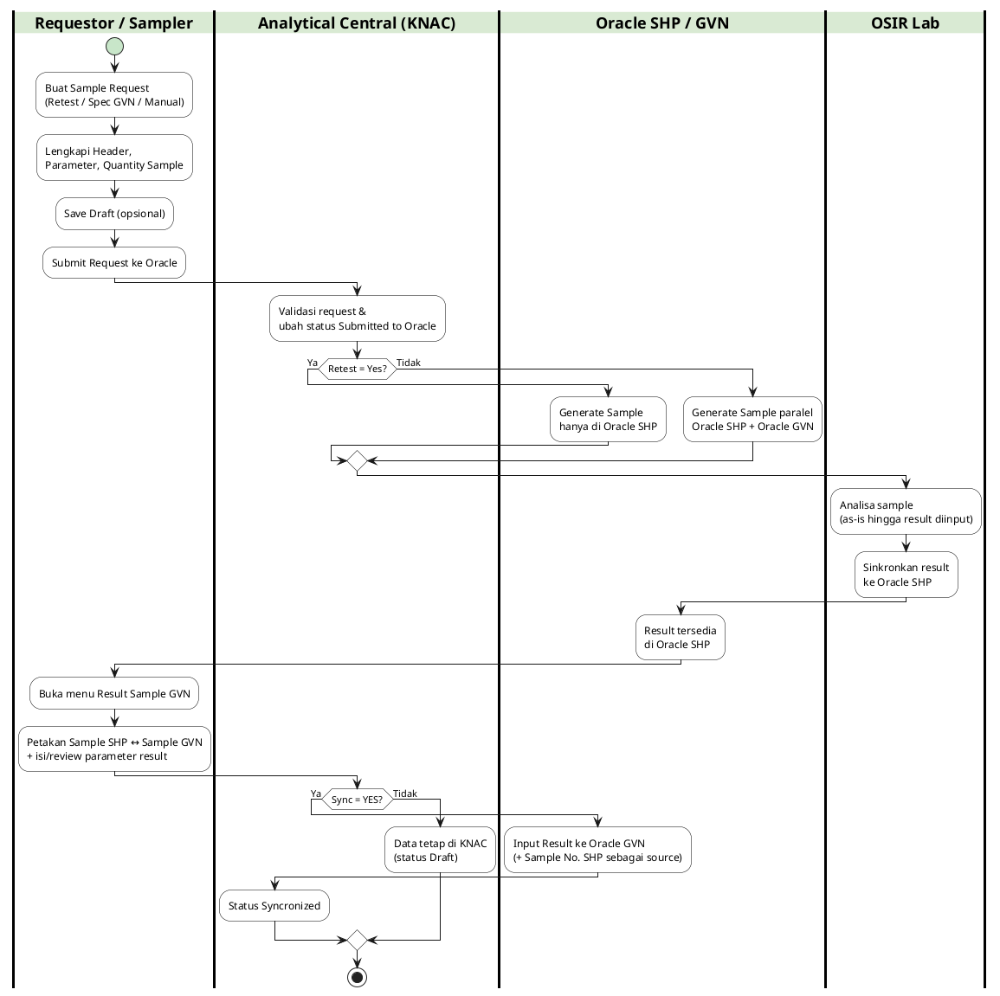
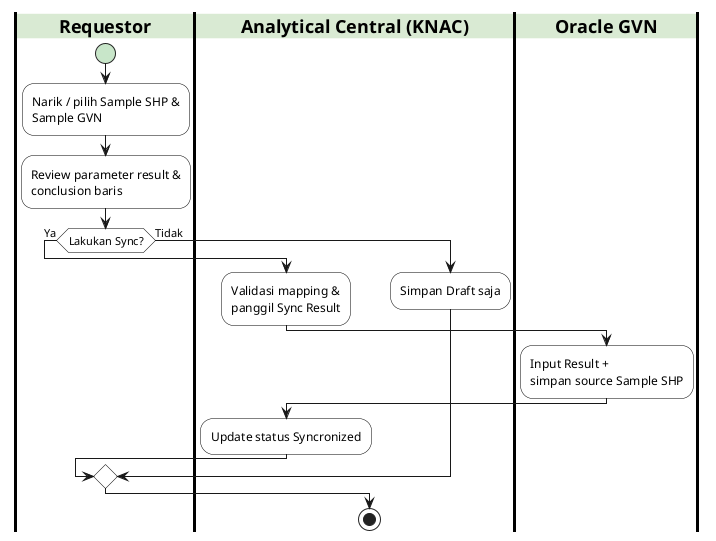
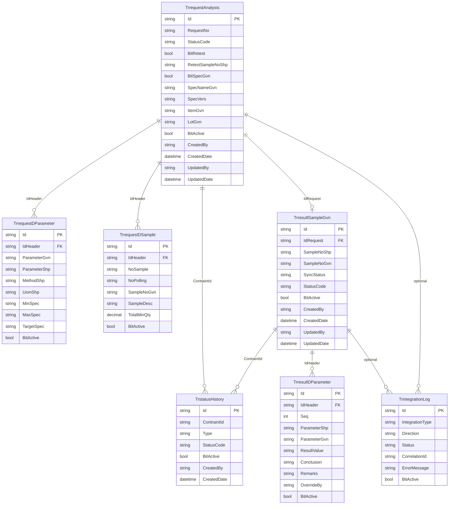

# FUNCTIONAL SPECIFICATION DOCUMENT (FSD)
## Modul: Sample Result GVN-SHP Integration
### Sistem: Analytical Central (KNAC) — PT. Sanghiang Perkasa
### Versi Dokumen: 1.1

---

| Atribut | Keterangan |
|---------|------------|
| **Nama Dokumen** | FSD Modul Sample Result GVN-SHP Integration |
| **Versi** | 1.1 |
| **Tanggal** | 22 Juli 2026 |
| **Divisi** | IT Digital Solution |
| **Status** | Draft |
| **Dibuat oleh** | Tim IT Digital Solution |
| **Proyek** | Sample Result GVN-SHP Integration / Analytical Central |
| **Referensi BRD** | `2026.GVNSHP-BRD.001` (26 Mar 2026) |
| **PID Ref.** | `2026.GVNSHP-PID.001` |

---

## Riwayat Revisi

| Versi | Tanggal | Diubah Oleh | Keterangan |
|-------|---------|-------------|------------|
| **1.1** | **22 Juli 2026** | **Tim IT Digital Solution** | Revisi: bullet flow, swimlane OSIR→SHP, status NEW, hapus ID Elemen, query Oracle, ERD DAL, screenshot LOV |
| 1.0 | 22 Juli 2026 | Tim IT Digital Solution | Initial Document — proses otoritatif mockup + flowapps |

---

> **Catatan build:** Caption bernomor (`Gambar 3.1`, `Tabel 6.2.1`) dihasilkan otomatis — jangan tulis manual di MD sumber.
>
> **Otoritas proses:** Alur fungsional mengikuti **mockup Analytical Central** + `flowapps.txt` (Submit → Generate; Result Draft → Syncronized). Perbedaan dengan BRD dicatat sebagai **[TBD]** / gap di Bab 9.

## 1. Pendahuluan

### 1.1 Latar Belakang

**Analytical Central (KNAC)** adalah portal laboratorium Kalbe Nutritionals / PT Sanghiang Perkasa untuk request analisa, review, COA, dan sinkronisasi ke Oracle SHP. Inisiatif **Sample Result GVN-SHP Integration** memperluas kemampuan KNAC agar pertukaran data lab tersambung ke **Oracle SHP** dan **Oracle GVN**: mulai create sample request, get specification, generate sample paralel, penarikan hasil dari OSIR, hingga sync result ke GVN.

Pada kondisi as-is, codebase `analyticalcentralwebsite` sudah memiliki workflow request dan sync staging SHP saat approval. Integrasi Get Spec / Generate Sample GVN / Input Result belum diimplementasi. Mockup CMS di `Mockup_AnalyticalCentral` dan narasi `flowapps.txt` menjadi acuan UI dan alur to-be untuk FSD ini.

### 1.2 Tujuan Dokumen

1. Mendeskripsikan fungsionalitas UI modul Transaction Sample GVN dan Result Sample GVN berdasarkan mockup.
2. Menjadi acuan pengembangan dan UAT untuk integrasi SHP/GVN.
3. Mendokumentasikan business rules, status workflow, RBAC (inferred), disposisi Sync, serta model data konseptual.
4. Mencatat gap BRD vs mockup/flowapps agar keputusan stakeholder tersurat.

### 1.3 Ruang Lingkup

| Dalam lingkup | Di luar lingkup |
|---------------|-----------------|
| Create / Edit / Submit Sample Request (Retest, Spec GVN, Manual) | Eksekusi analisa lab di aplikasi **OSIR** |
| Generate Sample ke Oracle SHP (± GVN) setelah Submit | Full rebuild master data Oracle SHP/GVN |
| List, Create, Edit, Sync Result Sample GVN | Fitur Master User & Total Capability (CMS existing / pelengkap mockup) |
| Status board, Status History, Parameter & Sample tab | — |
| Aturan numbering sample `GVN-MN…`, mutual exclusion Retest↔Spec | Hangfire / background job retry (keputusan terpisah) |

### 1.4 Stakeholder

| Peran | Tim/Divisi | Keterlibatan |
|-------|------------|--------------|
| Document Approver | IT Digital Solution | Review & approval FSD (Hendi Hendrasta, Debby Tantika Ardi) |
| Document Approver | Project Management | Review & approval FSD (Cut Shafira Salsabila, Andreas Kurnijanto) |
| Requestor / Sampler | Lab / Business | Create request, submit, view result |
| System Integrator | IT | Integrasi Oracle SHP, Oracle GVN, KN Global |
| Client | Eksternal / internal | > **[TBD]** — alur Client Approved ada di BRD, tidak di mockup |

### 1.5 Sumber Kebenaran & Konvensi

| Prioritas | Sumber |
|-----------|--------|
| 1 | Mockup HTML/JS: `Mockup_AnalyticalCentral/*.html` |
| 2 | `Documentation/flowapps.txt` |
| 3 | `Documentation/BRD - GVN-SHP Integration.md` (numbering, mutual exclusion, gap notes) |
| 4 | Codebase as-is `analyticalcentralwebsite` (pola modul, role existing) |
| 5 | Studi Analisis `Documentation/Studi Analisis - GVN-SHP Integration.md` |

Field tanpa `id`/`name` di HTML ditulis sebagai `> **[TBD]**`. Handler tombol mengikuti nama fungsi JS mockup.

### 1.6 Istilah Singkat

Lihat **Bab 9 — Glosarium** untuk daftar lengkap (KNAC, SHP, GVN, OSIR, Syncronized, FGDUM001).

---

## 2. Ringkasan Business Flow

Alur to-be (otoritatif mockup + flowapps) ringkas sebagai berikut:

1. Requestor membuat **Sample Request** di KNAC dengan salah satu basis: **Retest**, **Get Spec (Spec GVN)**, atau **Manual**.
2. Requestor melengkapi header, parameter, dan quantity sample, lalu **Save Draft** (opsional) atau langsung **Submit Request**.
3. Sistem mengubah status menjadi **Submitted to Oracle** dan **Generate Sample**:
   - Retest = **No** → generate di **Oracle SHP** dan **Oracle GVN**
   - Retest = **Yes** → generate **hanya di Oracle SHP**
4. Analisa lab dilakukan di **OSIR** (di luar KNAC) hingga result diinput.
5. Setelah result diinput di OSIR, data **tersinkron ke Oracle SHP**.
6. Requestor membuka menu **Result Sample GVN**, memetakan Sample SHP ↔ Sample GVN, lalu mereview parameter result.
7. Requestor memilih **Sync** (SYNC = YES) untuk Input Result ke Oracle GVN (Sample No. SHP sebagai source) → status **Syncronized**; atau hanya Save → tetap **Draft** di KNAC.

> **Gap BRD:** BRD memicu generate setelah **Client Approved**, disposisi **OK / NOT OK** + auto-retest, serta **Notify Sampler** dan **Failed Integration**. Fitur tersebut **belum** ada di mockup/flowapps — dicatat di Bab 5 & 9 sebagai **[TBD]**.

### 2.1 Lane Swimlane — Business Flow End-to-End

**Lane (urutan kiri → kanan):**

| # | Lane ID | Label | Tipe |
|---|---------|-------|------|
| 1 | L1 | Requestor / Sampler | User |
| 2 | L2 | Analytical Central (KNAC) | System |
| 3 | L3 | Oracle SHP / GVN | ERP / Integrasi |
| 4 | L4 | OSIR Lab | External |

### 2.2 Swimlane — Alur Sample Request hingga Result Sync



**Hand-off antar lane:**

1. Requestor → KNAC: Submit Request menyimpan data dan memicu generate.
2. KNAC → Oracle: Generate Sample SHP (± GVN) sesuai flag Retest.
3. OSIR → Oracle SHP: Setelah result diinput di OSIR, data tersinkron ke Oracle SHP.
4. Requestor → KNAC: Buka Result Sample GVN setelah data tersedia di Oracle SHP.
5. Requestor → KNAC → Oracle GVN: Sync Result mengirim hasil terpetakan.

### 2.3 Ringkasan Status Request (Mockup)

| Kode Status | Label | Transisi |
|-------------|-------|----------|
| `New` | New | Saat buka form create |
| `Draft` | Draft | Setelah `saveData()` |
| `Submitted to Oracle` | Submitted to Oracle | Setelah `submitRequest()` sukses |

### 2.4 Ringkasan Status Result (Mockup)

| Kode Status | Label | Transisi |
|-------------|-------|----------|
| `New` | New | Saat buka form create result |
| `Draft` | Draft | Setelah `saveData()` pada result |
| `Syncronized` | Syncronized | Setelah `syncResult()` sukses |

---

## 3. Transaction Sample GVN

Modul Transaction Sample GVN mencakup daftar request, form create, dan halaman detail. Sumber UI: `transaction_cms.html`, `request_create_cms.html`, `request_detail_cms.html`. Navigasi sidebar: Transaction → Transaction Sample GVN (`assets/js/sidebar.js`).

### 3.1 Dashboard List — Transaction Sample GVN

Halaman list menampilkan kartu ringkasan (Total / Draft / Submitted to Oracle) dan tabel request. Klik kartu memanggil `filterTable` dengan teks status.

**Tampilan Halaman List Transaction:**


#### 3.1.1 Dashboard Cards

| Elemen | Handler | Keterangan |
| -------- | --------- | ------------ |
| Total Requests | `filterTable('')` | Menampilkan semua baris |
| Draft | `filterTable('Draft')` | Filter status Draft |
| Submitted to Oracle | `filterTable('Submitted to Oracle')` | Filter status Submitted |#### 3.1.2 Kolom DataTable List

| Kolom | Field Key / Entity Field | Render | Sortable | Keterangan |
|-------|--------------------------|--------|----------|------------|
| Request No | Request Number | Text / Link | Ya | Contoh format mock: `{seq}/{NOR\|TOP}/{MM}/{YYYY}` |
| Requester | Requester | Text | Ya | Nama user pembuat |
| Created Date | Created Date | DateTime | Ya | Tanggal dibuat |
| Updated Date | Updated Date | DateTime | Ya | Tanggal diubah |
| Status | Status | Badge | Ya | `Draft` atau `Submitted to Oracle` |
| Action | — | Icon Edit | Tidak | Navigasi ke `request_detail_cms.html` |

#### 3.1.3 Tombol Aksi — List Transaction

| Tampilan | Tombol | ID / Handler | Warna/Style | Fungsi |
|----------|--------|--------------|-------------|--------|
|  | + New | `btnNewTransaction` → `request_create_cms.html` | btn warning (`#ffc107`) | Membuka form Create Sample Request |
|  | Edit | Link ke detail | Icon / outline | Membuka `request_detail_cms.html` |

#### 3.1.4 CRUD — List Transaction

| Operasi | Cara | Role | Keterangan |
|---------|------|------|------------|
| **Create** | Klik + New | Requestor / Admin (inferred) | Form create |
| **Read** | Buka list / filter card | Semua role terautentikasi (inferred) | Filter via `filterTable` |
| **Update** | Klik Edit pada baris | Requestor / Admin (inferred) | Detail page |

### 3.2 Create Sample Request

Halaman create (`request_create_cms.html`) berisi Status Board (Alert `New`, Progress 0%), accordion Status History, form header dua kolom, serta tab Parameter dan Sample. Tiga jalur penentuan parameter: **Retest**, **Spec GVN**, atau **Manual** (+ New parameter).

**Tampilan Halaman Create Request:**


#### 3.2.0 Query Oracle — Sumber LOV Create Request

Halaman Create Request memakai extract Oracle (mock file di `Mockup_AnalyticalCentral/Data/`). Query referensi:

**Spec GVN** (`Spec_GVN.json`) — Spec = Yes:

```sql
SELECT gs.spec_id, gs.spec_name, gs.spec_vers, gs.spec_desc, gs.inventory_item_id,
       msi.segment1 AS Item_Code, msi.description, msi.item_type,
       svr.ORGANIZATION_CODE,
       gst.test_id, gqt.test_code, gqt.test_desc AS Parameter, gqt.test_class,
       gtm.test_method_id, gtm.test_method_desc AS Test_Method,
       gqt.test_type, gqt.test_unit AS UOM,
       NVL(TO_CHAR(gst.min_value_num), gst.min_value_char) AS combined_min,
       NVL(TO_CHAR(gst.max_value_num), gst.max_value_char) AS combined_max,
       NVL(TO_CHAR(gst.target_value_num), gst.target_value_char) AS combined_target
FROM gmd_specifications gs
INNER JOIN GMD_ALL_SPEC_VRS_VL svr ON gs.spec_id = svr.spec_id
LEFT JOIN MTL_SYSTEM_ITEMS msi
  ON msi.inventory_item_id = gs.inventory_item_id
 AND gs.owner_organization_id = msi.organization_id
LEFT JOIN gmd_spec_tests gst ON gs.spec_id = gst.spec_id
LEFT JOIN GMD_QC_TESTS gqt ON gqt.test_id = gst.test_id
LEFT JOIN GMD_TEST_METHODS gtm ON gqt.test_method_id = gtm.test_method_id
WHERE svr.SPEC_VR_STATUS = 700
```

**Sample SHP Retest** (`Sample_SHP.json`) — Retest = Yes:

```sql
SELECT gs.sample_id, gs.sample_no, gs.sample_desc, gs.batch_id,
       gs.inventory_item_id, msi.segment1, gs.lot_number, gs.creation_date,
       gr.seq, gqt.test_code, gr.result_value_num, gqt.test_unit, gr.result_value_char
FROM GMD_SAMPLES gs, mtl_system_items msi, gmd_results gr,
     GMD_QC_TESTS gqt, Gmd_spec_results gsr
WHERE gs.inventory_item_id = msi.inventory_item_id
  AND gs.organization_id = msi.organization_id
  AND gs.sample_id = gr.sample_id
  AND gr.test_id = gqt.test_id
  AND gr.result_id = gsr.result_id
  AND gsr.evaluation_ind <> '5O'
  AND gs.creation_date >= TO_DATE('2026-02-01', 'YYYY-MM-DD')
  AND (msi.segment1 LIKE 'IBMIX%' OR msi.segment1 LIKE 'FGDUM%')
ORDER BY gs.sample_no, gr.seq
```

**Item Lot GVN** (`Item Lot GVN.json`):

```sql
SELECT msi.segment1 AS item_code, msi.description AS item_description,
       mln.lot_number,
       mln.origination_date AS lot_creation_date,
       mln.expiration_date AS lot_expired_date,
       mln.status_id, msi.organization_id
FROM mtl_lot_numbers mln
JOIN mtl_system_items_b msi
  ON mln.inventory_item_id = msi.inventory_item_id
 AND mln.organization_id = msi.organization_id
WHERE msi.organization_id = 84
ORDER BY mln.origination_date DESC
```

**Test Code SHP** (`Test Code SHP.json`) — enrich Method/UOM/Test Class:

```sql
SELECT gqt.test_id, gqt.test_code AS PARAMETER, gqt.test_desc, gqt.test_class,
       gtm.test_method_id, gtm.test_method_desc AS TEST_METHOD,
       gqt.test_type, gqt.test_unit, gqt.delete_mark,
       gqt.min_value_num, gqt.max_value_num
FROM GMD_QC_TESTS gqt
LEFT JOIN GMD_TEST_METHODS gtm ON gqt.test_method_id = gtm.test_method_id
LEFT JOIN GMD_QC_TEST_VALUES gqtv ON gqt.test_id = gqtv.test_id
```

**Tampilan LOV / Popup Create Request:**


#### 3.2.1 Status Board & Status History

| Elemen | Keterangan |
| -------- | ------------ |
| Status History Accordion | Riwayat status dokumen |
| Heading Status | Judul accordion |
| Collapse Status | Konten tabel history |Kolom history (mock): No, Status, Created By (role), Timestamp.

#### 3.2.2 Fields – Header (Create)

| Field Name | Tipe | Mandatory | Default | Validasi | Keterangan |
| ------------ | ------ | ----------- | --------- | ---------- | ------------ |
| Request Number | Text (readonly) | Ya (Auto) | `AUTOGENERATE` | — | Nomor request otomatis |
| Requester | Text (readonly) | Ya (Auto) | `AUTOGENERATE` | — | Dari sesi login |
| Request Date | Text (readonly) | Ya (Auto) | `AUTOGENERATE` | — | Tanggal pengajuan |
| Objective | Text | Opsional | (kosong) | — | Tujuan request |
| Company Name | Text | Ya | `PT. Global Vita Nutritech` | — | Nama perusahaan |
| Priority | Dropdown/LOV | Ya | Select Priority | Normal / Urgent / Top Urgent | Prioritas request |
| Factory (Same with Company) | Checkbox | Tidak | Checked | — | Salin nama/alamat perusahaan |
| Factory Name | Text | Ya | Sama Company Name | — | Nama pabrik |
| Factory Address | Textarea | Ya | Alamat demo mock | — | Alamat pabrik |
| Retest | Radio | Ya | No | Mutual exclusive dengan Spec GVN | Handler `updateLogic()` |
| Sample No. SHP | Dropdown/LOV | Ya jika Retest=Yes | (kosong) | Wajib pilih sample prior | Sumber `Sample_SHP.json` |
| Spec GVN | Radio | Ya | No | Mutual exclusive dengan Retest | = Use Spec BRD |
| Select Spec GVN | Dropdown/LOV | Ya jika Spec=Yes | (kosong) | `SPEC_NAME \ | SPEC_VERS` | Sumber `Spec_GVN.json` |
| Item GVN | Dropdown/LOV (Select2, tags) | Ya | (kosong) | — | Autofill dari Spec jika Spec=Yes |
| Lot GVN | Dropdown/LOV | Opsional | (kosong) | Filter by Item | Sumber `Item Lot GVN.json` |
| Sample Name | Text | Ya | Auto Item atau Item-Lot | — | Diisi `updateSampleName()` |
| Matrix Product | Dropdown/LOV | Opsional | --Select Data-- | — | Placeholder mock |
| Packaging | Dropdown/LOV | Opsional | --Select Packaging-- | — | Placeholder mock |
| Storage Condition | Dropdown/LOV | Opsional | --Select Storage-- | — | Placeholder mock |
| Reference Sample | Text | Opsional | (kosong) | — | Referensi sample |
| Remark | Textarea | Opsional | (kosong) | — | Catatan |#### 3.2.3 Tab Parameter — Kolom Grid

Tab `pills-parameter` / `pills-parameter-tab`. Body: `parameterTableBody`.

| Kolom | Field Key | Render | Sortable | Keterangan |
|-------|-----------|--------|----------|------------|
| Parameter GVN | TEST_CODE / param | Text | Tidak | Dari Spec atau capability |
| Parameter SHP | TEST_CODE map | Text | Tidak | Enrich `Test Code SHP.json`; hilang → baris kuning |
| Method SHP | Method | Text | Tidak | Dari Test Code SHP |
| UOM SHP | Unit | Text | Tidak | Dari Test Code SHP |
| Test Class SHP | Class | Text | Tidak | Dari Test Code SHP |
| Min Spec | COMBINED_MIN | Text | Tidak | Dari Spec GVN |
| Max Spec | COMBINED_MAX | Text | Tidak | Dari Spec GVN |
| Target Spec | COMBINED_TARGET | Text | Tidak | Dari Spec GVN |
| Action | — | Hapus baris | Tidak | Hapus baris parameter |

**Sumber auto-populate:**

1. Spec GVN dipilih → match `Spec_GVN.json`; unique by `TEST_CODE`; enrich Method/UOM/Test Class.
2. Retest Sample dipilih → baris dari `Sample_SHP.json` untuk `SAMPLE_NO`; Min/Max/Target kosong; enrich sama.
3. Manual → modal `addParameterModal`.

#### 3.2.4 Modal + New Parameter

| Field Name | Tipe | Mandatory | Default | Validasi | Keterangan |
| ------------ | ------ | ----------- | --------- | ---------- | ------------ |
| Parameter | Dropdown/LOV (Select2) | Ya | (kosong) | Required (`alert` jika kosong) | Capability parameter |
| Jumlah Baris | Number | Ya | 1 | ≥ 1 | Append N baris kosong |
| + Tambah | Button | — | — | — | Menambah baris ke grid |#### 3.2.5 Tab Sample — Generate

Tab `pills-sample` / `pills-sample-tab`. Body: `sampleTableBody`.

| Field Name | Tipe | Mandatory | Default | Validasi | Keterangan |
| ------------ | ------ | ----------- | --------- | ---------- | ------------ |
| Quantity Sample | Number | Ya saat Submit (tooltip) | 0 | Tooltip: minimal 1 — **belum enforce di JS** | Jumlah sample yang digenerate |
| Generate | Button | — | — | — | Bangun N baris sample |

| Kolom Grid Sample |
| ------------------- |
| No |
| Sample No. SHP |
| Pooling No. SHP |
| Sample No. GVN |
| Sample Description for (COA) |
| Total Min Sample (g) |#### 3.2.6 Tombol Aksi — Create Request

| Tampilan | Tombol | ID / Handler | Warna/Style | Fungsi |
|----------|--------|--------------|-------------|--------|
|  | Save | `saveData()` | btn-primary | Simpan sebagai **Draft** (konfirmasi Swal) |
|  | Submit | `submitRequest()` | btn-success | Konfirmasi submit ke Oracle → sukses → redirect list |
|  | Back | Link list | Outline | Kembali ke list |

**Tooltip Submit (bisnis mockup):** Jika Retest = No → Create Sample di Oracle SHP **dan** Oracle GVN. Validasi Qty Sample minimal 1.

> **Gap:** Tooltip tidak menyatakan Retest = Yes = SHP only (disurat di `flowapps.txt`). Enforce qty≥1 belum ada di `submitRequest()`.

#### 3.2.7 CRUD — Create Request

| Operasi | Cara | Role | Keterangan |
|---------|------|------|------------|
| **Create** | Isi form → Save / Submit | Requestor | Draft atau Submitted |
| **Read** | Buka form New | Requestor | Status New |
| **Update** | Ubah field sebelum Submit | Requestor | Setelah Submit lihat detail |

---

### 3.3 Detail Sample Request (Setelah Submit)

Halaman `request_detail_cms.html` menampilkan request yang sudah **Submitted to Oracle**. Alert meminta update Admin Review & Conclusion; Progress 100%. Header mayoritas readonly; radio Retest/Spec masih interaktif. Tab Sample: Qty readonly, `btnGenerateSample` disembunyikan (`d-none`), sample prefilled.

**Tampilan Halaman Detail Request:**


#### 3.3.1 Fields – Detail (perbedaan vs Create)

| Field Name | Tipe | Mandatory | Default | Validasi | Keterangan |
| ------------ | ------ | ----------- | --------- | ---------- | ------------ |
| Sample Name | Text (readonly) | Ya | Nilai tersimpan | — | Background readonly |
| Quantity Sample | Number (readonly) | Ya | Nilai tersimpan | — | Generate hidden |
| Parameter Min/Max/Target | Text | Opsional | Demo rows | — | Masih editable di mock |
| Admin Review / Conclusion | — | — | — | — | Bertentangan dengan teks alert |#### 3.3.2 Tombol Aksi — Detail Request

| Tampilan | Tombol | ID / Handler | Warna/Style | Fungsi |
|----------|--------|--------------|-------------|--------|
|  | Save | > **[TBD]** — onclick Save di detail | btn-primary | Simpan perubahan detail |
|  | Back | Link list | Outline | Kembali ke list |

Tidak ada tombol **Submit** pada halaman detail mockup.

#### 3.3.3 CRUD — Detail Request

| Operasi | Cara | Role | Keterangan |
|---------|------|------|------------|
| **Read** | Buka dari list Edit | Requestor / Admin | Status Submitted |
| **Update** | Ubah field → Save | Admin (inferred) | Parameter masih editable di mock |

---

## 4. Result Sample GVN

Modul Result mencakup list, create (mapping SHP↔GVN), dan edit/sync. Sumber: `result_sample_gvn_list_cms.html`, `result_sample_gvn_create_cms.html`, `result_sample_gvn_cms.html`.

### 4.1 Dashboard List — Result Sample GVN

Data list dimuat dari `fetch('./Data/Sample_GVN.json')`, distinct by `SAMPLE_NO`. Status Sync mock: `(countAll % 3 === 0) ? 'Syncronized' : 'Draft'`.

**Tampilan Halaman List Result:**


#### 4.1.1 Dashboard Cards

| Elemen | Handler | Keterangan |
| -------- | --------- | ------------ |
| Total | `filterStatus('')` | Semua result |
| Draft | `filterStatus('Draft')` | Belum Sync |
| Syncronized | `filterStatus('Syncronized')` | Sudah Sync |#### 4.1.2 Kolom DataTable List Result

| Kolom | Field Key | Render | Sortable | Keterangan |
|-------|-----------|--------|----------|------------|
| Sample No. GVN | `SAMPLE_NO` | Text | Ya | Nomor sample GVN |
| Sample No. SHP | (mock map) | Text | Ya | Relasi SHP |
| Item | `SEGMENT1` / Item | Text | Ya | Kode item |
| Lot | Lot | Text | Ya | Lot number |
| Requested Date | Request Date | Date | Ya | Tanggal request |
| Completion Date | Completion Date | Date | Ya | Tanggal selesai analisa |
| Sync Status | Sync Status | Badge | Ya | `Draft` / `Syncronized` |
| Action | — | Input Result | Tidak | Ke halaman edit/detail |

Tabel: `tableResultSample`, body `tableResultSampleBody`.

#### 4.1.3 Tombol Aksi — List Result

| Tampilan | Tombol | ID / Handler | Warna/Style | Fungsi |
|----------|--------|--------------|-------------|--------|
|  | + New | `btnNewTransaction` → create | btn warning | Buka create result |
|  | Input Result | Link edit | Outline | Buka `result_sample_gvn_cms.html` |

#### 4.1.4 CRUD — List Result

| Operasi | Cara | Role | Keterangan |
|---------|------|------|------------|
| **Create** | + New | Admin (inferred) | Mapping baru |
| **Read** | List + filter | Requestor / Admin | `filterStatus` |
| **Update** | Input Result | Admin | Edit + Sync |

---

### 4.2 Create Result — Mapping SHP ↔ GVN

Halaman `result_sample_gvn_create_cms.html`. Status **Draft**, Progress 50%. Section **SHP Information** dari `Sample_SHP_Ver2.json`; **GVN Information** dari `Sample_GVN.json`.

**Tampilan Halaman Create Result:**


#### 4.2.0 Query Oracle — Sumber LOV Create Result

**Sample SHP Ver2** (`Sample_SHP_Ver2.json`) — Sample No. SHP + disposition/dates:

```sql
SELECT gs.sample_id, gs.sample_no, gs.sample_desc, gs.batch_id,
       gs.inventory_item_id, msi.segment1, gs.lot_number, gs.creation_date,
       gs.last_update_date AS LAST_UPDATE_DATE,
       gs.sample_disposition AS SAMPLE_DISPOSITION,
       gr.seq, gqt.test_code, gr.result_value_num, gqt.test_unit, gr.result_value_char
FROM GMD_SAMPLES gs, mtl_system_items msi, gmd_results gr,
     GMD_QC_TESTS gqt, Gmd_spec_results gsr
WHERE gs.inventory_item_id = msi.inventory_item_id
  AND gs.organization_id = msi.organization_id
  AND gs.sample_id = gr.sample_id
  AND gr.test_id = gqt.test_id
  AND gr.result_id = gsr.result_id
  AND gsr.evaluation_ind <> '5O'
  AND gs.creation_date >= TO_DATE('2026-02-01', 'YYYY-MM-DD')
  AND (msi.segment1 LIKE 'IBMIX%' OR msi.segment1 LIKE 'FGDUM%')
ORDER BY gs.sample_no, gr.seq
```

**Sample GVN** (`Sample_GVN.json`) — Sample No. GVN + list Result:

```sql
SELECT gs.sample_id, gs.sample_no, gs.sample_desc, gs.batch_id,
       gs.inventory_item_id, msi.segment1, gs.lot_number, gs.creation_date,
       gr.seq, gqt.test_code, gr.result_value_num, gqt.test_unit, gr.result_value_char
FROM GMD_SAMPLES gs, mtl_system_items msi, gmd_results gr,
     GMD_QC_TESTS gqt, Gmd_spec_results gsr
WHERE gs.inventory_item_id = msi.inventory_item_id
  AND gs.organization_id = msi.organization_id
  AND gs.sample_id = gr.sample_id
  AND gr.test_id = gqt.test_id
  AND gr.result_id = gsr.result_id
  AND gsr.evaluation_ind <> '5O'
  AND gs.creation_date >= TO_DATE('2026-02-01', 'YYYY-MM-DD')
  AND (msi.segment1 LIKE 'IBMIX%' OR msi.segment1 LIKE 'FGDUM%')
ORDER BY gs.sample_no, gr.seq
```

**Tampilan LOV Create Result:**


#### 4.2.1 Fields – SHP Information

| Field Name | Tipe | Mandatory | Default | Validasi | Keterangan |
| ------------ | ------ | ----------- | --------- | ---------- | ------------ |
| Sample No. SHP | Dropdown/LOV | Ya | (kosong) | Tooltip: nomor sudah dipakai tidak bisa reuse — **belum enforce** | Pilih sample SHP sumber result |
| Item | Text (readonly) | Ya (Auto) | (kosong) | — | Autofill dari sample SHP |
| Lot | Text (readonly) | Opsional | (kosong) | — | Autofill |
| Request Date | Text (readonly) | Ya (Auto) | (kosong) | — | Tanggal request |
| Analysis Completion Date | Text (readonly) | Opsional | (kosong) | — | Tanggal selesai |#### 4.2.2 Fields – GVN Information

| Field Name | Tipe | Mandatory | Default | Validasi | Keterangan |
| ------------ | ------ | ----------- | --------- | ---------- | ------------ |
| Sample No. GVN | Dropdown/LOV | Ya | (kosong) | Tooltip: exclude disposition Accept (`4A`) / Accept with Variance (`5AV`) — **belum difilter di JS** | Target sample GVN |
| Item | Text (readonly) | Ya (Auto) | (kosong) | — | Autofill |
| Lot | Text (readonly) | Opsional | (kosong) | — | Autofill |#### 4.2.3 Kolom Grid Parameter Result (Create)

Body: `parameterTableBody`. Saat Sample GVN berubah, grid diisi dari `TEST_CODE` / `RESULT_VALUE_*`.

| Kolom | Field Key | Render | Keterangan |
|-------|-----------|--------|------------|
| Parameter SHP | TEST_CODE | Text | Belum ada map nyata SHP↔GVN di mock |
| Parameter GVN | TEST_CODE | Text | Duplikat kode di create |
| UOM | TEST_UNIT | Text | Unit uji |
| Min | — | Text | Mock `-` |
| Max | — | Text | Mock `-` |
| Result | RESULT_VALUE_* | Text | Nilai hasil lab |
| Conclusion | — | Dropdown | **Conform** / **Not Conform** |
| Remarks | — | Text | Catatan |
| Override By | — | Text | User override |

#### 4.2.4 Tombol Aksi — Create Result

| Tampilan | Tombol | ID / Handler | Warna/Style | Fungsi |
|----------|--------|--------------|-------------|--------|
|  | Save | `saveData()` | btn-primary | Simpan Draft |
|  | Sync | `syncResult()` | btn-success | Konfirmasi sync ke GVN → status Syncronized → list |

Tidak ada auto-retest loop pada Sync.

---

### 4.3 Edit Result / Sync Disposition

Halaman `result_sample_gvn_cms.html`. Status **Syncronized**, Progress 100%. Mapping demo hardcoded (contoh `00040`→`37934`). Conclusion baris: **Accept** | **Retest (Out of Spec)** — perubahan dari original mengaktifkan Remarks + Override By (user demo hardcoded).

**Tampilan Halaman Edit Result:**


#### 4.3.1 Fields – Edit Result

| Field Name | Tipe | Mandatory | Default | Validasi | Keterangan |
| ------------ | ------ | ----------- | --------- | ---------- | ------------ |
| Sample No. SHP | Dropdown/LOV | Ya | Nilai tersimpan | — | Mapping SHP |
| Sample No. GVN | Text | Ya | Nilai tersimpan | — | Input/teks di edit (bukan select create) |
| Conclusion (baris) | Dropdown/LOV | Ya | Accept / Retest | Override → Remarks wajib (mock) | **Bukan** loop Create Sample BRD |
| Parameter grid | Grid | — | Demo mismatch nama | — | Dokumentasi kebutuhan mapping asimetrik |Modal tambah parameter sama: `addParameterModal`, `swal-param`, `qtyParam`, `btnAddParameter`.

#### 4.3.2 Tombol Aksi — Edit Result

| Tampilan | Tombol | ID / Handler | Warna/Style | Fungsi |
|----------|--------|--------------|-------------|--------|
|  | Save | `saveData()` | btn-primary | Simpan perubahan |
|  | Sync | `syncResult()` | btn-success | Sync ulang / konfirmasi ke GVN |

#### 4.3.3 CRUD — Result

| Operasi | Cara | Role | Keterangan |
|---------|------|------|------------|
| **Create** | Form create → Save / Sync | Admin | Draft atau Syncronized |
| **Read** | List / Edit | Requestor / Admin | — |
| **Update** | Edit conclusion / remarks → Save / Sync | Admin | Override logic mock |

---

## 5. Aturan Bisnis

| Rule ID | Aturan |
|---------|--------|
| BR-01 | Running Counter sample (`XXXXX`) dan Counter Retest (`RR`/`XX`) wajib increment berurutan, tersentralisasi, tanpa duplikasi. `MM`/`YY` mengikuti waktu pengajuan (BRD §4.1). |
| BR-02 | Format Sample No. baru: `GVN-MN[MM][YY]-[XXXXX]`. Retest: akhiran `-[RR]` / `-[XX]` sesuai tooltip mockup. |
| BR-03 | Format Pooling No. SHP (tooltip mockup): `GVN-[YY]-[MM]-[XXX]`. |
| BR-04 | Mutual exclusion: jika **Retest = Yes**, maka **Spec GVN** dipaksa No dan sebaliknya (`updateLogic()`; BRD §4.2). |
| BR-05 | Jika Spec GVN = Yes, parameter di-populate dari Spec / Validity Rule Oracle GVN (`Spec_GVN.json` di mock). |
| BR-06 | Jika Retest = Yes, parameter di-populate dari sample SHP prior; Spec disabled; generate sample **hanya di Oracle SHP** (`flowapps.txt`). |
| BR-07 | Jika Retest = No pada Submit, sistem Generate Sample di **Oracle SHP dan Oracle GVN** (`flowapps.txt` + tooltip Submit). |
| BR-08 | Submit mengubah status request menjadi **Submitted to Oracle** dan memicu generate (otoritas mockup/flowapps). |
| BR-09 | Quantity Sample minimal 1 saat Submit (tooltip). > **[TBD]** — enforce server-side wajib; mock belum enforce di JS. |
| BR-10 | Baris parameter tanpa mapping Test Code SHP ditandai visual (baris kuning) di mock. |
| BR-11 | Analisa lab berlangsung di **OSIR** hingga result diinput; KNAC tidak menggantikan OSIR. |
| BR-12 | Pada Result, Sample No. SHP yang sudah dipakai tidak boleh dipilih ulang (tooltip). > **[TBD]** enforce. |
| BR-13 | Sample GVN dengan disposition Accept (`4A`) / Accept with Variance (`5AV`) dikecualikan dari pilihan (tooltip). > **[TBD]** enforce. |
| BR-14 | **Sync = YES** (`syncResult`): Input Result ke Oracle GVN + lampirkan Sample No. SHP sebagai source; status → **Syncronized**. |
| BR-15 | **Sync = NO** (hanya Save / tidak Sync): data tetap di KNAC berstatus **Draft**; proses berhenti tanpa kirim ke GVN. |
| BR-16 | Conclusion baris **Retest (Out of Spec)** pada edit result adalah disposisi line-level, **bukan** auto-loop Create Sample BRD. |
| BR-17 | Item dummy SHP untuk generate administratif: `FGDUM001` (BRD); filter mock data mencakup `FGDUM%` / `IBMIX%`. |
| BR-18 | > **[TBD] — Gap BRD:** Trigger generate setelah **Client Approved** (bukan Submit). Belum di mockup. |
| BR-19 | > **[TBD] — Gap BRD:** Disposisi hasil **OK / NOT OK** dengan auto-retest `-[RR]`. Digantikan model Sync di FSD ini sampai keputusan stakeholder. |
| BR-20 | > **[TBD] — Gap BRD:** **Notify Sampler** email saat Result Approved / Ready. Tidak ada di mockup/flowapps. |
| BR-21 | > **[TBD] — Gap BRD:** **Failed Integration** + retry wajib, no bypass sebelum lab queue. Tidak ada di mockup. |
| BR-22 | > **[TBD] — Gap BRD:** Status request `DRAFT` → `SUBMIT TO LAB` → `CLIENT FEEDBACK` → `APPROVED` vs mockup `New`/`Draft`/`Submitted to Oracle`. |
| BR-23 | > **[TBD]:** Kolom Admin Review / Conclusion pada detail request (disebut alert & BRD) belum ada di HTML mockup. |
| BR-24 | Prefix sample di detail demo (`LAB-MN…`) inkonsisten vs tooltip create (`GVN-MN…`). Canonical untuk implementasi: **`GVN-MN`** sampai diputuskan lain. |

---

## 6. RBAC

BRD tidak mendefinisikan matriks RBAC formal. Matriks berikut **inferred** dari label UI mockup + role existing KNAC (`REQ`, `ADMIN`). Semua sel bertanda catatan TBD wajib dikonfirmasi stakeholder.

### 6.1 Matriks Akses Modul

| Bagian / Operasi | Requestor (`REQ`) | Admin (`ADMIN`) | System |
|------------------|-------------------|-----------------|--------|
| List Transaction | R | R | — |
| Create / Save Draft Request | C/U | C/U | — |
| Submit Request | U | U | Trigger generate |
| Detail Request (post-submit) | R | R/U | — |
| List Result | R | R | — |
| Create / Edit Result | > **[TBD]** | C/U | — |
| Sync Result ke GVN | > **[TBD]** | U | Input Result API |
| Master Capability / User | N | Y (inferred) | — |

Keterangan: **C**=Create, **R**=Read, **U**=Update, **N**=No, **Y**=Yes.

### 6.2 Catatan As-Is KNAC

Role constants existing dipakai sebagai titik awal implementasi menu/auth via KN Global. Mockup **tidak** memiliki role gating.

---

## 7. Approval / Sync Disposition

### 7.1 Model Disposisi Otoritatif (Mockup / flowapps)

Disposisi hasil lab di KNAC diwakili oleh aksi **Sync**:

| Keputusan | Aksi UI | Status Result | Efek Integrasi |
|-----------|---------|---------------|----------------|
| SYNC = YES | Tombol **Sync** / `syncResult()` | `Syncronized` | Input Result ke Oracle GVN + Sample No. SHP sebagai source |
| SYNC = NO | Hanya **Save** / tidak Sync | `Draft` | Data tetap di KNAC; tidak masuk GVN |

### 7.2 Lane Swimlane — Result Sync

**Lane (urutan kiri → kanan):**

| # | Lane ID | Label | Tipe |
|---|---------|-------|------|
| 1 | L1 | Requestor | User |
| 2 | L2 | Analytical Central (KNAC) | System |
| 3 | L3 | Oracle GVN | ERP |



### 7.3 Gap vs BRD (Approval Client & OK/NOT OK)

| Topik BRD | Perilaku BRD | Perilaku FSD (mockup) | Status |
|-----------|--------------|----------------------|--------|
| Client Approved | Syarat generate paralel | Tidak ada di mockup | > **[TBD]** |
| OK | Input Result GVN | Diganti **Sync** | Gap tercatat |
| NOT OK | Auto Create Sample retest | Tidak; conclusion Retest line-level saja | Gap tercatat |
| Notify Sampler | Email dari SHP | Tidak ada | > **[TBD]** |
| Submit Review lock | Kunci parameter | Belum spek di mock | > **[TBD]** |

---

## 8. Database & ERD

### 8.1 Standarisasi Kolom (AnalyticalCentral.DAL)

Pola entity transaction existing (`TrrequestAnalysis`, `TrrequestDParameter`, `TrrequestDSample`, `TrstatusHistory`) di `AnalyticalCentral.Common\Entity\Transaction`:

| Kolom wajib | Tipe | Keterangan |
|-------------|------|------------|
| `Id` | string (GUID) | Primary key |
| `IdHeader` | string | FK ke header (untuk tabel detail) |
| `BitActive` | bool / bool? | Soft active flag |
| `CreatedBy` | string? | User pembuat |
| `CreatedDate` | DateTime? | Waktu buat |
| `UpdatedBy` | string? | User pengubah |
| `UpdatedDate` | DateTime? | Waktu ubah |

Naming: prefix **`Tr*`** untuk transaction, **`M*`** untuk master. DbSet di `AnalyticalCenterContext`: `TrrequestAnalyses`, `TrrequestDParameters`, `TrrequestDSamples`, `TrstatusHistories`.

### 8.2 Strategi Desain Tabel Modul GVN-SHP

1. **Ekstensi** entity request existing (`TrrequestAnalysis` + detail) untuk field Retest / Spec GVN / Item / Lot / Sample No. SHP–GVN.
2. **Tabel baru** untuk Result Sample GVN: header + detail parameter, mengikuti pola audit di atas.
3. **Reuse** `TrstatusHistory` dengan `Type` = `REQUEST` / `RESULT` dan `ContraintId` = Id header.
4. LOV Spec/Sample Oracle **tidak** disimpan sebagai master PG penuh — di-query ke Oracle (lihat §3.2.0 / §4.2.0); snapshot boleh disimpan di baris transaksi jika diperlukan.

### 8.3 Entitas Usulan

| Entitas | Peran | Catatan |
|---------|-------|---------|
| `TrrequestAnalysis` *(extend)* | Header request | Tambah `BitRetest`, `RetestSampleNoShp`, `BitSpecGvn`, `SpecIdGvn`, `SpecNameGvn`, `SpecVers`, `ItemGvn`, `LotGvn` |
| `TrrequestDParameter` *(extend)* | Parameter grid | Tambah `ParameterGvn`, `ParameterShp`, `MethodShp`, `UomShp`, `TestClassShp`, `MinSpec`, `MaxSpec`, `TargetSpec` |
| `TrrequestDSample` *(extend)* | Sample/pooling | Map `NoSample`/`NoPolling` ke Sample No. SHP / Pooling; tambah `SampleNoGvn` |
| `TrstatusHistory` *(reuse)* | Histori status | `ContraintId`, `Type`, `StatusCode` + audit |
| `TrresultSampleGvn` *(baru)* | Header result | Mapping SHP↔GVN + `SyncStatus` |
| `TrresultDParameter` *(baru)* | Baris result | Result value, conclusion, remarks, override |
| `TrintegrationLog` *(baru, opsional)* | Log generate/sync | Mendukung Failed Integration **[TBD]** |

### 8.4 Kolom Usulan — `TrresultSampleGvn` & Detail

**Header `TrresultSampleGvn`:** `Id`, `IdRequest` (opsional), `SampleNoShp`, `SampleIdShp`, `ItemShp`, `LotShp`, `RequestDate`, `AnalysisCompletionDate`, `SampleNoGvn`, `SampleIdGvn`, `ItemGvn`, `LotGvn`, `SyncStatus`, `StatusCode`, `BitActive`, `CreatedBy`, `CreatedDate`, `UpdatedBy`, `UpdatedDate`.

**Detail `TrresultDParameter`:** `Id`, `IdHeader`, `Seq`, `ParameterShp`, `ParameterGvn`, `UomShp`, `UomGvn`, `MinSpecGvn`, `MaxSpecGvn`, `ResultValue`, `Conclusion`, `Remarks`, `OverrideBy`, `BitActive`, `CreatedBy`, `CreatedDate`, `UpdatedBy`, `UpdatedDate`.

### 8.5 ERD



### 8.6 Mapping UI → Entity

| Field UI | Entity / Kolom | Keterangan |
|----------|----------------|------------|
| Request Number | `TrrequestAnalysis.RequestNo` | Autogenerate |
| Retest | `BitRetest` | Mutual exclusion |
| Spec GVN | `BitSpecGvn` | — |
| Sample No. SHP (retest) | `RetestSampleNoShp` | LOV Sample_SHP |
| Select Spec GVN | `SpecNameGvn` + `SpecVers` | LOV Spec_GVN |
| Sample No. SHP (result) | `TrresultSampleGvn.SampleNoShp` | — |
| Sample No. GVN (result) | `TrresultSampleGvn.SampleNoGvn` | — |
| Sync Status | `TrresultSampleGvn.SyncStatus` | New / Draft / Syncronized |

### 8.7 Integrasi Oracle

| Integrasi | Arah | Trigger | Catatan teknis |
|-----------|------|---------|----------------|
| Get Specification | GVN → KNAC | Spec GVN = Yes | Query Spec_GVN (§3.2.0) |
| Generate Sample SHP | KNAC → SHP | Setelah Submit | Dummy `FGDUM001`; fondasi as-is staging + `run_create_sample` |
| Generate Sample GVN | KNAC → GVN | Retest = No | > **[TBD]** package/API |
| Sync result OSIR → SHP | OSIR → SHP | Setelah input di OSIR | Di luar UI KNAC; prasyarat menu Result |
| Pull Result | Oracle SHP → KNAC | Menu Result | Query Sample_SHP_Ver2 / Sample_GVN (§4.2.0) |
| Input Result / Sync | KNAC → GVN | `syncResult()` | Sertakan Sample SHP sebagai source |
| Failed Integration | Internal | Error generate | > **[TBD]** BRD only |

---


## 9. LOV, Appendix & Gap

### 9.1 LOV Status Request (Mockup)

| Kode Status | Label | Warna Badge | Keterangan |
|-------------|-------|-------------|------------|
| New | New | > **[TBD]** | Form create baru |
| Draft | Draft | Warning / kuning (card) | Setelah Save |
| Submitted to Oracle | Submitted to Oracle | Success / hijau (card) | Setelah Submit |

### 9.2 LOV Status Result (Mockup)

| Kode Status | Label | Warna Badge | Keterangan |
|-------------|-------|-------------|------------|
| New | New | > **[TBD]** | Form create result baru |
| Draft | Draft | Warning | Belum Sync |
| Syncronized | Syncronized | Success | Setelah Sync sukses |

### 9.3 LOV Priority

| Nilai | Keterangan |
|-------|------------|
| Normal | Prioritas normal |
| Urgent | Prioritas urgent |
| Top Urgent | Prioritas tertinggi (contoh Request No memuat `TOP`) |

### 9.4 LOV Conclusion Result

| Layar | Nilai | Keterangan |
|-------|-------|------------|
| Create Result | Conform / Not Conform | Enum create |
| Edit Result | Accept / Retest (Out of Spec) | Enum edit — **inkonsisten** antar layar; > **[TBD]** standardisasi |

### 9.5 Disposition Codes (Oracle — Glosarium Operasional)

| Kode | Label sementara | Sumber | Keterangan |
|------|-----------------|--------|------------|
| `1P` | > **[TBD]** | SQL/mock Sample | Muncul di extract |
| `4A` | Accept | Tooltip Result create | Exclude dari pilihan GVN |
| `5AV` | Accept with Variance | Tooltip Result create | Exclude dari pilihan GVN |
| `5O` | > **[TBD]** | Filter SQL `evaluation_ind <> '5O'` | Arti bisnis belum resmi |

### 9.6 Glosarium

| Istilah | Arti |
|---------|------|
| KNAC / Analytical Central | Portal web request & CMS lab Kalbe Nutritionals |
| Oracle SHP | Ekosistem Oracle sisi SHP (sample admin, staging, dummy item) |
| Oracle GVN | Ekosistem Oracle sisi GVN (spec, sample numerik, input result) |
| OSIR | Aplikasi lab eksternal untuk eksekusi analisa |
| Spec / Validity Rule | Spesifikasi & aturan validitas di GVN sebagai template parameter |
| Pooling Number | Nomor pooling terkait sample lab |
| FGDUM001 | Item dummy SHP untuk generate sample (BRD) |
| Retest | Pengajuan ulang berbasis sample sebelumnya |
| Syncronized | Status result setelah Sync ke GVN sukses (ejaan mengikuti mockup) |
| Failed Integration | Status/log BRD saat generate gagal — > **[TBD]** di UI |
| COA | Certificate of Analysis |
| Capability | Master kemampuan uji lab + mapping method |

### 9.7 Gap BRD vs Mockup / flowapps

| # | Topik | BRD | Mockup / flowapps | Keputusan FSD v1.0 |
|---|-------|-----|-------------------|--------------------|
| 1 | Disposisi hasil | OK / NOT OK + auto-retest | Sync YES/NO (Draft→Syncronized) | Ikuti **Sync**; BRD sebagai gap |
| 2 | Trigger generate | Setelah Client Approved | Setelah Submit | Ikuti **Submit** |
| 3 | Retest generate | Paralel kurang tegas | SHP only | Ikuti **SHP only** |
| 4 | Notify Sampler | Ada | Tidak ada | > **[TBD]** |
| 5 | Failed Integration | Wajib | Tidak ada | > **[TBD]** |
| 6 | Status request | DRAFT→…→APPROVED | New/Draft/Submitted to Oracle | Ikuti **mockup** |
| 7 | Cakupan item | Non-internal divert | Semua item | Ikuti **flowapps** (semua item) |

### 9.8 File Mockup Acuan

| File | Peran |
|------|-------|
| `transaction_cms.html` | List Transaction Sample GVN |
| `request_create_cms.html` | Create Sample Request |
| `request_detail_cms.html` | Detail setelah submit |
| `result_sample_gvn_list_cms.html` | List Result |
| `result_sample_gvn_create_cms.html` | Create Result |
| `result_sample_gvn_cms.html` | Edit Result / Sync |
| `assets/js/sidebar.js` | Navigasi menu |
| `Data/*.json` | Kontrak data mock Oracle extracts |

### 9.9 Open Questions (ringkas)

1. Kapan hybrid BRD (Client Approved, Failed Integration, Notify) digabung ke UI?
2. Standardisasi enum Conclusion Create vs Edit?
3. Nama API/package Oracle untuk Get Spec, Generate GVN, Input Result?
4. Scope counter numbering (global / per company / per matrix)?
5. Apakah Sync=NO dapat di-Sync belakangan?

---

*Dokumen ini disusun mengikuti standar FSD Generator Engine. Proses otoritatif: mockup + flowapps. Referensi BRD `2026.GVNSHP-BRD.001` untuk numbering, mutual exclusion, dan pencatatan gap.*
