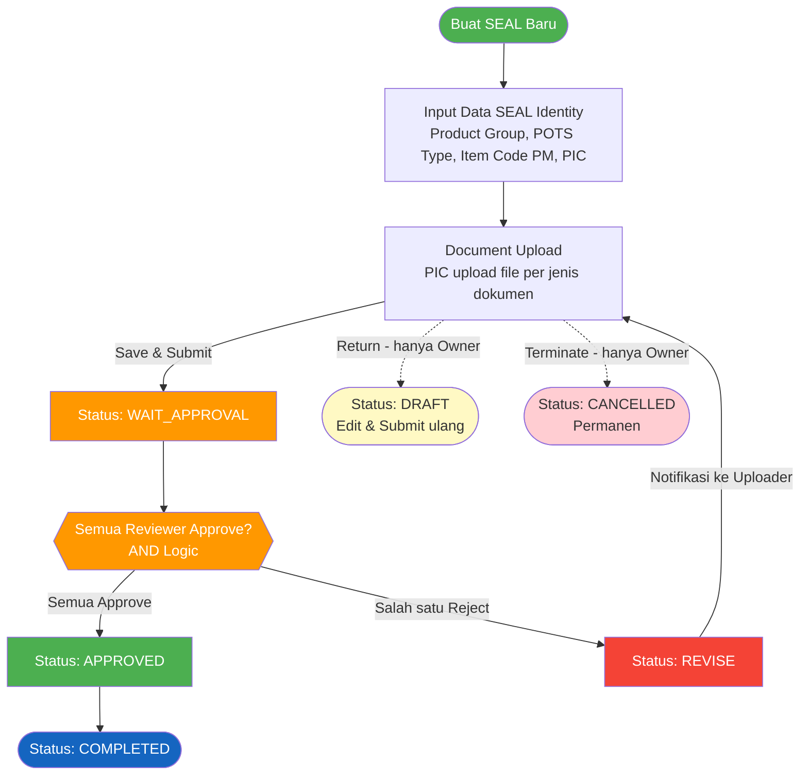

# FUNCTIONAL SPECIFICATION DOCUMENT (FSD)
## Modul: SEAL – Project Identity
### Sistem: IDC System (New RM Selection)

---

| Atribut          | Keterangan                                         |
|------------------|-----------------------------------------------------|
| **Nama Dokumen** | FSD Modul SEAL – Project Identity                  |
| **Versi**        | 1.0                                                |
| **Tanggal**      | 20 Februari 2026                                   |
| **Divisi**       | Packaging Development / ICT                        |
| **Status**       | Draft                                              |
| **Revamp dari**  | KN2015_RMPM (ProjectIdentity + PrintoutDocument)   |

---

## Daftar Isi

1. [Pendahuluan](#1-pendahuluan)
   - 1.1 [Tujuan Dokumen](#11-tujuan-dokumen)
   - 1.2 [Ruang Lingkup](#12-ruang-lingkup)
   - 1.3 [Stakeholder](#13-stakeholder)
2. [Ringkasan Business Flow](#2-ringkasan-business-flow)
   - 2.1 [Proses As-Is (Sistem Lama)](#21-proses-as-is-sistem-lama)
   - 2.2 [Proses To-Be (Sistem Baru)](#22-proses-to-be-sistem-baru)
3. [Spesifikasi Fungsional](#3-spesifikasi-fungsional)
   - 3.1 [Halaman Index (Daftar SEAL)](#31-halaman-index-daftar-seal)
   - 3.2 [Halaman Detail SEAL](#32-halaman-detail-seal)
   - 3.3 [Halaman Document Approval](#33-halaman-document-approval)
4. [Struktur Database](#4-struktur-database)
5. [Aturan Bisnis](#5-aturan-bisnis)
6. [List of Values (LOV) & Referensi Data](#6-list-of-values-lov--referensi-data)
7. [Hak Akses & Peran Pengguna](#7-hak-akses--peran-pengguna)
8. [Notifikasi](#8-notifikasi)

---

## 1. Pendahuluan

Modul **SEAL (Sign-off Evaluation for Artwork & Labels)** – yang sebelumnya dikenal sebagai *Project Identity* – merupakan modul inti dalam sistem IDC yang mengelola lifecycle dokumen identifikasi proyek packaging material. Modul ini merupakan hasil *revamp* dari sistem lama **KN2015_RMPM**, yang menggabungkan dua modul terpisah:

- **ProjectIdentity**: Modul pencatatan identitas proyek (header informasi proyek, item, supplier, member PIC).
- **PrintoutDocument**: Modul pengelolaan dokumen fisik dari setiap departemen beserta mekanisme review dan persetujuannya.

Pada sistem baru (IDC), kedua modul tersebut telah disatukan dalam satu alur yang terintegrasi dengan tampilan UI modern berbasis Bootstrap 5 / Vuexy template.

### 1.1 Tujuan Dokumen

Dokumen ini bertujuan untuk:

1. Menjelaskan fungsionalitas lengkap modul SEAL di sistem IDC.
2. Menjadi acuan pengembangan (*development reference*) bagi tim ICT.
3. Mendeskripsikan alur proses, desain layar, struktur database, serta aturan bisnis yang berlaku.
4. Mencatat perubahan/penyesuaian dari sistem lama (KN2015_RMPM) ke sistem baru (IDC).

### 1.2 Ruang Lingkup

Dokumen ini mencakup tiga halaman utama:

1. `ProjectIdentityIndex.html` – Halaman daftar SEAL
2. `ProjectIdentityDetail.html` – Halaman input/edit identitas proyek + upload dokumen
3. `ProjectIdentityDocumentApproval.html` – Halaman review & approval dokumen per proyek

### 1.3 Stakeholder

| Peran                | Nama / Tim                    | Keterlibatan                              |
|----------------------|-------------------------------|-------------------------------------------|
| Business Owner       | Packaging Development         | Pemilik proses bisnis, validasi kebutuhan |
| ICT Developer        | KN IT                         | Pengembangan dan implementasi             |
| Uploader             | PCD, BD, RA, QFS, PDV         | Pengguna modul, upload & submit dokumen   |
| Reviewer / Approver  | PCD, BD, RA, QFS, PDV         | Melakukan review dan approval dokumen     |

---

## 2. Ringkasan Business Flow

### 2.1 Proses As-Is (Sistem Lama)

Pada sistem lama (KN2015_RMPM), proses dibagi menjadi dua modul terpisah:

**Modul ProjectIdentity** menangani:
- Header dokumen proyek (Doc No, Doc Date, Status)
- Informasi item PM (Item Code PM, PM Category)
- Data supplier dari Oracle
- Member of Project: Packaging Dev, Business Dev, RA, QFS, Product Dev
- Workflow submit dan approval

**Modul PrintoutDocument** menangani:
- Review per departemen (sequential, bukan parallel)
- Upload attachment per kategori dokumen
- Item Specification viewer
- Aksi per reviewer: Continued / Returned

| Aspek              | Sistem Lama                                  | Sistem Baru (IDC)                         |
|--------------------|----------------------------------------------|-------------------------------------------|
| Halaman Utama      | ProjectIdentity/Index + PrintoutDocument/Index| ProjectIdentityIndex.html (satu pintu)   |
| Input Data         | ProjectIdentity/Detail                       | ProjectIdentityDetail.html                |
| Review & Approval  | PrintoutDocument/Detail (per departemen)     | ProjectIdentityDocumentApproval.html      |
| UI Framework       | Bootstrap 3 / AdminLTE                       | Bootstrap 5 / Vuexy                       |
| Approval Logic     | Per-departemen sequential                    | Per-dokumen parallel (AND logic)          |
| Upload Dokumen     | Per departemen (attachment per tab)          | Per jenis dokumen (accordion per dok)     |

### 2.2 Proses To-Be (Sistem Baru)

#### 2.2.1 Flow Diagram



#### 2.2.2 Status Dokumen

| Kode              | Label            | Deskripsi                                                                          |
|-------------------|------------------|----------------------------------------------------------------------------------|
| `DRAFT`           | Draft            | Baru dibuat / dikembalikan oleh Owner, dapat diedit dan disubmit kembali           |
| `WAIT_APPROVAL`   | Waiting Approval | Sudah disubmit, menunggu review dari semua reviewer                                |
| `REVISE`          | Revise           | Minimal satu reviewer melakukan reject; Uploader wajib upload ulang dokumen        |
| `APPROVED`        | Approved         | Semua reviewer telah menyetujui                                                    |
| `COMPLETED`       | Completed        | Proses selesai setelah status Approved (final)                                     |
| `CANCELLED`       | Cancelled        | Dibatalkan secara permanen oleh Owner/Creator - tidak dapat dipulihkan             |

---

## 3. Spesifikasi Fungsional

### 3.1 Halaman Index (Daftar SEAL)

**Path**: `ProjectIdentityIndex.html`

**Tujuan**: Menampilkan semua dokumen SEAL dalam bentuk daftar tabel, dilengkapi dashboard ringkasan status.

#### 3.1.1 Deskripsi

| Card           | Warna    | Isi                                                        |
|----------------|----------|------------------------------------------------------------|
| Total SEAL     | Biru     | Total semua dokumen SEAL dari pengguna saat ini            |
| Draft          | Kuning   | Jumlah dokumen dengan status Draft                         |
| Submitted      | Biru Muda| Jumlah dokumen dengan status Waiting Approval / Submit     |
| Completed      | Hijau    | Jumlah dokumen dengan status Approved / Completed / Closed |

#### 3.1.2 Screenshot

*(Gambar 1: Halaman Index SEAL)*

#### 3.1.3 Functional Description

**Action Bar:**

| Tombol          | Fungsi                                                          |
|-----------------|-----------------------------------------------------------------|
| Export Excel    | Mengekspor data tabel ke format Excel                           |
| Create New SEAL | Mengarahkan ke halaman Detail dengan parameter `?id=new`        |

**Tabel Daftar SEAL:**

| Kolom             | Sumber Data        | Keterangan                                        |
|-------------------|--------------------|---------------------------------------------------|
| Doc No            | `txtDocNo`         | Nomor dokumen (auto-generated)                    |
| Date              | `dtDocDate`        | Tanggal dokumen dibuat                            |
| Product Group     | `txtProductGroup`  | Grup produk                                       |
| Available Supplier| `txtSupplierName`  | Nama supplier                                     |
| Status            | `txtDocStatus`     | Badge warna sesuai status                         |
| Action            | -                  | Dropdown menu: Edit / Review / View               |

#### 3.1.4 Business Rules & Validation

| Status Dokumen               | Label Tombol | Halaman Tujuan                              |
|------------------------------|-------------|---------------------------------------------|
| Draft                        | Edit        | `ProjectIdentityDetail.html?id={id}`         |
| Waiting Approval             | Review      | `ProjectIdentityDocumentApproval.html?id={id}` |
| Approved / Rejected / Completed | View    | `ProjectIdentityDocumentApproval.html?id={id}` |

---

### 3.2 Halaman Detail SEAL

**Path**: `ProjectIdentityDetail.html`

**Tujuan**: Halaman input dan editing data identitas proyek SEAL. Memiliki dua tab utama.

#### 3.2.1 Deskripsi

| Elemen             | Kondisi Tampil                       | Fungsi                                                       |
|--------------------|--------------------------------------|--------------------------------------------------------------|
| Judul              | Selalu                               | "Packforces / SEAL / Detail"                                 |
| Tombol Back        | Selalu                               | Kembali ke halaman Index                                     |
| Tombol Save        | Status = Draft                       | Menyimpan data SEAL ke database. Tipe: `btn-primary`         |
| Tombol Submit      | Status = Draft (setelah first save)  | Mengubah status Draft → Waiting Approval. Tipe: `btn-info`   |
| Tombol Return      | Status ≠ Draft **dan** user = Owner  | Mengembalikan dokumen ke Draft (perlu catatan alasan). Tipe: `btn-warning` |
| Tombol Terminate   | Status ≠ Cancelled **dan** user = Owner | Membatalkan dokumen secara permanen (perlu catatan alasan). Tipe: `btn-danger` |
| Badge Status       | Selalu                               | Menampilkan status dokumen saat ini (contoh: "Draft")        |

#### 3.2.2 Screenshot

*(Gambar 2: Halaman Detail SEAL)*

#### 3.2.3 Functional Description

**Tab 1: SEAL Identity — Bagian A: Informasi Dokumen**

| Field      | ID Elemen     | Tipe     | Keterangan                                        |
|------------|---------------|----------|---------------------------------------------------|
| Doc No     | `txtDocNo`    | Input    | Read-only. Auto-generated saat save pertama       |
| Doc Date   | `txtDocDate`  | Date     | Tanggal dokumen. Default: tanggal hari ini        |
| Doc Status | `txtDocStatus`| Input    | Read-only. Terisi otomatis sesuai status workflow |

**Tab 1: SEAL Identity — Bagian B: Project Details**

| Field          | ID Elemen         | Tipe       | LOV / Sumber Data                    | Keterangan                                  |
|----------------|-------------------|------------|--------------------------------------|---------------------------------------------|
| Product Group  | `txtProductGroup` | Input+LOV  | MAppParam: PRODUCT_GROUP             | Pilih grup produk                           |
| Project Type   | `txtProjectType`  | Input+LOV  | MAppParam: IDC_PROJECTTYPE           | Tipe proyek                                 |
| POTS Type      | `txtPotsType`     | Input+LOV  | Hardcoded: MAKE / BUY                | Make or Buy                                 |
| Supplier Name  | `txtSupplierName` | Input+LOV  | Oracle: SupplierOracleForIdentity    | Nama supplier dari Oracle                   |
| Item Code PM   | `txtItemCodePM`   | Input+LOV  | Oracle: ItemCodePMForIdentity        | Kode item packaging material dari Oracle    |
| Item Desc      | `lblItemDesc`     | Label      | Auto-fill dari LOV Item Code PM      | Deskripsi item PM                           |

**Tab 1: SEAL Identity — Bagian C: Reference Document**

| Radio Option       | Nilai        | Aksi                                                              |
|--------------------|--------------|-------------------------------------------------------------------|
| Item Specification | `itemSpec`   | Tombol LOV Item Spec No aktif; Tombol LOV Parent Spec nonaktif   |
| PM Evaluation      | `pmEval`     | Tombol LOV Parent Spec aktif; Tombol LOV Item Spec No nonaktif   |

**Tab 1: SEAL Identity — Bagian D: Project Members (PIC)**

| Kolom    | Keterangan                                                   |
|----------|--------------------------------------------------------------|
| Dept     | Departemen / Role PIC (terisi otomatis dari data user)       |
| Assignee | Nama pegawai yang ditugaskan (dipilih dari LOV Employee)     |
| Action   | Tombol hapus PIC dari daftar                                 |

**Alur Menambah PIC:**

1. Klik tombol **+ Add PIC** pada tabel Project Members.
2. Pop-up **Add Project Member** tampil.
3. Klik tombol **Search** (ikon kaca pembesar hijau) di sebelah field *Assignee (Name)*.
4. Pop-up **Select Employee** tampil berisi daftar karyawan bersumber dari *IDC Master User* (kolom: Username, Department, LOB).
5. Gunakan kolom pencarian untuk memfilter nama atau departemen.
6. Klik **Select** pada baris karyawan yang diinginkan.
7. Field *Assignee (Name)* dan *Department* terisi otomatis sesuai data yang dipilih.
8. Klik **Add Member** untuk menyimpan entri PIC ke tabel.

**Tab 2: Document Upload**

| No | Nama Dokumen                        | Wajib |
|----|-------------------------------------|-------|
| 1  | FOOD GRADE/FOOD CONTACT CERTIFICATE | ✓     |
| 2  | HALAL CERTIFICATE/FREE ANIMAL DECLARATION | ✓ |
| 3  | MIGRATION TEST REPORT               |       |
| 4  | FORM MOCK UP APPROVAL               |       |
| 5  | MATERIAL SAFETY DATA SHEET          | ✓     |
| 6  | QUOTATION                           | ✓     |
| 7  | PME_DOCUMENT_TYPE                   |       |
| 8  | SPECIFICATION                       |       |
| 9  | REPORT STABILITY TEST               |       |

#### 3.2.4 Business Rules & Validation

1. **Doc No** bersifat read-only, auto-generated: format `SEAL-{YYYY}-{NNNN}`.
2. **Doc Date** default adalah tanggal hari ini.
3. Pengguna harus memilih salah satu referensi: **Item Specification** atau **PM Evaluation** — tidak boleh keduanya.
4. Tombol **Submit** hanya muncul setelah dokumen pertama kali disimpan.
5. Semua field menjadi read-only setelah disubmit.
6. Tombol **Return** hanya tampil jika status ≠ `DRAFT` **dan** user yang login adalah **Owner/Creator** dokumen. Klik Return memerlukan konfirmasi beserta catatan alasan (wajib). Status dokumen kembali menjadi `DRAFT` dan dicatat di log.
7. Tombol **Terminate** hanya tampil jika status ≠ `CANCELLED` **dan** user yang login adalah **Owner/Creator** dokumen. Klik Terminate memerlukan konfirmasi beserta catatan alasan (wajib). Status dokumen berubah ke `CANCELLED` secara permanen — tidak dapat diedit, disubmit, maupun dipulihkan. Sistem mengirim notifikasi ke seluruh PIC yang tercantum.

---

### 3.3 Halaman Document Approval

**Path**: `ProjectIdentityDocumentApproval.html`

**Tujuan**: Halaman untuk melihat status review dan melakukan approve/reject per dokumen oleh reviewer yang berwenang.

#### 3.3.1 Deskripsi

| Elemen           | Fungsi                                                                    |
|------------------|---------------------------------------------------------------------------|
| Judul            | "Packforces / SEAL / Document Approval"                                   |
| Badge Demo Mode  | Indikator mode demo (akan dihapus di production)                          |
| Tombol Back      | Kembali ke halaman Detail (`ProjectIdentityDetail.html`)                  |
| Badge Status     | Menampilkan status dokumen saat ini (contoh: "Waiting Approval")          |

#### 3.3.2 Screenshot

*(Gambar 3: Halaman Document Approval)*

#### 3.3.3 Functional Description

Halaman ini memiliki dua tab utama:

---

**Tab 1: SEAL Identity (Read-Only)**

Semua field identik dengan halaman Detail, namun seluruhnya dalam mode **read-only** — semua tombol LOV dinonaktifkan (disabled). Field yang ditampilkan:

| Group              | Field                                                                          |
|--------------------|--------------------------------------------------------------------------------|
| Header             | Doc No, Doc Date, Doc Status                                                   |
| Project Details    | Product Group, Project Type, POTS Type, Supplier Name, Item Code PM, Item Desc |
| Reference Document | Item Spec No atau PM Evaluation No (sesuai pilihan saat input)                 |
| Project Members    | Tabel Dept & Assignee (read-only, tanpa tombol Delete / Add PIC)               |

---

**Tab 2: Document Upload (Approval Mode)**

*(Gambar 4: Tab Document Upload – Accordion Reviewer Cards)*

> **Approval Logic:** ANY **ONE** PIC from assigned departments can upload (**OR logic**). **ALL** reviewers must approve (**AND logic – parallel**).

Setiap jenis dokumen ditampilkan dalam sebuah **Accordion Card** dengan komponen berikut:


**A. Header Accordion**

| Elemen              | Keterangan                                                      |
|---------------------|-----------------------------------------------------------------|
| Ikon Dokumen        | Icon jenis file (PDF / DOCX / XLSX)                             |
| Nama Dokumen        | Nama jenis dokumen (misal: FOOD GRADE CERTIFICATE)              |
| Badge Status        | `APPROVED` / `PENDING APPROVAL` / `PENDING UPLOAD`              |

**B. Eligible Uploaders (PIC)**

Menampilkan daftar badge nama PIC yang berhak melakukan upload untuk dokumen ini. Format badge: `[DEPT] - [Nama]` (contoh: `PCD - Ageng`).

**C. Upload Area / File Info**

- **Jika belum ada file**: Tampil Drop Zone dengan tombol *Choose File*
- **Jika sudah ada file**: Tampil info file (nama, ukuran, uploader, waktu upload) + tombol **View**

| Elemen      | Keterangan                                                       |
|-------------|------------------------------------------------------------------|
| Drop Zone   | Area klik/drag untuk memilih file                                |
| Choose File | Tombol alternatif untuk membuka file browser                     |
| Format      | Mendukung: PDF, DOCX, XLSX (Max 5MB)                             |
| Progress Bar| Ditampilkan saat proses upload berlangsung                       |
| View Button | Membuka preview/download file yang sudah terupload               |

**D. Reviewer Approval Cards**

Setiap reviewer ditampilkan dalam sebuah card yang memuat:

| Elemen           | Keterangan                                                                  |
|------------------|-----------------------------------------------------------------------------|
| Nama Reviewer    | Nama pegawai reviewer                                                       |
| Departemen       | Departemen reviewer (contoh: Business Development (BD))                     |
| Badge Status     | `Approved` (hijau) / `Rejected` (merah) / `Pending` (kuning)               |
| Textarea Catatan | Area input catatan/alasan — **wajib diisi** saat Reject                     |
| Timestamp        | Waktu keputusan dibuat (hanya muncul setelah approve/reject)                |
| Tombol Aksi      | **Approve** (hijau) / **Reject** (merah) — hanya muncul saat status Pending |

**Alur Reviewer Memberi Keputusan (Approve/Reject):**

1. Reviewer membuka accordion dokumen yang belum memiliki keputusan darinya (badge card = `Pending`).
2. Reviewer mengisi **catatan** pada textarea (opsional untuk Approve, **wajib** untuk Reject).
3. Reviewer menekan tombol **Approve** atau **Reject**.
4. Sistem menvalidasi: jika **Reject** dan catatan kosong → tampil peringatan *"Catatan Wajib"*.
5. Muncul dialog konfirmasi — reviewer memilih *"Ya, lanjutkan!"* atau *"Batal"*.
6. Setelah dikonfirmasi:
   - Badge card reviewer berubah → **Approved** (hijau) / **Rejected** (merah)
   - Tombol Approve/Reject diganti teks konfirmasi (misal: *"✓ Approved just now"*), textarea dinonaktifkan
   - Entri ditambahkan ke **History Log** (`Disetujui/Ditolak oleh [Nama]`)
7. Sistem mengecek semua reviewer pada dokumen yang sama:
   - **Ada yang Reject** → badge header accordion = `REJECTED` (merah), alert Waiting berubah pesan error
   - **Semua Approve** → badge header accordion = `APPROVED` (hijau), alert "Waiting" disembunyikan, entri *"Dokumen Fully Approved"* ditambahkan ke History Log

**E. History Log**

Timeline vertikal yang mencatat aktivitas dokumen secara kronologis (entri terbaru di atas):

| Event                   | Warna | Deskripsi                                              |
|-------------------------|-------|--------------------------------------------------------|
| Dokumen Fully Approved  | Hijau | Semua reviewer telah menyetujui dokumen                |
| Disetujui oleh [Nama]   | Hijau | Salah satu reviewer memberikan approval                |
| Ditolak oleh [Nama]     | Merah | Salah satu reviewer memberikan penolakan               |
| Submitted for Approval  | Biru  | PIC berhasil mengupload dan submit untuk review        |
| File Uploaded           | Cyan  | PIC mengupload file                                    |
| File Deleted            | Merah | File dihapus oleh PIC                                  |
| Document Created        | Cyan  | Sistem membuat requirement dokumen secara otomatis     |

---

**Status Badge Dokumen (Header Accordion)**

| Badge            | Warna    | Kondisi                                            | Update                                   |
|------------------|----------|----------------------------------------------------|------------------------------------------|
| PENDING UPLOAD   | Abu-abu  | File belum diupload oleh PIC                       | Awal / setelah file dihapus              |
| PENDING APPROVAL | Kuning   | File sudah diupload, ada reviewer yang masih Pending | Setelah upload berhasil                 |
| REJECTED         | Merah    | Minimal satu reviewer menolak                      | Real-time saat reviewer klik Reject      |
| APPROVED         | Hijau    | Semua reviewer telah approve                       | Real-time saat reviewer terakhir approve |

#### 3.3.4 Business Rules & Validation

1. Upload hanya oleh PIC yang tercantum sebagai *Eligible Uploaders* untuk dokumen tersebut (**OR Logic**).
2. Semua reviewer harus memberikan keputusan Approve/Reject (**AND Logic**).
3. Approval berjalan secara **parallel** — semua reviewer bisa review bersamaan tanpa urutan.
4. Catatan **wajib diisi** oleh reviewer saat melakukan **Reject**.
5. Jika semua reviewer **Approve** → badge header dokumen berubah ke `APPROVED` (real-time), alert Waiting disembunyikan.
6. Jika minimal satu reviewer **Reject** → badge header dokumen berubah ke `REJECTED` (real-time), alert berubah pesan error merah.
7. Dokumen yang di-Reject harus diupload ulang oleh PIC yang eligible.
8. Reviewer yang sudah memberikan keputusan **tidak dapat** mengubahnya kembali (tombol terkunci).
9. Semua perubahan status terekam di **History Log** secara real-time.

---

## 4. Struktur Database

> **Konvensi Penamaan**:
> - Nama tabel menggunakan **lowercase prefix + PascalCase** (contoh: `trProjectIdentityHdr`)
> - Setiap tabel memiliki: `IntId` (PK integer, auto-increment) dan `TxtId` (varchar 50, business key)
> - Nama kolom menggunakan **TitleCase** dengan prefix tipe data: `Int`, `Txt`, `Dt`, `Bit`

### 4.1 Konvensi Penamaan

| Prefix   | Tipe Data   | Contoh          |
|----------|-------------|-----------------|
| `Int`    | INTEGER     | `IntId`, `IntVersion` |
| `Txt`    | VARCHAR/TEXT| `TxtDocNo`, `TxtSupplierName` |
| `Dt`     | DATE/TIMESTAMP | `DtDocDate`, `DtCreatedDate` |
| `Bit`    | BOOLEAN     | `BitFcsLogo`, `BitActive` |
| `tr`     | Tabel transaksi | `trProjectIdentityHdr` |
| `m`      | Tabel master | `mPMCategoryDocHeader` |

### 4.2 Entity Relationship Diagram (ERD)

*(Gambar 5: ERD – Relasi Tabel Modul SEAL)*

### 4.4 Tabel Transaksi

#### 4.3.1 `trProjectIdentityHdr` — Header Proyek

*(Revamp dari: `mProjectIdentity_Header`)*

| Kolom                    | Tipe Data      | Nullable | Keterangan                                                         |
|--------------------------|----------------|----------|--------------------------------------------------------------------|
| `IntId`                  | INT (PK)       | No       | Primary key, auto increment                                        |
| `TxtId`                  | VARCHAR(50)    | No       | Business key unik                                                  |
| `TxtDocNo`               | VARCHAR(50)    | No       | Nomor dokumen (format: SEAL-YYYY-NNN)                              |
| `DtDocDate`              | DATE           | No       | Tanggal dokumen                                                    |
| `TxtDocStatus`           | VARCHAR(20)    | No       | Draft / Waiting Approval / Approved / Rejected / Completed / Closed |
| `TxtProductGroup`        | VARCHAR(100)   | Yes      | Nama product group                                                 |
| `TxtProjectType`         | VARCHAR(100)   | Yes      | Tipe proyek                                                        |
| `TxtPotsType`            | VARCHAR(10)    | Yes      | Make / Buy                                                         |
| `TxtSupplierId`          | VARCHAR(50)    | Yes      | ID Supplier dari Oracle                                            |
| `TxtSupplierName`        | VARCHAR(200)   | Yes      | Nama supplier                                                      |
| `TxtItemCodePm`          | VARCHAR(50)    | Yes      | Kode Item PM dari Oracle                                           |
| `TxtItemDescPm`          | VARCHAR(500)   | Yes      | Deskripsi Item PM                                                  |
| `TxtPmCategoryName`      | VARCHAR(100)   | Yes      | Nama PM Category                                                   |
| `TxtRefDocType`          | VARCHAR(20)    | Yes      | Jenis referensi: `itemSpec` / `pmEval`                             |
| `TxtItemSpecNo`          | VARCHAR(50)    | Yes      | Nomor Item Specification                                           |
| `TxtPmEvaluationNo`      | VARCHAR(50)    | Yes      | Nomor PM Evaluation                                                |
| `TxtAkasiaNumber`        | VARCHAR(50)    | Yes      | Nomor Akasia dari Oracle                                           |
| `BitFcsLogo`             | BOOLEAN        | Yes      | FCS/Forestry Certificate Logo                                      |
| `TxtForestryCertBody`    | VARCHAR(100)   | Yes      | Badan sertifikasi kehutanan                                        |
| `TxtForestryCertNo`      | VARCHAR(50)    | Yes      | Nomor sertifikat kehutanan                                         |
| `DtForestryCertValidTo`  | DATE           | Yes      | Tanggal berlaku sertifikat kehutanan                               |
| `BitHalalLogo`           | BOOLEAN        | Yes      | Logo Halal                                                         |
| `BitQrCode`              | BOOLEAN        | Yes      | QR Code                                                            |
| `BitKonsesi`             | BOOLEAN        | Yes      | Proyek konsesi                                                     |
| `BitBusinessRepresentative` | BOOLEAN    | Yes      | Business Representative                                            |
| `TxtNoteClose`           | TEXT           | Yes      | Catatan penutupan dokumen                                          |
| `IntVersion`             | INT            | No       | Versi dokumen, default 1                                           |
| `DtDeliveryEstimation`   | DATE           | Yes      | Estimasi pengiriman                                                |
| `TxtCreatedBy`           | VARCHAR(50)    | No       | ID pegawai pembuat                                                 |
| `TxtCreatedByName`       | VARCHAR(100)   | Yes      | Nama pegawai pembuat                                               |
| `DtCreatedDate`          | TIMESTAMP      | No       | Waktu pembuatan                                                    |
| `TxtModifiedBy`          | VARCHAR(50)    | Yes      | ID pegawai yang terakhir modifikasi                                |
| `DtModifiedDate`         | TIMESTAMP      | Yes      | Waktu modifikasi terakhir                                          |

#### 4.3.2 `trProjectIdentityPic` — Project Member (PIC)

*(Revamp dari: field individual `txtPackagingDevelopment`, dll di header lama)*

| Kolom            | Tipe Data    | Nullable | Keterangan                                        |
|------------------|--------------|----------|---------------------------------------------------|
| `IntId`          | INT (PK)     | No       | Primary key, auto increment                       |
| `TxtId`          | VARCHAR(50)  | No       | Business key unik                                 |
| `IntProjectHdrId`| INT (FK)     | No       | Referensi ke `trProjectIdentityHdr.IntId`         |
| `TxtDeptRole`    | VARCHAR(100) | No       | Departemen/Role PIC                               |
| `TxtEmployeeId`  | VARCHAR(50)  | No       | ID pegawai                                        |
| `TxtEmployeeName`| VARCHAR(200) | No       | Nama pegawai                                      |
| `TxtCreatedBy`   | VARCHAR(50)  | No       | ID pembuat record                                 |
| `DtCreatedDate`  | TIMESTAMP    | No       | Waktu penambahan                                  |

#### 4.3.3 `trProjectIdentityDoc` — Dokumen per Proyek

*(Revamp dari: tabel dokumen PrintoutDocument per departemen)*

| Kolom               | Tipe Data    | Nullable | Keterangan                                               |
|---------------------|--------------|----------|----------------------------------------------------------|
| `IntId`             | INT (PK)     | No       | Primary key, auto increment                              |
| `TxtId`             | VARCHAR(50)  | No       | Business key unik                                        |
| `IntProjectHdrId`   | INT (FK)     | No       | Referensi ke `trProjectIdentityHdr.IntId`                |
| `IntDocCategoryId`  | INT (FK)     | No       | Referensi ke `mPMCategoryDocDetail.IntPMCategoryDocDtlId`|
| `TxtDocName`        | VARCHAR(200) | No       | Nama jenis dokumen                                       |
| `BitIsMandatory`    | BOOLEAN      | No       | Apakah dokumen wajib                                     |
| `TxtDocStatus`      | VARCHAR(30)  | No       | Pending Upload / Pending Approval / Approved / Rejected  |
| `TxtFileName`       | VARCHAR(255) | Yes      | Nama file yang diupload                                  |
| `TxtFilePath`       | TEXT         | Yes      | Path penyimpanan file di server                          |
| `IntFileSizeKb`     | INT          | Yes      | Ukuran file dalam KB                                     |
| `TxtFileType`       | VARCHAR(10)  | Yes      | Ekstensi file (pdf, docx, xlsx)                          |
| `TxtUploadedBy`     | VARCHAR(50)  | Yes      | ID pegawai yang upload                                   |
| `TxtUploadedByName` | VARCHAR(100) | Yes      | Nama pegawai yang upload                                 |
| `DtUploadedDate`    | TIMESTAMP    | Yes      | Waktu upload                                             |
| `TxtCreatedBy`      | VARCHAR(50)  | No       | ID pembuat record                                        |
| `DtCreatedDate`     | TIMESTAMP    | No       | Waktu pembuatan record                                   |

#### 4.3.4 `trProjectIdentityDocApproval` — Approval per Dokumen

| Kolom               | Tipe Data    | Nullable | Keterangan                                              |
|---------------------|--------------|----------|---------------------------------------------------------|
| `IntId`             | INT (PK)     | No       | Primary key, auto increment                             |
| `TxtId`             | VARCHAR(50)  | No       | Business key unik                                       |
| `IntProjectDocId`   | INT (FK)     | No       | Referensi ke `trProjectIdentityDoc.IntId`               |
| `TxtReviewerId`     | VARCHAR(50)  | No       | ID reviewer                                             |
| `TxtReviewerName`   | VARCHAR(200) | No       | Nama reviewer                                           |
| `TxtReviewerDept`   | VARCHAR(100) | No       | Departemen reviewer                                     |
| `TxtApprovalStatus` | VARCHAR(20)  | No       | Pending / Approved / Rejected                           |
| `TxtApprovalNote`   | TEXT         | Yes      | Catatan approval                                        |
| `DtApprovalDate`    | TIMESTAMP    | Yes      | Tanggal approval                                        |
| `TxtCreatedBy`      | VARCHAR(50)  | No       | ID pembuat record                                       |
| `DtCreatedDate`     | TIMESTAMP    | No       | Waktu pembuatan record                                  |

#### 4.3.5 `trProjectIdentityDocHistory` — History Log Dokumen

| Kolom           | Tipe Data    | Nullable | Keterangan                                              |
|-----------------|--------------|----------|---------------------------------------------------------|
| `IntId`         | INT (PK)     | No       | Primary key, auto increment                             |
| `TxtId`         | VARCHAR(50)  | No       | Business key unik                                       |
| `IntProjectDocId`| INT (FK)    | No       | Referensi ke `trProjectIdentityDoc.IntId`               |
| `TxtAction`     | VARCHAR(100) | No       | Deskripsi aksi (File Uploaded, Submitted, Approved, dll)|
| `TxtActionBy`   | VARCHAR(100) | No       | Nama pegawai yang melakukan aksi                        |
| `DtActionDate`  | TIMESTAMP    | No       | Waktu aksi dilakukan                                    |
| `TxtNotes`      | TEXT         | Yes      | Catatan tambahan                                        |

#### 4.3.6 `trPMEvaluationHeader` — Header PM Evaluation

*(Tabel referensi yang digunakan oleh SEAL sebagai sumber PM Evaluation No)*

| Kolom                         | Tipe Data    | Nullable | Keterangan                                      |
|-------------------------------|--------------|----------|-------------------------------------------------|
| `IntId`                       | serial4 (PK) | No       | Primary key, auto increment                     |
| `TxtPMEvaluationId`           | UUID         | Yes      | Business key unik (UUID)                        |
| `TxtPMEvaluationNumber`       | VARCHAR(50)  | Yes      | Nomor dokumen PM Evaluation                     |
| `IntPMEvaluationReferenceId`  | INT (FK)     | Yes      | ID referensi PM Evaluation                      |
| `TxtPMEvaluationReference`    | VARCHAR(50)  | Yes      | Nomor referensi PM Evaluation                   |
| `TxtDocStatus`                | VARCHAR(50)  | Yes      | Status dokumen                                  |
| `TxtSampleNumber`             | VARCHAR(50)  | Yes      | Nomor sample                                    |
| `TxtItemSampleCode`           | VARCHAR(50)  | Yes      | Kode item sample                                |
| `TxtSampleDesc`               | VARCHAR(200) | Yes      | Deskripsi sample                                |
| `TxtRemark`                   | VARCHAR(500) | Yes      | Catatan                                         |
| `TxtCreatedBy`                | VARCHAR(50)  | Yes      | ID user pembuat                                 |
| `DtCreatedDate`               | TIMESTAMP    | Yes      | Waktu pembuatan                                 |
| `TxtUpdatedBy`                | VARCHAR(50)  | Yes      | ID user terakhir update                         |
| `DtUpdatedDate`               | TIMESTAMP    | Yes      | Waktu update terakhir                           |

### 4.4 Tabel Master yang Digunakan (Existing)

> Tabel-tabel berikut **sudah ada** di Packforces context. SEAL menggunakannya sebagai referensi — **tidak perlu dibuat ulang**.

#### 4.3.1 `mPMCategoryDocHeader` — Header Konfigurasi Dokumen per PM Category

| Kolom                   | Tipe Data    | Nullable | Keterangan                                |
|-------------------------|--------------|----------|-------------------------------------------|
| `IntPMCategoryDocHdrId` | INT (PK)     | No       | Primary key                               |
| `IntPMCategoryId`       | INT (FK)     | Yes      | Referensi ke `mPMCategory`                |
| `TxtPMCategoryCode`     | VARCHAR      | Yes      | Kode PM Category (FP, RB, ML, dll)        |
| `TxtPMCategoryName`     | VARCHAR      | Yes      | Nama PM Category                          |
| `BitActive`             | BOOLEAN      | Yes      | Status aktif konfigurasi                  |
| `TxtInsertedBy`         | VARCHAR(100) | Yes      | ID user pembuat                           |
| `DtInserted`            | TIMESTAMP    | Yes      | Waktu pembuatan                           |
| `TxtUpdatedBy`          | VARCHAR(100) | Yes      | ID user updater                           |
| `DtUpdated`             | TIMESTAMP    | Yes      | Waktu update terakhir                     |

#### 4.3.2 `mPMCategoryDocDetail` — Daftar Dokumen per PM Category

| Kolom                    | Tipe Data    | Nullable | Keterangan                                              |
|--------------------------|--------------|----------|---------------------------------------------------------|
| `IntPMCategoryDocDtlId`  | INT (PK)     | No       | Primary key                                             |
| `IntPMCategoryDocHdrId`  | INT (FK)     | No       | Referensi ke `mPMCategoryDocHeader`                     |
| `TxtDocumentName`        | VARCHAR(255) | Yes      | Nama dokumen yang diwajibkan                            |
| `BitActive`              | BOOLEAN      | Yes      | Status aktif dokumen dalam konfigurasi                  |
| `TxtInsertedBy`          | VARCHAR(100) | Yes      | ID user pembuat                                         |
| `DtInserted`             | TIMESTAMP    | Yes      | Waktu pembuatan                                         |
| `TxtUpdatedBy`           | VARCHAR(100) | Yes      | ID user updater                                         |
| `DtUpdated`              | TIMESTAMP    | Yes      | Waktu update terakhir                                   |

**Relasi ke SEAL:** Saat SEAL dibuat, sistem membaca `mPMCategoryDocDetail` berdasarkan PM Category dari item yang dipilih, lalu membuat record di `trProjectIdentityDoc` untuk setiap dokumen aktif.

---

## 5. Aturan Bisnis

### 5.1 Pembuatan Dokumen

1. **Doc No** bersifat read-only dan di-generate otomatis: format `SEAL-{YYYY}-{NNNN}`.
2. **Doc Date** default adalah tanggal hari ini.
3. **Doc Status** awal adalah `Draft` dan tidak dapat diubah manual.

### 5.2 Reference Document

1. Pengguna harus memilih salah satu: **Item Specification** atau **PM Evaluation** — tidak boleh keduanya.
2. Saat **Item Specification** dipilih: LOV Item Spec No aktif, LOV Parent Spec dinonaktifkan.
3. Saat **PM Evaluation** dipilih: LOV Parent Spec aktif, LOV Item Spec No dinonaktifkan.

### 5.3 Submit Dokumen

1. Tombol **Submit** hanya muncul setelah dokumen pertama kali disimpan.
2. Sistem memvalidasi: semua field wajib terisi dan dokumen bertanda wajib sudah diupload.
3. Setelah submit: status `Draft` → `Waiting Approval`.
4. Dokumen tidak dapat diedit setelah disubmit.

### 5.4 Upload Dokumen

1. Format file yang diizinkan: **PDF, DOCX, XLSX**. Ukuran maksimum: **5 MB**.
2. Upload hanya oleh PIC yang tercantum sebagai *Eligible Uploaders* (**OR Logic**).
3. Setelah upload, sistem mengirim notifikasi ke reviewer.

### 5.5 Proses Approval

1. Semua reviewer harus memberikan keputusan (**AND Logic**).
2. Approval berjalan secara **parallel** — semua reviewer bisa review bersamaan.
3. Jika semua **Approve** → status `Approved`.
4. Jika minimal satu **Reject** → status `Rejected`, PIC upload ulang dan re-submit.
5. Reviewer yang sudah memberi keputusan tidak dapat mengubahnya.

### 5.6 Return Dokumen

1. Hanya **Owner / Creator** dokumen yang dapat melakukan Return.
2. Return dapat dilakukan pada status apapun kecuali `DRAFT` dan `CANCELLED`.
3. Pengguna wajib mengisi catatan alasan Return (input konfirmasi wajib).
4. Setelah Return: status berubah ke `DRAFT`, dokumen dapat diedit dan disubmit ulang.
5. Aksi Return dicatat di **History Log** (user, timestamp, catatan).

### 5.7 Terminasi Dokumen (Terminate)

1. Hanya **Owner / Creator** dokumen yang dapat melakukan Terminate.
2. Terminate dapat dilakukan pada status apapun kecuali `CANCELLED`.
3. Pengguna wajib mengisi catatan alasan Terminate (input konfirmasi wajib).
4. Setelah Terminate: status berubah ke `CANCELLED` — **permanen, tidak dapat dipulihkan**.
5. Aksi Terminate dicatat di **History Log** (user, timestamp, catatan).
6. Sistem mengirim notifikasi ke seluruh PIC yang tercantum bahwa dokumen dibatalkan.

### 5.8 Aturan LOV Item Code PM

Saat Item Code PM dipilih dari LOV, sistem otomatis mengisi:
- `txtItemCodePM`, `lblItemDesc`, `txtSupplierName`, `txtAkasiaNumber`

---

## 6. List of Values (LOV) & Referensi Data

| LOV Name                      | Sumber         | Query / SP                                                                          | Field Tujuan                                                         |
|-------------------------------|----------------|-------------------------------------------------------------------------------------|----------------------------------------------------------------------|
| Product Group                 | `mAppParam`    | `select * from mAppParam where txtAppParamVariable = 'PRODUCT_GROUP'`               | `txtProductGroup`                                                    |
| Project Type                  | `mAppParam`    | `select * from mAppParam where txtAppParamVariable = 'IDC_PROJECTTYPE'`             | `txtProjectType`                                                     |
| POTS Type                     | Hardcoded      | MAKE / BUY                                                                          | `txtPotsType`                                                        |
| Supplier Name *(POTS: Make)*  | Oracle EBS     | `select supplier_name from XXSHP_SUPPLIER_IDC_SYSTEM_V`                              | `txtSupplierName`                                                    |
| Supplier Name *(POTS: Buy)*   | KNCentralized  | `select * from mAppParam where txtAppParamVariable = 'SUPPLIER_NAME'`                | `txtSupplierName`                                                    |
| Item Code PM *(POTS: Make)*   | Oracle EBS     | `SELECT * from XXSHP_IDC_ITEMCODE_IDENTITY`<br>*(kolom: Item Code, Description, Supplier Name, Akasia Number, MD Number, MD Expiry Date)* | `txtItemCodePM`, `lblItemDesc`, `txtSupplierName`, `txtAkasiaNumber`, `txtMDNumber`, `dtMDExpiry` |
| Item Code PM *(POTS: Buy)*    | IDC - Item Code Production | `select * from mItemCodeProduction where txtDocStatus = 'APPROVED'`                  | `txtItemCodePM`                                                      |

> **Catatan Implementasi POTS Type**: Logika sumber data Supplier Name dan Item Code PM bergantung pada nilai **POTS Type**:
> - **MAKE** → data diambil dari **Oracle EBS** (view `XXSHP_SUPPLIER_IDC_SYSTEM_V` dan `XXSHP_IDC_ITEMCODE_IDENTITY`).
> - **BUY (Supplier)** → data diambil dari **KNCentralized** tabel `mAppParam` dengan `txtAppParamVariable = 'SUPPLIER_NAME'` *(referensi: modul `RequestItemTrial` tab POTS Setup)*.
> - **BUY (Item Code PM)** → data diambil dari **IDC module Item Code Production** tabel `mItemCodeProduction` dengan filter `txtDocStatus = 'APPROVED'`.
>
> **Pada IDC saat ini, hanya sumber Oracle (POTS: MAKE) yang sudah diimplementasikan.**
| Item Spec No (Oracle)         | Oracle EBS     | SP: `ItemSpecPMDocNoForIdentity`                                                     | `txtItemSpec`                                                        |
| PM Evaluation No (Packforces) | Packforces     | SP: `PMEvaluationDocNoForIdentity`                                                   | `txtPMEvaluation`                                                    |
| Employee / PIC                | KN Global API  | `GET KNGlobal_API/UserAPI/GetAllListUser`<br>*(Module: Master User — kolom: KN Global, Username, Department, Superior, LOB)*<br>**Implementasi saat ini:** data di-seed dari *IDC Master User* (konstanta `IDC_USERS`). Akan diganti dengan API call di production. | `txtNewPICName` (Name), `txtNewPICDept` (Department — terisi otomatis) |

> **Catatan `mAppParam`**: SP yang digunakan adalah `spMAppParam_Select` dengan parameter `@intOption=1` dan `@txtAppParamVariable`. Kolom yang dikembalikan: `txtAppParamID`, `txtAppParamDescription`, `txtAppParamVariable`.


---

## 7. Hak Akses & Peran Pengguna

| Peran                   | Buat SEAL | Edit SEAL          | Upload Dokumen       | Review/Approve | Return / Terminate        | Lihat Semua |
|-------------------------|-----------|--------------------|----------------------|---------------|--------------------------|-------------|
| Packaging Dev (PCD)     | ✓         | ✓ (milik sendiri)  | ✓ (jika eligible)    | ✓             | ✓ (milik sendiri)         | ✗           |
| Business Dev (BD)       | ✓         | ✓ (milik sendiri)  | ✓ (jika eligible)    | ✓             | ✓ (milik sendiri)         | ✗           |
| Regulatory Affairs (RA) | ✓         | ✓ (milik sendiri)  | ✓ (jika eligible)    | ✓             | ✓ (milik sendiri)         | ✗           |
| Product Dev (PDV)       | ✓         | ✓ (milik sendiri)  | ✓ (jika eligible)    | ✓             | ✓ (milik sendiri)         | ✗           |
| Administrator           | ✓         | ✓                  | ✓                    | ✓             | ✓ (semua dokumen)         | ✓           |

**Catatan**: Return dan Terminate hanya dapat dilakukan oleh **Owner/Creator** dokumen, bukan oleh PIC atau reviewer lain.

---

## 8. Notifikasi

| Event                          | Penerima                        | Jenis          |
|--------------------------------|---------------------------------|----------------|
| SEAL baru dibuat               | Pembuat (konfirmasi)            | In-App         |
| Dokumen berhasil disubmit      | Semua reviewer terkait          | Email + In-App |
| Reviewer telah approve/reject  | Pembuat / PIC yang upload       | Email + In-App |
| Semua dokumen approved         | Pembuat / PIC                   | Email + In-App |
| Dokumen rejected               | PIC yang upload                 | Email + In-App |
| Reminder review belum selesai  | Reviewer yang belum action      | Email (Jadwal) |

---

*Dokumen ini dibuat secara otomatis berdasarkan analisis kode sumber oleh tim ICT.*
*Revisi dokumen dilakukan jika ada perubahan spesifikasi dari Business Owner.*

**End of Document**

---

## Appendix A: PostgreSQL DDL Scripts

> Script berikut digunakan untuk membuat tabel-tabel yang dibutuhkan modul SEAL Project Identity di database PostgreSQL IDC-System.
>
> **Konvensi Penamaan:**
> - Nama tabel: `lowercase prefix + PascalCase` (contoh: `trIdcSealHdr`)
> - Nama kolom: `TitleCase` dengan prefix tipe data: `Int`, `Txt`, `Dt`, `Bit`

### A.1 Tabel Header SEAL (`trIdcSealHdr`)

```sql
CREATE TABLE "trIdcSealHdr" (
    "IntId"             BIGSERIAL       PRIMARY KEY,
    "TxtSealNo"         VARCHAR(50)     NOT NULL UNIQUE,
    "TxtProductGroup"   VARCHAR(100),
    "TxtProjectType"    VARCHAR(100),
    "TxtPotsType"       VARCHAR(10)     CHECK ("TxtPotsType" IN ('MAKE', 'BUY')),
    "TxtSupplierName"   VARCHAR(255),
    "TxtItemCodePm"     VARCHAR(100),
    "TxtItemDesc"       VARCHAR(500),
    "TxtAkasiaNumber"   VARCHAR(100),
    "TxtMdNumber"       VARCHAR(100),
    "DtMdExpiry"        DATE,
    "TxtItemSpec"       VARCHAR(100),
    "TxtPmEvaluation"   VARCHAR(100),
    "TxtDocStatus"      VARCHAR(30)     NOT NULL DEFAULT 'DRAFT'
                            CHECK ("TxtDocStatus" IN ('DRAFT','WAIT_APPROVAL','REVISE','APPROVED','COMPLETED','CANCELLED')),
    "TxtReturnNote"     TEXT,
    "DtReturnDate"      TIMESTAMP,
    "TxtTerminateNote"  TEXT,
    "DtTerminateDate"   TIMESTAMP,
    "TxtCreatedBy"      VARCHAR(100)    NOT NULL,
    "DtCreated"         TIMESTAMP       NOT NULL DEFAULT CURRENT_TIMESTAMP,
    "TxtUpdatedBy"      VARCHAR(100),
    "DtUpdated"         TIMESTAMP
);

COMMENT ON TABLE  "trIdcSealHdr"                IS 'Header SEAL Project Identity';
COMMENT ON COLUMN "trIdcSealHdr"."TxtSealNo"    IS 'Nomor SEAL unik, auto-generated';
COMMENT ON COLUMN "trIdcSealHdr"."TxtPotsType"  IS 'MAKE = dari Oracle, BUY = dari Packforces/IDC';
COMMENT ON COLUMN "trIdcSealHdr"."TxtDocStatus" IS 'Status dokumen mengikuti flow SEAL';
```

### A.2 Tabel PIC SEAL (`trIdcSealPic`)

```sql
CREATE TABLE "trIdcSealPic" (
    "IntId"         BIGSERIAL       PRIMARY KEY,
    "IntHdrId"      BIGINT          NOT NULL REFERENCES "trIdcSealHdr"("IntId") ON DELETE CASCADE,
    "TxtUsername"   VARCHAR(100)    NOT NULL,
    "TxtKnGlobal"   VARCHAR(100),
    "TxtDepartment" VARCHAR(100),
    "BitActive"     BOOLEAN         NOT NULL DEFAULT TRUE,
    "TxtCreatedBy"  VARCHAR(100)    NOT NULL,
    "DtCreated"     TIMESTAMP       NOT NULL DEFAULT CURRENT_TIMESTAMP
);

COMMENT ON TABLE  "trIdcSealPic"             IS 'Daftar PIC (Eligible Uploader) per SEAL';
COMMENT ON COLUMN "trIdcSealPic"."IntHdrId"  IS 'FK ke trIdcSealHdr';
```

### A.3 Tabel Dokumen Upload (`trIdcSealDoc`)

```sql
CREATE TABLE "trIdcSealDoc" (
    "IntId"           BIGSERIAL       PRIMARY KEY,
    "IntHdrId"        BIGINT          NOT NULL REFERENCES "trIdcSealHdr"("IntId") ON DELETE CASCADE,
    "TxtDocType"      VARCHAR(100)    NOT NULL,
    "TxtDocName"      VARCHAR(255),
    "TxtFilePath"     TEXT,
    "TxtFileExt"      VARCHAR(20),
    "TxtDocStatus"    VARCHAR(30)     NOT NULL DEFAULT 'PENDING'
                          CHECK ("TxtDocStatus" IN ('PENDING','UPLOADED','APPROVED','REVISE')),
    "TxtUploadedBy"   VARCHAR(100),
    "DtUploaded"      TIMESTAMP,
    "TxtCreatedBy"    VARCHAR(100)    NOT NULL,
    "DtCreated"       TIMESTAMP       NOT NULL DEFAULT CURRENT_TIMESTAMP,
    "TxtUpdatedBy"    VARCHAR(100),
    "DtUpdated"       TIMESTAMP
);

COMMENT ON TABLE  "trIdcSealDoc"              IS 'Dokumen upload per jenis dokumen per SEAL';
COMMENT ON COLUMN "trIdcSealDoc"."TxtDocType" IS 'Jenis dokumen sesuai PM Category';
```

### A.4 Tabel Reviewer / Approver (`trIdcSealReviewer`)

```sql
CREATE TABLE "trIdcSealReviewer" (
    "IntId"           BIGSERIAL       PRIMARY KEY,
    "IntHdrId"        BIGINT          NOT NULL REFERENCES "trIdcSealHdr"("IntId") ON DELETE CASCADE,
    "TxtReviewerName" VARCHAR(100)    NOT NULL,
    "TxtReviewerRole" VARCHAR(100),
    "TxtReviewStatus" VARCHAR(30)     NOT NULL DEFAULT 'PENDING'
                          CHECK ("TxtReviewStatus" IN ('PENDING','APPROVED','REVISE')),
    "TxtReviewNote"   TEXT,
    "DtReviewed"      TIMESTAMP,
    "TxtCreatedBy"    VARCHAR(100)    NOT NULL,
    "DtCreated"       TIMESTAMP       NOT NULL DEFAULT CURRENT_TIMESTAMP
);

COMMENT ON TABLE  "trIdcSealReviewer"                   IS 'Daftar reviewer per SEAL (AND Logic: semua harus approve)';
COMMENT ON COLUMN "trIdcSealReviewer"."TxtReviewStatus" IS 'PENDING=belum action, APPROVED=setuju, REVISE=minta revisi';
```

### A.5 Tabel Status Log (`trIdcSealStatusLog`)

```sql
CREATE TABLE "trIdcSealStatusLog" (
    "IntId"         BIGSERIAL       PRIMARY KEY,
    "IntHdrId"      BIGINT          NOT NULL REFERENCES "trIdcSealHdr"("IntId") ON DELETE CASCADE,
    "TxtStatusFrom" VARCHAR(30),
    "TxtStatusTo"   VARCHAR(30)     NOT NULL,
    "TxtNote"       TEXT,
    "TxtActionBy"   VARCHAR(100)    NOT NULL,
    "DtAction"      TIMESTAMP       NOT NULL DEFAULT CURRENT_TIMESTAMP
);

COMMENT ON TABLE  "trIdcSealStatusLog"            IS 'Log perubahan status dokumen SEAL';
COMMENT ON COLUMN "trIdcSealStatusLog"."IntHdrId" IS 'FK ke trIdcSealHdr';
```

### A.6 Tabel PM Category Document Config (`trPmCategoryDoc`)

```sql
CREATE TABLE "trPmCategoryDoc" (
    "IntId"         BIGSERIAL       PRIMARY KEY,
    "TxtPmCategory" VARCHAR(100)    NOT NULL,
    "TxtDocName"    VARCHAR(255)    NOT NULL,
    "BitActive"     BOOLEAN         NOT NULL DEFAULT TRUE,
    "TxtCreatedBy"  VARCHAR(100)    NOT NULL,
    "DtCreated"     TIMESTAMP       NOT NULL DEFAULT CURRENT_TIMESTAMP,
    "TxtUpdatedBy"  VARCHAR(100),
    "DtUpdated"     TIMESTAMP
);

COMMENT ON TABLE  "trPmCategoryDoc"               IS 'Konfigurasi jenis dokumen per PM Category';
COMMENT ON COLUMN "trPmCategoryDoc"."TxtDocName"  IS 'Nama jenis dokumen yang wajib di-upload';
```

### A.7 Index Rekomendasi

```sql
-- Pencarian SEAL berdasarkan status
CREATE INDEX "idx_sealHdr_docStatus"  ON "trIdcSealHdr"("TxtDocStatus");
CREATE INDEX "idx_sealHdr_createdBy"  ON "trIdcSealHdr"("TxtCreatedBy");

-- Relasi dokumen ke header
CREATE INDEX "idx_sealDoc_hdrId"      ON "trIdcSealDoc"("IntHdrId");
CREATE INDEX "idx_sealReviewer_hdrId" ON "trIdcSealReviewer"("IntHdrId");
CREATE INDEX "idx_sealPic_hdrId"      ON "trIdcSealPic"("IntHdrId");
CREATE INDEX "idx_sealLog_hdrId"      ON "trIdcSealStatusLog"("IntHdrId");
```


